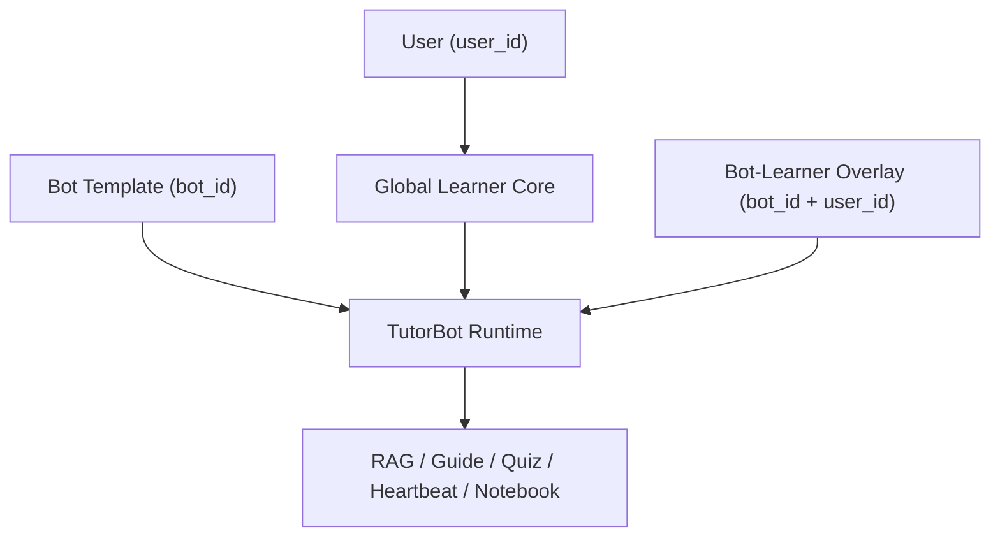

# PRD：第二阶段跨 Bot Learner Overlay 体系

## 1. 文档信息

- 文档名称：跨 Bot Learner Overlay 体系 PRD
- 文档路径：`/doc/plan/2026-04-15-bot-learner-overlay-prd.md`
- 创建日期：2026-04-15
- 适用范围：完整 TutorBot、多 Bot 场景、个性化、Heartbeat、Guided Learning、跨功能 learner state
- 状态：Draft v2
- 关联文档：
  - [2026-04-15-learner-state-memory-guided-learning-prd.md](/Users/yehongchen/Documents/CYH_2/Markzuo/deeptutor/doc/plan/2026-04-15-learner-state-memory-guided-learning-prd.md)
  - [2026-04-15-learner-state-supabase-schema-appendix.md](/Users/yehongchen/Documents/CYH_2/Markzuo/deeptutor/doc/plan/2026-04-15-learner-state-supabase-schema-appendix.md)
  - [2026-04-15-bot-learner-overlay-service-design.md](/Users/yehongchen/Documents/CYH_2/Markzuo/deeptutor/doc/plan/2026-04-15-bot-learner-overlay-service-design.md)
  - [2026-04-15-learner-state-service-design.md](/Users/yehongchen/Documents/CYH_2/Markzuo/deeptutor/doc/plan/2026-04-15-learner-state-service-design.md)

## 2. 背景

第一阶段 PRD 已经确定：

- 学员长期状态主真相按 `user_id` 组织
- 复用现有 Supabase：
  - `user_profiles`
  - `user_stats`
  - `user_goals`
- 新增：
  - `learner_summaries`
  - `learner_memory_events`
  - `learning_plans`
  - `learning_plan_pages`
  - `heartbeat_jobs`

这条主线解决的是：

- 每个学员拥有真正可工作的个性化能力
- TutorBot / Guide / Notebook / Heartbeat 围绕单一 learner state 工作

但最终目标不止于此。  
你最终要的是：

> **共享 bot 模板 + 每学员独立状态 overlay**

也就是说，未来当一个学员开始同时使用多个差异显著的 TutorBot 时，系统必须做到两件事：

1. **共享同一个学员核心状态**
2. **允许每个 Bot 对同一学员维护局部差异化状态**

这份 PRD 只处理第二件事。

## 2.1 官方承诺与第二阶段的直接关系

这一阶段不是“锦上添花”，而是为了让以下官方承诺在**多 Bot** 场景下仍然成立：

1. `Summary`
   - 学过什么、探索过什么、理解如何演化
   - 不能因为使用了多个 Bot 就被拆成几份彼此不通的摘要

2. `Profile`
   - 偏好、水平、目标、沟通风格会持续演化
   - 不能因为某个 Bot 的局部风格偏好而污染全局画像

3. `Persistent Memory`
   - 必须 shared across all features and all your TutorBots
   - 这意味着第二阶段必须支持：
     - **全局共享**
     - **局部差异**
   - 两者缺一不可

4. `Guided Learning`
   - 一个 Bot 发起的学习旅程，其完成结果必须能回流到全局 learner core
   - 同时保留发起该计划的 Bot 的局部连续性

所以第二阶段的真正目标不是“让不同 Bot 更不一样”，而是：

> 在保证全局 Summary / Profile / Memory 继续共享的前提下，为不同 TutorBot 引入可控、有限、可治理的局部差异。

## 3. 这份 PRD 要解决什么问题

### 3.1 典型未来场景

一个学员可能同时使用：

1. `construction-exam-coach`
   - 建筑实务主陪学 TutorBot
2. `case-study-coach`
   - 专注案例题
3. `review-reminder-bot`
   - 专注复习提醒与错题回顾
4. `research-advisor`
   - 专注资料整理与深度问答

这时：

- 学员的**考试目标、整体掌握度、总体偏好**应该共享
- 但每个 Bot 的：
  - 当前任务
  - 局部教学方式
  - 局部 heartbeat 策略
  - 局部工作记忆
  应该允许不同

### 3.1.1 必须覆盖的真实多 Bot 场景

除了角色差异，还必须覆盖这些高风险场景：

1. **同一学员上午用案例题 Bot，晚上用复习 Bot**
   - 全局 learner summary 应继续累积
   - 两个 Bot 的局部 active focus 不应互相覆盖

2. **同一学员在 Guide Bot 中完成学习旅程，再回主 TutorBot 提问**
   - Guide 结果必须进入全局 learner core
   - 主 TutorBot 必须马上“知道”这件事

3. **同一学员被多个 Bot 同时认为应该触达**
   - 只能有一个 Bot 在某个窗口最终发出主动提醒
   - 不能形成多 Bot 轰炸

4. **某个 Bot 暂时偏了**
   - 局部 working memory 出现误导
   - 不能污染全局 learner summary/profile

5. **Bot 模板升级**
   - 同一 learner 的 overlay 仍然有效
   - 不因 Soul / Skills 变更而丢失局部连续性

### 3.2 如果没有 overlay，会发生什么

如果只有 `user_id` 全局主真相，而没有 overlay：

1. 不同 Bot 的局部上下文会互相污染
2. 某个 Bot 的短期 focus 会误覆盖另一个 Bot 的 focus
3. 案例题教练的局部策略会影响日常复习 TutorBot
4. Heartbeat 无法体现不同 Bot 的角色差异

### 3.3 如果 overlay 设计错了，会发生什么

如果 overlay 设计成第二套长期主真相：

1. 会重新长出“全局 learner state”与“bot learner state”双真相
2. 又会回到现在你最忌讳的重复路线
3. 运营后台不知道看哪套状态
4. 代码里又会开始双写与冲突

所以这份 PRD 的核心任务不是“加一层更复杂的数据结构”，而是：

> **定义一个严格受限的 Bot-Learner Overlay，只承接局部差异，不重做长期主真相。**

## 4. 第一性原理

### 4.1 核心原则

1. **学员核心长期事实只有一份**
   - 继续由 `user_id` 级 learner state 承担

2. **Bot overlay 只能表达“这个 Bot 对这个学员的局部差异”**
   - 不能重新表达学员总体画像

3. **共享优先，差异后置**
   - 能放全局 learner core 的，不放 overlay

4. **Bot overlay 是局部作用域，不是第二主脑**
   - 它只改变本 Bot 对该学员的局部行为

5. **Overlay 优先级低于显式用户设置，高于 Bot 模板默认值**

6. **局部事实默认不会自动升级成全局事实**
   - 必须经过受控 promotion pipeline

7. **多 Bot 主动触达必须有全局仲裁**
   - 不允许每个 Bot 各发各的

### 4.2 Less Is More

第二阶段绝对不能做：

1. 为每个学员复制整套 bot workspace
2. 为每个 Bot 建一套平行 learner profile / summary / progress 真相
3. 把所有差异都塞进 overlay
4. 让 overlay 成为“什么都能写”的万能层

## 5. Overlay 的准确定义

### 5.1 Overlay 是什么

Overlay 是：

- 某个 `bot_id`
- 面向某个 `user_id`
- 在**不改变全局 learner 主真相**前提下
- 维护的局部个性化状态

### 5.2 Overlay 不是什么

Overlay 不是：

1. 第二份 learner profile
2. 第二份 learner summary
3. 第二份 learner progress
4. 第二份 learner goals
5. 第二套 heartbeat 主真相

### 5.3 Overlay 适合表达什么

只适合表达这类“局部、可替换、与 Bot 角色强相关”的内容：

1. 本 Bot 的局部 focus
2. 本 Bot 的局部任务或 mission
3. 本 Bot 的教学/表达局部偏好覆盖
4. 本 Bot 的 heartbeat 局部覆盖
5. 本 Bot 的工作记忆投影
6. 本 Bot 的当前活跃学习计划绑定

## 6. 目标架构



### 6.1 三层个性化模型

#### A. Global Learner Core

主键：

- `user_id`

职责：

- 全局 profile
- 全局 summary
- 全局 progress
- 全局 goals
- 全局长期记忆

#### B. Bot Template

主键：

- `bot_id`

职责：

- Soul
- Skills
- Tools
- 默认教学策略
- 默认知识库绑定

#### C. Bot-Learner Overlay

主键：

- `bot_id + user_id`

职责：

- 本 Bot 对该学员的局部差异状态

## 7. Overlay 必须承载的内容

### 7.1 允许承载

#### 1. `local_focus`

示例：

- “这个 Bot 当前主要陪你练案例题”
- “这个 Bot 当前重点盯屋面防水”

#### 2. `active_plan_binding`

示例：

- 当前这个 Bot 正在推进的 `learning_plan_id`

#### 3. `teaching_policy_override`

示例：

- 这个 Bot 对该学员使用更苏格拉底式
- 这个 Bot 默认更少直接给答案

#### 4. `heartbeat_override`

示例：

- 这个 Bot 一周只提醒两次
- 这个 Bot 只在晚间复习窗口触达

#### 5. `working_memory_projection`

示例：

- 这个 Bot 对该学员最近 10 次相关交互的局部工作摘要

### 7.2 明确禁止承载

Overlay 禁止承载：

1. 学员显示名、时区、会员计划
2. 学员总目标
3. 学员全局 mastery
4. 学员全局 weak points
5. 学员全局 summary
6. 学员全局 consent

这些都必须继续留在 Global Learner Core。

### 7.3 Overlay 还必须显式支持什么

为了真正服务于多 Bot，而不只是“多几个 JSON 字段”，overlay 还需要支持：

1. `channel_presence_override`
   - 某个 Bot 在某个渠道是否活跃

2. `local_notebook_scope_refs`
   - 某个 Bot 局部依赖哪些 notebook / materials

3. `engagement_state`
   - 某个 Bot 最近是否还在活跃陪伴该学员

4. `promotion_candidates`
   - 本 Bot 观察到、但尚未升级为全局事实的候选信息

## 8. 数据模型

### 8.1 推荐最小表：`bot_learner_overlays`

建议 DDL：

```sql
create table if not exists bot_learner_overlays (
  bot_id text not null,
  user_id uuid not null references users(id) on delete cascade,
  local_focus_json jsonb not null default '{}'::jsonb,
  active_plan_id uuid,
  teaching_policy_override_json jsonb not null default '{}'::jsonb,
  heartbeat_override_json jsonb not null default '{}'::jsonb,
  channel_presence_override_json jsonb not null default '{}'::jsonb,
  local_notebook_scope_refs_json jsonb not null default '[]'::jsonb,
  engagement_state_json jsonb not null default '{}'::jsonb,
  promotion_candidates_json jsonb not null default '[]'::jsonb,
  working_memory_projection_md text not null default '',
  version int not null default 1,
  created_at timestamptz not null default now(),
  updated_at timestamptz not null default now(),
  primary key (bot_id, user_id)
);

create index if not exists idx_bot_learner_overlays_user
  on bot_learner_overlays(user_id);
```

### 8.2 为什么第二阶段仍然只建议一张主表起步

因为 overlay 是局部差异层，不是第二套 learner domain。

如果一开始就拆成：

- `bot_learner_profiles`
- `bot_learner_summaries`
- `bot_learner_progress`
- `bot_learner_goals`

那本质上又回到了第二套长期真相。

所以第二阶段最稳的方式是：

- 先只引入一张 `bot_learner_overlays`
- 后续只有在明确确有 צורך时，才允许拆更细

## 9. 运行时合并规则

### 9.1 运行时装配顺序

TutorBot 在多 Bot 场景下的运行时装配顺序应为：

1. 当前输入
2. session state
3. Global Learner Core
4. Bot-Learner Overlay
5. Bot Template

### 9.2 优先级规则

1. 当前输入 > session state > global learner core > overlay > bot template
2. 用户显式设置 > overlay 推断
3. global learner core 事实 > overlay 局部偏好
4. overlay 永远不能覆盖全局 learner core 的稳定事实字段
5. overlay 只能影响当前 Bot 的运行时，不影响其他 Bot

### 9.3 冲突示例

#### 示例 1

全局 learner profile：

- `communication_style = concise`

overlay：

- `teaching_policy_override.explanation_style = detailed`

结果：

- 在这个 Bot 里允许更详细解释
- 但不应覆盖全局 learner profile

#### 示例 2

全局 learner goals：

- 一级建造师建筑工程

overlay：

- 这个 Bot 当前 focus 只盯“防水案例题”

结果：

- 全局目标不变
- 本 Bot 的局部任务聚焦防水案例题

#### 示例 3

全局 learner core：

- `weak_points` 中没有“防火间距”

某 Bot overlay：

- `promotion_candidates = [{"type":"possible_weak_point","topic":"防火间距","confidence":0.68}]`

结果：

- 这个候选只能影响该 Bot 的局部提问与陪学
- 不能直接写入全局 weak_points
- 必须经过 promotion pipeline 判定后才能升级

## 9.4 Overlay → Global Core 的晋升机制

这是第二阶段最关键的控制点。

### 原则

Overlay 的存在不能破坏“memory shared across all features and all your TutorBots”。  
因此必须允许：

- 局部状态在满足条件时升级成全局状态

但不能允许：

- 任意局部噪声直接覆盖全局事实

### 建议的 promotion pipeline

1. Bot 在 overlay 中写入 `promotion_candidates`
2. 聚合器按规则评估：
   - 是否重复出现
   - 是否来自结构化结果
   - 是否有用户明确确认
   - 是否与全局事实冲突
3. 满足阈值时，生成统一 `learner_memory_event`
4. 再由第一阶段的统一 writeback pipeline 更新：
   - global summary
   - global profile
   - global progress

### 可直接晋升的情况

1. Guided Learning 完成
2. 结构化 quiz / review 结果
3. 用户明确表达并确认的偏好/目标

### 不可直接晋升的情况

1. 单次普通聊天推断
2. Bot 的局部工作记忆猜测
3. 某个 Bot 的短期 focus

## 9.5 Overlay 的衰减与失效

Overlay 如果永不清理，也会变成第二套长期记忆。

所以必须有生命周期规则：

1. `local_focus`
   - 若连续一段时间无相关活动，应自动降级或清空

2. `active_plan_binding`
   - plan 完成/归档后自动解除

3. `working_memory_projection_md`
   - 只保留最近相关局部工作记忆，不做无限增长

4. `promotion_candidates`
   - 超时未晋升自动过期

5. `engagement_state`
   - 长期不活跃时自动降级

## 10. Heartbeat 的 overlay 化

### 10.1 原则

Heartbeat 主真相仍然以学员为中心，但允许 Bot 局部覆盖。

也就是说：

- 全局 learner core 定义：
  - consent
  - 默认 cadence
  - 默认 quiet hours

- overlay 只允许定义：
  - 某个 Bot 的局部提醒策略差异

### 10.3 多 Bot Heartbeat 全局仲裁

第二阶段不能让“每个 Bot 都有 heartbeat”直接变成“每个 Bot 都能触达”。

必须引入全局仲裁层，保证：

1. 同一学员同一时间窗口只能有一个 Bot 赢得触达资格
2. 优先级应综合：
   - 全局 learner goal 紧迫度
   - active plan 状态
   - 最近互动来源
   - overlay heartbeat override
   - 近期是否已被其他 Bot 触达

### 10.4 触达归因

每次触达必须记录：

- 最终是哪一个 Bot 赢得触达
- 为什么是这个 Bot
- 哪些 Bot 本次被抑制

这样运营和调试时才能解释得清。

### 10.2 示例

全局：

- 每周 3 次

复习 Bot overlay：

- 改成每周 1 次，只在周日晚上

案例题 Bot overlay：

- 只有当 active plan 未完成时才提醒

## 11. Guided Learning 的 overlay 化

Guide 的长期学习成果仍写回：

- global learner core

但可以额外在 overlay 中记录：

- 这个 Bot 当前绑定的 active plan
- 当前学习路径 focus
- 该 Bot 下的局部 guide working summary

这样可以做到：

- 学习成果全局共享
- 本 Bot 的流程连续性仍保留

### 11.1.1 Guide 结果的双层落点

对于第二阶段的 Guide，必须同时满足：

1. **全局落点**
   - summary/progress/memory event 回写 Global Learner Core

2. **局部落点**
   - active plan binding / local focus / working memory projection 回写 Overlay

如果只写局部不写全局：

- 会破坏“shared across all TutorBots”

如果只写全局不写局部：

- 会丢失当前 Bot 的流程连续性

## 12. 运营与产品侧如何发挥作用

Overlay 不是只给代码看，也必须对运营有用。

### 12.1 运营后台可见项

对某个用户，应能查看：

1. Global Learner Core
2. 不同 Bot 的 overlay
3. 哪个 Bot 当前在做什么
4. 哪个 Bot 的 heartbeat 为什么这样配置

### 12.2 运营侧可操作项

应允许：

1. 调整某个 Bot 的局部 heartbeat
2. 调整某个 Bot 的局部教学风格
3. 取消某个 Bot 的局部 focus
4. 将某个 Bot 的局部 active plan 归档

### 12.3 不应允许

不应允许运营侧误把 overlay 当全局 profile 来改。

### 12.4 后台展示的硬要求

后台必须明确区分三个面板：

1. **Global Learner Core**
2. **Bot Template Defaults**
3. **Bot-Learner Overlay**

不能在同一个表单里混写。

## 13. 可靠性与一致性

Overlay 也必须遵循第一阶段的可靠性模型：

- DB 是最终真相
- durable outbox 兜底

### 13.1 写入分类

强同步写：

- 运营或用户显式修改 overlay

异步可补偿写：

- working memory projection 刷新
- guide completion 后的 overlay 局部更新

### 13.2 幂等要求

所有 overlay 更新必须带：

- `bot_id`
- `user_id`
- `source_feature`
- `source_id`
- `dedupe_key`

### 13.3 Overlay 的一致性要求

1. Overlay 更新失败不能阻塞 Global Learner Core 的关键写回
2. Overlay 与 Global Core 的双写必须有先后关系：
   - 结构化全局写回优先
   - 局部 projection 可异步补齐
3. Overlay 的 promotion 不能绕过全局 writeback pipeline

## 13.4 可观测性字段

第二阶段必须统一记录：

- `user_id`
- `bot_id`
- `overlay_version`
- `overlay_write_type`
- `overlay_write_reason`
- `promotion_candidate_count`
- `promotion_applied`
- `heartbeat_arbitration_result`
- `suppressed_bot_ids`

## 14. 什么时候才应该进入第二阶段

只有当以下条件满足，才建议进入 overlay 实施：

1. 第一阶段 learner state 已稳定运行
2. 至少已有两个以上角色明显不同的 TutorBot
3. 已有真实用户场景证明：
   - 仅用 `user_id` 全局主真相已经不够
4. 运营侧确实需要管理 bot 局部差异

如果这些条件不满足，第二阶段不应提前开工。

### 14.1 第二阶段的进入闸门

必须全部满足：

1. 第一阶段 learner state 已上线且稳定
2. 第一阶段 SLO 有实测数据
3. 至少两个 Bot 已在真实用户流量中活跃
4. 已出现真实的多 Bot 状态冲突样本
5. 运营确认需要管理 bot 局部差异

## 15. 分阶段实施计划

### Phase 2A：只定义 overlay contract

目标：

- 不先改代码
- 先定义 overlay 的边界与禁止事项

### Phase 2B：最小数据层

目标：

- 新建 `bot_learner_overlays`
- 先接只读查询

### Phase 2C：运行时装配

目标：

- TutorBot runtime 在读取 global learner core 后，再叠加 overlay

### Phase 2D：可写能力

目标：

- 允许 heartbeat override / local focus / active plan binding 写入

### Phase 2E：后台治理

目标：

- 让运营与管理端能真正看见并管理 overlay

### Phase 2F：Promotion 与仲裁

目标：

- 落地 overlay → global core 的 promotion pipeline
- 落地多 Bot heartbeat 仲裁

## 16. 验收标准

### 16.1 架构验收

1. Global Learner Core 仍然是唯一长期主真相
2. Overlay 没有长成第二套 learner profile/progress/summary
3. overlay 只承载 bot 局部差异

### 16.2 产品验收

1. 同一学员跨多个 Bot 时，核心画像连续
2. 不同 Bot 可保持局部差异
3. 一个 Bot 的局部 focus 不会污染另一个 Bot

### 16.3 运营验收

1. 运营能看见不同 Bot 的 overlay
2. 能明确区分全局状态与局部状态
3. 不会误把 overlay 当全局 profile 改坏

### 16.4 官方承诺对齐验收

第二阶段必须继续满足以下承诺，而不是因为多 Bot 引入而被破坏：

1. `Summary` 仍然是跨功能、跨 Bot 连续的
2. `Profile` 仍然是全局 learner identity，而不是被拆碎
3. `Persistent Memory` 仍然 shared across all TutorBots
4. Guided Learning 的完成结果仍能被其他 Bot 立即感知
5. 多 Bot 场景下不会出现重复轰炸式 heartbeat

## 17. 风险与取舍

### 风险 1：过早引入 overlay

后果：

- 复杂度增加
- 真实收益不足

应对：

- 坚持只有在多 Bot 场景真实成立后才进入第二阶段

### 风险 2：overlay 偷偷扩张成第二主真相

后果：

- 再次出现双真相

应对：

- 严格限制 overlay 可承载字段
- contract 中明确禁止长期 profile/progress/summary 重复建模

### 风险 3：运营误用

后果：

- 改坏全局或局部状态

应对：

- 后台 UI 明确标识“全局状态”与“Bot 局部状态”

### 风险 4：局部状态永不晋升，导致真正有价值的信息被困在某个 Bot

应对：

- 引入 promotion pipeline
- 对 Guide completion / 结构化测评等强信号直接进入全局 writeback

### 风险 5：局部状态无限膨胀，重新变成长期开销

应对：

- 对 overlay 设 TTL / 衰减规则
- 明确 overlay 只保留局部、短中期、Bot 相关状态

## 18. 不确定性与验证计划

### 不确定性 1：到底哪些局部状态值得晋升为全局事实

建议：

- 一开始保守
- 优先只让结构化结果与用户明确设置参与晋升

验证方式：

- 抽样检查 200 条 promotion cases
- 计算误晋升率

### 不确定性 2：多 Bot heartbeat 仲裁权重

建议：

- 第一版采用简单优先级模型
- 后续再做数据驱动权重优化

验证方式：

- A/B 对比点击率、投诉率、负反馈率

### 不确定性 3：overlay working memory 的最佳保留长度

建议：

- 先做短窗口
- 不要做无限累计

验证方式：

- 对比回答连续性与状态污染率

## 19. 最终结论

这份第二阶段 PRD 的核心不是“给系统再加一层更复杂的状态”，而是：

> 在不破坏第一阶段 `user_id` 全局主真相的前提下，为真正多 Bot 场景增加一个严格受限、只承载局部差异的 Overlay。

这样最终才能真正实现：

- **共享 bot 模板**
- **共享学员全局核心状态**
- **每学员独立状态 overlay**

而且不会重新回到你最忌讳的：

- 两套重复线路
- 两套重复状态
- 两套重复长期真相
