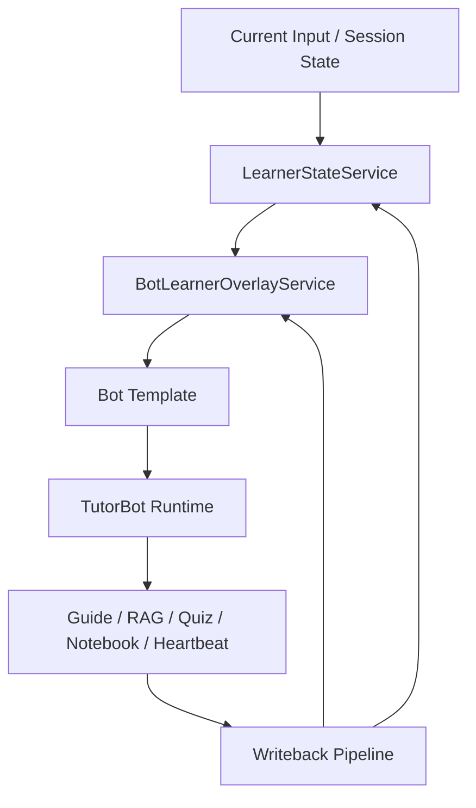

# 设计稿：BotLearnerOverlayService

## 1. 文档信息

- 文档名称：BotLearnerOverlayService 设计稿
- 文档路径：`/doc/plan/2026-04-15-bot-learner-overlay-service-design.md`
- 创建日期：2026-04-15
- 适用范围：完整 TutorBot、多 Bot、Learner State、Heartbeat、Guided Learning、Notebook、Promotion Pipeline
- 状态：Draft v1
- 关联文档：
  - [learner-state.md](/Users/yehongchen/Documents/CYH_2/Markzuo/deeptutor/contracts/learner-state.md)
  - [2026-04-15-learner-state-memory-guided-learning-prd.md](/Users/yehongchen/Documents/CYH_2/Markzuo/deeptutor/doc/plan/2026-04-15-learner-state-memory-guided-learning-prd.md)
  - [2026-04-15-bot-learner-overlay-prd.md](/Users/yehongchen/Documents/CYH_2/Markzuo/deeptutor/doc/plan/2026-04-15-bot-learner-overlay-prd.md)

## 2. 设计目标

`BotLearnerOverlayService` 的目标不是增加第二套 learner truth，而是为第二阶段提供一个**严格受限的局部差异服务**，满足：

1. 同一个 `user_id` 在多个 TutorBot 间共享全局 learner state。
2. 某个 `bot_id` 可以对同一个 `user_id` 持有局部运行时差异。
3. 局部差异可以被读取、衰减、清理、晋升，但不能反向取代全局 learner truth。
4. Heartbeat、Guide、Notebook、TutorBot 在多 Bot 场景下可以通过统一 overlay service 协同，而不是各自私存局部状态。

## 3. 非目标

这份服务设计明确不做：

1. 不创建第二份 profile / summary / progress / goals 主真相。
2. 不替代 `LearnerStateService`。
3. 不承接 Bot 模板、Soul、Skills、Tools 的管理。
4. 不直接负责 HTML 页面生成或 notebook 富文本存储。
5. 不在本阶段引入“每个学员复制整套 bot workspace”。

## 4. 服务定位

### 4.1 在整体架构中的位置

### 4.2 服务边界

`BotLearnerOverlayService` 只负责：

1. 维护 `bot_id + user_id` 局部 overlay。
2. 在运行时读取 overlay 并返回给 TutorBot runtime。
3. 接收受控 patch，更新局部 focus、plan binding、working memory projection 等。
4. 产出 promotion candidates，交给全局 learner writeback pipeline。
5. 产出 heartbeat override 候选，交给全局 heartbeat arbitration。

它不负责：

1. 直接写全局 learner profile / summary / progress。
2. 直接决定最终 heartbeat 是否发送。
3. 直接拼装 TutorBot 最终 prompt。
4. 直接读取或修改 bot template。

## 5. 数据模型原则

### 5.1 主键

- `overlay_key = bot_id + user_id`

### 5.2 最小字段集

第一版只允许以下字段进入 overlay：

1. `local_focus`
2. `active_plan_binding`
3. `teaching_policy_override`
4. `heartbeat_override`
5. `working_memory_projection`
6. `channel_presence_override`
7. `local_notebook_scope_refs`
8. `engagement_state`
9. `promotion_candidates`

### 5.3 明确禁止字段

以下字段不得进入 overlay：

1. 学员显示名
2. 时区
3. 会员计划
4. 全局目标
5. 全局 mastery / weak points
6. 全局 summary
7. 全局 consent
8. 支付、余额、订阅状态

## 6. 读路径设计

### 6.1 读取时机

运行时上下文装配顺序固定为：

1. 当前输入
2. session state
3. active question / current learning step
4. learner profile
5. learner summary
6. learner progress
7. notebook / guide references
8. overlay
9. bot template

### 6.2 读取规则

1. 只有当 `bot_id` 与 `user_id` 同时存在时，才读取 overlay。
2. 没有 overlay 时，返回空 overlay，不报错。
3. overlay 中空值不覆盖全局 learner core。
4. overlay 中过期字段在读取时要自动过滤。

### 6.3 运行时输出

服务读取后返回一个受控对象：

- `effective_overlay`
- `suppressed_fields`
- `expired_fields`
- `promotion_candidates`
- `heartbeat_override_candidate`

其中：

- `effective_overlay` 只包含本轮可生效字段
- `promotion_candidates` 只是候选，不能直接写入全局 learner core

## 7. 写路径设计

### 7.1 允许的写入来源

只有以下来源允许写 overlay：

1. TutorBot runtime 的结构化局部 patch
2. Guided Learning 的局部 plan binding 更新
3. Notebook 范围绑定更新
4. Heartbeat 策略的局部 override 更新
5. 运营后台的受控 bot-level override

### 7.2 禁止的写入来源

以下来源不得直接写 overlay：

1. 任意普通自由聊天文本
2. Bot 模板加载过程
3. workspace memory 回写
4. 直接把全局 learner core 字段镜像一份写入 overlay

### 7.3 Patch 模型

服务采用 patch 而不是整份覆盖：

- `set`
- `merge`
- `clear`
- `append_candidate`

禁止：

- 整份 JSON 覆盖
- 无版本号并发覆盖

## 8. Promotion Pipeline 集成

### 8.1 为什么需要晋升管道

官方承诺要求 memory 在 all features 和 all TutorBots 间共享。  
这意味着 Bot 局部观察到的稳定事实，未来可能需要回流到全局 learner core。

但直接回流会造成污染，所以必须经过 promotion pipeline。

### 8.2 晋升条件

只有满足以下任一条件的局部候选，才允许进入全局 writeback 审核：

1. 来源于结构化结果
2. 用户明确确认
3. 多次稳定复现且未与全局事实冲突

### 8.3 不能直接晋升的内容

以下内容默认只能停留在 overlay：

1. 短期 focus
2. 当前 Bot 的临时语气偏好
3. 当日 engagement 情绪判断
4. working memory 摘要
5. 局部 notebook scope

### 8.4 输出接口

对外只需要保留最小 public surface：

1. `read_overlay(bot_id, user_id)`
2. `patch_overlay(bot_id, user_id, patch, *, source_feature, source_id)`
3. `build_context_fragment(bot_id, user_id, *, language="zh", max_chars=2000)`
4. `promote_candidate(bot_id, user_id, candidate_kind, payload, *, source_feature, source_id)`

其余如：

- `collect_promotion_candidates(...)`
- `ack_promotions(...)`
- `drop_promotions(...)`
- `resolve_heartbeat_inputs(...)`
- `decay_overlay(...)`

更适合作为内部接口，而不是一开始就暴露成宽 public API。

## 9. Heartbeat 仲裁集成

### 9.1 设计原则

overlay 可以表达某个 Bot 的 heartbeat 偏好，但**最终是否触达**只能由全局 heartbeat arbitration 决定。

### 9.2 服务职责

`BotLearnerOverlayService` 只负责输出：

- `heartbeat_override_candidate`
- `engagement_state`
- `active_plan_binding`

供全局 heartbeat arbitration 计算：

1. 哪个 Bot 最适合触达
2. 哪个 Bot 应被抑制
3. 这次触达的理由是什么

### 9.3 不允许的设计

服务不允许直接：

1. 发送 heartbeat
2. 自己决定“轮到这个 Bot 发”
3. 绕过 quiet hours / consent / cooldown

## 10. 与 Guided Learning / Notebook 的协作

### 10.1 Guided Learning

Guide 可以通过 overlay 维护：

1. `active_plan_binding`
2. `local_focus`
3. `working_memory_projection`

但 Guide 完成结果必须：

1. 通过全局 writeback 更新 `learner_summaries`
2. 通过全局 writeback 更新 progress
3. 再由 overlay 保留局部连续性

### 10.2 Notebook

Notebook 不应直接成为 overlay truth。  
它只能提供：

1. `local_notebook_scope_refs`
2. `promotion_candidates`

Notebook 富文本本体仍然属于内容资产层。

## 11. 缓存与并发

### 11.1 缓存原则

overlay 可以缓存，但缓存不是主真相。

建议：

1. 短 TTL 内存缓存
2. 可选 Redis 热缓存
3. 命中失败回源 DB

### 11.2 并发控制

同一 `bot_id + user_id` 的写入必须串行化。

建议：

1. optimistic version
2. `updated_at`
3. per-key lock

若发生冲突：

1. 单字段 merge 优先
2. 冲突字段重试
3. 无法 merge 时退回上游重新读取再 patch

## 12. 可靠性与 outbox

### 12.1 写入分类

**强同步写**

1. 运营后台手动修改局部 override
2. 用户显式切换某个 Bot 的局部教学模式
3. 用户显式开启/关闭某个 Bot 的局部 heartbeat override

**异步可补偿写**

1. working memory projection 刷新
2. engagement state 更新
3. promotion candidates 写入

### 12.2 outbox 要求

overlay 的异步写回也必须经过 durable outbox：

1. 先写本地 SQLite outbox
2. 再异步 flush 到主 DB
3. 用 `dedupe_key` 保证幂等

## 13. 对外服务接口草案

第一版建议方法集合应保持极小：

1. `read_overlay(bot_id, user_id)`
2. `patch_overlay(bot_id, user_id, patch, *, source_feature, source_id, version=None)`
3. `build_context_fragment(bot_id, user_id, *, language="zh", max_chars=2000)`
4. `promote_candidate(bot_id, user_id, candidate_kind, payload, *, source_feature, source_id)`

内部接口可保留：

1. `_collect_promotion_candidates(...)`
2. `_ack_promotions(...)`
3. `_drop_promotions(...)`
4. `_resolve_heartbeat_inputs(...)`
5. `_decay_overlay(...)`
6. `_clear_overlay_fields(...)`

## 14. Observability

### 14.1 Trace 字段

至少要记录：

1. `overlay_applied`
2. `overlay_fields`
3. `overlay_version`
4. `promotion_candidates_count`
5. `promotion_eligible_count`
6. `heartbeat_override_present`
7. `overlay_decay_applied`

### 14.2 审计字段

至少要记录：

1. `updated_by_source`
2. `updated_by_actor`
3. `patch_type`
4. `dedupe_key`
5. `write_mode`

## 15. 失败模式与护栏

### 15.1 典型失败模式

1. overlay 越长越像第二份 learner profile
2. Bot 局部 working memory 污染全局 learner state
3. 多 Bot heartbeat 重复触达
4. Guide 完成结果只留在 overlay，没有回到全局 learner core
5. overlay 跟随 bot template 升级意外失效

### 15.2 护栏

1. 字段白名单
2. 禁止字段黑名单
3. promotion pipeline
4. 全局 heartbeat arbitration
5. overlay TTL 与 decay
6. contract + CI guard

## 16. 实施顺序

### Phase 2A：服务与 contract

1. 扩展 `contracts/learner-state.md`
2. 出 `BotLearnerOverlayService` 设计稿
3. 再进入 schema 设计

### Phase 2B：schema

1. 新增 overlay 主表
2. 新增 overlay event / audit 表
3. 新增必要索引

### Phase 2C：只读接入

1. TutorBot runtime 先读 overlay
2. 先不开放复杂写入

### Phase 2D：受控写入

1. Guide / notebook / heartbeat / TutorBot 开始写局部 patch
2. promotion pipeline 生效

### Phase 2E：heartbeat 仲裁

1. 接入全局 arbitration
2. 清掉 Bot 私发路径

## 17. 成功标准

### 17.1 功能成功

1. 同一 `user_id` 跨多个 Bot 共享 profile / summary / progress
2. 不同 Bot 对同一学员可以持有稳定局部差异
3. Guide 结果能进入全局 learner core
4. 多 Bot heartbeat 不重复轰炸

### 17.2 架构成功

1. overlay 没有长成第二套 learner truth
2. Bot 模板与 learner core 责任边界清晰
3. 所有局部晋升都经过统一 promotion pipeline

## 18. 不确定性与验证计划

当前仍需验证的核心问题：

1. `working_memory_projection` 保留多长最稳
2. `engagement_state` 是否值得放 overlay 而不是 session
3. heartbeat arbitration 权重怎么配最适合建筑教培
4. promotion candidate 的最小字段集是什么

验证方式：

1. 先在单 Bot + 一个附属 Bot 的灰度环境里跑
2. 对比：
   - 污染率
   - 晋升准确率
   - heartbeat 打扰率
   - guide completion 后跨 Bot 感知成功率

## 19. 最终结论

第二阶段的 overlay 体系必须坚持一句话：

> **Global Learner Core 继续是唯一长期主真相；Bot-Learner Overlay 只是严格受限的局部差异层。**

只有这样，系统才能真正达到：

- 共享 bot 模板
- 每学员独立状态
- 多 Bot 协同
- 无重复主真相

否则第二阶段很容易重新走回“再长出第二套记忆系统”的老路。
## 7. Heartbeat 规则

1. Heartbeat 主语永远是学员，不是 bot workspace。
2. 第一阶段 heartbeat job 必须按 `user_id` 调度。
3. 如第二阶段引入 bot overlay，局部 heartbeat override 也只能作为候选，不能绕过全局仲裁。
4. 同一时段内，同一学员只能由一个 Bot 赢得最终主动触达资格。

## 8. 设计禁令

以下设计视为违反 contract：

1. 再建一套平行 learner profile 表，只为某个功能自己用。
2. 把 `TutorBot workspace memory` 重新当主真相。
3. 让 notebook、guide、heartbeat 各自维护自己的长期 learner summary。
4. 第一阶段直接把长期 truth 设计成 `bot_id + user_id`。
5. 第二阶段把 overlay 扩展成第二套 learner truth。
