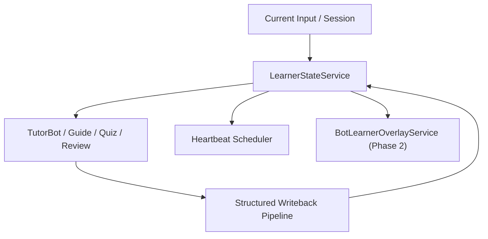

# 设计稿：LearnerStateService

## 1. 文档信息

- 文档名称：LearnerStateService 设计稿
- 文档路径：`/doc/plan/2026-04-15-learner-state-service-design.md`
- 创建日期：2026-04-15
- 适用范围：TutorBot、Guide、Notebook、Quiz、Review、Heartbeat、Session Writeback、Profile/Progress/Summary
- 状态：Draft v1
- 关联文档：
  - [learner-state.md](/Users/yehongchen/Documents/CYH_2/Markzuo/deeptutor/contracts/learner-state.md)
  - [2026-04-15-learner-state-memory-guided-learning-prd.md](/Users/yehongchen/Documents/CYH_2/Markzuo/deeptutor/doc/plan/2026-04-15-learner-state-memory-guided-learning-prd.md)
  - [2026-04-15-learner-state-supabase-schema-appendix.md](/Users/yehongchen/Documents/CYH_2/Markzuo/deeptutor/doc/plan/2026-04-15-learner-state-supabase-schema-appendix.md)
  - [2026-04-15-bot-learner-overlay-service-design.md](/Users/yehongchen/Documents/CYH_2/Markzuo/deeptutor/doc/plan/2026-04-15-bot-learner-overlay-service-design.md)

## 2. 设计目标

`LearnerStateService` 是第一阶段学员长期状态的单一服务入口，目标是：

1. 统一读取 `user_profiles / user_stats / user_goals / learner_summaries`
2. 统一写入 learner profile / progress / summary / memory events
3. 统一受控 writeback，而不是让 Guide、Notebook、TutorBot 各写各的
4. 为第二阶段 `BotLearnerOverlayService` 提供稳定全局 learner core

## 3. 非目标

这份服务设计明确不做：

1. 不管理 Bot 模板、Soul、Skills、Tools。
2. 不直接生成 Guided Learning HTML 页面。
3. 不替代 session state。
4. 不在第一阶段引入 bot-level overlay 主逻辑。
5. 不直接发送 heartbeat。

## 4. 服务边界

### 4.1 负责的真相

`LearnerStateService` 负责以下长期状态真相：

1. `user_profiles`
2. `user_stats`
3. `user_goals`
4. `learner_summaries`
5. `learner_memory_events`
6. `learning_plans`
7. `learning_plan_pages`
8. `heartbeat_jobs`

### 4.2 不负责的真相

1. session state
2. active question context
3. TutorBot workspace memory 文件
4. notebook 富文本本体
5. overlay 局部差异

## 5. 运行时定位

### 5.1 与上下文编排、Overlay 的协作关系

`LearnerStateService` 在系统里的定位必须稳定为：

1. 它是**长期真相入口**
   - 负责 `user_id` 级 learner core 的统一读写
2. 它不是**每轮 prompt 装配器**
   - 不负责决定本轮最终注入哪些上下文块
   - 这个职责属于 TutorBot 的 context orchestration
3. 它是**上下文编排的稳定供给层**
   - context orchestration 只能消费它输出的 snapshot / compact learner card / active plan 信息
   - 不能绕过本服务直接拼装第二套长期真相
4. 它是**Overlay 的上游**
   - 第二阶段 overlay 只能建立在稳定 learner core 之上
   - 运行时顺序必须先读 global learner core，再叠加 bot-local overlay

换句话说：

1. `LearnerStateService` 决定长期事实
2. `Context Orchestration` 决定每轮最小必要上下文包
3. `BotLearnerOverlayService` 只在第二阶段追加局部差异

任何实现都不得把这三个职责重新混成一个“大而全 memory service”。

## 6. 读模型

### 6.1 核心读取对象

服务读取后返回统一 `LearnerStateSnapshot`：

1. `profile`
2. `summary`
3. `progress`
4. `goals`
5. `active_learning_plans`
6. `heartbeat_preferences`
7. `memory_event_cursor`

### 6.2 读取优先级

1. 所有长期事实都从 DB 真相读取
2. Markdown 只做 projection，不参与主读取决策
3. session state 在服务外部注入，不由本服务替代

### 6.3 缓存策略

允许：

1. 短 TTL 内存缓存
2. 可选 Redis 热缓存

不允许：

1. 以缓存结果作为长期真相
2. 从缓存直接推导永久字段并回写

## 7. 写模型

### 7.1 写入分类

#### A. 强同步写

这些操作必须直写 DB，失败即报错：

1. 用户显式修改 profile / preferences
2. 用户显式修改 goals
3. heartbeat 开关修改
4. learning plan 创建/调整

#### B. 异步可补偿写

这些操作允许先落 durable outbox 再 flush：

1. summary refresh
2. learner memory events
3. guide completion writeback
4. progress merge
5. heartbeat delivery logs

### 7.2 写入入口

服务只接受结构化写入：

1. `update_profile(...)`
2. `merge_progress(...)`
3. `replace_goals(...)`
4. `refresh_summary(...)`
5. `append_memory_events(...)`
6. `upsert_learning_plan(...)`
7. `update_learning_plan_page(...)`
8. `upsert_heartbeat_job(...)`

禁止：

1. 整份 learner state JSON 覆盖
2. 任意模块私自直接拼 SQL 写长期真相

## 8. 最小接口草案

### 8.1 最小 public 读接口

第一阶段只暴露最小集合：

1. `read_snapshot(user_id, *, event_limit=None)`
2. `build_context(user_id, *, language="zh", max_chars=4000)`

### 8.2 最小 public 写接口

1. `refresh_from_turn(user_id, turn_payload, *, source_feature, source_id, sync=False)`
2. `record_guide_completion(user_id, guide_payload, *, source_id, sync=False)`
3. `record_notebook_writeback(user_id, notebook_payload, *, source_id, sync=False)`
4. `merge_profile(user_id, patch, *, source_feature, actor=None, sync=True)`
5. `merge_progress(user_id, patch, *, source_feature, source_id=None, sync=False)`

### 8.3 内部/受控接口

以下接口存在，但不建议一开始开放成广泛 public surface：

1. `_create_or_init_learner(...)`
2. `_replace_goals(...)`
3. `_refresh_summary(...)`
4. `_append_memory_events(...)`
5. `_upsert_learning_plan(...)`
6. `_update_learning_plan_page(...)`
7. `_upsert_heartbeat_job(...)`
8. `_record_heartbeat_delivery(...)`
9. `_project_profile_md(...)`
10. `_project_summary_md(...)`
11. `_rebuild_from_memory_events(...)`
12. `_flush_outbox(...)`

## 9. 关键写回场景映射

### 9.1 TutorBot

读取：

1. `read_snapshot(...)`

写入：

1. `refresh_from_turn(...)`

### 9.2 Guided Learning

读取：

1. `read_snapshot(...)`
2. 由内部接口加载 active learning plans

写入：

1. `record_guide_completion(...)`
2. `merge_progress(...)`

### 9.3 Notebook

读取：

1. `read_snapshot(...)`

写入：

1. `record_notebook_writeback(...)`

### 9.4 Quiz / Review / Deep Question

读取：

1. `read_snapshot(...)`

写入：

1. `merge_progress(...)`
2. `refresh_from_turn(...)`

### 9.5 Heartbeat

读取：

1. `read_snapshot(...)`
2. heartbeat scheduler 通过内部接口取 jobs

写入：

1. 由内部接口更新 heartbeat jobs / delivery

## 10. 冲突与幂等

### 10.1 幂等

所有异步写入都必须带：

1. `source_feature`
2. `source_id`
3. `dedupe_key`

### 10.2 冲突规则

1. 显式用户设置优先于模型推断
2. 结构化结果优先于自由文本
3. 单字段 merge 优先于整份覆盖
4. 同一 `user_id` 的并发写回必须串行化

## 11. 对 durable outbox 的要求

### 11.1 作用

当网络抖动或 Supabase 短暂不可用时：

1. 不丢 summary refresh
2. 不丢 memory events
3. 不丢 progress merge

### 11.2 要求

1. 本地 SQLite 持久化
2. 可重试
3. 可幂等
4. 可观测 backlog
5. 可人工重放

## 12. Observability

### 12.1 Trace 字段

至少记录：

1. `learner_state_read`
2. `learner_state_write`
3. `learner_state_write_mode`
4. `learner_state_tables_touched`
5. `learner_state_outbox_used`
6. `learner_state_dedupe_key`

### 12.2 审计字段

至少记录：

1. `source_feature`
2. `source_id`
3. `source_bot_id`
4. `actor`
5. `sync_or_async`

## 13. 失败模式与护栏

### 13.1 失败模式

1. 旧模块继续绕过服务直接写文件
2. `user_profiles.attributes` 无边界膨胀
3. `user_stats.current_question_context` 再被当长期真相使用
4. summary 刷新覆盖掉显式 profile

### 13.2 护栏

1. contract + CI guard
2. 受控写接口
3. 强同步写 / 异步写分类
4. field-level merge
5. projection 与 truth 分离

## 14. 实施顺序

### Phase 1A：服务壳层

1. 定义 `LearnerStateService`
2. 暂时包住现有 `user_profiles / user_stats / user_goals`
3. 先提供统一读接口

### Phase 1B：新表接入

1. 接入 `learner_summaries`
2. 接入 `learner_memory_events`
3. 接入 `learning_plans / learning_plan_pages`
4. 接入 `heartbeat_jobs`

### Phase 1C：写入收口

1. Guide / Notebook / TutorBot / Review 统一走服务接口
2. outbox 生效

## 15. 成功标准

1. TutorBot、Guide、Notebook、Heartbeat 都通过同一个服务读取学员长期状态
2. 没有新增同义平行表
3. `user_profiles / user_stats / user_goals` 真正被复用，而不是摆设
4. 结构化 writeback 真实落到 `learner_summaries / learner_memory_events`
5. phase 2 overlay 接入时不需要重做 learner core
6. public 接口保持极小，不再长成第二套碎片 service
