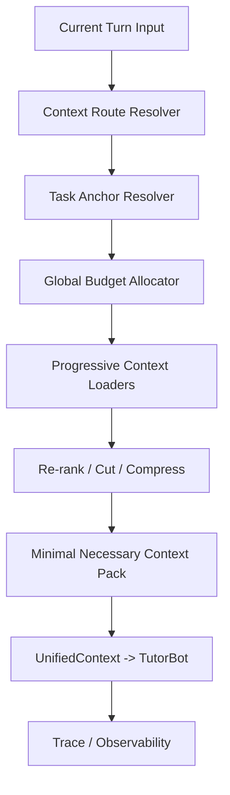

# PRD：TutorBot 每轮最小必要上下文包与上下文编排

## 1. 文档信息

- 文档名称：TutorBot 上下文编排 PRD
- 文档路径：`/doc/plan/2026-04-16-tutorbot-context-orchestration-prd.md`
- 创建日期：2026-04-16
- 适用范围：TutorBot、统一 `/api/v1/ws`、turn runtime、session context、learner state、notebook、guided learning、跨会话历史
- 状态：Draft v1
- 关联文档：
  - [CONTRACT.md](/Users/yehongchen/Documents/CYH_2/Markzuo/deeptutor/CONTRACT.md)
  - [contracts/index.yaml](/Users/yehongchen/Documents/CYH_2/Markzuo/deeptutor/contracts/index.yaml)
  - [contracts/learner-state.md](/Users/yehongchen/Documents/CYH_2/Markzuo/deeptutor/contracts/learner-state.md)
  - [2026-04-15-unified-ws-full-tutorbot-prd.md](/Users/yehongchen/Documents/CYH_2/Markzuo/deeptutor/doc/plan/2026-04-15-unified-ws-full-tutorbot-prd.md)
  - [2026-04-15-learner-state-memory-guided-learning-prd.md](/Users/yehongchen/Documents/CYH_2/Markzuo/deeptutor/doc/plan/2026-04-15-learner-state-memory-guided-learning-prd.md)
  - [2026-04-15-learner-state-service-design.md](/Users/yehongchen/Documents/CYH_2/Markzuo/deeptutor/doc/plan/2026-04-15-learner-state-service-design.md)

## 2. 背景

DeepTutor 现阶段已经具备四类上下文来源：

1. `conversation_history`
2. `memory_context`
3. `notebook_context`
4. `history_context`

当前系统已经不是“没有上下文能力”，而是：

- `conversation_history` 已具备 token-aware 压缩与摘要
- `learner_state` 已能提供学员长期状态上下文
- notebook / guided learning / history 已能生成额外上下文

但这些能力仍然缺少统一编排层。当前更像“多个上下文源都能工作”，而不是“一个世界级 TutorBot 在每轮对话中只装载最小必要上下文包”。

如果继续沿用“能拿到什么就尽量塞什么”的方式，系统会长期遇到以下问题：

1. 当前任务锚点被无关长期记忆稀释
2. notebook / cross-session history 抢占当前对话优先级
3. 长对话中上下文窗口不可控
4. 不同入口下行为不一致
5. trace 里无法解释“本轮为什么加载了这些上下文”

## 3. 问题定义

### 3.1 当前核心问题不是“重建上下文”，而是“如何稳定地重建”

TutorBot 本质上必须每轮重建上下文。原因不是为了炫技，而是因为：

1. 当前用户意图每轮都可能变化
2. 当前会话锚点每轮都可能变化
3. 长期记忆、学习计划、notebook、历史会话不可能每轮全量携带
4. 模型上下文窗口是稀缺资源，必须动态分配

因此真正的问题不是：

- 是否每轮重建上下文

而是：

- 是否只重建“最小必要上下文包”
- 是否基于稳定状态重建
- 是否让检索受路由与预算控制

### 3.2 当前缺口

当前系统主要缺口有五个：

1. 没有统一的 `Context Orchestration` 内部层
2. 没有统一的全局 token budget allocator
3. `conversation_history` 是 token-aware，但其他上下文更多还是局部字符级控制
4. 没有一套显式的“何时加载哪类上下文”的路由规则
5. 缺少“当前任务锚点优先”的硬约束

### 3.3 如果直接做“每轮动态加载”但不加约束，会出现什么问题

1. 容易形成鸡同鸭讲
2. 容易让旧记忆污染当前问题
3. 容易出现检索过度与上下文漂移
4. 容易因为不同 query 的偶然召回结果而行为不稳定

### 3.4 最难也最容易翻车的真实场景

本 PRD 必须先面向最难场景设计，而不是先面向理想路径设计。

#### A. 当前题目追问，但历史里有相似题

风险：

- 系统把历史相似题当成当前题
- 回答开始解释另一道题，形成鸡同鸭讲

要求：

- `active_question_context` 必须压过历史命中
- 历史相似题只能作为补充证据，不能替代当前题干

#### B. 用户切换话题非常快

例子：

1. 刚在追问案例题
2. 下一句突然问“我还有多少点数”
3. 再下一句又回到学习计划

风险：

- 重上下文还挂在当前轮
- 轻 query 被旧上下文污染

要求：

- 路由必须允许“快速降级”
- `low_signal_social` 与账户类 query 必须主动卸载 notebook / history 重上下文

#### C. 用户引用“上次”但当前会话也有近似内容

风险：

- 系统误把“上次”理解成当前 session 前几轮
- 或误去跨会话检索，把当前会话连续性打断

要求：

- 先判断“上次”是当前 session 还是跨 session
- 跨 session 检索应是 Level 3，而不是默认动作

#### D. Guided Learning 当前页面与 notebook 命中冲突

风险：

- 当前 plan/page 明明更权威，却被 notebook 历史片段覆盖

要求：

- current plan/page 是强锚点
- notebook snippet 默认只能解释当前页面，不能替代当前页面

#### E. 用户纠正系统的长期记忆

例子：

- “我不是准备一建，我是二建”

风险：

- 旧 learner profile 继续被注入
- 当前轮回答仍按旧画像走

要求：

- 当前轮用户纠正优先级必须高于 learner_state 旧值
- 这类纠正要进入高优先级 writeback 流

#### F. 长对话 + 多工具 + 多轮追问

风险：

- 历史消息、tool results、notebook snippets、memory hits 同时变多
- 虽然每一块都被“局部控制”，但总包仍超预算

要求：

- 必须只有一个全局预算器
- 不允许 source 各自局部截断后再一起拼

## 4. 产品目标

### 4.1 最终目标

让 TutorBot 达到以下能力：

1. 每轮都重建上下文，但只重建最小必要上下文包
2. 优先围绕当前任务锚点，而不是围绕全量历史
3. 在长对话中始终保持上下文窗口可控
4. 在需要时，选择性、渐进式加载 notebook / learner memory / cross-session history
5. 每轮都能解释：
   - 为什么加载这些上下文
   - 为什么不加载另一些上下文
   - 每类上下文花了多少预算

### 4.2 体验目标

1. 用户追问当前题时，TutorBot 不应被旧 notebook 或旧 memory 带偏
2. 用户继续 Guided Learning 当前页面时，系统应优先记住当前 plan/page
3. 用户说“你上次建议我先学什么”时，系统才主动拉跨会话历史
4. 用户随口打招呼、问点数、问订阅时，不应加载重上下文
5. 长对话超过数百轮时，系统仍能保持前后语义连续

### 4.3 世界级目标

本 PRD 的目标不是“比现在稍微聪明一点”，而是做到当前顶尖智能体的共同水准：

1. 稳定状态与动态检索分层
2. 最近原始对话与长期摘要分层
3. 长期记忆受边界控制，不无限增长
4. 上下文重建可解释、可观测、可回放
5. 检索与压缩不抢占当前会话主导权

## 5. 非目标

本 PRD 明确不做：

1. 不新增第二套业务身份或第二套 Tutor 概念
2. 不新增新的对外聊天路由，聊天仍只走统一 `/api/v1/ws`
3. 不让 notebook / history / memory 直接替代当前会话
4. 不把这层先升级成新的仓库级 contract domain
5. 不为单一模型写死 hardcode 逻辑
6. 不追求“每轮都检索更多内容”，而追求“每轮只检索需要内容”

## 6. 第一性原理与设计原则

### 6.1 First Principles

1. 当前任务锚点优先于历史记忆
2. 当前会话优先于跨会话历史
3. 稳定事实优先于自由文本
4. 摘要优先于原始长文本
5. 不加载也是一种正确决策

### 6.2 Less Is More

1. 不引入新的用户可见概念名词
2. 不把四类上下文都默认加载
3. 不把“检索到”误当成“应该注入”
4. 不让每个上下文源各自做预算
5. 不在当前 query 没需要时做重检索

### 6.3 稳定性原则

为避免鸡同鸭讲，本系统必须满足：

1. 每轮重建基于稳定状态，而不是完全自由拼装
2. 同类 query 应触发相同或相近的上下文路由
3. 当前 active question / active plan / active page 必须具有硬优先级
4. 被检索到的外部上下文只能作为证据或补充，不能取代当前用户问题

### 6.4 Determinism First

第一阶段必须优先确定性，而不是优先“更智能”：

1. route classifier 优先走规则与状态机
2. 只有规则无法判定时，才允许引入小模型或 LLM 作为 fallback router
3. 任何 LLM router 输出都必须收敛到有限 route label，而不是自由文本解释
4. 同一输入在同一状态下，应尽量得到同一路由

原因：

1. 教学场景最怕不稳定
2. 可解释性比花哨智能更重要
3. 线上 debug 与回放必须能复现

### 6.5 Stable Prefix 与 Dynamic Evidence 分离

必须明确区分：

1. **Stable Prefix**
   - 系统规则
   - TutorBot 稳定 persona
   - 工具定义
   - 稳定项目上下文
2. **Dynamic Evidence**
   - 当前会话摘要
   - recent raw turns
   - learner card
   - notebook snippets
   - history hits

要求：

1. Stable Prefix 尽量不在 session 中频繁变动
2. Dynamic Evidence 每轮重建
3. 不允许把动态检索内容塞回 Stable Prefix 区块
4. 如 provider 支持 prompt caching，优先围绕 Stable Prefix 设计缓存友好结构

## 7. 目标架构

### 7.1 说明

这不是一个新的业务控制面，而是一层内部运行时编排：

1. `Context Route Resolver`
2. `Task Anchor Resolver`
3. `Global Budget Allocator`
4. `Progressive Context Loaders`
5. `Minimal Necessary Context Pack Assembler`

这些都属于内部实现层，不新增新的对外产品概念。

### 7.1.1 与 Learner State / Overlay / Guide 的系统分工

这份 PRD 必须与前面的 learner-state / overlay 设计形成固定分工，而不是重新发明一套 memory 语义。

固定分工如下：

1. `Learner State`
   - 决定长期事实是什么
   - 决定长期事实如何受控写回
2. `Context Orchestration`
   - 决定每轮该带哪些事实进入模型
   - 决定它们进入哪个 block、占多少预算、为什么被加载
3. `Guided Learning / Notebook / History`
   - 提供可被路由与预算器消费的候选证据
   - 不直接升级成新的长期主真相
4. `Bot-Learner Overlay`
   - 在第二阶段作为 bot-local fragment 接入
   - 只补充局部差异，不替代 learner core

因此本层不能做的事包括：

1. 自己维护第二份 learner profile / learner summary
2. 把检索命中直接当成长久事实
3. 绕过 learner-state writeback pipeline 修改长期真相
4. 在第一阶段把 overlay 提前做成必需依赖

### 7.2 两层重建，而不是整包重写

每轮所谓“重建上下文”，不是重新制造所有内容，而是：

1. **固定层**
   - Stable Prefix
   - 工具定义
   - 基础 persona
2. **可变层**
   - 当前 session 摘要与 recent turns
   - compact learner card
   - 条件触发的 notebook / memory / history evidence

因此这里的重建本质是：

- 重建可变层
- 不频繁扰动固定层

这样才能同时兼顾：

1. 语义稳定
2. prompt caching
3. 低成本
4. 可解释性

## 8. 四类上下文的目标职责

### 8.1 `conversation_history`

职责：

- 维护当前会话连续性
- 保留最近原始话轮
- 用压缩摘要承接旧历史

原则：

- 默认加载
- 永远受 token budget 控制
- 永远优先于 cross-session history

### 8.2 `memory_context`

职责：

- 提供学员长期稳定画像
- 提供长期学习摘要
- 提供少量高价值目标与进度

原则：

- 默认只加载 compact learner card
- 不默认全量加载 memory events
- 事件级 detail 必须由当前 query 触发

### 8.3 `notebook_context`

职责：

- 提供当前 notebook / current plan page / guided material 的局部知识支撑

原则：

- 默认不加载
- 只在问题与 notebook 或当前学习页面明确相关时加载
- 只加载 top-k snippet，不加载整本内容

### 8.4 `history_context`

职责：

- 提供跨会话回忆、跨会话承诺、跨会话连续学习线索

原则：

- 默认不加载
- 只有出现“回忆/延续/之前提过/上次聊过”类需求时触发
- 只提供经过压缩与筛选的命中结果

## 9. 当前任务锚点优先级

为避免鸡同鸭讲，本 PRD 规定以下固定优先级：

1. `active_question_context`
2. 当前轮用户问题
3. 当前会话最近原始 turns
4. 当前会话摘要
5. active plan / active page / active notebook
6. learner profile / progress / goals highlights
7. relevant memory events
8. cross-session history hits

如果更低优先级上下文与更高优先级上下文冲突，必须服从更高优先级上下文。

## 10. 每轮最小必要上下文包

### 10.1 Always-on 最小包

每轮默认只构建以下最小包：

1. system prompt / tool definitions / stable persona
2. 当前用户问题
3. 当前会话摘要
4. 最近少量原始 turns
5. `active_question_context`，若存在
6. compact learner card

其中 compact learner card 只允许包含：

1. 关键画像字段
2. 一段 learner summary
3. progress highlights
4. top goals
5. 极少量 recent memory hits

### 10.2 Conditional 包

只有在路由命中时，才允许追加：

1. active plan / active page context
2. notebook snippets
3. detailed memory events
4. cross-session history snippets
5. 历史承诺或历史建议摘要
6. 第二阶段的 bot-local overlay fragment（若存在且命中）

### 10.3 最小必要上下文包的结构约束

最小必要上下文包必须拆成四个逻辑槽位：

1. `anchor_block`
2. `session_block`
3. `learner_block`
4. `evidence_block`

要求：

1. `anchor_block` 永远最短、最明确、优先级最高
2. `session_block` 负责当前连续性
3. `learner_block` 只承载稳定 learner facts
4. `evidence_block` 只承载按需检索的外部片段
5. 第二阶段 overlay 只允许作为 `learner_block` 的局部补充或 `evidence_block` 的局部证据

禁止：

1. 把 memory hit 混进 anchor block
2. 把 notebook 原文混进 learner block
3. 把 cross-session 历史伪装成当前会话事实
4. 把 overlay 伪装成新的全局 learner summary / learner profile

## 11. 路由分类

### 11.1 最小路由标签

第一阶段统一收敛为以下路由标签：

1. `low_signal_social`
2. `session_followup`
3. `active_question_followup`
4. `guided_plan_continuation`
5. `notebook_followup`
6. `personal_recall`
7. `cross_session_recall`
8. `general_learning_query`
9. `tool_or_grounding_needed`

### 11.2 各标签默认加载策略

| route | conversation_history | memory_context | notebook_context | history_context |
| --- | --- | --- | --- | --- |
| `low_signal_social` | 最近少量原始 turns | compact only | no | no |
| `session_followup` | summary + recent raw | compact only | no | no |
| `active_question_followup` | summary + recent raw + active question | compact only | no | no |
| `guided_plan_continuation` | summary + recent raw | compact + active plan highlights | current page only | no |
| `notebook_followup` | summary + recent raw | compact only | top-k notebook snippets | no |
| `personal_recall` | summary + recent raw | compact + relevant memory hits | optional | maybe |
| `cross_session_recall` | summary + recent raw | compact + relevant memory hits | no | top-k history hits |
| `general_learning_query` | summary + recent raw | compact only | no | no |
| `tool_or_grounding_needed` | summary + recent raw | compact only | optional | no |

### 11.3 场景到路由的验收矩阵

| 用户场景 | 主 route | 允许升级到 | 默认禁止 |
| --- | --- | --- | --- |
| “你好 / 在吗 / 还有多少点数” | `low_signal_social` | Level 1 | notebook, history |
| 当前题目继续追问 | `active_question_followup` | Level 2 | cross-session history |
| “继续刚才这个学习页面” | `guided_plan_continuation` | Level 2 | cross-session history |
| “把这个记到笔记里 / 我笔记里怎么写的” | `notebook_followup` | Level 2 | cross-session history |
| “你记得我偏好什么讲法吗” | `personal_recall` | Level 2 | heavy history search |
| “你上次建议我怎么学” | `cross_session_recall` | Level 3 | full notebook dump |
| “为什么这个规范现在这样要求” | `tool_or_grounding_needed` | Level 2 | cross-session history by default |
| 普通知识问答 | `general_learning_query` | Level 1 | notebook, history unless explicit |

## 12. 渐进升级策略

### 12.1 四级升级

#### Level 0：硬锚点层

只放：

1. 当前用户问题
2. active question
3. active plan/page
4. 当前会话最近原始 turns

#### Level 1：最小包层

在 Level 0 基础上增加：

1. conversation summary
2. compact learner card

这是默认目标层。大多数 query 应在这一层完成。

#### Level 2：相关补充层

只在路由命中时增加：

1. notebook top-k snippets
2. relevant memory events
3. active plan page details

#### Level 3：重检索层

只在以下场景允许进入：

1. 用户明确引用过去承诺或过去建议
2. 当前回答需要跨会话追溯
3. 当前问题明显无法仅靠 session + learner card 解决

此层允许加载：

1. cross-session history hits
2. 多源检索摘要
3. rerank 后的证据片段

### 12.2 升级终止条件

满足以下任一条件即停止升级：

1. 预算耗尽
2. 当前 query 已有足够锚点
3. 检索信号弱
4. 新增上下文边际收益低于阈值

### 12.3 升级顺序必须单调

升级必须遵守以下顺序：

1. 先补当前 session
2. 再补当前 active page / notebook
3. 再补 learner memory hits
4. 最后才补 cross-session history

禁止：

1. 先做 history search 再看当前 session
2. 先把 notebook 全文塞入再裁剪
3. 在还没确定 task anchor 前做大范围检索

## 13. 全局预算分配

### 13.1 总原则

所有上下文必须进入一个统一总预算，而不是各自独立截断。

### 13.2 预算结构

设：

- `model_context_window`
- `reserved_output_tokens`
- `tool_reserve_tokens`
- `safety_margin_tokens`

则：

- `effective_input_budget = model_context_window - reserved_output_tokens - tool_reserve_tokens - safety_margin_tokens`

### 13.3 默认预算建议

第一阶段建议默认目标：

1. 稳定前缀：`20%` 以内
2. conversation summary + recent raw turns：`25% ~ 35%`
3. compact learner card：`8% ~ 15%`
4. active plan/page/notebook relevant context：`0% ~ 20%`
5. relevant memory / cross-session history：`0% ~ 20%`
6. 预留弹性：`10%`

### 13.4 预算规则

1. `conversation_history` 不能无限挤占其余上下文
2. `memory_context` 不能因为 summary 很长而长期固定占满
3. `history_context` 必须是最后进入预算的重上下文
4. notebook / history 检索结果必须先 rerank 再进预算
5. 所有大段文本必须优先摘要后再进入总包

### 13.5 Source 打分字段

所有候选上下文片段在进入预算前，都应具备统一打分字段：

1. `source_type`
2. `authority`
3. `relevance`
4. `recency`
5. `token_cost`
6. `conflict_risk`
7. `anchor_alignment`

第一阶段不要求最复杂算法，但至少要求：

1. 先过滤
2. 再打分
3. 再裁切
4. 最后入包

### 13.6 推荐的稳健实现

第一阶段不建议上复杂 knapsack 求解器。

推荐顺序：

1. 先按硬优先级分桶
2. 每个桶内按 `anchor_alignment > authority > relevance > recency` 排序
3. 按桶顺序贪心装包
4. 超预算时优先裁掉最低优先级桶

原因：

1. 更容易解释
2. 更容易 debug
3. 更容易灰度上线
4. 对当前系统已经足够稳健

## 14. 防止鸡同鸭讲的硬规则

### 14.1 主语义来源

每轮必须先确定主语义来源：

1. 当前题目
2. 当前学习页面
3. 当前会话追问
4. 跨会话回忆

主语义来源只能有一个主标签，其他上下文只能辅助。

### 14.2 source tagging

拼装后的上下文必须保留来源标签：

1. `session_recent`
2. `session_summary`
3. `learner_profile`
4. `learner_progress`
5. `learner_goals`
6. `memory_hit`
7. `notebook_snippet`
8. `history_hit`
9. `active_plan_page`

### 14.3 evidence not instruction

所有被检索出来的 snippet 都必须被视为证据，而不是新的系统指令。

### 14.4 稳定摘要

1. 会话摘要必须增量维护，不能每轮完全重写风格
2. learner summary 只能由受控写回刷新
3. history hit 若与当前 session 冲突，不允许压过当前 session

### 14.5 Source Authority Ladder

当多源内容冲突时，按以下权威顺序裁决：

1. 当前轮用户明确陈述或纠正
2. `active_question_context`
3. active plan / active page
4. 当前 session recent raw turns
5. 当前 session summary
6. 当前 notebook 当前页/当前 record
7. learner goals / progress / profile
8. learner memory events
9. cross-session history summaries

### 14.6 证据注入规则

所有检索内容都必须按“证据块”注入，而不是按“指令块”注入。

证据块必须满足：

1. 标明来源
2. 标明是否为摘要
3. 标明是否来自历史会话
4. 不能包含会改变系统行为的伪指令

## 15. 目标实现边界

### 15.1 建议新增的内部模块

建议新增以下内部模块，全部位于 `deeptutor/services/session/`：

1. `context_router.py`
2. `context_budget.py`
3. `context_sources.py`
4. `context_pack.py`
5. `context_trace.py`

### 15.1.1 推荐内部接口

第一阶段建议统一以下内部数据结构：

1. `ContextRouteDecision`
   - `primary_route`
   - `secondary_flags`
   - `task_anchor_type`
   - `route_reasons`
2. `ContextCandidate`
   - `source_type`
   - `source_id`
   - `content`
   - `authority`
   - `relevance`
   - `recency`
   - `token_cost`
   - `conflict_risk`
3. `ContextPack`
   - `anchor_block`
   - `session_block`
   - `learner_block`
   - `evidence_block`
   - `trace_metadata`

### 15.1.2 推荐 Loader 设计

建议每个 loader 只回答两个问题：

1. 能提供哪些候选片段
2. 这些片段的代价与来源是什么

而不是让 loader 自己决定最终注入内容。

最终裁决只能由：

1. route resolver
2. budget allocator
3. pack assembler

共同完成。

### 15.2 预计会修改的现有模块

1. `deeptutor/services/session/turn_runtime.py`
2. `deeptutor/services/session/context_builder.py`
3. `deeptutor/services/session/sqlite_store.py`
4. `deeptutor/services/learner_state/service.py`
5. `deeptutor/services/notebook/service.py`

### 15.3 contract 边界要求

本次实现：

1. 不新增新的对外 WebSocket 路由
2. 不新增新的稳定业务身份
3. 不新增新的对外 contract domain
4. 如需新增 trace 字段，应补 `turn` 相关 contract
5. 如需新增 learner-state 对外稳定字段，应补 `learner_state` 相关 contract

## 16. 观测与 trace

每轮必须记录以下上下文编排元数据：

1. `context_route`
2. `task_anchor_type`
3. `escalation_level`
4. `loaded_sources`
5. `candidate_sources`
6. `excluded_sources`
7. `token_budget_total`
8. `token_budget_used`
9. `token_budget_by_source`
10. `cache_hits`
11. `compression_applied`
12. `history_search_applied`
13. `route_confidence`
14. `anchor_confidence`
15. `fallback_path`

### 16.1 必须支持的调试视图

上线后必须至少支持以下调试能力：

1. 看一轮 turn 最终用了哪些上下文块
2. 看每个上下文块为什么被选中
3. 看哪些候选被丢弃，为什么被丢弃
4. 看预算在哪一块被耗尽
5. 看是否触发了 fallback

## 17. 验收标准

### 17.1 行为验收

1. 对“你好”“在吗”“还有多少点数”类 query，不加载 notebook 和 cross-session history
2. 对当前题目追问，优先只加载当前题目上下文和当前 session
3. 对 Guided Learning 当前页面追问，优先加载 active plan/page，不加载无关 notebook
4. 对“你上次建议我怎么复习”类 query，允许触发 cross-session history
5. 长对话超过 500 条消息时，仍能保持预算内上下文构造

### 17.2 预算验收

1. 所有上下文源进入统一预算
2. 不允许因 `memory_context` 或 `notebook_context` 造成无界膨胀
3. 所有大段上下文都能在 trace 中看到 token 占用

### 17.3 稳定性验收

1. 同类 query 多次触发时，路由标签基本稳定
2. 当前任务锚点优先级始终成立
3. 检索类证据不会覆盖当前用户问题

### 17.4 延迟验收

为保证可交付，上下文编排必须有明确延迟上限：

1. Level 1：P95 不应额外增加超过 `250ms`
2. Level 2：P95 不应额外增加超过 `600ms`
3. Level 3：P95 不应额外增加超过 `1200ms`

若当前环境暂时达不到，应优先降级到更低层，而不是拖慢主对话链。

## 18. 测试要求

### 18.1 单元测试

1. route classification
2. task anchor resolution
3. budget allocation
4. source loading policy
5. escalation stop rules

### 18.2 集成测试

1. 长对话 session 压缩后仍可追问
2. active question follow-up 不误触发 history search
3. guided plan continuation 正确加载当前页面
4. notebook follow-up 只加载 top-k snippets
5. personal recall 与 cross-session recall 区分正确

### 18.3 红队场景

必须增加以下反例测试：

1. 用户说“不是这个题，是上一题”
2. 用户说“不是一建，是二建”
3. 用户说“别管上次，先回答我现在这句”
4. 用户连续三次快速切话题
5. notebook 有旧内容，但当前 plan/page 有更新内容
6. history search 命中错误但看起来很像

### 18.4 线下评测集

上线前必须构造一套固定评测集，至少包含：

1. 低信号 query
2. 当前题追问
3. 当前 plan continuation
4. notebook follow-up
5. 显式 recall
6. cross-session recall
7. 用户纠正长期记忆
8. 长对话压缩后追问

### 18.5 回归测试

1. `tests/api/test_unified_ws_turn_runtime.py`
2. `tests/api/test_mobile_router.py`
3. `tests/api/test_system_router.py`
4. `tests/services/test_app_facade.py`
5. `tests/services/learner_state/*`

## 19. 分阶段落地

### Phase 1：统一预算与最小包

目标：

1. 把四类上下文统一纳入一个总预算
2. 先落地 `route -> minimal pack -> trace`
3. 默认只做 Level 0 / Level 1
4. route 优先采用规则与状态机，不引入 LLM router 作为必需依赖

### Phase 2：选择性加载与渐进升级

目标：

1. notebook / memory / history 按标签路由
2. 正式落地 Level 2 / Level 3
3. 加入 rerank 与 evidence tagging
4. 引入 retrieval timeout / fallback 机制

### Phase 3：稳定优化

目标：

1. prompt caching 友好化
2. 更稳的摘要更新策略
3. 线上数据驱动调优阈值

### Phase 0：灰度前置条件

在正式做 Phase 1 前，必须先具备：

1. feature flag：可单独开关 `memory_context / notebook_context / history_context`
2. 可回滚：一键退回当前 build_context 逻辑
3. trace 面板：至少能看到 route / budget / loaded sources
4. 线下评测集：可做前后对比

## 20. 成功指标

### 20.1 用户侧

1. 长对话中的“答非所问”率下降
2. “你没记住我刚才说的”类反馈下降
3. “你怎么突然扯到以前内容”类反馈下降

### 20.2 系统侧

1. 平均上下文 token 占用下降
2. over-budget fallback 率下降
3. 重检索触发率可解释
4. query 命中合适上下文源的比例上升

### 20.3 产品侧

1. 当前会话连贯性增强
2. 长期个性化能力增强
3. notebook / guide / learner state 真正进入同一条上下文主链

### 20.4 失败指标

以下指标上升，视为 PRD 落地失败或需回滚：

1. 当前题追问中的答非所问率上升
2. 跨会话 recall 误触发率过高
3. 上下文编排 P95 延迟明显恶化
4. over-budget fallback 激增
5. 用户纠正后系统仍沿用旧画像

## 21. 不确定性、验证与替代方案

### 21.1 当前不确定性

1. 现有 notebook / history 数据质量是否足以支撑高精度检索
2. route 仅靠规则是否足够覆盖所有自然语言变体
3. compact learner card 的最佳长度需要线上校准
4. Level 3 的收益是否足以覆盖额外延迟成本

### 21.2 验证方案

对上述不确定性，建议按以下方式验证：

1. notebook / history 检索：
   - 先做离线评测集
   - 再做小流量 canary
2. route 规则覆盖率：
   - 先统计真实 query 样本
   - 对误路由样本做聚类补规则
3. learner card 长度：
   - A/B 两组预算
   - 比较答非所问率与 token 成本
4. Level 3 收益：
   - 单独打 flag
   - 只在显式 recall 用户群中启用

### 21.3 替代方案

如果某些目标在当前条件下不稳，应按以下替代路线收敛：

1. 若 route classifier 不稳：
   - 退回规则优先
   - 暂不引入 LLM route fallback
2. 若 notebook 检索质量不足：
   - 先只支持 current page / current note
   - 暂不支持 notebook 全域检索
3. 若 cross-session history 误触发过高：
   - 改为仅显式 recall 触发
   - 暂不做隐式 recall
4. 若总预算器过重：
   - 先做优先级分桶 + 贪心装包
   - 暂不做更复杂优化算法

## 22. 外部参考

本 PRD 的目标水准参考以下公开方向，但不会机械照搬：

1. [Hermes Agent](https://github.com/NousResearch/hermes-agent)
2. [Hermes Context Compression & Caching](https://hermes-agent.nousresearch.com/docs/developer-guide/context-compression-and-caching/)
3. [Hermes Persistent Memory](https://hermes-agent.nousresearch.com/docs/user-guide/features/memory/)
4. [OpenAI Agents SDK Session Memory](https://developers.openai.com/cookbook/examples/agents_sdk/session_memory)
5. [OpenAI Tolan](https://openai.com/index/tolan/)
6. [Anthropic Prompt Caching](https://platform.claude.com/docs/en/build-with-claude/prompt-caching)

本项目最终路线不是简单复制某一个外部系统，而是：

1. 学 Hermes 的 bounded memory、compression、session search
2. 学 Tolan 的每轮重建上下文
3. 保留 DeepTutor 自己的 learner-state、guided learning、unified turn、TutorBot 结构优势
