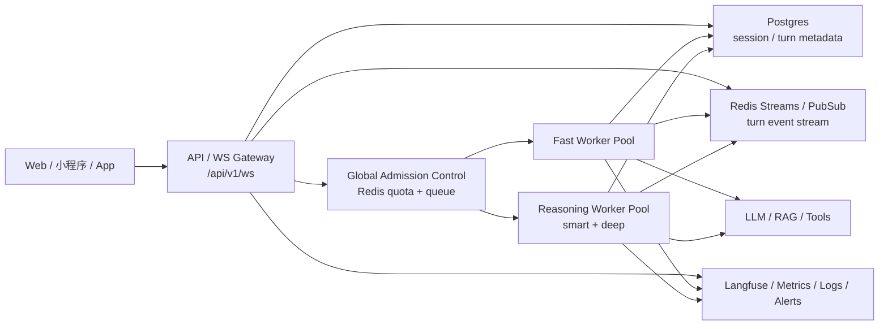
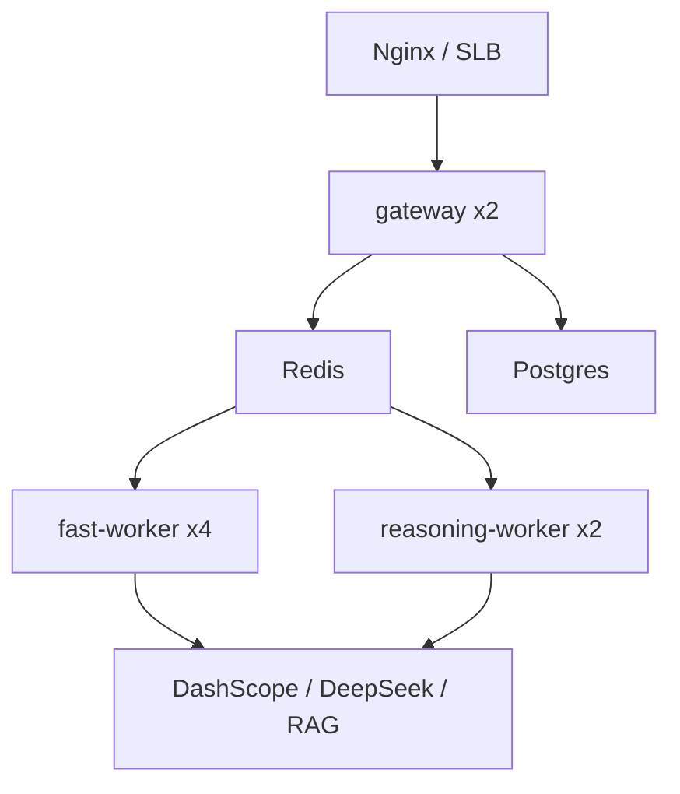

# DeepTutor 5 万会员全球级稳健部署 PRD

## 1. 文档信息

- 文档名称：DeepTutor 5 万会员全球级稳健部署 PRD
- 文档版本：v2
- 更新时间：2026-04-19
- 适用仓库：`/Users/yehongchen/Documents/CYH_2/Markzuo/deeptutor`
- 目标读者：创始人、技术负责人、后端工程师、运维负责人、阿里云部署执行人
- 当前约束：必须保持统一 turn control plane，不得新增第二套聊天 WebSocket 协议；方案必须能从当前阿里云 SSH 环境起步落地

---

## 2. 一句话结论

DeepTutor 要支持 5 万会员，正确路线不是继续把单机单进程硬顶上去，也不是一上来就引入高门槛复杂平台；而是保留统一 `/api/v1/ws` control plane，逐步把状态、排队、执行从单进程中抽离，先用当前阿里云 ECS + Docker Compose + Redis + Postgres 跑出低门槛、高稳定、可横向扩容的 execution plane，再在验证过混载容量后演进到多节点部署。

---

## 3. 背景与问题

### 3.1 当前事实

根据当前线上运行形态与代码结构，DeepTutor 目前具备以下特征：

- 对外统一流式入口是 `/api/v1/ws`
- 线上当前默认模式是 `fast`
- 当前阿里云生产实例是单台 ECS，单个 `uvicorn` worker
- 当前部署入口仍是单个 all-in-one `deeptutor` 容器
- 当前 turn live subscription 仍依赖进程内 `asyncio.Queue`
- 当前 session / turn 权威状态源仍以 `SQLiteSessionStore` 为主
- 当前 `EventBus` 仍是单进程单例内存队列
- 当前快速发布脚本仍以重建或重启整站容器为主，发布与长连接生命周期仍强耦合

这意味着系统目前更接近：

- 一个统一 contract 已经收口
- 但 execution plane 仍是单机内聚实现

### 3.2 当前瓶颈

当前形态可以支撑中低规模产品验证，但不适合作为 5 万会员级长期架构，原因有四个：

1. 接入层和执行层强耦合
2. turn live stream 依赖本地进程内队列，天然不利于多副本订阅
3. session / turn 权威状态仍在 SQLite，无法作为多副本共享真相
4. 并发保护主要是进程内 bulkhead，不是全局 admission control

### 3.3 为什么“5 万会员”不能按“5 万并发”来理解

5 万会员是总用户规模，不是同一时刻同时发起 turn 的用户数。

真正决定系统容量的是：

- 峰值同时发起 turn 的人数
- 这些 turn 里 `fast / smart / deep` 的占比
- 单 turn 持续时间
- 是否存在直播课、冲刺班、统一上课时段
- 系统承诺的 SLA

因此本 PRD 的目标不是“让单机扛 5 万并发”，而是构建一套：

- 可以稳态支撑 5 万会员产品规模
- 可以按峰值并发水平横向扩容
- 可以在当前阿里云 SSH 上低门槛起步部署

的部署与运行方案。

### 3.4 当前 PRD 必须正视的现实边界

这份 PRD 的目标不是夸大 closure，而是给出当前条件下最优、稳健、可交付的路线。

因此必须明确：

1. 第一阶段即使做到 `gateway x2 + worker x6`，如果它们还在同一台 ECS 上，也不等于机器级高可用。
2. Docker Compose-first 方案适合第一阶段低门槛起步，但不应被误写成 5 万会员终局架构。
3. reasoning 池即使逻辑分池，如果仍与 `fast` 共用同一宿主机 CPU/内存，也只能得到“较强隔离”，不是“完全物理隔离”。
4. 当前线上已有快发路径会重建/重启整站容器；如果不先拆 execution plane，发布时长连接和长任务仍会受影响。

---

## 4. 产品目标

### 4.1 核心目标

1. 在不破坏统一 turn contract 的前提下，建立可横向扩展的 deployment architecture。
2. 默认 `fast` 模式下，支撑大盘付费会员体验；`smart / deep` 作为可控高价值池化能力。
3. 第一阶段必须能够直接在当前阿里云 SSH 环境通过 Docker Compose 落地。
4. 整体方案必须同时满足：
   - 稳：不因单个 mode 或单个 worker 卡死整条线
   - 丝滑：付费用户主要路径保持稳定延迟和低失败率
   - 要求不高：不依赖重型平台作为第一阶段前提
5. 给出可执行的三阶段演进路径：`5000 会员 -> 2 万会员 -> 5 万会员`

### 4.2 非目标

1. 当前阶段不追求“一步到位的大厂全家桶”。
2. 当前阶段不强依赖 Kubernetes、Service Mesh、Kafka、复杂多集群。
3. 当前阶段不把所有会员默认升级到 `deep` 模式。
4. 当前阶段不新增第二套 turn transport、第二套 WebSocket 路由或第二套状态来源。

---

## 5. 第一性原则与设计原则

### 5.1 第一性原则

1. 用户感知的是“是否稳定、是否流畅、是否总能得到回复”，不是内部组件名。
2. 对外 contract 必须单一；对内执行平面可以演进。
3. 先做可验证、可部署、可回滚的最小正确架构，再做更复杂的平台化。
4. 默认选择低复杂度、低运维负担、可从当前阿里云 SSH 直接落地的方案。

### 5.2 设计原则

1. 单一入口不动：继续以 `/api/v1/ws` 作为唯一流式入口。
2. 状态与执行分离：session/turn state、stream events、LLM execution 不再绑死在一个进程内。
3. 模式池化隔离：`fast` 和 `reasoning` 至少分池，避免互相拖死。
4. 全局准入控制：不靠每个进程自己估算是否还能吃流量。
5. 先 Compose-first，再 cluster-ready：第一阶段能在当前 ECS 上落地，第二阶段天然可扩成多节点。
6. 明确不确定性：凡是当前没有真实数据支撑的性能承诺，必须标记为“待混载验证”，不得伪装成已证实结论。
7. 发布与评测解耦：不得再让评测、回放、压测和线上生产容器生命周期强耦合。

---

## 6. 当前架构诊断

### 6.1 当前强项

1. turn contract 已统一，控制面方向正确。
2. WebSocket 入口已收口，前端和运行时协议不会轻易再次分叉。
3. chat mode 已有 `fast / smart / deep` 三种运行分层，具备资源分池基础。
4. 阿里云当前部署链路已经可用，能在 SSH 环境下直接发布和验证。

### 6.2 当前核心风险

1. `TurnRuntimeManager` 仍把执行生命周期和 live subscriber 放在本地进程内。
2. `SQLiteSessionStore` 不适合做 5 万会员阶段的跨副本权威状态源。
3. `EventBus` 仍是单进程队列，不适合作为多副本 event backbone。
4. reasoning 模式目前更多是“占用更久”，而不是“独立资源池”，高峰时会拖累整体体验。
5. 现有快发脚本以重建或重启整站容器为主，发布期间长连接、长 turn 和评测任务都可能被中断。
6. 当前公网入口、端口暴露、宿主 nginx 占用关系复杂，第一阶段不适合同时追求“无感发布 + 零运维重构 + 域名总切换”。

### 6.3 当前部署不该怎么演进

以下路线都不推荐：

1. 继续堆大单机，不改 execution plane。
2. 直接把所有接口搬进 Kubernetes，但保留 SQLite + 进程内 subscriber。
3. 继续让 `fast / smart / deep` 共抢同一批 worker。
4. 用更多补丁继续包住单机 runtime，而不明确 authority / queue / state 边界。
5. 继续把长对话评测、线上服务、快速发布混在同一个生产容器里执行。

### 6.4 当前已有能力，应该复用而不是推倒重来

为了降低第一阶段改造成本，本 PRD 明确要求优先复用现有能力：

1. 继续复用统一 turn contract 和 `/api/v1/ws`
2. 继续复用现有 orchestrator / capability / tool 体系
3. 优先复用已有 Redis rate limit backend 能力，再逐步扩成 admission control
4. 优先复用已有 orphaned running turn recovery 思路，扩成外部队列与 lease 机制
5. 继续复用当前阿里云部署链路和脚本体系，但要改造成按角色部署，而不是整站一锅端

这意味着第一阶段不是“全仓重写”，而是“authority、state、queue、execution 解耦”。

---

## 7. 目标部署方案

## 7.1 总体架构

### 7.2 角色划分

#### A. API / WS Gateway

职责：

- 维护统一 `/api/v1/ws`
- 鉴权、start_turn、subscribe_turn、resume_from、cancel_turn
- 将 turn 请求写入全局 admission control
- 从外部 event stream 读取并向客户端转发事件

不再承担：

- 长时间同步执行 turn
- 进程内持有 turn live subscriber 作为唯一事实

#### B. Global Admission Control

职责：

- 按 mode / user tier / bot / tenant 统一限流
- 控制全局 in-flight 数量
- 超额 turn 进入队列
- 保障 `fast` 池优先级高于 `reasoning`

实现要求：

- 第一阶段直接使用 Redis
- 不引入复杂调度系统作为前提
- 准入结果必须显式分成：`accept / enqueue / reject / degrade`

#### C. Worker Pool

至少分两池：

- `fast-worker`
- `reasoning-worker`

第二阶段可进一步拆成：

- `fast-worker`
- `smart-worker`
- `deep-worker`

职责：

- 从队列拉取待执行 turn
- 执行 orchestrator / capability / tool / rag / llm
- 把 turn events 写入 event stream
- 回写 turn status / metadata / outputs
- 维护 execution lease，避免单 turn 被多个 worker 并发消费

#### D. State Store

目标权威状态源：

- Postgres

负责：

- session
- turn
- turn status
- event metadata index
- replay / resume 必需的数据

SQLite 只保留为：

- 本地开发
- 单机临时测试

#### E. Event Stream

目标：

- Redis Streams 或 Redis PubSub + backlog 存储

职责：

- 支撑 gateway 多副本订阅 turn event
- 支撑 turn replay / catchup
- 解耦 websocket 生命周期与执行生命周期
- 为发布、worker crash、gateway 重连提供可恢复基础

### 7.3 一阶段与终局的关系

本 PRD 明确分清三种层次：

1. Control plane 终局方向：从现在开始就应稳定，不应反复重写。
2. Execution plane 第一阶段：先在单台 ECS 上拆角色，建立可扩展边界。
3. Infra 终局：后续再升级到多节点、多可用区、高可用数据库和更成熟的发布机制。

这三层不能混写。否则最容易出现的问题是：

- 文档看起来像终局方案
- 落地却仍然是单机整站重启
- 最后既做不到当前可部署，也做不到长期可扩展

---

## 8. 为什么这是“全球顶尖水平”但仍然“要求不高”

### 8.1 顶尖的地方

1. control plane 不分叉，对外 contract 稳定。
2. execution plane 与 gateway 解耦，具备真正横向扩展能力。
3. 默认模式与高耗时模式分池，符合真实大规模 AI 产品的资源治理方式。
4. admission control 先于盲目扩容，避免虚假容量。
5. 观测、回放、流式重连、状态权威保持在同一套 turn 语义里，不长第二套系统。

### 8.2 要求不高的地方

1. 第一阶段不用 Kubernetes。
2. 第一阶段不用 Kafka。
3. 第一阶段不用 Service Mesh。
4. 第一阶段可以继续在当前阿里云 ECS 上，通过 SSH + Docker Compose 落地。
5. 第一阶段只引入两个核心外部依赖：
   - Redis
   - Postgres

这是“高水平架构减法”，不是“高水平名词堆砌”。

### 8.3 顶尖方案不等于一次引入最多组件

全球顶尖水平的关键，不是组件数量，而是：

1. 边界定义正确
2. 失败模式提前设计
3. 发布与回滚有纪律
4. 容量承诺建立在真实观测和混载验证上

如果一个方案：

- 第一阶段就要求 Kubernetes、Kafka、多集群
- 但没有先解决 turn authority、stream backlog、queue fairness

那不是顶尖，而是高复杂度低产出。

---

## 9. 在当前阿里云 SSH 上的落地方案

## 9.1 当前可接受的基础环境

基于当前阿里云 SSH 可落地的最小环境：

- 1 台现有 ECS 继续保留
- Docker Compose 继续作为编排入口
- 新增 Redis 服务
- 新增 Postgres 服务
- 将当前 `deeptutor` 单容器拆成：
  - `gateway`
  - `fast-worker`
  - `reasoning-worker`
  - `redis`
  - `postgres`
  - `nginx`（可选，但推荐）

推荐分两种落地变体：

#### 方案 A：同机自托管 Redis + Postgres

优点：

- 起步最快
- 只依赖当前 SSH 与 Docker Compose
- 最适合作为第一阶段迁移与验证入口

缺点：

- 不是机器级高可用
- 数据库与应用仍存在单宿主故障域

适用：

- 先完成 execution plane 解耦
- 先完成 `5000 会员稳态版`

#### 方案 B：ECS 上跑 gateway/worker，状态层用托管 Redis/Postgres

优点：

- 更早获得状态层可靠性
- 降低单机磁盘和本地 DB 维护风险

缺点：

- 需要额外申请与维护云资源
- 当前起步门槛略高

适用：

- 团队已经接受托管资源
- 希望 Phase 1.5 就开始减少单机故障域

本 PRD 的默认推荐是：

- Phase 1 用方案 A 起步
- 最迟在 Phase 2 切到方案 B 或等价托管形态

### 9.2 第一阶段推荐拓扑

说明：

- 即使仍在单台 ECS 上，也要逻辑拆角色
- 这样后面迁移到第二台 ECS 时，不需要再推翻角色模型
- 但必须明确：同机 `gateway x2` 只代表进程/容器级冗余，不代表机器级高可用

### 9.3 部署形态要求

第一阶段必须满足：

1. 可以通过当前 SSH 登录目标机执行部署
2. 可以通过 Docker Compose 启停和扩 worker
3. 可以通过现有脚本体系继续发布
4. 可以做灰度：先扩 gateway / worker，不强制一次性整站切换
5. 不能再要求所有评测任务直接在生产服务容器中运行

### 9.4 Phase 1 不应过度承诺的能力

第一阶段可以承诺：

1. 逻辑分池
2. 基础 queue 与 admission control
3. gateway / worker 分离
4. 发布与线上执行面显著解耦

第一阶段不应承诺：

1. 真正意义上的多机高可用
2. 零损发布
3. Redis/Postgres 任一单点故障下完全无损继续服务
4. 在未做混载压测前就宣称“已可稳定支撑 5 万会员”

### 9.5 场景覆盖矩阵

这部分是本 PRD 从“方向性文档”升级为“可交付文档”的关键。

| 场景 | 期望行为 | Phase 1 设计要求 | Phase 2+ 目标 |
|---|---|---|---|
| 日常稳定流量 | 主路径平稳，`fast` 延迟可控 | `fast` 与 reasoning 分池 | 多节点扩容 |
| 冲刺班瞬时涌入 | 不把整站打爆 | admission control + queue | 按 mode 和 tier 分配配额 |
| `deep` 请求挤爆 | 不拖垮 `fast` | reasoning 单独排队 | `smart` / `deep` 继续拆池 |
| gateway 重启 | 用户可重连并继续订阅 | 外部 event stream + resume | gateway 多副本滚动发布 |
| worker crash | turn 不永久挂死 | lease + orphan recovery + 重试/失败收敛 | 自动重试与熔断 |
| Redis 短时故障 | 系统可降级或拒绝，而不是写坏状态 | fail-closed 或受控降级 | Redis HA |
| Postgres 短时故障 | 不新写坏状态；已有 turn 进入受控失败 | 新 turn 阻断，旧 turn 尽量收敛 | 托管高可用 |
| 模型上游抖动 | 不让慢请求淹没主池 | queue wait + timeout + per-pool 限额 | provider 级策略与多 provider |
| 发布代码 | 不应整站长连接全断 | gateway/worker 分角色发布 | canary / blue-green |
| 长对话评测 | 不影响生产容器生命周期 | 一律跑 isolated one-off 容器 | 独立评测节点 |
| 公网入口波动 | 内部执行面不应跟着重建 | ingress 与 execution 分离 | SLB / 域名 / upstream 切换 |

---

## 10. 三阶段容量演进计划

## 10.1 Phase 1：5000 会员稳态版

### 目标

- 从单进程架构升级为可横向扩展的基础 execution plane
- 默认 `fast` 模式支撑主业务
- `smart / deep` 合并为 reasoning 池

### 建议部署

- `gateway x2`
- `fast-worker x4`
- `reasoning-worker x2`
- Redis 单实例
- Postgres 单实例或托管版

### 核心能力

1. `/api/v1/ws` 继续保持唯一入口
2. gateway 无长任务执行责任
3. `fast` 与 `reasoning` 分池
4. queue wait / job duration / failure rate 可观测
5. 发布、评测、线上执行不再共享同一个生命周期单元

### 验收标准

1. 混载压测下 `fast` 不被 reasoning 拖死
2. worker 挂掉后，gateway 仍可接新请求
3. reconnect / replay / resume 保持统一 contract
4. 发布可回滚，单组件重启不导致全站重建
5. 长对话评测任务必须能在隔离容器中运行，不中断生产容器

## 10.2 Phase 2：2 万会员增强版

### 目标

- 把 reasoning 池进一步精细化
- 开始支撑明显峰值时段

### 建议部署

- `gateway x3-4`
- `fast-worker x8-12`
- `smart-worker x3-4`
- `deep-worker x3-4`
- Redis 高可用
- Postgres 托管高可用

### 增强项

1. mode 级独立配额
2. user tier / membership 级配额
3. 高峰时段自动降级策略
4. 更细粒度的 autoscaling 信号
5. gateway 与 worker 分布到不同故障域

### 验收标准

1. 高峰期 `fast` 的 p95 延迟仍满足产品承诺
2. `smart / deep` 的 queue 策略对用户可解释、可观测
3. 单个 mode 池资源耗尽不会拖垮其他池

## 10.3 Phase 3：5 万会员目标版

### 目标

- 达到平台级规模的可持续运行形态

### 建议部署

- 多节点 ECS
- gateway 与 worker 跨节点部署
- Redis 高可用
- Postgres 高可用
- 必要时前置 SLB / Nginx upstream

### 关键增强项

1. 多节点部署
2. 单节点故障可自动摘除
3. 日常发布不影响整体会话面
4. capacity planning 与扩容 runbook 固化

### 验收标准

1. 明确产线 SLA
2. 明确 mode 分池容量上限
3. 明确峰值扩容策略
4. 明确高峰降级与恢复策略
5. 明确发布窗口、回滚窗口和故障演练制度

---

## 11. 模式策略

### 11.1 默认策略

- 生产默认模式：`fast`

### 11.2 reasoning 策略

`smart / deep` 不应作为全量会员默认模式，而应作为：

- 会员升级权益
- 高价值学习场景
- 限量模式
- 峰值时可队列化的模式

### 11.3 降级策略

当 reasoning 池达到高压阈值时：

1. 优先排队
2. 超阈值后给出明确等待提示
3. 必要时允许平台把部分请求降级到 `fast`
4. 不允许 reasoning 反向挤压 `fast`

### 11.4 默认 SLA 建议

以下 SLA 不是已证实事实，而是当前建议的产品承诺上限，必须经真实混载验证后才能对外发布：

| 模式 | 建议 SLA | 说明 |
|---|---|---|
| `fast` | 短 turn `p95 < 6s` | 若超出，应优先扩 `fast-worker` |
| `smart` | 有结果或明确排队反馈 `p95 < 25s` | 若无法做到，应收紧配额 |
| `deep` | 有结果或明确排队反馈 `p95 < 30s` | 若无法做到，应限量而非硬顶 |

如果验证结果与建议 SLA 不一致，以真实混载结果为准。

---

## 12. 核心技术方案

## 12.1 状态层改造

### 目标

把当前 `SQLiteSessionStore` 抽象为统一 store interface，并新增 `PostgresSessionStore`。

### 原则

1. 保持当前调用形状尽量稳定
2. 不在第一阶段就全仓大改调用方
3. 先让接口稳定，再切底层实现

### 第一阶段输出

- `SessionStore` interface
- `SQLiteSessionStore` 继续存在，用于本地开发
- `PostgresSessionStore` 用于生产
- dual-read / dual-write 迁移开关
- 明确的 backfill 与回滚路径

### 12.1.1 推荐迁移顺序

1. 先引入接口，不改调用方语义
2. 在非关键路径做双写验证
3. 再切生产读路径
4. 最后把 SQLite 降为开发/回退实现

避免一次性“热切换所有读写”。

## 12.2 turn event stream 改造

### 目标

将当前进程内 subscriber queue 演进为外部 event stream。

### 原则

1. 对客户端仍然保持统一 turn event schema
2. 不新造第二套 websocket 协议
3. backlog / catchup / replay 继续存在

### 第一阶段输出

- `TurnEventStream` interface
- `InMemoryTurnEventStream` 作为本地实现
- `RedisTurnEventStream` 作为生产实现
- 明确 stream retention、event trim、catchup 边界

### 12.2.1 设计约束

1. stream retention 不能无限增长
2. replay 不要求永久保存所有细粒度 events，但必须保留统一 turn 级回放能力
3. 生产环境中，client reconnect 不应依赖 worker 本地内存

## 12.3 execution plane 改造

### 目标

把 turn 执行从 gateway 进程里抽离出去。

### 原则

1. gateway 只负责接入与订阅
2. worker 负责执行
3. orchestrator 仍保留为统一执行核心

### 第一阶段输出

- `gateway` service
- `fast-worker`
- `reasoning-worker`
- `execution lease`
- `job state machine`

### 12.3.1 execution lease 规则

每个 turn 被 worker 消费后，必须持有 lease：

1. 正常执行中：worker 周期性续租
2. worker crash：lease 过期后 turn 可被恢复流程处理
3. 是否自动重试，必须按 capability / mode 配置，而不是全量盲重试

## 12.4 admission control 改造

### 目标

把当前 local concurrency guard 升级为全局 admission control。

### 第一阶段输出

- 全局 in-flight 计数
- mode 池容量上限
- queue wait time 指标
- reject / degrade / enqueue 策略

### 12.4.1 推荐实现顺序

第一阶段不新造完整“调度中心”，而是按以下顺序扩：

1. 先把现有 Redis rate limit backend 打开
2. 在其之上增加 mode 级 in-flight 计数
3. 再增加 enqueue / dequeue 与 queue wait 指标
4. 最后再增加 tier、bot、tenant 粒度

这样可以最大限度利用现有代码现实，避免空降新系统。

### 12.4.2 admission control 判定原则

1. `fast` 池满但 reasoning 有空闲，不允许把 `fast` 自动转成 reasoning 池执行
2. reasoning 池满但 `fast` 有空闲，可以按产品策略选择降级到 `fast`
3. 当全局依赖异常时，优先 fail-closed，而不是写出不一致状态

## 12.5 发布与回滚方案

### 12.5.1 第一阶段推荐发布方式

第一阶段不追求真正 zero-downtime，而追求：

1. 按角色滚动
2. 发布影响面可控
3. 可回滚

推荐顺序：

1. 先发 worker
2. 验 queue / job / event stream 正常
3. 再发 gateway
4. 最后发 ingress 或 nginx 配置

### 12.5.2 第一阶段推荐回滚方式

1. 保留上一版镜像 tag
2. 保留旧 compose 配置
3. Postgres schema 变更优先走 additive migration
4. Redis stream schema 改动必须保持后向兼容

### 12.5.3 评测与生产隔离要求

1. 长对话回放、压力测试、批量评测一律使用 isolated one-off 容器
2. 禁止再次使用 `docker exec 生产容器` 的方式承载高时长评测任务
3. 若必须在线上机器压测，也必须使用独立容器名、独立输出目录、独立资源预算

---

## 13. 观测与运维要求

## 13.1 必须具备的指标

1. `turn_started_total`
2. `turn_completed_total`
3. `turn_failed_total`
4. `queue_wait_ms`
5. `job_duration_ms`
6. `pool_inflight{mode=*}`
7. `pool_rejected_total{mode=*}`
8. `gateway_active_ws_connections`
9. `stream_delivery_lag_ms`
10. `provider_latency_ms`
11. `orphaned_turn_recovered_total`
12. `turn_enqueue_total / turn_reject_total / turn_degrade_total`

## 13.2 必须具备的运维动作

1. 单独扩 `fast-worker`
2. 单独扩 `reasoning-worker`
3. 单独滚动重启 gateway
4. 查看 queue backlog
5. 查看 mode 级别 in-flight
6. 在不重建全站的前提下发布单一角色
7. 单独停止某类 worker 而不影响 gateway
8. 运行独立评测容器而不动生产容器

## 13.3 发布原则

1. 先灰度 gateway
2. 再灰度 worker
3. 发布时不能再让评测任务和生产容器生命周期强耦合
4. 混载压测通过前，不对外夸大 closure

### 13.4 告警建议

最少要有以下告警：

1. `fast` 池 queue wait 连续超阈
2. reasoning 池 reject/degrade 激增
3. orphaned turn recovery 激增
4. Redis stream lag 激增
5. Postgres 写延迟显著升高
6. provider latency 激增或错误率升高

---

## 14. 容量模型

## 14.1 会员规模与系统容量的关系

系统容量不直接由会员总数决定，而由峰值并发 turn 决定。

建议运营与技术共同维护以下模型：

`峰值并发 turn = 活跃会员数 × 峰值同时发问比例`

### 经验规划

| 会员规模 | 峰值并发 turn 规划 | 备注 |
|---|---:|---|
| `5000` | `50 - 120` | 以 `fast` 为主 |
| `2 万` | `150 - 300` | 需 mode 分池与全局 admission control |
| `5 万` | `300 - 500+` | 需多节点部署与成熟扩容策略 |

### 资源规划原则

1. `fast` 负责大盘
2. `smart / deep` 负责高价值场景
3. 任何阶段都不允许 reasoning 抢占 fast 的核心体验预算

### 14.2 当前最关键的不确定性

以下问题当前仍未被真实证据完全覆盖，必须在实施过程中继续验证：

| 不确定性 | 当前状态 | 验证方式 | 替代方案 |
|---|---|---|---|
| 真实建筑实务长对话的混载峰值 | 未充分验证 | 用真实 long dialog 题集跑 mixed-load replay | 先降低 reasoning 配额 |
| 单机 Compose 方案下 gateway 连接上限 | 未量化 | 压 websocket 连接数与 FD/内核参数 | Phase 1 控制连接规模，Phase 2 多节点 |
| Redis Streams 的 retention 与成本平衡 | 未量化 | 跑 7-14 天 retention 实测 | 降低细粒度 event 保留时间 |
| Postgres 回放/写放大成本 | 未量化 | 统计 turn/event 写频与索引成本 | 先缩小 event metadata 落库范围 |
| Phase 1 发布对用户长连接的影响 | 可预见但未量化 | 灰度发布演练 | Phase 1 明确告知非零影响，Phase 2 引入更成熟切换 |
| provider 高峰限额对 reasoning 池影响 | 未完全验证 | 分 mode provider 压测 | reasoning 收紧配额或做 provider 分流 |

---

## 15. 风险与应对

### 风险 1：直接上重型平台导致交付变慢

应对：

- 第一阶段坚持 Compose-first
- 不把 K8s 作为前置条件

### 风险 2：只拆容器，不拆 authority

应对：

- 明确 state / queue / stream / execution 的边界
- 先做 authority 收口，再做横向扩容

### 风险 3：`smart / deep` 混池拖死 `fast`

应对：

- 至少两池隔离
- 全局 admission control
- 明确 queue 与降级策略

### 风险 4：宣称 5 万会员，但没有混载压测证据

应对：

- 所有 closure 以混载压测和线上观测为准
- 先给阶段性容量，不给虚高总数

### 风险 5：把同机双副本误当成高可用

应对：

- 文档、发布、对外口径都明确标注“同机多副本 != 多机 HA”
- 真正机器级高可用只在 Phase 2+ 后承诺

### 风险 6：Postgres/Redis 引入后，运维复杂度突然升高

应对：

- Phase 1 允许同机自托管
- Phase 2 再迁托管版
- 文档中明确给出自托管与托管两种变体

### 风险 7：migration 一次性切换失败

应对：

- additive schema
- dual-write
- feature flag 切读路径
- 保留 SQLite 回退实现

---

## 16. 里程碑

## 16.1 Milestone A：现网可扩容基础版

目标：

- 在当前阿里云 SSH 上完成 gateway / worker / Redis / Postgres 的最小拆分

完成标准：

- gateway 不再执行长任务
- worker 可单独扩容
- Redis / Postgres 成为生产基础依赖
- 有灰度与回滚脚本
- 有 isolated eval runbook

## 16.2 Milestone B：模式池化与全局准入

目标：

- 实现 `fast` 与 reasoning 分池
- 实现 queue + quota + reject/degrade 逻辑

完成标准：

- 混载压测下 fast SLA 稳定
- 高峰 reasoning 不影响主路径

## 16.3 Milestone C：多节点 5 万会员目标版

目标：

- 支撑 5 万会员规模的长期运行

完成标准：

- 多节点部署可用
- 有扩容 runbook
- 有降级 runbook
- 有混载容量证明

---

## 17. 本 PRD 的最终决策

1. DeepTutor 的正确路线是保留统一 `/api/v1/ws` control plane，不新增第二套 transport。
2. 第一阶段不直接上重型平台，而是基于当前阿里云 SSH 用 Docker Compose 实现角色拆分。
3. 第一阶段必须引入 Redis 和 Postgres，作为 execution plane 外置的基础设施。
4. worker 至少按 `fast` 与 `reasoning` 两池拆分。
5. 5 万会员目标必须以“多副本 + 全局 admission control + 分池 + 观测 + 混载压测”为前提，而不能继续建立在单机单进程上。
6. 第一阶段允许同机多角色部署，但不得把它误写成机器级高可用。
7. 发布、评测、线上执行必须分生命周期管理。

---

## 18. 下一步实现清单

1. 抽 `SessionStore` interface，并引入 `PostgresSessionStore`
2. 抽 `TurnEventStream` interface，并引入 `RedisTurnEventStream`
3. 把 gateway 与 worker 拆成独立服务角色
4. 引入全局 admission control
5. 完成 `fast` / `reasoning` 双池 worker 部署
6. 在当前阿里云 ECS 上完成第一阶段 Compose 部署
7. 跑混载压测，验证 `fast` 主路径 SLA
8. 形成发布、回滚、isolated eval 三份 runbook
