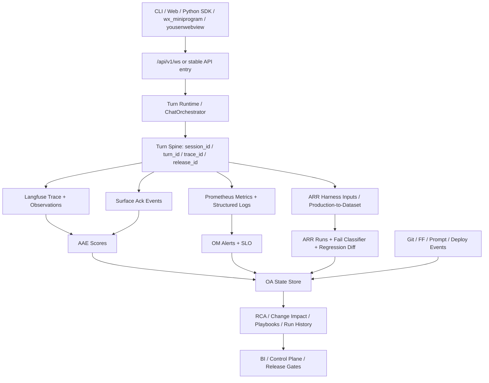

# PRD：DeepTutor 顶尖观测体系（ARR / AAE / OA / OM）

## 1. 文档信息

- 文档名称：DeepTutor 顶尖观测体系 PRD
- 文档路径：`/Users/yehongchen/Documents/CYH_2/Markzuo/deeptutor/doc/plan/2026-04-19-deeptutor-top-tier-observability-arr-aae-oa-om-prd.md`
- 创建日期：2026-04-19
- 最近修订：2026-04-19（二次强化版）
- 文档状态：Proposed
- 适用范围：
  - `deeptutor` backend
  - 统一聊天入口 `/api/v1/ws`
  - CLI / Web / Python SDK
  - `wx_miniprogram`
  - `yousenwebview`
  - Langfuse / Prometheus / Grafana / 阿里云部署链路
- 关联约束：
  - [CONTRACT.md](/Users/yehongchen/Documents/CYH_2/Markzuo/deeptutor/CONTRACT.md)
  - [contracts/index.yaml](/Users/yehongchen/Documents/CYH_2/Markzuo/deeptutor/contracts/index.yaml)
  - [contracts/turn.md](/Users/yehongchen/Documents/CYH_2/Markzuo/deeptutor/contracts/turn.md)
  - [deeptutor/contracts/unified_turn.py](/Users/yehongchen/Documents/CYH_2/Markzuo/deeptutor/deeptutor/contracts/unified_turn.py)
  - [docs/zh/guide/runtime-observability.md](/Users/yehongchen/Documents/CYH_2/Markzuo/deeptutor/docs/zh/guide/runtime-observability.md)
- 深层设计审计：
  - [2026-04-19-deeptutor-observability-original-intent-mapping-audit.md](/Users/yehongchen/Documents/CYH_2/Markzuo/deeptutor/doc/plan/2026-04-19-deeptutor-observability-original-intent-mapping-audit.md)
- 调研参考：
  - 旧仓：`/Users/yehongchen/Documents/CYH_2/Markzuo/FastAPI20251222`
  - 当前仓：`/Users/yehongchen/Documents/CYH_2/Markzuo/deeptutor`

## 2. 执行摘要

DeepTutor 当前已经有三块重要基础：

1. 统一 turn contract 与唯一流式入口 `/api/v1/ws`
2. `turn_runtime -> Langfuse -> usage_ledger -> BI/cost` 的最小观测闭环
3. `healthz / readyz / metrics / metrics/prometheus` 的最小运维观测面

但它距离“顶尖观测体系”还有四个关键缺口：

1. 没有把真实产品行为系统化地转成可回归、可比较、可归因的 ARR 飞轮
2. 没有统一的 AAE 评分面，无法把“答得如何、教得如何、用户是否满意”沉淀为长期可追踪质量资产
3. 没有 OA（Observer Analyst）层，把 runtime、评测、变更、前端表面、反馈、成本串成 RCA 与修复剧本
4. 没有 OM（Operations Monitoring）控制面，把服务健康、链路完整性、SLO/Burn-rate、跨服务探针与告警收敛成生产运维事实

本 PRD 的核心判断是：

> `deeptutor` 不应该复制旧仓的一堆脚本和页面，而应该复用旧仓已经验证过的四层方法论，并把它们重新收口到 DeepTutor 的单一 authority 上。

这个单一 authority 是：

1. 聊天 authority：只有 `/api/v1/ws`
2. 会话 authority：只有 `session_id / turn_id`
3. trace authority：每个 turn 只有一条主 trace spine
4. 评测 authority：ARR/AAE/OA/OM 都围绕同一条 turn / trace / release 事实展开，而不是各自再长第二套 ID 体系

本 PRD 提议把观测体系收敛为四层互补架构：

1. `OM`：回答“系统现在是否活着、稳定、可接流量、可告警”
2. `ARR`：回答“这次改动是否让已知能力退化”
3. `AAE`：回答“系统长期质量到底如何，哪里变强，哪里变差”
4. `OA`：回答“为什么会这样，和哪些变更相关，下一步该怎么修”

四层不是四套平行真相，而是同一条主链路的四种视角。

## 2.1 本次二次强化后的关键加强点

相较第一版，本次增强重点补四个短板：

1. 把“观测能力清单”进一步收敛成“核心场景矩阵 + 失败形状 + release gate”的实战结构。
2. 把“长期愿景”与“当前条件下最小可交付版本”拆开，避免一开始就把体系做成重平台项目。
3. 把 `LLM judge`、小程序 `surface ack`、`Langfuse score/annotation`、`Supabase control plane` 这些存在现实不确定性的部分，全部显式写成验证计划和替代路径。
4. 把 OA 的输出从“可能很聪明的分析”收紧成“带证据、带置信度、带下一步验证动作”的诊断合同，避免观察层自己变成第二个幻觉源。

## 3. 深度调研结论

## 3.1 旧仓真实形态，不是概念想象

### 3.1.1 ARR 在旧仓里到底是什么

旧仓里的 ARR 不是一个“分数看板”名字，而是一条真实可执行的回归流水线：

- 入口是 [scripts/run_arr_pipeline.py](/Users/yehongchen/Documents/CYH_2/Markzuo/FastAPI20251222/scripts/run_arr_pipeline.py)
- 支持 `lite / full / auto` 三种模式
- 内置 `canary / flaky / long-dialog / chain` 多类样本
- 产出 `test_results_* / classified_* / chain_classified_* / arr_report_*.html`
- 会把 ARR 分数写回 Langfuse
- 会做失败分类、历史对比、补丁验证、失败模式沉淀
- 会生成 `AAE compat` 产物，说明旧仓里 AAE 与 ARR 不是两条完全脱离的飞轮

因此，旧仓里的 ARR 本质上是：

> 以真实输入集、分类结果、差异对照、Langfuse 写回和长期失败记忆组成的 Agent 回归飞轮。

### 3.1.2 AAE 在旧仓里到底是什么

旧仓里的 AAE 不是独立聊天 runtime，而是“智能体评审”层：

- BI 路由里有 `/api/v1/bi/eval/aae`
- 数据来源是 `AGENT_EVAL_AUDIT_REPORT.md`、`AGENT_EVAL_ACTION_PLAN.md`、以及复合质量维度
- 旧仓还实现了自适应 composite score，把多维信号合成长期质量判断
- ARR 还会输出 `artifacts/aae_eval_results_direct.json` 这类兼容产物

因此，AAE 更准确的定义应是：

> `AAE = Agent Audit & Evaluation`，即把“系统级诊断、质量评审、长期评分口径、行动计划”沉淀成一套可运营、可跟踪、可用于 release gate 的质量控制面。

### 3.1.3 OA 在旧仓里到底是什么

旧仓里的 OA 不是一个普通 dashboard，而是 Observer Analyst 闭环：

- CLI 入口是 [scripts/run_observer.py](/Users/yehongchen/Documents/CYH_2/Markzuo/FastAPI20251222/scripts/run_observer.py)
- 批处理入口是 [scripts/run_oa_daily_batch.py](/Users/yehongchen/Documents/CYH_2/Markzuo/FastAPI20251222/scripts/run_oa_daily_batch.py)
- 支持 `analyst / raw / curator / coach` 多种模式
- 有统一状态仓 [services/observer/state_store.py](/Users/yehongchen/Documents/CYH_2/Markzuo/FastAPI20251222/services/observer/state_store.py)
- 会写 `oa_runs / oa_signals / oa_change_events / oa_causal_links / oa_playbooks`
- BI 层能看 `data coverage / root causes / change impact / run history / playbooks`

因此，OA 本质上是：

> 站在系统外侧，把 OM + ARR + AAE + 变更事件融合后，生成 RCA、趋势、修复剧本和 run history 的观测分析层。

### 3.1.4 OM 在旧仓里到底是什么

旧仓里并没有一个单文件叫 OM，但它已经形成完整运维监控面：

- `Prometheus / Grafana / Langfuse` 组成栈级探针
- `observability_stack` 能直接探测三者健康状态
- EventLog / API logs / Langfuse / Benchmark / Prometheus 会被统一拉进 Observer 快照
- BI dashboard 上有 runtime quality、stack 状态、trace profile、ARR/AAE/OA 交叉视图

因此，OM 应定义为：

> `OM = Operations Monitoring`，即对“服务活性、链路健康、延迟、错误、资源、告警、依赖栈状态”的运行时监控与响应面。

## 3.2 当前 deeptutor 的真实基础

### 3.2.1 已有强项

当前 `deeptutor` 已经有若干关键基石，不能重复造轮子：

1. 统一流式入口只有 `/api/v1/ws`
2. `UnifiedTurnStartMessage / UnifiedTurnStreamEvent / UnifiedTurnSemanticDecision` 已形成机器可读 contract
3. `turn_runtime` 已经把 `session_id / turn_id / capability / bot_id / active_object / context_route / user_id` 写入 trace metadata
4. `LangfuseObservability` 已有 safe no-op fallback、attribute propagation、usage_scope、cost estimate、PII mask
5. `usage_ledger` 已形成 measured / estimated token 与 cost 的落账层
6. `readyz / healthz / metrics / metrics/prometheus` 已形成最小 OM 出口
7. `wx_miniprogram` 与 `yousenwebview` 已经有 workflow status 与 WS stream 可承接前端表面观测
8. 已有 `semantic_router_eval`、`context_orchestration_eval` 等专项评测脚本和 fixtures
9. 已有 BI / member / cost 统计基础

### 3.2.2 当前缺口

但当前仓库还缺：

1. 没有统一的 ARR runner，把语义路由、上下文承接、RAG、TutorBot、多轮 continuity、小程序表面放进同一回归体系
2. 没有 AAE 统一 score taxonomy，无法把人评、机评、用户反馈、guardrail 结果统一挂到 trace / turn / dataset run
3. 没有 OA state store，导致 RCA、变更影响、run history、修复剧本缺少长期可查询底座
4. 没有产品表面 ack telemetry，无法确认“后端发了”和“用户真看到了”之间是否断裂
5. 没有 observability control plane，把 Langfuse、Prometheus、Grafana、Aliyun 服务状态放到同一张生产事实板上
6. 没有从 production trace 自动反哺 dataset 的标准机制
7. 没有一套明确的 release gate，把 runtime、回归、评分、盲区覆盖整合成 go/no-go

## 4. 根因定义

### 4.1 一等业务事实

本 PRD 要维护的一等业务事实只有一句话：

> DeepTutor 的每一次真实学习交互，都必须能够从“用户表面行为”一直追到“turn 语义决策、工具/知识调用、模型输出、用户感知、评分结果、变更归因、运维状态”。

这意味着观测体系不是单纯“多打点”，而是要保证这条事实链不断：

1. 用户在哪个表面进入
2. 哪个 session / turn 接住了它
3. 哪条 trace 是它的主 spine
4. 这轮调用了什么 capability / tool / knowledge
5. 用户最终看到的内容是什么
6. 这轮是成功、失败、退化、误导，还是让付费学员满意
7. 若退化，它与哪个 release / prompt / feature flag / commit 更可能相关

### 4.2 当前最核心的结构问题

现在 `deeptutor` 的问题不是“没有观测”，而是“观测还没有形成统一闭环”：

1. runtime trace 有了，但 release gate 没接上
2. cost ledger 有了，但质量评分没接上
3. frontend workflow 有了，但 render ack 没标准化
4. 专项评测有了，但还没上升成 ARR 总线
5. Langfuse 有了，但还没有变成 AAE/OA 的统一输入之一

如果继续只补点式增强，很容易再次进入 patch spiral：

1. 某个问题来了，临时加一个脚本
2. 又一个问题来了，再加一个 JSON 报告
3. 再有问题，就去 Langfuse 手工看
4. 最后形成很多局部工具，但没有可治理的控制面

## 5. 产品目标

## 5.1 核心目标

1. 建立 DeepTutor 的单一观测主链路，所有评测、评分、诊断、运维都围绕 `session_id / turn_id / trace_id / release_id` 收敛。
2. 把旧仓验证过的 `ARR / AAE / OA / OM` 方法论迁入 `deeptutor`，但不复制旧系统的历史包袱。
3. 让团队能回答四类问题：
   - 系统现在稳不稳？
   - 这次改动退化没退化？
   - 长期质量在提升还是下滑？
   - 如果有问题，最可能是哪一层、哪次变更、哪条链路出了问题？
4. 让真实产品表面成为一等观测对象，而不是只有 backend trace。
5. 让 release gate 具备证据化、结构化、可回放的 go/no-go 判断能力。

## 5.2 世界级标准

这里的“顶尖”不是指“打点特别多”，而是指：

1. authority 单一
2. 数据词汇表稳定
3. trace / metrics / logs / scores / datasets 能相互关联
4. offline eval、online eval、human review、runtime alert 互相打通
5. 前端表面、后端 runtime、评测体系、运维告警不是四套孤岛

## 5.3 非目标

1. 不新增第二套聊天 WebSocket 或专用 TutorBot WS 路由
2. 不让 OM / ARR / AAE / OA 自己维护第二套会话和 turn 语义
3. 不把旧仓所有页面和脚本机械复制到当前仓
4. 不为了“更高级”先引入过重的数据平台、消息总线或数据湖
5. 不把普通内部 helper 的局部字段滥升级成仓库级 contract
6. 不追求第一期就把所有评测都自动化到 100%

## 5.4 当前条件下的最小可交付标准

在当前代码基础、现有 Langfuse/Prometheus 基建、以及小程序真实验证成本的前提下，可交付的第一阶段不应定义成“全部做完”，而应定义成以下六项同时成立：

1. 任一关键 trace 都能稳定关联 `user_id / session_id / turn_id / trace_id / release_id / git_sha / ff_snapshot_hash`。
2. `/api/v1/ws`、turn latency、provider error、surface first render 至少有一套统一可看的 OM 仪表板与告警草案。
3. Web 与至少一个小程序表面具备可回链到 turn 的 `surface ack` 事件，并能看见覆盖率。
4. 已有 `semantic_router_eval`、`context_orchestration_eval` 和关键 `long-dialog` case 被总线化进统一 ARR lite。
5. AAE 先收敛到少数高价值分数：`correctness / groundedness / continuity / paid_student_satisfaction_proxy`。
6. OA 先做到 daily / pre-release 两种模式下的 `blind spots + top issues + evidence links + next checks`，而不是一开始追求全自动根因系统。

如果以上六项做不到，就不应宣称“顶尖观测体系已落地”，最多只能说“观测基线已建立”。

## 6. 设计原则与硬约束

## 6.1 Contract First

凡是涉及 turn / session / stream / trace / replay / resume 的设计，都必须继续以：

1. `/api/v1/ws`
2. `UnifiedTurnStartMessage`
3. `UnifiedTurnStreamEvent`
4. `UnifiedTurnSemanticDecision`

作为唯一对外稳定边界。

## 6.2 One Spine

每个真实交互必须有且只有一条主 spine：

1. `session_id`
2. `turn_id`
3. `trace_id`
4. `release_id`

ARR、AAE、OA、OM 只能围绕这条 spine 衍生事实，不得各自另起炉灶。

## 6.3 Scores vs Tags

采用 Langfuse 当前成熟实践：

1. tracing 时已知的分类维度用 `tags`
2. 事后评估出来的质量结论用 `scores`

例如：

- `product_surface=wx_miniprogram` 属于 tag
- `continuity_score=0.82` 属于 score

## 6.4 Surface Matters

只看 backend trace 不算完成，必须补齐：

1. Web 真正首屏渲染
2. 小程序真正消息渲染
3. 用户取消、重试、断线重连
4. “后端成功但前端没显示”的表面断裂

## 6.5 Less Is More

本 PRD 默认做减法而不是堆层：

1. OM、ARR、AAE、OA 是四层视角，不是四个新 runtime
2. 统一事件词汇表，不为每个专项评测造一套命名
3. 统一 run history 与 state store，不为每个 dashboard 再建旁路 JSON 真相

## 6.6 Evidence Over Opinion

凡是进入发布门禁、事故判断、OA 根因候选、AAE 质量结论的事实，都必须至少附一个可追链证据：

1. trace / observation 链接
2. Prometheus 指标或告警规则命中
3. ARR case 结果
4. human review 记录
5. 变更事件记录

没有证据链的判断，只能算“假设”，不能算“结论”。

## 6.7 Expensive Intelligence Is Default-Off

最贵、最不稳定的能力必须默认按分层启用，而不是全量打开：

1. `LLM-as-a-judge` 默认只跑关键 cohort、低分样本、候选版本和抽样生产样本
2. 小程序真实表面 E2E 默认先覆盖关键路径，不追求第一期全自动全场景
3. OA 的深度推理默认在 daily / pre-release / incident 三类模式中按需触发

顶尖系统不是把所有智能能力全量打开，而是知道哪些地方必须在线、哪些地方适合抽样、哪些地方应该离线做。

## 7. 术语与定义

| 缩写 | 正式定义 | 核心问题 | authority |
| --- | --- | --- | --- |
| `OM` | Operations Monitoring | 系统现在是否健康、稳定、可告警 | runtime metrics / health / logs / stack probes |
| `ARR` | Agent Reliability & Regression | 这次改动是否让已知能力退化 | benchmark datasets / deterministic harness / fail classification |
| `AAE` | Agent Audit & Evaluation | 长期质量到底如何、哪里弱、哪里强 | scores on traces/observations/sessions/dataset runs |
| `OA` | Observer Analyst | 为什么出问题、和哪些变更有关、怎么修 | fused signals + state store + RCA + playbooks |

四者关系：

1. `OM` 提供运行时事实
2. `ARR` 提供回归事实
3. `AAE` 提供质量事实
4. `OA` 消费前三者再生成诊断事实

## 8. 目标架构

## 9. 单一观测主链路设计

## 9.1 主 ID 体系

以下字段必须形成仓库级统一词汇表：

- `service_name`
- `service_version`
- `deployment_environment`
- `product_surface`
- `entry_surface`
- `client_platform`
- `user_id`
- `session_id`
- `turn_id`
- `trace_id`
- `release_id`
- `git_sha`
- `prompt_version`
- `ff_snapshot_hash`
- `capability`
- `tool_name`
- `knowledge_base`
- `bot_id`
- `active_object_type`
- `active_object_id`

其中：

1. `session_id / turn_id` 继续以 `unified_turn` contract 为准
2. `trace_id` 是 turn 级主 trace
3. `release_id = service_version + git_sha + deployment_environment` 的稳定组合
4. `product_surface` 表示用户看到的表面，例如 `web / wx_miniprogram / yousenwebview / cli / sdk`
5. `entry_surface` 表示进入链路的技术入口，例如 `ws / http / cli / sdk`

## 9.2 OTel 资源属性规范

为避免不同服务、不同部署写出两套名字，统一采用 OpenTelemetry 资源语义：

1. `service.name`
2. `service.version`
3. `deployment.environment.name`
4. 必要时补 `cloud.provider`、`cloud.region`、`container`、`k8s` 等资源属性

DeepTutor 不需要第一期全面上 OTLP collector，但字段命名必须直接与 OTel 资源语义兼容。

## 9.3 主事件分层

每个真实 turn 至少要打通以下事件层：

1. `Turn Entry`
   - start_turn accepted
   - auth / ownership / rate-limit result
2. `Turn Context`
   - context route
   - active object
   - loaded_sources / excluded_sources
3. `Turn Execution`
   - orchestrator selected capability
   - model call count
   - tool calls / rag pipeline / rerank
4. `Turn Output`
   - first token
   - final content
   - citations / sources / answer shape
5. `Surface Ack`
   - websocket connected
   - first render on client
   - render completed
   - retry / abort / reconnect
6. `Outcome`
   - user feedback
   - machine score
   - human review score
   - release gate impact

## 9.4 事实源矩阵

为避免未来再长出“同一事实四处各写一份”的问题，这里明确 source of truth：

1. `turn/session truth`
   - authority：`unified_turn contract + session store`
   - 禁止派生系统改写
2. `trace / observation truth`
   - authority：`Langfuse`
   - 负责 trace、observation、tags、scores 关联
3. `runtime metric truth`
   - authority：`Prometheus`
   - 负责 SLI/SLO、告警输入、窗口统计
4. `release gate / run history truth`
   - authority：`Postgres / Supabase control plane`
   - 负责 `arr_* / oa_* / aae_composite_* / incident ledger`
5. `artifact truth`
   - authority：版本化文件与报告产物
   - 负责 HTML/Markdown/JSON 报告、复盘附件、人工审查记录

任何新模块若不能回答“我写入的是哪一层 truth”，则默认不允许上线。

## 9.5 release lineage 与控制面输入

如果看不到变更，就不可能做可靠归因。每个 release candidate 和线上运行实例必须沉淀以下变更输入：

1. `release_id`
2. `git_sha`
3. `service_version`
4. `deployment_environment`
5. `deployed_at`
6. `prompt_version`
7. `ff_snapshot_hash`
8. `config_bundle_hash`
9. `operator` 或自动化来源

这批字段中：

1. `prompt_version / ff_snapshot_hash / config_bundle_hash` 进入 trace metadata
2. `release_id / git_sha / deployment_environment / deployed_at` 进入 release gate 与 OA state store
3. 所有 ARR / AAE / OA run 必须显式记录自己消费的是哪一版 release lineage

## 10. 四层系统设计

## 10.1 OM：Operations Monitoring

### 10.1.1 目标

回答：

1. 服务是否存活
2. 是否 ready
3. `/api/v1/ws` 是否稳定
4. 依赖是否可用
5. 是否需要告警与止血

### 10.1.2 监控对象

后端：

1. `healthz`
2. `readyz`
3. `/metrics/prometheus`
4. ws 建连数、拒绝数、异常断开数
5. turn P50/P95/P99 latency
6. first token latency
7. provider error rate
8. circuit breaker 状态
9. retrieval timeout / empty hit / rerank failure
10. usage ledger 入账延迟与失败率

产品表面：

1. Web 首消息渲染成功率
2. 小程序首消息渲染成功率
3. frontend-first-render latency
4. reconnect 成功率
5. “后端 done 但前端未确认 render”的断裂率

依赖栈：

1. Langfuse
2. Prometheus
3. Grafana
4. Supabase / Postgres
5. 搜索供应商
6. 百炼账单与 telemetry
7. 阿里云容器健康

### 10.1.3 SLI / SLO

第一期建议定义五个核心 SLI：

1. `turn_success_ratio`
2. `turn_first_render_ratio`
3. `readyz_success_ratio`
4. `turn_p95_latency_seconds`
5. `provider_error_ratio`

对应 SLO 示例：

1. 生产 7 天滚动窗口 `turn_success_ratio >= 99.5%`
2. 生产 7 天滚动窗口 `turn_first_render_ratio >= 99.0%`
3. 生产 24 小时 `readyz_success_ratio >= 99.9%`
4. `FAST` 模式 `turn_p95_latency <= 6s`
5. `DEEP` 模式 `turn_p95_latency <= 18s`

以上数值是第一版目标示例，不应直接假装已经校准完成。正式 steady-state 阈值应基于至少一个完整基线窗口校准后生效；在此之前，发布门禁默认走 bootstrap 规则。

告警使用 multi-window burn-rate 思路，而不是简单一次越线就报警。

### 10.1.4 产物

OM 必须提供：

1. stack health 快照
2. SLO 仪表板
3. Alert rules
4. oncall runbook
5. incident ledger

### 10.1.5 首批指标命名与告警策略

第一期就应避免“先随便埋点，后面再统一命名”的做法。建议指标前缀统一为 `deeptutor_`，例如：

1. `deeptutor_turn_requests_total`
2. `deeptutor_turn_latency_seconds`
3. `deeptutor_turn_first_token_latency_seconds`
4. `deeptutor_surface_render_ack_total`
5. `deeptutor_surface_render_failures_total`
6. `deeptutor_provider_errors_total`
7. `deeptutor_rag_empty_hits_total`
8. `deeptutor_ws_disconnects_total`

告警策略上：

1. 用户面症状优先于内部症状
2. burn-rate 告警优先于单点瞬时阈值
3. 每条告警必须绑定 runbook 与 owner
4. 无法指导动作的告警，不应进入正式 oncall

## 10.2 ARR：Agent Reliability & Regression

### 10.2.1 目标

回答：

1. 这次代码或配置改动是否让既有能力退化
2. 哪类 case 退化
3. 是基础设施问题、语义理解问题、RAG 问题，还是表面渲染问题

### 10.2.2 基准集结构与核心场景矩阵

DeepTutor 的 ARR 不应只跑普通问答，而应至少覆盖六类集：

1. `turn-contract`
   - `/api/v1/ws` 开始、重放、取消、resume
2. `semantic-router`
   - active object / follow-up / route decision
3. `context-orchestration`
   - notebook / history / learner-state / fallback_path
4. `rag-grounding`
   - knowledge hit / citation completeness / exact question
5. `surface-e2e`
   - Web / wx_miniprogram / yousenwebview 的真实显示链
6. `long-dialog`
   - continuity / switch / resume / interruption / repair

必须额外显式覆盖的关键使用场景：

1. `首问冷启动`
   - 风险：新 session、首次 trace、release lineage 缺失
   - 关键观测：trace completeness、first token、first render
2. `短追问/省略追问`
   - 风险：route wrong、active object 丢失、continuity 漂移
   - 关键观测：route decision、context route、continuity score
3. `TutorBot 练题`
   - 风险：出题/解析/答案暴露/模式错路由
   - 关键观测：bot_id、teaching mode、presentation shape、surface render
4. `RAG 精准问答`
   - 风险：空召回、错误引用、grounding 假阳性
   - 关键观测：retrieval hit、citation completeness、groundedness score
5. `取消/重试/断线重连`
   - 风险：turn 失配、双写、用户看到旧内容
   - 关键观测：resume_attempted、resume_succeeded、duplicate render
6. `小程序切后台/弱网`
   - 风险：后端完成但表面未确认、ack 丢失
   - 关键观测：ws reconnect、surface ack latency、unknown coverage
7. `provider 降级或超时`
   - 风险：FAIL_INFRA 和 FAIL_REASONING 混淆
   - 关键观测：provider error、fallback path、timeout class
8. `发布后回归`
   - 风险：只在 prod-like 配置或特定 feature flag 下复现
   - 关键观测：release lineage、cohort diff、new fail type
9. `付费学员不满意`
   - 风险：语义其实正确，但教学体验差
   - 关键观测：paid_student_satisfaction_score、review note、surface latency
10. `观察盲区`
   - 风险：表面看似没报错，但证据链不完整
   - 关键观测：coverage ratio、blind_spots_total、missing fields

### 10.2.3 运行模式

1. `lite`
   - PR 前、日常本地验证
   - 关注 canary + flaky + critical long-dialog subset
2. `full`
   - 合并前、发布前
   - 全量单轮 + 多轮 + surface e2e
3. `prod-like`
   - 发布候选、副本环境
   - 真实配置、真实依赖、低并发稳定压测

### 10.2.3A 样本治理分层

ARR 不应把所有 case 混成一池。至少分三层：

1. `gate_stable`
   - 稳定、可重复、直接参与发布门禁
2. `diagnostic_flaky`
   - 波动较高，不直接决定 gate，但必须持续观察
3. `regression_tier`
   - 曾经出过事故、或业务价值极高的关键 case
   - 使用比普通样本更严格的 repeated-pass / `pass^k` 门禁

### 10.2.4 fail taxonomy

ARR 必须统一失败分类，不允许每条脚本各写各的名字。第一期统一：

1. `FAIL_INFRA`
2. `FAIL_TIMEOUT`
3. `FAIL_ROUTE_WRONG`
4. `FAIL_CONTEXT_LOSS`
5. `FAIL_RAG_MISS`
6. `FAIL_GROUNDEDNESS`
7. `FAIL_TOOL_ERROR`
8. `FAIL_RENDER_MISS`
9. `FAIL_CONTINUITY`
10. `FAIL_PRODUCT_BEHAVIOR`

### 10.2.5 结果落点

每次 ARR run 必须落：

1. `arr_runs`
2. `arr_case_results`
3. `arr_failure_taxonomy`
4. `arr_regression_diffs`
5. Langfuse scores

并且可把失败 case 一键沉淀到 dataset，形成 production-to-regression 飞轮。

### 10.2.6 flaky、infra、语义失败的分流规则

ARR 最大的工程风险不是“跑不起来”，而是把不同失败形状混成一个红点。必须提前定规则：

1. `FAIL_INFRA / FAIL_TIMEOUT` 不得直接和 `FAIL_ROUTE_WRONG / FAIL_CONTEXT_LOSS / FAIL_GROUNDEDNESS` 混算语义回归率
2. `flaky` case 可以单列，但不能隐藏；critical cohort 不允许长期依赖 flaky 豁免
3. 新出现的 `critical fail type` 一律阻塞 gate，即使整体 pass rate 仍高
4. 任何“由于 blind spot 无法判定”的 case 必须单列为 `UNKNOWN`，不能硬算 PASS

### 10.2.7 Bootstrap 模式与稳态模式

ARR 在体系初期与稳态期不应采用同一套严苛规则：

1. `bootstrap mode`
   - 目标：先证明回归总线能稳定跑、失败分类可信、关键 cohort 被覆盖
   - 判断：侧重 critical cohort、new regressions、case coverage
2. `steady-state mode`
   - 目标：稳定比较版本间质量趋势
   - 判断：加入更严格的 pass rate、cohort trend、long-dialog continuity 阈值

### 10.2.8 关键 regression-tier 的 repeated-pass 规则

对关键 regression-tier case，不应只看单次 PASS。第一阶段建议：

1. `gate_stable` 使用单次或少量重复运行作为主 gate
2. `regression_tier` 使用 repeated-pass 或 `pass^k` 机制
3. 若关键 regression-tier 未达到稳定通过，即使整体 pass rate 仍高，也应阻塞 release

## 10.3 AAE：Agent Audit & Evaluation

### 10.3.1 目标

回答：

1. 模型回答是否正确
2. 是否 grounded
3. continuity 是否稳定
4. 教学体验是否达标
5. 付费学员是否满意
6. 系统级质量趋势是升还是降

### 10.3.2 score 体系

AAE 第一版统一 score taxonomy：

1. `correctness_score`
2. `groundedness_score`
3. `continuity_score`
4. `teaching_quality_score`
5. `paid_student_satisfaction_score`
6. `tool_effectiveness_score`
7. `surface_render_score`
8. `latency_class`
9. `guardrail_pass`
10. `review_note`

分数类型：

1. `NUMERIC`
2. `BOOLEAN`
3. `CATEGORICAL`
4. `TEXT`

### 10.3.3 写分来源

1. 用户反馈
2. 规则评测
3. LLM-as-a-judge
4. Annotation Queue 人工评审
5. ARR run 回写

### 10.3.4 评分附着对象

采用 Langfuse 当前成熟能力：

1. score 可挂 `trace`
2. score 可挂 `observation`
3. score 可挂 `session`
4. score 可挂 `dataset run`

DeepTutor 约束：

1. end-to-end 体验主评分挂 `trace`
2. retrieval / tool / prompt 子环节评分优先挂 `observation`
3. 长对话/学习阶段评分可挂 `session`
4. benchmark / regression 总分挂 `dataset run`

### 10.3.5 Composite

AAE 不只要原子分，还要长期 composite：

建议第一版 composite 维度：

1. 正确性
2. groundedness
3. continuity
4. rendering completeness
5. paid-student satisfaction
6. review completion
7. ARR pass rate
8. OM SLO compliance

当可用信号不足时，允许自适应降权，但必须显式展示覆盖率，不得假装有满分结论。

### 10.3.6 Judge 治理、标定与发布边界

AAE 若没有 judge 治理，会很快沦为“看起来很高级，但谁也不信”的分数系统。必须补三条纪律：

1. 能规则化的先规则化，例如 citation completeness、missing render、schema completeness
2. `LLM-as-a-judge` 必须维护自己的 `judge_model / judge_prompt_version / calibration_set_version`
3. 每个关键分数都要有小规模人工校准集，用来比较 judge 与人工的一致性
4. 当 `judge-human agreement` 低于阈值时，该分数只能用于趋势或 triage，不得直接决定 release gate
5. `paid_student_satisfaction_score` 第一阶段允许用 proxy，但必须明确标注这是 proxy，不是假装已经等于真实留存或满意度

## 10.4 OA：Observer Analyst

### 10.4.1 目标

回答：

1. 哪个问题最值得处理
2. 最可能是哪条链路或哪次变更导致
3. 影响面有多大
4. 下一步修法与验证法是什么

### 10.4.2 输入信号

OA 消费：

1. OM runtime signals
2. ARR results
3. AAE scores
4. Langfuse traces
5. structured logs
6. Git commits
7. deploy events
8. feature flag changes
9. prompt version changes
10. frontend ack telemetry

### 10.4.3 状态仓

建议直接采用旧仓已验证的表意模型，并改名保持当前仓清晰：

1. `oa_runs`
2. `oa_signals`
3. `oa_change_events`
4. `oa_causal_links`
5. `oa_playbooks`

设计原则：

1. `oa_*` 是控制面派生事实，不是 turn truth
2. turn truth 仍在 `session/turn/trace`
3. `oa_*` 只做融合、趋势、归因、剧本

### 10.4.4 输出

OA 每次 run 至少产出：

1. `health summary`
2. `raw evidence bundle`
   - 用于 release room、incident 复盘、外部 agent 二次分析
3. `blind spots`
4. `root causes`
5. `change impact`
6. `repair playbooks`
7. `run history entry`

### 10.4.5 调度

调度分三类：

1. `daily`
   - 日报与趋势更新
2. `pre-release`
   - 候选版本 go/no-go
3. `incident`
   - 故障发生后按需触发

### 10.4.6 OA 输出合同

OA 的价值不是“像个聪明分析师”，而是产出可执行的诊断对象。每条 root cause 候选必须包含：

1. `hypothesis`
2. `confidence`
3. `supporting_evidence`
4. `affected_cohorts`
5. `suspected_change_window`
6. `next_verification_step`
7. `counterfactual`
8. `validation_cmds`
9. `suggested_fix_type`
10. `owner`

其中：

1. `confidence` 低，不等于不能输出，但必须显式标注
2. 没有 `supporting_evidence` 的条目不允许升级成“根因”
3. 必须说明“为什么这个假设优先于其他假设”
4. `suggested_fix_type` 优先使用“减法 / 收权 / 归一化 / contract 澄清 / 窄补丁”这类修法语言，而不是笼统写“进一步观察”

## 11. 数据模型

## 11.1 建议存储分工

### 11.1.1 Langfuse

负责：

1. trace spine
2. observations
3. tags
4. scores
5. datasets / experiments / annotation queues

### 11.1.2 Prometheus

负责：

1. runtime counters
2. histograms
3. burn-rate alert inputs
4. exporter / stack health

### 11.1.3 Structured Logs

负责：

1. append-only 事件侧证据
2. turn / trace / release 的检索补充
3. collector 失败时的短期回放来源

约束：

1. logs 不是业务 authority
2. logs 必须是结构化 JSON，且可回链 `trace_id / turn_id / release_id`
3. logs 默认短保留，供诊断与补采，不承载长期控制面查询

### 11.1.4 Postgres / Supabase

负责：

1. `arr_*`
2. `oa_*`
3. `aae_composite_*`
4. 生产控制面查询
5. BI 聚合

写入策略：

1. `arr_* / oa_* / aae_composite_*` 属于控制面派生事实
2. 写入必须采用 `best-effort`
3. 若控制面写入失败，不得阻断 ARR/OA 主流程；必须退化到 artifact / JSONL fallback

### 11.1.5 SQLite

继续只承担：

1. session / message / turn truth
2. 本地 turn replay
3. 轻量本地缓存

不建议把 ARR/OA/AAE 长期控制面都压回 SQLite。

## 11.2 保留、采样与成本控制

顶尖观测体系不是无限制存一切，而是在证据价值与成本之间做清晰分层：

1. Prometheus 热数据优先支撑近期告警与趋势，保留窗口可短，但 recording rules 必须稳定
2. Langfuse 保留高价值 trace、score 与 dataset 关联，必要时对低价值长上下文做摘要化
3. AAE 中最贵的 judge 先做分层采样：
   - critical cohort 全量
   - 新 release canary 高采样
   - 普通生产流量按比例采样
4. OA / ARR / AAE composite 结果应长期保留，以便做版本间对比和季度级质量回看

## 11.3 表结构建议

### 11.3.1 `arr_runs`

字段：

1. `run_id`
2. `run_mode`
3. `release_id`
4. `git_sha`
5. `environment`
6. `surface_scope`
7. `status`
8. `started_at`
9. `finished_at`
10. `summary_json`

### 11.3.2 `arr_case_results`

字段：

1. `run_id`
2. `case_id`
3. `dataset_name`
4. `surface`
5. `trace_id`
6. `turn_id`
7. `pass_fail`
8. `fail_type`
9. `confidence`
10. `evidence_json`

### 11.3.3 `aae_composite_runs`

字段：

1. `composite_run_id`
2. `release_id`
3. `window_start`
4. `window_end`
5. `coverage_ratio`
6. `dimensions_json`
7. `composite_score`
8. `status`

### 11.3.4 `oa_runs`

字段：

1. `run_id`
2. `run_type`
3. `release_id`
4. `status`
5. `coverage_ratio`
6. `blind_spots_total`
7. `health_score`
8. `summary`
9. `metadata_json`

## 12. 前端与真实表面观测设计

## 12.1 为什么必须把表面升级为一等信号

仅有 backend done，并不代表用户真的完成了一轮成功学习。真实故障可能发生在：

1. ws 已发但小程序没渲染
2. 内容渲染了但 workflow 状态没同步
3. 会话恢复了但 session_id 漂移
4. first token 正常，但首屏由于样式/结构没显示核心内容

因此必须对表面加三类事件：

1. `render_ack`
2. `surface_error`
3. `user_action`

## 12.2 必采表面事件

Web / 小程序统一要求：

1. `ws_connected`
2. `start_turn_sent`
3. `session_event_received`
4. `first_visible_content_rendered`
5. `done_rendered`
6. `user_retry_clicked`
7. `user_cancelled`
8. `resume_attempted`
9. `resume_succeeded`
10. `surface_render_failed`

这些事件不应自成业务 authority，只作为 OA/AAE/OM 的输入信号。

## 12.3 客户端事件可靠性要求

前端 telemetry 最容易两头出问题：要么太弱，丢数据；要么太重，影响真实交互。第一阶段必须坚持：

1. 埋点绝不阻塞真实渲染与用户操作
2. 每个 ack 事件都要有本地 `event_id` 以便去重
3. 允许离线队列与延迟 flush，但必须标记采集时间与发送时间
4. 小程序切后台、回前台、断线重连后，允许补发，但不得伪造 render 成功
5. 若客户端 ack 丢失，只能记为 `coverage unknown` 或 `ack missing`，不能直接假定用户看到了内容

## 13. 数据集与实验飞轮

## 13.1 production-to-dataset

从生产 trace 回灌 dataset 的标准机制必须成为产品能力，而不是临时脚本：

1. 从 Langfuse trace / observation 选择失败样本
2. 补 expected output / 标准 rubric
3. 进入 ARR / AAE
4. 形成可回放基准

特别适用于：

1. semantic route 错误
2. follow-up continuity 错误
3. surface render miss
4. paid-student dissatisfaction

样本状态流转必须显式分层：

1. `observer_auto`
   - 自动挖掘出来的候选，默认不进入正式 gate
2. `reviewed`
   - 已有人类或规则复核
3. `verified`
   - 预期输出、rubric、失败类型已确认
4. `gate_eligible`
   - 允许正式进入 gate_stable 或 regression-tier

## 13.2 annotation queue

AAE 必须支持 structured human review：

1. 评审员看真实 trace
2. 选择评分卡
3. 补 review note
4. 必要时补 corrected output

这会让 DeepTutor 不只“知道错了”，还能沉淀“应该怎么对”。

## 13.3 cohort、版本与抽样策略

如果不做 cohort 分层，最终只会得到一个没法行动的平均分。建议至少维护以下 cohort：

1. `critical_turn_contract`
2. `critical_long_dialog`
3. `paid_student_high_value`
4. `wx_surface_risk`
5. `rag_grounding_risk`
6. `new_release_canary`

并保持：

1. dataset 必须有 `dataset_name + dataset_version`
2. judge / rubric / expected output 也必须版本化
3. 生产回灌样本必须记录来源时间窗和筛选规则

## 13.4 dataset taxonomy

第一阶段建议把样本资产明确分成：

1. `golden`
   - 证明系统会做什么
2. `negative`
   - 证明系统不会犯什么错
3. `hard`
   - 对抗“系统只会做熟题”的饱和问题
4. `online_failure_candidates`
   - 尚未审核，不直接进入正式门禁

## 14. 控制面与仪表板

## 14.1 OM Dashboard

必须有：

1. stack health
2. service readiness
3. ws / turn latency
4. provider failures
5. active alerts

## 14.2 ARR Dashboard

必须有：

1. latest run summary
2. pass rate trend
3. failure taxonomy pie
4. latest regressions
5. flaky / canary / long-dialog breakdown

## 14.3 AAE Dashboard

必须有：

1. score distributions
2. composite score
3. dimension breakdown
4. review queue progress
5. paid-student satisfaction trend

## 14.4 OA Dashboard

必须有：

1. data coverage
2. blind spots
3. root causes
4. change impact timeline
5. repair playbooks
6. run history

## 14.5 Release Room / 收线视图

真正用于“现在能不能发”“这条线能不能收”的，不是单个 dashboard，而是统一收线视图。必须有：

1. 当前 release candidate 的 P0-P4 状态
2. 每个 gate 的 `PASS / FAIL / WARN / SKIP`
3. blocker 列表与证据链接
4. blind spot 列表
5. 最近一次 ARR / AAE / OA / OM 时间戳
6. rollback / canary / hold 建议

## 15. 发布门禁

建议统一成五级门禁：

### 15.1 判定语义

1. `PASS`
   - 证据完整，满足当前门槛，可继续推进
2. `FAIL`
   - 已确认不满足硬门槛，阻塞发布或收线
3. `WARN`
   - 没有直接 blocker，但有风险或盲区，需要带条件推进
4. `SKIP`
   - 本次不适用，且理由明确

### 15.2 Bootstrap 与稳态双门禁

在体系未完全成熟前，不应伪装成已经有成熟 SLO。门禁分两期：

1. `bootstrap gates`
   - 适用于前 2-6 周建设期
   - 优先检查字段完整性、critical cohort 覆盖、new critical regressions、blind spots 上限
2. `steady-state gates`
   - 适用于体系跑稳后
   - 在 bootstrap 通过的基础上，增加稳定的绝对阈值与趋势阈值

### `Gate P0` Runtime

1. `readyz` 正常
2. 关键依赖可连
3. burn-rate 无触发
4. 候选版本的 release lineage 完整

### `Gate P1` Trace Completeness

1. `user_id / session_id / turn_id / release_id` 完整
2. surface ack 覆盖率达标
3. prompt / ff / git_sha 可关联
4. 关键 cohort 不允许大面积 `coverage unknown`

### `Gate P2` ARR

1. canary pass rate 达标
2. long-dialog continuity 达标
3. 无新增 critical fail type
4. `FAIL_INFRA` 与语义失败已分流，不允许混淆成单一红灯

### `Gate P3` AAE

1. correctness
2. groundedness
3. continuity
4. paid-student satisfaction

都达到最低门槛。

额外约束：

1. 若关键分数仍主要依赖 proxy 或 judge 且未经校准，则本 gate 最多给 `WARN`，不应给“强 PASS”

### `Gate P4` OA

1. blind spots 不超过阈值
2. root cause 链可生成
3. playbook 可输出

如果 OA 盲区太大，即使系统表面没报警，也不能算“可放心发布”。

### 15.3 硬 blocker

无论总分多高，只要出现以下情况之一，默认阻塞 release：

1. `/api/v1/ws` 不稳定或关键 turn contract 断裂
2. 出现新的 `critical fail type`
3. 关键 release 无法回链 `git_sha / prompt_version / ff_snapshot_hash`
4. critical cohort 的 blind spot 超过上限
5. 小程序/真实表面出现“后端完成但用户看不到”且无法解释的系统性断裂

## 16. 分阶段落地计划

## 16.1 当前条件下最小可交付节奏

若按“稳健、最小、能交付”来切，不建议一开始把 Phase 0-6 全部铺开。更可落地的切法是：

1. `M0`
   - 统一词汇表、release lineage、Prometheus 指标命名、基础 gate 语义
2. `M1`
   - OM 基线 + Web/小程序 surface ack + trace enrich
3. `M2`
   - ARR lite 总线化 + release room 初版
4. `M3`
   - AAE 最小分数面 + OA daily/pre-release 摘要

只有 `M0-M3` 跑稳后，才值得继续做更重的 composite、annotation automation、incident observer 深化。

## Phase 0：词汇表与 contract 收口

目标：

1. 明确统一 IDs、tags、scores、release 词汇表
2. 规定 OM / ARR / AAE / OA 的职责边界

产物：

1. 本 PRD
2. contract appendix
3. metric naming spec

## Phase 1：OM 基线补齐

目标：

1. 补齐 ws/turn/runtime/surface 的核心 metrics
2. 建立 observability stack 探针
3. 建立 burn-rate alerts

验收：

1. Prometheus 与 Grafana 能看到统一指标
2. Langfuse / Prometheus / Grafana / Supabase stack 状态可视

## Phase 2：表面 ACK 与 trace enrich

目标：

1. Web / 小程序 / yousenwebview 统一 render ack
2. release_id / git_sha / prompt_version / ff_snapshot_hash 入 trace

验收：

1. 任一线上 trace 都能追到产品表面和 release

## Phase 3：ARR Runner 总线化

目标：

1. 合并现有 semantic/context eval 成 ARR runner
2. 增加 surface e2e / long-dialog 套件

验收：

1. 产出统一 `arr_runs / arr_case_results / diff`
2. PR 前可稳定跑 lite
3. release 前可稳定跑 full

## Phase 4：AAE 评分面

目标：

1. score taxonomy 上线
2. rules / llm judge / human review / user feedback 汇总
3. composite score 上线

验收：

1. trace 能看到核心 score
2. dashboard 能看长期趋势

## Phase 5：OA State Store 与 Observer

目标：

1. `oa_runs / oa_signals / oa_change_events / oa_causal_links / oa_playbooks`
2. daily / pre-release / incident 三类运行模式

验收：

1. 能看 run history
2. 能出 RCA
3. 能出 playbook

## Phase 6：Release Gate 与 BI Control Plane

目标：

1. P0-P4 门禁
2. 统一控制台

验收：

1. 任何“可以收线了吗”问题都能给出证据化 PASS / FAIL / WARN / SKIP

## 17. 风险与治理

## 17.1 高 cardinality 爆炸

风险：

1. 把 `user_id / session_id / trace_id` 直接塞进 Prometheus labels 会炸时序

治理：

1. Prometheus 只保留低基数 labels
2. 高基数放 Langfuse / logs / Postgres

## 17.2 第二套 authority 漂移

风险：

1. ARR / OA 脚本自己生成另一套 session/turn 标识

治理：

1. 一律回链 `session_id / turn_id / trace_id / release_id`

## 17.3 LLM Judge 漂移

风险：

1. AAE 分数不稳定

治理：

1. 保留 human calibration
2. judge prompt/version 可追踪
3. composite 对低覆盖率显式降权

## 17.4 前端表面埋点成新业务逻辑

风险：

1. 为了埋点改坏真实渲染流程

治理：

1. 埋点只做旁路 side-effect
2. 不让 render ack 参与业务决策

## 17.5 数据隐私与成本

风险：

1. trace 过细导致隐私与费用放大

治理：

1. 继续保留 PII mask
2. 默认只上传必要摘要，不原样上传整份内部上下文

## 17.6 Langfuse 作为主 score spine 的现实不确定性

不确定性：

1. 当前部署链路已经验证 trace 能稳定写入，但 score 写入量、annotation queue 使用强度、dataset 规模化操作，在本项目当前环境下尚未系统压测

验证方案：

1. 先做小规模 spike：真实写入 `trace score / observation score / dataset run score`
2. 验证查询、聚合、UI 使用体验与写入稳定性

替代方案：

1. 若 Langfuse score 维度暂不适合作为高吞吐控制面，则保留 `Langfuse = trace + high-value score spine`
2. 高频 composite 与大批量 run history 先落 Postgres，仅通过 `trace_id / dataset_run_id` 关联回 Langfuse

## 17.7 小程序 surface ack 的现实不确定性

不确定性：

1. 弱网、切后台、进程回收下的 ack 可靠性，当前代码链路尚未形成稳定证据

验证方案：

1. DevTools CLI + 模拟器 + 真机三类验证
2. 覆盖：首问、断网、重连、切后台、狂点重试

替代方案：

1. 第一期若 ack 稳定性不足，可先把其纳入 `coverage metric` 与 `WARN gate`，而不是直接当硬 PASS 依据

## 17.8 LLM Judge 在建筑实务场景的现实不确定性

不确定性：

1. `正确性` 与 `教学质量` 在建筑实务场景里并不总能被同一个 judge 稳定识别

验证方案：

1. 建一个小型人工金标集，至少覆盖：案例题、短追问、RAG 问答、TutorBot 练题
2. 比较 `judge-human agreement`

替代方案：

1. 在一致性不足前，让 judge 主要用于 triage、排序、趋势，不直接决定强 release gate

## 17.9 Supabase / Postgres 控制面落点的现实不确定性

不确定性：

1. 当前仓库已有 BI 与 SQLite/session 现实，新增 `arr_* / oa_* / aae_composite_*` 的 DDL、查询模式、保留策略尚未在本仓正式收口

验证方案：

1. 先落最小表结构与典型查询
2. 验证：一次 pre-release gate、一次 daily OA、一次 ARR lite 汇总是否足够顺滑

替代方案：

1. 若第一阶段数据库侧准备不足，可先以版本化 artifact + 轻量表结构过渡，但必须保留统一 run_id 与 release_id

## 17.10 全自动表面 E2E 的现实不确定性

不确定性：

1. Web 可以较快自动化，但 `wx_miniprogram / yousenwebview` 的全自动稳定回归，短期内未必能一步到位

验证方案：

1. 先覆盖关键链路的半自动或准自动回归
2. 对无法自动化的步骤保留人工验证 checklist 与 evidence capture

替代方案：

1. 第一阶段把 full E2E 限定在关键路径，其余表面行为用 `surface ack + trace + targeted manual evidence` 补足

## 18. 这份 PRD 的最终决策

1. DeepTutor 的顶尖观测体系，不是“多几个 dashboard”，而是 `OM + ARR + AAE + OA` 的闭环架构。
2. 这四层必须继续围绕单一 `turn/session/trace` authority 建设，不能绕开 `/api/v1/ws`。
3. `wx_miniprogram` 和 `yousenwebview` 必须进入正式观测体系，不再只是外围表面。
4. `Langfuse` 继续作为 trace 与 score spine；`Prometheus` 继续作为 runtime SLI/SLO spine；`Postgres/Supabase` 作为 ARR/OA/AAE 控制面仓。
5. 第一阶段不是先做复杂 UI，而是先把统一词汇表、surface ack、ARR runner、AAE scores、OA state store 立住。

## 19. 实施优先级建议

如果只允许立刻开 4 个任务，优先级应为：

1. `P0` 统一字段、release lineage、gate 语义
2. `P1` OM 基线 + trace enrich + surface ACK
3. `P2` ARR lite 总线化
4. `P3` AAE 最小分数面 + OA 摘要版

原因很简单：

1. 没有统一字段和 release lineage，后面所有观测都会散，归因也无法成立
2. 没有 OM 基线与 surface ACK，产品真实行为仍然是盲区
3. 没有 ARR，总是只能事后看 trace
4. 没有 AAE/OA 的最小闭环，就无法把“问题发现”转成“问题分级与下一步动作”

## 20. 参考资料

### 当前仓

1. [deeptutor/services/session/turn_runtime.py](/Users/yehongchen/Documents/CYH_2/Markzuo/deeptutor/deeptutor/services/session/turn_runtime.py)
2. [deeptutor/services/observability/langfuse_adapter.py](/Users/yehongchen/Documents/CYH_2/Markzuo/deeptutor/deeptutor/services/observability/langfuse_adapter.py)
3. [deeptutor/api/runtime_metrics.py](/Users/yehongchen/Documents/CYH_2/Markzuo/deeptutor/deeptutor/api/runtime_metrics.py)
4. [docs/zh/guide/runtime-observability.md](/Users/yehongchen/Documents/CYH_2/Markzuo/deeptutor/docs/zh/guide/runtime-observability.md)
5. [deeptutor/contracts/unified_turn.py](/Users/yehongchen/Documents/CYH_2/Markzuo/deeptutor/deeptutor/contracts/unified_turn.py)

### 旧仓

1. [scripts/run_arr_pipeline.py](/Users/yehongchen/Documents/CYH_2/Markzuo/FastAPI20251222/scripts/run_arr_pipeline.py)
2. [scripts/run_observer.py](/Users/yehongchen/Documents/CYH_2/Markzuo/FastAPI20251222/scripts/run_observer.py)
3. [scripts/run_oa_daily_batch.py](/Users/yehongchen/Documents/CYH_2/Markzuo/FastAPI20251222/scripts/run_oa_daily_batch.py)
4. [services/observer/state_store.py](/Users/yehongchen/Documents/CYH_2/Markzuo/FastAPI20251222/services/observer/state_store.py)
5. [services/bi/eval_observatory_layers.py](/Users/yehongchen/Documents/CYH_2/Markzuo/FastAPI20251222/services/bi/eval_observatory_layers.py)
6. [services/bi/eval_observatory_analysis.py](/Users/yehongchen/Documents/CYH_2/Markzuo/FastAPI20251222/services/bi/eval_observatory_analysis.py)
7. [services/bi/observability_stack.py](/Users/yehongchen/Documents/CYH_2/Markzuo/FastAPI20251222/services/bi/observability_stack.py)

### 官方参考

1. Langfuse Metrics Overview：<https://langfuse.com/docs/metrics/overview>
2. Langfuse Scores Overview：<https://langfuse.com/docs/evaluation/scores/overview>
3. Langfuse Datasets from Production：<https://langfuse.com/docs/evaluation/experiments/datasets>
4. OpenTelemetry Resources：<https://opentelemetry.io/docs/concepts/resources/>
5. OpenTelemetry Semantic Conventions：<https://opentelemetry.io/docs/concepts/semantic-conventions/>
6. Prometheus Metric Naming：<https://prometheus.io/docs/practices/naming/>
7. Google SRE Handbook on SLO alerting：<https://sre.google/static/pdf/art-of-slos-howto-a4.pdf>
