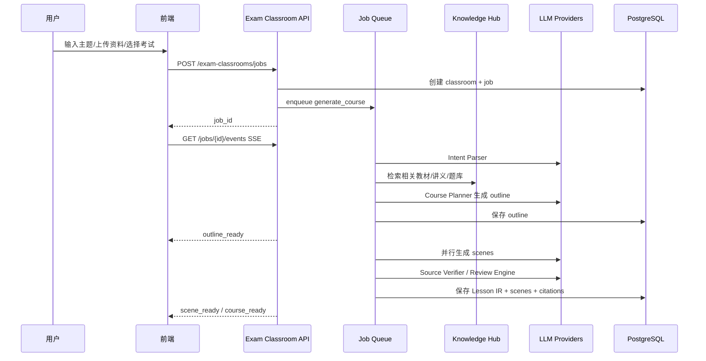
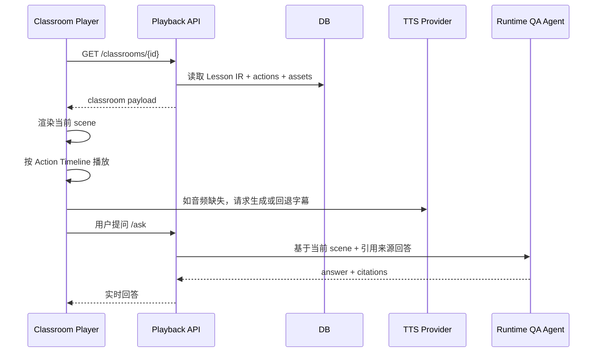
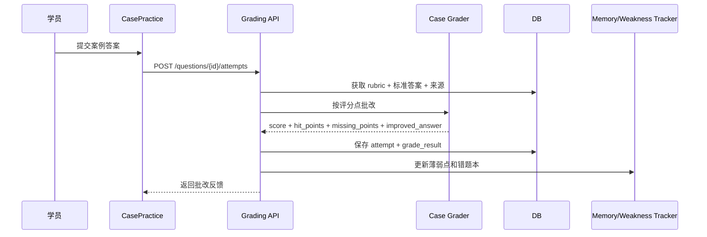
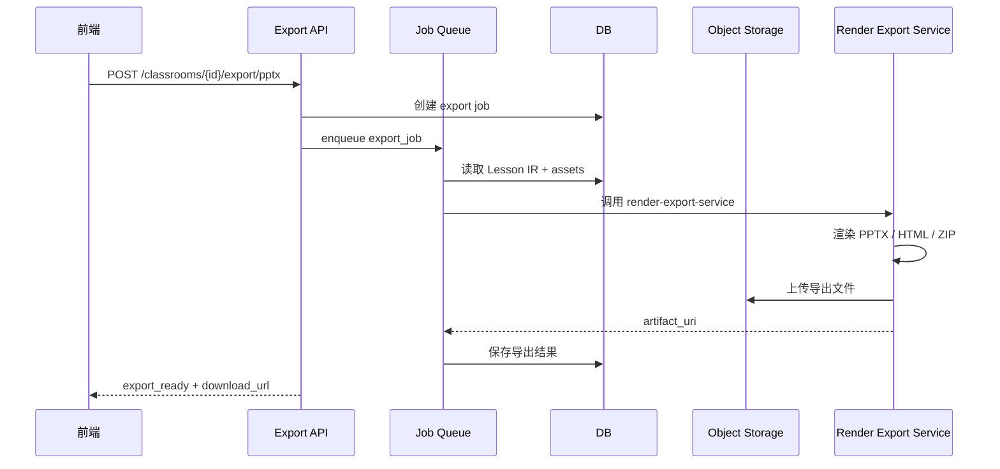

# 建筑实务 AI 互动课堂系统技术实现蓝图 v1.1

> 文档状态（2026-04-22）：
>
> - 本文件退居**背景蓝图**与设计素材。
> - 所有 authority、transport、状态机、MVP 边界、命名收口，以 [建筑实务AI互动课堂_架构与实施收口_v1.2.md](/Users/yehongchen/Documents/CYH_2/Markzuo/deeptutor/docs/openmaic/建筑实务AI互动课堂_架构与实施收口_v1.2.md) 为准。
> - 小程序表面与渲染规则，以 [ADR-005-mini-program-surface-renderer-contract.md](/Users/yehongchen/Documents/CYH_2/Markzuo/deeptutor/docs/openmaic/ADR-005-mini-program-surface-renderer-contract.md) 为准。
> - `建筑实务AI互动课堂_Implementation_Plan_v1.0.docx` 与 `建筑实务AI互动课堂_PRD_v1.0.docx` 仅保留历史上下文，不再作为实施 authority。

> ⚠️ 红线：
>
> - 本文件禁止直接派工。
> - 本文件中的 Next.js / React / Tailwind / Zustand / React Scene Renderer / Web Frontend / `web/components` / `web/app` 只能作为 Web/Admin 或 HTML export 的历史设计素材，不是 P0 学员端实现依据。
> - P0 学员端主表面是 `wx_miniprogram`，宿主交付包是 `yousenwebview/packageDeeptutor`。
> - P0 共享的是 `Scene Runtime Core` 的语义解释规则，不共享 React UI 组件。
> - 任何与 v1.2 / ADR-001-006 冲突的表、API、状态、前端路径、知识库链路，都不得实施。

> 项目定位：基于 luban-deep / DeepTutor，建设面向一级建造师《建筑工程管理与实务》的 AI 互动课堂、自动备课、案例训练与导出系统。OpenMAIC 作为产品体验和交互范式标杆，但采用 clean-room 自研实现，不复制其源码、Prompt、Schema、UI 或素材。

---

## 0. 这版文档解决什么问题

上一版 PRD 更像“产品愿景 + 功能列表”。这版文档回答四个落地问题：

1. **这些功能到底如何实现？**
2. **技术栈怎么选？**
3. **模块之间如何协作？**
4. **怎样拆成研发可执行任务，而不是只停留在目标和计划？**

核心原则：

> 先建立稳定的生成链路，再逐步增强多 Agent、白板、PBL、交互仿真、TTS 和导出能力。

稳定链路如下：

```text
用户输入 / 上传资料
  ↓
考试意图解析 Intent Parser
  ↓
资料检索 Source Retriever / RAG
  ↓
课程规划 Course Planner
  ↓
Lesson IR 课程中间表示
  ↓
Scene Generator 场景生成
  ↓
Action Timeline Builder 动作时间线
  ↓
Renderer 课堂渲染器
  ↓
Player / Exporter 播放器与导出器
  ↓
学习数据回写 Memory / 错题本 / 薄弱点画像
```

所有功能都必须挂在这条链路上。否则功能越多，系统越不稳。

---

## 1. 目标、计划、实施的区别

为了避免“看起来很完整，实际无法开工”，本项目分三层管理。

### 1.1 产品目标

产品目标回答：**用户最终得到什么价值？**

例如：

- 学员可以一键生成建筑实务互动课。
- 学员可以被 AI 老师讲解、被 AI 同学追问、做题、被批改。
- 教研老师可以导出 PPTX、HTML、课堂 ZIP。
- 系统能沉淀错题和薄弱点，生成重学课。

### 1.2 技术目标

技术目标回答：**系统必须具备什么能力？**

例如：

- 有 Lesson IR，可以统一表达课程。
- 有 Scene Generator，可以生成 slide、quiz、case、whiteboard。
- 有 Action Timeline，可以表达老师说话、白板绘制、聚光、高亮、等待答题。
- 有 Exporter，可以从同一份 Lesson IR 导出多种格式。

### 1.3 实施任务

实施任务回答：**研发明天打开 IDE 要写什么？如何验收？依赖什么？**

例如：

- 新建 `exam_classrooms` 数据表。
- 实现 `POST /api/exam-classrooms/jobs`。
- 实现 `LessonIR` Pydantic schema。
- 实现 `Scene Runtime Core` 和 `WxRendererAdapter`。
- 写 10 个 lesson_ir fixture 做渲染回归测试。

---

## 2. 对标 OpenMAIC：哪些学，哪些不直接做

OpenMAIC 当前公开 README 显示，其核心体验包括：一键生成课堂、多智能体课堂、幻灯片、测验、HTML 交互模拟、PBL、白板、TTS、PPTX/HTML 导出等。其技术标识包括 Next.js、React、TypeScript、LangGraph、Tailwind CSS；OpenMAIC 仓库标注 AGPL-3.0，因此商业产品不应直接合并其源码。

本项目的对标策略：

| OpenMAIC 能力 | 本项目实现方式 | P0/P1/P2 | 备注 |
|---|---|---:|---|
| 一键生成课堂 | Course Planner + Lesson IR + Scene Generator | P0 | 必须做 |
| AI 老师和同学 | Actor Script + Runtime QA | P0 | P0 先脚本化，P1 再更动态 |
| 多 Agent 编排 | Deterministic DAG，P1 引入 LangGraph | P0/P1 | 不一开始重度 LangGraph |
| 幻灯片 | Slide Scene + Scene Runtime Core + WxRendererAdapter + PPTX/HTML adapters | P0 | 以 ADR-005 为准 |
| 测验 | Question Engine | P0 | 必须做 |
| 案例题批改 | Rubric Grader + Weakness Tracker | P0 | 这是我们超过通用课堂的核心 |
| 交互仿真 | 小程序原生 signature simulation | P0.5/P1 | 不做任意 HTML simulation |
| PBL | PBL Scenario Engine | P1 | P0 做结构化案例课 |
| 白板 | WhiteboardIR + wx_canvas_renderer + static fallback + export adapters | P0 | 不把 SVG renderer 当唯一执行路径 |
| TTS | TTS Provider Adapter | P0.5 | P0.5 先单老师字幕/音频，失败回退字幕 |
| ASR | ASR Provider Adapter | P1 | 语音提问/口述答题 |
| PPTX 导出 | Node Export Service + PptxGenJS | P0 | 必须做 |
| HTML 导出 | Static Classroom Package | P0 | 必须做 |
| 课堂 ZIP | lesson.json + assets + index.html | P0 | 必须做 |
| MP4 视频 | Remotion Export Service | P1/P2 | 不进第一阶段 MVP |
| 3D / 游戏 / 在线编程 | 暂不做 | P2 | 建筑实务早期不需要 |

结论：

- **P0 不能完全达到 OpenMAIC 的广度，但要达到“建筑实务备考可用”的深度。**
- **P1 达到 OpenMAIC 核心体验的 75%—85%。**
- **P2 在建筑实务考试场景上超过 OpenMAIC：因为我们有考试知识图谱、案例评分、错题重学、机构教研审核。**

---

## 3. 推荐技术栈（Historical）

> 本节是 v1.1 Web-first 蓝图遗留内容。P0 实施时不得直接采用为学员端方案。
>
> 当前有效收口：
>
> - Mini-program Frontend：WXML / WXSS / TypeScript、原生小程序组件、Canvas 2D / WXML block renderer、wx audio / socket / request adapters。
> - Scene Runtime Core：平台无关 TypeScript/数据解释器，不依赖 DOM、React、Window、Document、`wx`。
> - Web/Admin：Next.js / React / TypeScript 仅用于教研审核、运营管理、导出预览或后续后台。
> - HTML Export：React/static bundle 可作为导出 artifact，不是 P0 学员端主表面。

### 3.1 总体选择

不建议另起炉灶，也不建议把 OpenMAIC 合进来。建议在 DeepTutor 现有仓库上新增 capability 和前端模块。

```text
DeepTutor Core
  ├─ Knowledge Hub / RAG
  ├─ TutorBot / Agent
  ├─ Guided Learning
  ├─ Quiz Generation
  ├─ Persistent Memory
  └─ Exam Classroom Capability  ← 新增
```

### 3.2 后端技术栈

| 层级 | 技术 | 选择理由 |
|---|---|---|
| 主语言 | Python 3.11+ | 与 DeepTutor 现有方向一致，适合 AI/RAG/评分 |
| API 服务 | 沿用 DeepTutor 当前 server；若可扩展，使用 FastAPI 风格路由 | 不为新模块强制迁移整体架构 |
| Schema | Pydantic | 强制 LLM 输出结构化，做校验和版本管理 |
| DB | PostgreSQL / Supabase | 仓库已有 supabase/migrations，适合 JSONB 存 Lesson IR |
| Vector | 复用 DeepTutor Knowledge Hub | P0 不新增向量库，降低复杂度 |
| Object Storage | S3-compatible / Supabase Storage / MinIO | 存音频、图片、HTML、PPTX、ZIP |
| Job Queue | Redis + Celery 或 Dramatiq | 课程生成、TTS、导出都是长任务，必须异步 |
| Realtime | Web/Admin 可用 SSE；小程序用轮询/增量事件；课堂问答统一 `/api/v1/ws` | 小程序 P0 不强依赖浏览器 EventSource |
| Agent 编排 | P0 自研 DAG；P1 LangGraph | 先稳，再做复杂多 Agent |
| Observability | OpenTelemetry + 结构化日志 + job step trace | 生成失败可定位 |

### 3.3 前端技术栈

| 层级 | 技术 | 选择理由 |
|---|---|---|
| 主框架 | WXML / WXSS / TypeScript + 原生小程序组件 | P0 学员端主表面是微信小程序 |
| Web/Admin | Next.js / React / TypeScript | 仅用于教研审核、运营管理、导出预览或后续后台 |
| 样式 | WXSS + 设计 token | P0 不以 Tailwind 作为学员端基础 |
| 状态管理 | 小程序页面/组件状态 + 可恢复 runtime state | 避免 Web-only Zustand 心智 |
| 数据校验 | Zod | 前后端 schema 对齐 |
| 白板 | WhiteboardIR + wx_canvas_renderer + static fallback | SVG 只用于 HTML/export adapter |
| 幻灯片 | Scene Runtime Core + WxRendererAdapter | 共享语义解释，不共享 React 组件 |
| 交互仿真 | 小程序原生 signature simulation | 不做任意 HTML simulation |
| 播放器 | 小程序 ClassroomPlayer | 使用 Scene Runtime Core + Action Timeline 驱动 |

### 3.4 导出服务技术栈

建议单独做一个 Node/TypeScript `render-export-service`，负责 PPTX、HTML ZIP、MP4。

| 导出 | 技术 | P0/P1 |
|---|---|---:|
| PPTX | PptxGenJS | P0 |
| HTML | React build / static bundle / JSZip | P0 |
| Classroom ZIP | JSZip 或 Python zipfile | P0 |
| MP4 | Remotion + FFmpeg | P1/P2 |
| 截图 | Playwright | P1，用于 PPTX 中嵌入复杂场景静态图 |

为什么导出服务单独拆出来？

1. PPTX 和 Remotion 都是 Node 生态更成熟。
2. 后端 Python 不应该承担视频渲染和 PPTX 复杂排版。
3. 导出是耗时任务，单独服务更易扩容。
4. 未来可以把导出服务部署为 worker 池。

### 3.5 模型与 Provider 策略

不要在业务代码里写死某一个模型。必须做 provider adapter。

```python
class LLMProvider:
    def generate_json(self, prompt: str, schema: type, **kwargs) -> dict: ...
    def generate_text(self, prompt: str, **kwargs) -> str: ...

class TTSProvider:
    def synthesize(self, text: str, voice: str, speed: float) -> AudioResult: ...

class ASRProvider:
    def transcribe(self, audio_uri: str) -> Transcript: ...
```

推荐模型分工：

| 任务 | 模型要求 | 备注 |
|---|---|---|
| 大纲生成 | 强推理、长上下文 | 质量优先 |
| Scene 生成 | 结构化输出稳定 | 成本与质量平衡 |
| JSON 修复 | 小模型 | 低成本 |
| 引用核查 | 强 RAG 能力 | 不允许胡编 |
| 案例评分 | 强推理 + rubric | 需要可解释 |
| 题目生成 | 指令稳定 | 防重复、防低质 |
| TTS | 中文自然度高 | 多角色音色 |

---

## 4. 系统模块图

```text
┌──────────────────────────────────────────────────────────┐
│             Mini-program Frontend / Web Admin             │
│  wx Player │ Quiz/Case │ Review(Admin) │ Export(Admin)    │
└───────────────┬──────────────────────────────────────────┘
                │ HTTP / job polling / unified /api/v1/ws
┌───────────────▼──────────────────────────────────────────┐
│                    Exam Classroom API                     │
│  jobs │ classrooms │ scenes │ questions │ grading │ export │
└───────────────┬──────────────────────────────────────────┘
                │
┌───────────────▼──────────────────────────────────────────┐
│               Exam Classroom Capability                   │
│                                                          │
│  Intent Parser                                            │
│  Source Retriever  ←→ DeepTutor Knowledge Hub             │
│  Exam Mapper                                              │
│  Course Planner                                           │
│  Lesson IR Service                                        │
│  Scene Generator                                          │
│  Multi-Agent Orchestrator                                 │
│  Action Timeline Builder                                  │
│  Question Engine                                          │
│  Case Grader                                              │
│  Review Engine                                            │
│  Learning Tracker → DeepTutor Memory / Notebook           │
└───────────────┬──────────────────────────────────────────┘
                │
        ┌───────▼────────┐
        │ Job Queue       │
        │ generation      │
        │ tts             │
        │ export          │
        └───────┬────────┘
                │
┌───────────────▼──────────────────────────────────────────┐
│                      Data / Assets                        │
│  PostgreSQL │ Vector Store │ Object Storage │ Logs/Traces  │
└───────────────┬──────────────────────────────────────────┘
                │
┌───────────────▼──────────────────────────────────────────┐
│                    Render Export Service                  │
│  PPTX Export │ HTML Export │ ZIP Export │ MP4 Export       │
└──────────────────────────────────────────────────────────┘
```

---

## 5. 核心模块如何配合

### 5.1 一键生成课程



关键点：

- 用户先看到大纲，不等完整课程生成完。
- 每个 scene 独立生成、独立失败、独立重试。
- 所有 LLM 输出必须进入 Pydantic 校验。
- 不允许直接把 LLM 文本塞进播放器。

### 5.2 课堂播放



### 5.3 案例题批改



### 5.4 导出 PPTX / HTML / ZIP



---

## 6. Lesson IR 设计

Lesson IR 是系统的“课程操作系统”。所有 scene、播放、导出、审核、视频都依赖它。

### 6.1 版本化 Schema

```json
{
  "schema_version": "1.0.0",
  "course_id": "uuid",
  "title": "大体积混凝土裂缝控制",
  "exam": {
    "exam_type": "yjjzs",
    "subject": "建筑工程管理与实务",
    "chapter": "建筑工程施工技术",
    "topic_tags": ["大体积混凝土", "裂缝控制", "案例题"]
  },
  "audience": {
    "level": "foundation|reinforcement|sprint",
    "persona": "zero_based|working_engineer|repeat_candidate"
  },
  "actors": [],
  "scenes": [],
  "source_policy": {},
  "quality_report": {},
  "exports": {}
}
```

### 6.2 Scene Schema

```json
{
  "id": "s01",
  "type": "slide_lecture|whiteboard|quiz|case_practice|dialogue|pbl|simulation|summary",
  "title": "为什么大体积混凝土容易开裂？",
  "duration_seconds": 180,
  "learning_objective": "理解温度应力与裂缝形成机制",
  "blocks": [],
  "narration": [],
  "actions": [],
  "questions": [],
  "citations": [],
  "review_status": "draft|ai_checked|source_verified|approved|rejected"
}
```

### 6.3 Action Schema

```json
{
  "id": "a001",
  "scene_id": "s01",
  "time": 8.5,
  "duration": 3.0,
  "actor_id": "teacher",
  "type": "speak|subtitle|show_slide|highlight|spotlight|whiteboard_draw|show_quiz|wait_for_answer|grade_answer|switch_actor",
  "payload": {}
}
```

### 6.4 为什么 Action Timeline 必须单独存在

如果只保存老师讲稿和幻灯片，课堂只能“看”。

Action Timeline 让课堂变成“发生”：

- 8 秒时老师说话。
- 12 秒时高亮图表。
- 18 秒时白板画流程图。
- 30 秒时小白同学提问。
- 50 秒时弹出测验。
- 70 秒时等待用户作答。

这就是接近 OpenMAIC 体验的关键。

---

## 7. 数据库设计

### 7.1 核心表

```sql
-- 课程
create table exam_classrooms (
  id uuid primary key,
  tenant_id uuid not null,
  created_by uuid not null,
  title text not null,
  exam_type text not null,
  subject text not null,
  status text not null,
  lesson_ir jsonb,
  source_kb_ids uuid[],
  schema_version text default '1.0.0',
  created_at timestamptz default now(),
  updated_at timestamptz default now()
);

-- 生成任务
create table classroom_jobs (
  id uuid primary key,
  classroom_id uuid references exam_classrooms(id),
  job_type text not null,
  status text not null,
  current_step text,
  progress numeric default 0,
  input jsonb,
  output jsonb,
  error jsonb,
  started_at timestamptz,
  finished_at timestamptz,
  created_at timestamptz default now()
);

-- 场景
create table classroom_scenes (
  id uuid primary key,
  classroom_id uuid references exam_classrooms(id),
  scene_key text not null,
  scene_type text not null,
  sort_order int not null,
  title text,
  status text not null,
  scene_ir jsonb not null,
  citations jsonb,
  quality_report jsonb,
  duration_seconds int,
  created_at timestamptz default now(),
  updated_at timestamptz default now()
);

-- 角色
create table classroom_actors (
  id uuid primary key,
  classroom_id uuid references exam_classrooms(id),
  actor_key text not null,
  actor_type text not null,
  display_name text not null,
  voice_config jsonb,
  persona_config jsonb
);

-- 动作时间线
create table classroom_actions (
  id uuid primary key,
  classroom_id uuid references exam_classrooms(id),
  scene_id uuid references classroom_scenes(id),
  action_type text not null,
  actor_key text,
  start_time numeric not null,
  duration numeric,
  payload jsonb not null
);

-- 题目
create table exam_questions (
  id uuid primary key,
  classroom_id uuid,
  scene_id uuid,
  question_type text not null,
  stem text not null,
  options jsonb,
  answer jsonb,
  rubric jsonb,
  explanation text,
  topic_tags text[],
  difficulty text,
  citations jsonb,
  created_at timestamptz default now()
);

-- 学员作答
create table question_attempts (
  id uuid primary key,
  user_id uuid not null,
  question_id uuid references exam_questions(id),
  answer_text text,
  answer_json jsonb,
  score numeric,
  grade_result jsonb,
  weak_tags text[],
  created_at timestamptz default now()
);

-- 导出文件
create table classroom_exports (
  id uuid primary key,
  classroom_id uuid references exam_classrooms(id),
  export_type text not null,
  status text not null,
  artifact_uri text,
  error jsonb,
  created_at timestamptz default now(),
  finished_at timestamptz
);

-- 审核项
create table review_items (
  id uuid primary key,
  classroom_id uuid,
  object_type text not null,
  object_id uuid,
  severity text,
  status text not null,
  reason text,
  suggestion text,
  created_at timestamptz default now(),
  resolved_at timestamptz
);
```

### 7.2 索引建议

```sql
create index idx_exam_classrooms_tenant on exam_classrooms(tenant_id, created_at desc);
create index idx_classroom_scenes_classroom on classroom_scenes(classroom_id, sort_order);
create index idx_classroom_jobs_status on classroom_jobs(status, created_at desc);
create index idx_exam_questions_tags on exam_questions using gin(topic_tags);
create index idx_question_attempts_user on question_attempts(user_id, created_at desc);
```

---

## 8. API 设计

### 8.1 创建课程生成任务

```http
POST /api/exam-classrooms/jobs
```

Request:

```json
{
  "exam_type": "yjjzs",
  "subject": "建筑工程管理与实务",
  "topic": "大体积混凝土裂缝控制",
  "course_type": "精讲课",
  "audience_level": "冲刺",
  "duration_minutes": 15,
  "source_kb_ids": ["kb_uuid"],
  "output_targets": ["classroom", "pptx", "html", "zip"]
}
```

Response:

```json
{
  "job_id": "uuid",
  "classroom_id": "uuid",
  "status": "queued"
}
```

### 8.2 获取生成进度

```http
GET /api/exam-classrooms/jobs/{job_id}/events
```

使用 SSE 返回：

```json
{"event":"outline_ready","progress":0.25,"payload":{"outline_id":"..."}}
{"event":"scene_ready","progress":0.55,"payload":{"scene_id":"s03"}}
{"event":"course_ready","progress":1.0,"payload":{"classroom_id":"..."}}
```

### 8.3 获取课堂

```http
GET /api/exam-classrooms/{classroom_id}
```

返回：

```json
{
  "classroom": {},
  "lesson_ir": {},
  "scenes": [],
  "actors": [],
  "actions": [],
  "assets": [],
  "questions": []
}
```

### 8.4 单 scene 重生成

```http
POST /api/exam-classrooms/{classroom_id}/scenes/{scene_id}/regenerate
```

Request:

```json
{
  "instruction": "这一节讲得更适合零基础学员，并增加一个施工现场类比",
  "preserve_citations": true,
  "preserve_questions": false
}
```

### 8.5 课堂内提问

```http
POST /api/exam-classrooms/{classroom_id}/ask
```

Request:

```json
{
  "scene_id": "s02",
  "question": "为什么保温保湿能减少裂缝？",
  "answer_style": "short|detailed|exam_oriented"
}
```

### 8.6 案例题批改

```http
POST /api/exam-questions/{question_id}/attempts
```

Request:

```json
{
  "answer_text": "应控制水泥用量，降低入模温度，加强养护……"
}
```

Response:

```json
{
  "score": 6,
  "full_score": 10,
  "hit_points": ["材料控制", "养护措施"],
  "missing_points": ["测温监控", "动态调整"],
  "feedback": "你的答案有方向，但缺少测温和动态调整，案例题会明显扣分。",
  "improved_answer": "可直接背诵的优化答案……",
  "weak_tags": ["测温监控", "案例表达不完整"]
}
```

### 8.7 导出

```http
POST /api/exam-classrooms/{classroom_id}/export/{type}
```

`type` 支持：`pptx | html | zip | script | video`。

---

## 9. 生成器实现方案

### 9.1 不要让 LLM 一次生成整堂课

错误做法：

```text
用户输入 → 一个巨大 Prompt → LLM 返回完整 HTML/PPT/课程
```

正确做法：

```text
用户输入
→ intent
→ sources
→ outline
→ scene plans
→ scene contents
→ actions
→ review
→ render
```

### 9.2 Generator DAG

```text
GenerateCourseJob
  ├─ parse_intent
  ├─ retrieve_sources
  ├─ map_exam_topics
  ├─ generate_outline
  ├─ verify_outline
  ├─ create_scene_jobs
  │   ├─ generate_slide_scene
  │   ├─ generate_whiteboard_scene
  │   ├─ generate_quiz_scene
  │   ├─ generate_case_scene
  │   └─ generate_dialogue_scene
  ├─ merge_lesson_ir
  ├─ source_verify
  ├─ quality_check
  ├─ create_tts_jobs
  └─ mark_ready
```

### 9.3 每个节点的输入输出

| 节点 | 输入 | 输出 | 验收 |
|---|---|---|---|
| parse_intent | 用户 topic | exam_type、subject、course_type、duration | JSON 合法 |
| retrieve_sources | topic + kb_ids | source chunks | 至少 N 条或标记资料不足 |
| generate_outline | intent + sources | outline | 有章节、场景、目标 |
| verify_outline | outline | review report | 不合格则重试或提示 |
| generate_scene | scene plan + sources | scene_ir | 通过 schema 校验 |
| build_actions | scene_ir | actions | 时间线合法、action 支持 |
| source_verify | scene_ir + sources | citations + risk | 不允许无来源硬结论 |
| quality_check | full lesson | quality_report | 可发布/需审核/失败 |
| create_tts | narration | audio assets | 可缺省回退字幕 |

---

## 10. Prompt 与结构化输出策略

### 10.1 Prompt 不写死在业务代码

建立 Prompt Registry：

```text
prompts/
  exam_classroom/
    parse_intent.zh.md
    generate_outline.zh.md
    generate_slide_scene.zh.md
    generate_whiteboard_scene.zh.md
    generate_quiz_scene.zh.md
    generate_case_scene.zh.md
    grade_case_answer.zh.md
    source_verify.zh.md
```

每个 Prompt 有版本号：

```yaml
id: generate_case_scene
version: 1.0.0
input_schema: CaseSceneInput
output_schema: CaseSceneIR
```

### 10.2 所有 LLM 输出必须被校验

流程：

```text
LLM raw output
→ JSON extractor
→ Pydantic validation
→ repair if failed
→ reject after 2 retries
→ human-visible error
```

### 10.3 结构化输出示例

```python
class SlideSceneIR(BaseModel):
    id: str
    type: Literal["slide_lecture"]
    title: str
    learning_objective: str
    blocks: list[SlideBlock]
    narration: list[NarrationLine]
    citations: list[Citation]
```

---

## 11. Renderer 实现

### 11.1 前端组件映射

```typescript
const SceneRendererMap = {
  slide_lecture: SlideRenderer,
  whiteboard: WhiteboardRenderer,
  quiz: QuizRenderer,
  case_practice: CasePracticeRenderer,
  dialogue: DialogueRenderer,
  pbl: PBLRenderer,
  simulation: SimulationRenderer,
  summary: SummaryRenderer,
}
```

### 11.2 播放器核心状态

```typescript
type PlaybackState = {
  classroomId: string
  currentSceneId: string
  currentTime: number
  status: 'idle' | 'playing' | 'paused' | 'asking' | 'quiz' | 'grading' | 'completed'
  activeActorId?: string
  activeSubtitle?: string
  activeHighlights: string[]
}
```

### 11.3 Action 执行器

```typescript
function executeAction(action: ClassroomAction, state: PlaybackState) {
  switch (action.type) {
    case 'speak':
      return showSubtitleAndPlayAudio(action)
    case 'highlight':
      return setHighlight(action.payload.targetId)
    case 'whiteboard_draw':
      return whiteboard.draw(action.payload)
    case 'show_quiz':
      return enterQuizMode(action.payload.questionId)
    case 'wait_for_answer':
      return pauseTimeline()
  }
}
```

---

## 12. 各功能具体怎么实现

### 12.1 一键生成课程

实现方法：

1. 创建生成任务。
2. 解析用户输入。
3. 检索资料。
4. 生成大纲。
5. 按大纲拆成 scene jobs。
6. 并行生成 scene。
7. 合并为 Lesson IR。
8. 前端订阅 SSE 展示进度。

最小可用验收：

- 输入“讲解大体积混凝土裂缝控制”。
- 30 秒内看到大纲。
- 2—4 分钟内生成 5 个 scene。
- 至少包含 slide、whiteboard、quiz、case。
- 可播放，可重生成某一个 scene。

### 12.2 AI 老师和同学

P0 做法：脚本化多角色。

```text
生成 scene 时，同时生成：
- teacher narration
- novice_student question
- top_student summary
- examiner warning
```

P1 做法：运行时 Agent。

```text
用户提问 → 当前 scene context + citations + actor persona → 对应 actor 回答
```

P1 可引入 LangGraph：

```text
Teacher Node → Student Question Node → Examiner Node → User Interrupt Node → Teacher Answer Node
```

### 12.3 幻灯片

实现方法：

- LLM 只生成 slide blocks，不生成最终 UI。
- 前端用 `SlideRenderer` 渲染 blocks。
- PPTX exporter 将 blocks 转成 PPT 对象。

Slide blocks：

```json
[
  {"type":"title","text":"大体积混凝土裂缝控制"},
  {"type":"bullet","items":["温度", "约束", "应力", "裂缝"]},
  {"type":"process","steps":["水化热", "内外温差", "温度应力", "裂缝"]}
]
```

### 12.4 测验

实现方法：

- Question Engine 生成题目。
- 题目带 topic_tags、difficulty、rubric、citations。
- 前端 quiz renderer 支持单选、多选、判断、排序、填空。
- 做题结果写入 attempts。

### 12.5 案例题批改

实现方法：

- 案例题必须有 rubric。
- AI 不自由打分，只能逐项判断评分点。
- 输出命中点、漏点、建议答案。
- 评分结果回写 weak_tags。

评分 Prompt 输入：

```json
{
  "question": "...",
  "rubric": [
    {"point":"材料控制", "score":2},
    {"point":"测温监控", "score":2}
  ],
  "student_answer": "..."
}
```

### 12.6 白板

P0 做法：SVG 白板步骤。

```json
{
  "type":"whiteboard",
  "steps":[
    {"kind":"text", "text":"温度应力 = 温差 + 约束"},
    {"kind":"flow", "nodes":["水化热", "内外温差", "应力", "裂缝"]}
  ]
}
```

前端按 Action Timeline 逐步显示。

P1 增强：

- 手写动画。
- 激光笔。
- 局部擦除。
- 图形拖动。
- 网络计划图专用白板。

### 12.7 交互仿真

P0 做轻交互：

- 排序题。
- 点击节点解释。
- 填空计算。
- 找错题。

P1 做核心仿真：

1. 网络计划关键线路识别器。
2. 索赔判断器。
3. 质量事故处理流程模拟。
4. 安全隐患识别图。
5. 工序排序模拟。

实现方式：

```text
SimulationIR → wx native simulation component → 用户行为 → 判分规则 → 反馈
```

### 12.8 PBL

P0：把 PBL 当成结构化案例课。

P1：做 PBL 状态机。

```text
intro → role_briefing → event_trigger → user_decision → ai_challenge → final_answer → grading → reflection
```

PBL 数据结构：

```json
{
  "project_background": "某高层住宅地下室施工……",
  "roles": ["项目经理", "监理", "甲方", "安全员"],
  "events": [
    {"id":"e01", "description":"基坑位移超限", "available_actions":["停工", "监测", "上报"]}
  ],
  "tasks": ["判断风险", "提出措施", "完成案例答案"],
  "rubric": []
}
```

### 12.9 TTS

P0：scene 级别配音。

- 生成 narration 后提交 TTS job。
- 音频存 object storage。
- 前端播放音频 + 字幕。
- TTS 失败则回退文字字幕。

P1：action 级别配音。

- 每个 actor 有 voice。
- 支持字级或句级时间戳。
- 支持多角色对话。

### 12.10 导出 PPTX

实现方法：

```text
Lesson IR
→ Export Normalizer
→ PPT Slide Layout Engine
→ PptxGenJS
→ .pptx
```

注意：

- 不允许 AI 自由排版。
- 使用固定模板：标题页、知识点页、流程页、案例题页、总结页。
- 复杂交互仿真导出为静态截图 + 二维码/链接。

### 12.11 导出 HTML

实现方法：

```text
Lesson IR + assets
→ static classroom shell
→ index.html
→ assets/
→ lesson.json
```

HTML 包必须离线可打开，或至少能在机构内网部署。

### 12.12 导出 Classroom ZIP

ZIP 内容：

```text
classroom.zip
  ├─ lesson.json
  ├─ manifest.json
  ├─ index.html
  ├─ assets/
  │   ├─ audio/
  │   ├─ images/
  │   └─ screenshots/
  ├─ questions.json
  ├─ citations.json
  └─ README.md
```

### 12.13 视频导出

P1/P2 再做。

实现方法：

```text
Lesson IR
→ Remotion Composition
→ TTS audio
→ subtitles
→ renderMedia()
→ MP4
```

不建议 P0 做视频，因为视频导出会引入渲染队列、字幕对齐、音频合成、失败重试、成本控制等额外复杂度。

---

## 13. 质量控制机制

### 13.1 生成质量检查

每个 scene 生成后过 Review Engine：

| 检查项 | 规则 |
|---|---|
| Schema 合法性 | 必须通过 Pydantic/Zod |
| 来源充分性 | 核心知识点必须有 citations |
| 考试相关性 | 必须关联 topic_tags |
| 教学完整性 | 目标、讲解、练习、总结至少三者齐备 |
| 案例题质量 | 必须有 rubric |
| 幻灯片长度 | 每页不超过规定字数 |
| 重复度 | 与同课程其他 scene 低重复 |
| 风险 | 无来源或版权不明内容标记人工审核 |

### 13.2 自动评测集

建立 30 个金标准任务：

1. 大体积混凝土。
2. 网络计划。
3. 施工索赔。
4. 屋面防水。
5. 深基坑。
6. 脚手架。
7. 模板工程。
8. 钢筋工程。
9. 混凝土工程。
10. 质量事故处理。

每个任务检查：

- 大纲是否合理。
- scene 类型是否合适。
- 题目是否可用。
- 案例评分是否合理。
- 导出是否成功。

---

## 14. 达到 OpenMAIC 水准的判断标准

不能泛泛说“像 OpenMAIC 一样好用”，必须有验收标准。

### 14.1 体验标准

| 指标 | P0 标准 | P1 标准 |
|---|---:|---:|
| 用户输入后看到大纲 | ≤ 30 秒 | ≤ 15 秒 |
| 生成 10 分钟课程 | ≤ 4 分钟 | ≤ 2 分钟 |
| 支持 scene 类型 | 4 类 | 8 类 |
| 多角色互动 | 脚本化 | 半实时/实时 |
| TTS | 单老师音色 | 多角色音色 |
| 白板 | 分步 SVG | 动画 + 激光笔 |
| 导出 | PPTX/HTML/ZIP | + MP4/DOCX |
| 课堂提问 | 基于当前 scene 回答 | 多 Agent 协作回答 |
| 案例题评分 | rubric 评分 | 与人工评分一致率持续优化 |

### 14.2 功能覆盖标准

| 功能 | OpenMAIC | 本项目 P0 | 本项目 P1 |
|---|---:|---:|---:|
| 一键生成 | 是 | 是 | 是 |
| 多 Agent | 是 | 基础 | 增强 |
| Slides | 是 | 是 | 是 |
| Quiz | 是 | 是 | 是 |
| Interactive HTML | 是 | 基础 | 增强 |
| PBL | 是 | 结构化案例 | 完整状态机 |
| Whiteboard | 是 | 基础 | 增强 |
| TTS | 是 | 是 | 增强 |
| PPTX | 是 | 是 | 是 |
| HTML | 是 | 是 | 是 |
| Classroom ZIP | 是 | 是 | 是 |
| 建筑实务案例评分 | 无 | 是 | 强化 |
| 错题重学课 | 无或弱 | 是 | 强化 |
| 教研审核流 | 弱 | 是 | 强化 |

---

## 15. 风险与替代方案

| 风险 | 影响 | 解决方案 |
|---|---|---|
| 一次性功能太多 | 项目延期 | P0 只做 4 类 scene + 3 类导出 |
| LLM 输出不稳定 | 渲染失败 | 强制 JSON schema + repair + fallback |
| 案例评分不准 | 学员不信任 | rubric 评分 + 人工标注评测集 |
| PPTX 变形 | 机构不可用 | 固定模板，不自由排版 |
| TTS 成本高 | 成本失控 | P0 只给重点 scene 配音，可关闭 |
| 交互仿真难 | 开发慢 | P0 轻交互，P1 专项仿真 |
| PBL 复杂 | 无法收敛 | P0 案例课，P1 状态机 |
| 版权风险 | 商业风险 | 来源分级 + 授权资料 + 审核 |
| OpenMAIC license | 法务风险 | clean-room 自研，不复制代码 |

---

## 16. 最小可交付系统定义

真正的 MVP 不是“功能最少”，而是“最小商业闭环”。

MVP 必须完成这条链路：

```text
上传资料 / 输入考点
→ 生成大纲
→ 生成 5 个 scene
→ AI 老师讲解
→ 白板解释
→ 测验
→ 案例题批改
→ 错题记录
→ 导出 PPTX/HTML/ZIP
```

只要这条链路稳定，就可以给机构和学员试点。

不进 MVP：

- 完整 3D 仿真。
- MP4 批量视频。
- 复杂 PBL 状态机。
- 班级管理全功能。
- SCORM/xAPI。
- 多考试全覆盖。

---

## 17. 参考来源

- OpenMAIC GitHub: https://github.com/THU-MAIC/OpenMAIC
- OpenMAIC README-zh: https://github.com/THU-MAIC/OpenMAIC/blob/main/README-zh.md
- luban-deep / DeepTutor: https://github.com/chenyh200807/luban-deep
- LangGraph Docs: https://docs.langchain.com/oss/python/langgraph/overview
- PptxGenJS Docs: https://gitbrent.github.io/PptxGenJS/
- Remotion renderMedia Docs: https://www.remotion.dev/docs/renderer/render-media
