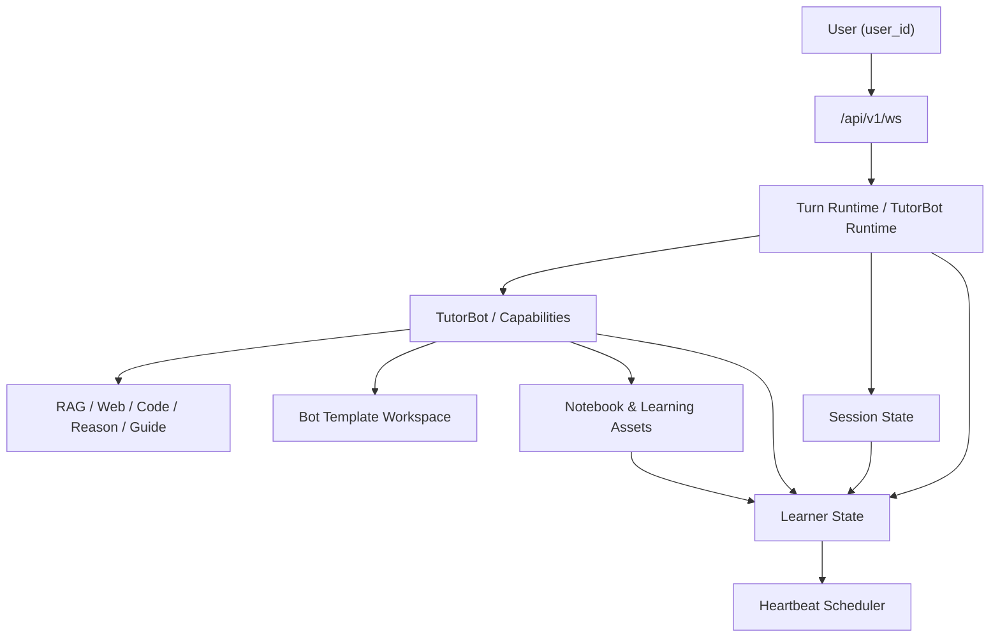
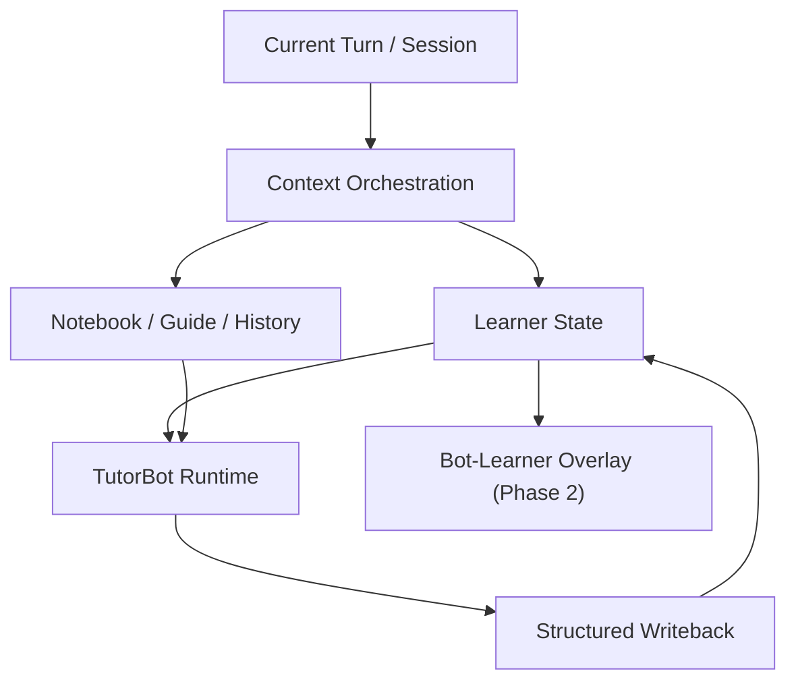

# PRD：学员级长期状态、持久记忆、Guided Learning 与 Heartbeat 统一架构

## 1. 文档信息

- 文档名称：学员级长期状态与 Guided Learning 统一架构 PRD
- 文档路径：`/docs/plan/2026-04-15-learner-state-memory-guided-learning-prd.md`
- 创建日期：2026-04-15
- 适用范围：TutorBot、Persistent Memory、Summary/Profile、Guided Learning、Notebook、Heartbeat、微信小程序主产品链路
- 状态：Partially Implemented v1（repo foundation；产品目的未全关）
- 关联附录：
  - [2026-04-15-learner-state-supabase-schema-appendix.md](/Users/yehongchen/Documents/CYH_2/Markzuo/deeptutor/docs/plan/2026-04-15-learner-state-supabase-schema-appendix.md)
  - [2026-04-15-bot-learner-overlay-prd.md](/Users/yehongchen/Documents/CYH_2/Markzuo/deeptutor/docs/plan/2026-04-15-bot-learner-overlay-prd.md)
  - [2026-04-15-bot-learner-overlay-service-design.md](/Users/yehongchen/Documents/CYH_2/Markzuo/deeptutor/docs/plan/2026-04-15-bot-learner-overlay-service-design.md)
  - [2026-04-15-learner-state-service-design.md](/Users/yehongchen/Documents/CYH_2/Markzuo/deeptutor/docs/plan/2026-04-15-learner-state-service-design.md)
  - [2026-04-24-learner-state-overlay-completion-evidence.md](/Users/yehongchen/Documents/CYH_2/Markzuo/deeptutor/docs/plan/2026-04-24-learner-state-overlay-completion-evidence.md)

## 1.1 复审状态（2026-04-24）

本 PRD 已有代码、contract、migration、运营面和聚焦测试基础，但不能算产品完成。当前真实状态以 `2026-04-24-learner-state-overlay-completion-evidence.md` 为准：

1. `LearnerStateService` 是 learner core 的单一服务入口，负责 profile/progress/goals/summary/memory/plan/heartbeat 的读写与 outbox。
2. Supabase schema、RLS、writer、local fallback/outbox 已有迁移与测试覆盖。
3. Heartbeat 主语维持 `user_id`，多 Bot 触达经全局 arbitration 后只产出一个 winner。
4. Member Console 已暴露 learner state、heartbeat jobs、arbitration history、Bot overlay、promotion 操作。
5. 未完成的产品 gate：真实生产 Supabase 实例迁移执行、线上运营权限配置、5 万规模压测、公网链路验收、以及长期个性化效果验收。

## 2. 背景

DeepTutor 官方对个性化能力的承诺非常明确：

- `Summary`
  - 持续记录学习进展、已学内容、理解如何演化。
- `Profile`
  - 持续维护学习者身份：偏好、知识水平、目标、沟通风格。
- `Persistent Memory`
  - 跨功能、跨 TutorBot 共享，随着交互不断更新。
- `Guided Learning`
  - 把个人材料转成结构化、多步骤学习旅程。
  - 设计学习计划、生成互动页面、支持边学边问、结束后产出学习总结。
- `TutorBot`
  - 每个 bot 有独立 workspace、独立 memory、主动 heartbeat、独立 skills/soul/tools。

我们已经完成了上一阶段的大收口：

- 微信小程序 chat 主入口已通过统一 `/api/v1/ws` 接入完整 TutorBot runtime。
- `TutorBot` 重新回到唯一业务身份。
- `rag` 是唯一知识工具，`construction-exam` 是默认知识库绑定。

但个性化这一层还没有真正收口。当前系统里已经存在多个“记忆/画像/摘要/学习状态”子系统，它们各自都能工作，但没有形成一个世界级产品应有的统一控制面。

## 3. 问题定义

### 3.1 当前不是“没有能力”，而是“能力分散且重复表达”

当前仓库里至少存在以下几层状态源：

1. **会话级状态**
   - 位置：
     - `deeptutor/services/session/sqlite_store.py`
     - `deeptutor/services/session/context_builder.py`
   - 代表字段：
     - `compressed_summary`
     - `preferences_json`
     - `active_question_context`
   - 作用：
     - 短中期对话摘要、活跃题目上下文、当前会话偏好。

2. **公共 memory**
   - 位置：
     - `deeptutor/services/memory/service.py`
     - `deeptutor/api/routers/memory.py`
   - 表达形式：
     - `SUMMARY.md`
     - `PROFILE.md`
   - 作用：
     - 平台级、公共级学习摘要与画像。

3. **学员专属 tutor_state**
   - 位置：
     - `deeptutor/services/tutor_state/service.py`
     - `deeptutor/api/routers/tutor_state.py`
   - 表达形式：
     - `PROFILE.md`
     - `PERSONA.md`
     - `MEMORY.md`
   - 作用：
     - 按 `user_id` 隔离的长期学员状态。

4. **完整 TutorBot 的 bot workspace memory**
   - 位置：
     - `deeptutor/tutorbot/agent/memory.py`
     - `deeptutor/services/tutorbot/manager.py`
   - 表达形式：
     - `SUMMARY.md`
     - `PROFILE.md`
     - `MEMORY.md`
     - `HISTORY.md`
   - 作用：
     - 完整 TutorBot runtime 的内部长期记忆。

5. **Guided Learning 会话状态**
   - 位置：
     - `deeptutor/agents/guide/guide_manager.py`
     - `deeptutor/api/routers/guide.py`
   - 当前形态：
     - `GuidedSession`
     - `summary`
     - `page_statuses`
     - `html_pages`
     - `chat_history`
     - `knowledge_points`
   - 作用：
     - 学习计划、页面生成、问答、完成总结。

6. **Notebook / 学习资产层**
   - 位置：
     - `deeptutor/services/notebook/service.py`
     - `deeptutor/api/routers/notebook.py`
   - 当前形态：
     - notebook records
     - `guided_learning` 类型记录
   - 作用：
     - 内容沉淀与检索，而不是统一学习状态真相。

### 3.2 根因

根因不是单点 bug，而是以下四个结构问题：

1. **同一业务事实被多个模块重复表达**
   - `summary/profile/memory/progress/persona` 被多层重复表达。

2. **缺少“学员级长期状态”的单一权威**
   - 当前没有一层被明确规定为：
     - 学员画像真相
     - 学员长期学习摘要真相
     - 学员偏好真相
     - 学员主动提醒真相

3. **TutorBot 内部 memory 与平台级状态没有统一**
   - 入口已经统一，但内部长期状态仍有“双真相”风险。

4. **Guided Learning、Notebook、Memory 之间没有统一学习域模型**
   - 都与“学习进展”有关，但没有一个统一的数据边界与回流机制。

### 3.3 如果不统一，会出现的长期问题

1. 同一个学员在不同入口得到不同画像。
2. TutorBot 记住的你，与平台记住的你不一致。
3. Guided Learning 完成后的学习总结，不能稳定反馈回长期记忆。
4. Heartbeat 没法真正做到“按学员个性化主动出现”。
5. 5 万学员规模下，状态不可治理，缓存、调度、回写、权限都会失控。

## 4. 目标

### 4.1 产品目标

构建一套真正满足官方承诺的学员级个性化系统，使 DeepTutor 能做到：

1. 每个学员拥有独立、持续演化的学习者画像。
2. 每个学员拥有跨所有功能、跨所有 TutorBot 共享的长期记忆。
3. Guided Learning 能把学习过程和结果稳定反馈回长期记忆。
4. Heartbeat 能按学员而不是按 bot 主动触达。
5. 在 5 万学员规模下，系统仍能稳定运行、容易治理、可观测、可审计。

### 4.2 架构目标

1. 建立“学员级长期状态”的**单一权威控制面**。
2. 明确区分四类状态：
   - session
   - learner state
   - TutorBot workspace state
   - notebook/content assets
3. 把 Guided Learning 收口为 TutorBot 主脑下的学习能力域，而不是并行产品主脑。
4. 把 Heartbeat 从 bot 级 loop 改为 learner job 级调度。
5. 保留 Markdown 视图，但不再让 Markdown 文件承担唯一主真相。

### 4.3 第一阶段收敛目标

为避免一开始把模型做得过重，第一阶段必须坚持：

1. **learner state 主真相只按 `user_id` 组织**
2. **不在第一阶段落地 `bot_id + user_id` 的长期 overlay 主模型**
3. **先让每个学员拥有真正可工作的个性化能力**
4. **未来如出现多个差异明显的 TutorBot，再补 bot-level overlay**

第一阶段的核心是：

- 每个学员一份全局长期状态
- 所有功能都真正读写这份状态
- 这份状态已经能驱动 TutorBot、Guide、Review、Heartbeat

而不是：

- 一开始就设计复杂的跨 bot 分层，却落不了地

### 4.4 体验目标

1. 每个新注册学员自动拥有独立 learner state。
2. 同一学员无论从 chat、quiz、guide、notebook、co-writer、TutorBot 进入，系统都知道是同一个人。
3. 同一学员的 TutorBot 在不同对话、不同时间、不同功能中都表现出连续理解。
4. Guided Learning 完成后，系统能自动更新：
   - Summary
   - Profile
   - Progress
   - Weak points
   - Recommended next steps
5. TutorBot 可以按学员节奏主动提醒、复习、追踪，而不是只做被动回复。

### 4.5 场景覆盖目标

本 PRD 必须覆盖以下高频真实场景，而不是只覆盖“理想学习流”：

1. **新注册学员，第一次打开小程序**
   - 没有历史学习记录
   - 需要自动创建 learner state
   - 不能因为没有 memory 而表现异常

2. **学员只说“你好”“在吗”“我还有多少点数”**
   - 不能误读成学习任务
   - 不能因为历史学习状态而污染基础交流

3. **学员随手问一个知识点**
   - 应使用统一 TutorBot + RAG
   - 但不应无条件写入长期画像

4. **学员连续做题、批改、追问**
   - 需要更新短期 session state
   - 只有稳定事实才进入 learner state

5. **学员发起 Guided Learning，并上传或引用个人材料**
   - 需要生成学习计划
   - 需要把完成结果写回长期总结与进度

6. **学员只写 notebook，不走 guide**
   - notebook 也应能对长期 learner summary 产生受控影响

7. **学员长时间未学习，系统主动提醒**
   - 应按个人时区、进度、同意状态、冷却时间来触达
   - 不能采用 bot 级统一广播

8. **同一学员在多个 TutorBot 或多个渠道中切换**
   - 允许共享 learner state
   - 不允许不同学员串状态

9. **老师模板更新，但学员历史不丢**
   - `SOUL.md / AGENTS.md / skills` 升级后，learner state 必须保持兼容

10. **大规模并发下的热点学员**
   - 同一学员可能同时发生：
     - 手机端对话
     - heartbeat 主动触达
     - guided learning 页面生成
     - notebook 写回
   - 系统必须有写入裁决与锁策略

## 5. 非目标

本次不做：

1. 不重写 TutorBot 核心 agent loop。
2. 不一次性重写全部 notebook 存储。
3. 不一次性把所有 Markdown 文件删除。
4. 不在本 PRD 中实现所有 UI 页面。
5. 不强制所有旧数据在第一阶段完全迁移完成。

## 6. 第一性原理与设计原则

### 6.1 First Principles

1. **老师模板可以共享，学生状态必须独立。**
2. **长期个性化的主真相必须按学员组织，而不是按会话、按 bot、按入口临时拼。**
3. **Notebook 是内容资产，不是长期个性化真相。**
4. **Guided Learning 是学习流程能力，不是第二个主脑。**
5. **能强行纠正输出的应该是证据与权威，不应该是多套散落的记忆文件。**

### 6.2 Less Is More

1. 不复制 5 万份 bot workspace。
2. 不为每个学员起一个常驻 bot 进程。
3. 不建立第二套 Heartbeat 服务体系。
4. 不让 `PROFILE.md / SUMMARY.md / MEMORY.md / USER.md` 同时作为多个主真相。
5. 用一个统一 learner state contract 收敛，而不是继续补更多 memory 子模块。

## 7. 当前现状审计

### 7.1 现状能力总结

#### A. 会话层

已有能力：

- 会话摘要
- 会话偏好
- 活跃题目上下文
- turn events

适合承担：

- 短中期上下文
- 当前对话状态

不适合承担：

- 长期学员画像
- 跨功能长期学习记忆

#### B. 公共 memory

已有能力：

- `SUMMARY.md`
- `PROFILE.md`
- 从 session 刷新

当前问题：

- 名称与 learner profile 冲突
- 容易与学员专属状态混淆

#### C. tutor_state

已有能力：

- 按 `user_id` 隔离
- `PROFILE.md / PERSONA.md / MEMORY.md`
- 从 member_console 同步资料
- 从 turn 刷新长期记忆

当前问题：

- 语义最接近“学员长期真相”，但并没有被正式提升为平台统一权威

#### D. 完整 TutorBot workspace memory

已有能力：

- 完整 runtime 长期记忆
- consolidator
- 独立文件

当前问题：

- 更像 bot 内部状态，不应默认承载学员长期私有真相

#### E. Guided Learning

已有能力：

- 学习计划
- HTML 页面生成
- 知识点导航
- contextual Q&A
- 完成总结
- notebook references

当前问题：

- session 仍是文件型主真相
- progress 仍偏工程进度
- 完成总结没有稳定回流到 learner 长期状态

#### F. Notebook

已有能力：

- 学习结果沉淀
- guided learning 记录
- 结构化记录类型

当前问题：

- 更适合作为内容资产层，不适合做长期个性化真相

### 7.2 最大结构缺口

当前最大缺口不是“没有 Summary/Profile/Guide/Heartbeat”，而是：

> 没有一个被全系统承认的、学员级、跨功能、跨 TutorBot 的 `Learner State` 总模型。

## 8. 目标架构

### 8.1 总体结构



### 8.1.1 与上下文编排、Overlay 的系统分工

这份 PRD 不是单独成立的“状态文档”，而是整套 TutorBot 个性化体系里的**长期控制面**。

它与其余设计的分工必须固定为：

1. `Learner State`
   - 定义学员级长期真相是什么
   - 定义哪些事实可以长期保存、如何受控写回
2. `Context Orchestration`
   - 不生产新的长期真相
   - 只负责每轮从 session / learner state / notebook / history 中装配最小必要上下文包
3. `Guided Learning / Notebook / Heartbeat`
   - 不各自维护平行 learner truth
   - 只能作为长期事实的生产域或消费域，通过统一 writeback / read path 与 learner state 协同
4. `Bot-Learner Overlay`
   - 只在第二阶段出现
   - 只表达 `bot_id + user_id` 的局部差异
   - 不得替代 learner state 的全局主真相

因此，这套架构必须形成固定链路：



硬要求：

1. `Learner State` 决定“长期事实是什么”
2. `Context Orchestration` 决定“这一轮带哪些事实进模型”
3. `Guided Learning / Notebook / Heartbeat` 决定“哪些行为会产生新事实”
4. `Overlay` 只决定“未来多 Bot 时，哪些是 bot 局部差异”

### 8.2 四层状态模型

#### 1. Session State

唯一职责：

- 保存短中期对话状态
- 保存当前题目上下文
- 保存当前 turn 摘要

主键：

- `session_id`

典型字段：

- `conversation_summary`
- `active_question_context`
- `preferences`
- `last_topics`

#### 2. Learner State

唯一职责：

- 作为学员长期个性化的**唯一主真相**

主键：

- **第一阶段：`user_id`**
- 后续如确实需要多 TutorBot 差异化长期状态，再增加 `bot_id + user_id` 的 overlay

典型字段：

- `profile`
- `summary`
- `goals`
- `preferences`
- `learning_style`
- `knowledge_level`
- `mastery_map`
- `weak_points`
- `recent_misconceptions`
- `active_learning_plans`
- `heartbeat_policy`
- `notebook_links`
- `updated_at`

第一阶段硬规则：

- TutorBot、Guide、Notebook、Review、Heartbeat 都只围绕 `user_id` 这份 learner state 读写
- 不允许先设计一个 `bot_id + user_id` 的平行长期真相，再让代码两边都写
- 如果需要记录“来自哪个 TutorBot”，应写在事件字段里，而不是改变主键

#### 3. Bot Template Workspace

唯一职责：

- 表达 TutorBot 模板能力

共享内容：

- `SOUL.md`
- `AGENTS.md`
- `TOOLS.md`
- `skills/`
- `tool bindings`
- `default_kb`
- `teaching defaults`

明确不放：

- 学员私有画像
- 学员私有长期记忆
- 学员私有 heartbeat 配置

#### 4. Notebook / Learning Assets

唯一职责：

- 内容资产层

包括：

- notebook
- guided learning records
- question notebook
- generated pages
- lesson outputs

明确不承担：

- 学员长期个性化真相

#### 5. Bot-Learner Overlay（后置能力，不在第一阶段落地）

只有当满足以下条件时，才允许引入 bot-level overlay：

1. 同一学员同时使用多个风格和任务显著不同的 TutorBot
2. 某些长期状态明确不该跨 bot 共享
3. 已有明确的数据边界与使用案例，而不是“为了以后可能会用”

第一阶段不做：

- `bot_id + user_id` 级长期 profile
- `bot_id + user_id` 级长期 summary
- `bot_id + user_id` 级长期 memory 主真相

### 8.3 统一原则

#### 原则 1：老师模板共享，学员状态独立

可共享：

- Soul
- Skills
- Tools
- 教学规范
- 默认知识库绑定

必须独立：

- USER/Profile/Summary/Memory
- Heartbeat policy
- Learning progress
- Weak points
- Mastery map

#### 原则 2：Markdown 是投影视图，不是真相

保留：

- `USER.md`
- `PROFILE.md`
- `SUMMARY.md`
- `MEMORY.md`
- `HEARTBEAT.md`

但它们应改成：

- 由结构化 Learner State 渲染
- 供 TutorBot prompt 和人类查看使用

而不是：

- 多处文件各自作为唯一写入真相

#### 原则 3：Guide 是能力域，不是第二主脑

Guided Learning 应收口为：

- TutorBot 主脑下的结构化学习 capability

而不是：

- 与 TutorBot 并行的一条主产品人格链

## 9. 新的数据与控制面设计

### 9.1 新增统一控制面：Learner State Contract

建议新增专项 contract：

- `contracts/learner-state.md`

定义：

1. `LearnerIdentity`
2. `LearnerProfile`
3. `LearnerSummary`
4. `LearnerProgress`
5. `LearnerHeartbeatPolicy`
6. `LearnerMemoryProjection`
7. `LearningPlan`

机器可读索引接入：

- `contracts/index.yaml`

### 9.2 建议的数据模型

#### A. 复用现有 `user_profiles` 作为 Learner Profile 主表

第一阶段直接复用现有 Supabase `user_profiles`，而不是另起一张同义表。

当前真实字段：

- `user_id`
- `summary`
- `attributes`
- `last_updated`

第一阶段建议演进为：

- `user_id`（主键）
- `summary`（短期保留，后续可迁移为投影视图）
- `attributes`
  - `display_name`
  - `timezone`
  - `communication_style`
  - `knowledge_level`
  - `exam_target`
  - `learning_preferences`
  - `support_preferences`
  - `consent`
  - `heartbeat_preferences`
  - `source`
  - `plan`
- `last_updated`

代码职责：

- 读：
  - TutorBot runtime
  - onboarding
  - profile settings
  - guided learning context loader
- 写：
  - onboarding/profile settings
  - 受控 profile refinement pipeline

运营价值：

- 支撑用户画像页
- 支撑偏好设置
- 支撑分层服务与会员信息
- 支撑 heartbeat 个性化基础参数

#### B. 复用现有 `user_stats` 作为 Learner Progress 主表

第一阶段直接复用现有 Supabase `user_stats`。

当前真实字段：

- `user_id`
- `mastery_level`
- `knowledge_map`
- `current_question_context`
- `radar_history`
- `total_attempts`
- `error_count`
- `last_practiced_at`
- `last_updated`
- `tag`

第一阶段建议职责收敛：

- `knowledge_map`
  - 作为 mastery / weak points / diagnosis 的核心结构
- `mastery_level`
  - 作为全局掌握度快照
- `total_attempts / error_count / last_practiced_at`
  - 作为行为与活跃度基础信号
- `current_question_context`
  - 逐步从长期表中退出，回收到 session state

代码职责：

- 读：
  - TutorBot runtime
  - quiz/review
  - guided learning 进度感知
  - heartbeat 任务构造
- 写：
  - question/deep_question 结果归并
  - review pipeline
  - guided learning completion progress writer

运营价值：

- 支撑知识图谱掌握度
- 支撑错题复盘
- 支撑推荐学习路径
- 支撑学员成长看板

#### C. 复用现有 `user_goals` 作为 Learner Goals 主表

第一阶段直接复用现有 Supabase `user_goals`。

当前真实字段：

- `id`
- `user_id`
- `goal_type`
- `title`
- `target_node_codes`
- `target_question_count`
- `progress`
- `deadline`
- `created_at`
- `completed_at`

代码职责：

- 读：
  - onboarding
  - study plan generator
  - heartbeat
  - TutorBot planning
- 写：
  - onboarding 设定目标
  - 学习计划调整
  - 目标完成状态更新

运营价值：

- 支撑考试目标管理
- 支撑学习计划生成
- 支撑学习周期提醒

#### D. 新建 `learner_summaries`

- `user_id`
- `summary_md`
- `summary_structured_json`
- `last_refreshed_from_turn_id`
- `last_refreshed_from_feature`
- `updated_at`

作用：

- 作为“Summary”单一真相
- 不再依赖多个模块各自产生 summary

#### E. 新建 `learner_memory_events`

- `event_id`
- `user_id`
- `source_feature`
- `source_id`
- `source_bot_id`
- `memory_kind`
- `payload_json`
- `dedupe_key`
- `created_at`

作用：

- 记录从 chat / guide / notebook / quiz 回流到长期记忆的结构化事件
- 支撑 summary/progress 的异步重建

#### F. 新建 `learning_plans`

- `plan_id`
- `user_id`
- `source_bot_id`
- `source_material_refs_json`
- `knowledge_points_json`
- `status`
- `current_index`
- `completion_summary_md`
- `created_at`
- `updated_at`

#### G. 新建 `learning_plan_pages`

- `plan_id`
- `page_index`
- `page_status`
- `html_content`
- `error_message`
- `generated_at`

#### H. 新建 `heartbeat_jobs`

- `job_id`
- `user_id`
- `bot_id`
- `channel`
- `policy_json`
- `next_run_at`
- `last_run_at`
- `last_result_json`
- `failure_count`
- `status`

### 9.2.1 复用现有 Supabase 表的硬要求

复用不是“名字继续保留”，而必须满足三条：

1. **字段语义能对上**
   - 例如 `user_stats.knowledge_map` 必须真的承接 mastery/progress，而不是只留着不用。

2. **代码里有明确读写入口**
   - 不能只是 PRD 里说复用，实际代码又绕开新建一套表。

3. **运营侧能看懂、能使用、能干预**
   - 例如：
     - `user_profiles` 能支撑画像编辑
     - `user_goals` 能支撑学习目标配置
     - `user_stats` 能支撑学习进展与错题趋势

如果某张旧表满足不了这三条，就不应为了“复用而复用”。

### 9.2.2 第一阶段的明确取舍

第一阶段建议：

- 复用：
  - `user_profiles`
  - `user_stats`
  - `user_goals`
- 新建：
  - `learner_summaries`
  - `learner_memory_events`
  - `learning_plans`
  - `learning_plan_pages`
  - `heartbeat_jobs`

不建议第一阶段直接新建与以下完全同义的平行表：

- `learner_profiles`
- `learner_progress`
- `learner_goals`

否则只会把旧表废掉、再长出新表，既没有收敛，也没有复用价值。

### 9.2.3 复用表的实际运行时链路

为确保复用表不是“摆设”，第一阶段必须按以下链路真正接入：

#### A. `user_profiles`

运行时用途：

1. 小程序 / Web 个人资料页读取
2. TutorBot 启动时装配 learner profile projection
3. Guided Learning / Heartbeat 读取用户目标与偏好
4. 会员/运营后台查看与调整用户画像

必须发生的代码接入：

1. 统一 `LearnerStateService` 读取 `user_profiles`
2. 旧的 `tutor_state PROFILE.md` 改为由 `user_profiles` 投影生成
3. onboarding/profile settings 写回 `user_profiles`

#### B. `user_stats`

运行时用途：

1. TutorBot 回答时读取 mastery / weak points
2. 出题、批改、复习链路更新 knowledge_map
3. Heartbeat 读取最近活跃度与薄弱点
4. 学员看板展示掌握度与成长轨迹

必须发生的代码接入：

1. `deep_question`、review、quiz 结果归并写 `user_stats`
2. Guided Learning completion 把掌握点变化归并进 `user_stats`
3. 旧的零散 mastery 逻辑逐步收口到 `user_stats`

#### C. `user_goals`

运行时用途：

1. 学员设置备考目标
2. Study plan generator 读取目标生成计划
3. Heartbeat 根据 goal/deadline 计算提醒理由
4. 运营侧查看目标完成进度

必须发生的代码接入：

1. onboarding/assessment 继续写 `user_goals`
2. learning plan / heartbeat 直接读 `user_goals`
3. 目标完成时更新 `progress/completed_at`

#### D. `learner_summaries`

运行时用途：

1. TutorBot 注入长期学习摘要
2. Guided Learning 完成后生成 completion summary 写回
3. Notebook / review 事件聚合后更新学习摘要

#### E. `learner_memory_events`

运行时用途：

1. 作为所有长期 writeback 的统一事件流
2. 支撑 summary/progress 的异步重建
3. 支撑审计与回放

#### F. `heartbeat_jobs`

运行时用途：

1. 调度每个学员的主动学习提醒
2. 记录是否触达、为什么触达、何时再触达

一句话要求：

> 复用表必须进入统一 `LearnerStateService` 的读写路径，且必须被 TutorBot、Guide、Heartbeat、运营后台中的至少一个真实流程直接使用，否则就不算有效复用。

### 9.3 统一 learner overlay 目录

如果仍保留文件语义，建议目录改为：

```text
data/tutorbot/{bot_id}/learners/{user_hash}/
  USER.md
  PROFILE.md
  SUMMARY.md
  MEMORY.md
  HEARTBEAT.md
  PROGRESS.json
```

而不是复制完整 workspace。

保留共享模板目录：

```text
data/tutorbot/{bot_id}/workspace/
  SOUL.md
  AGENTS.md
  TOOLS.md
  skills/
```

第一阶段说明：

- 这里的 learner 目录只是 **projection / cache / 可读视图**
- 主真相仍是 `user_id` 维度的数据库记录
- 目录保留 `bot_id` 前缀，是为了让默认 TutorBot 工作区结构与可读性保持一致
- 它不是第一阶段长期 overlay 主模型

### 9.3.1 存储可靠性模型

必须明确：

- **数据库是最终真相**
- **本地 durable outbox 是可靠性兜底**
- **Markdown / 文件目录不是主真相**

#### A. 强同步写

以下操作必须同步写主 DB，失败就显式报错，不允许只写本地缓存：

1. 用户显式修改 profile / preferences
2. 用户显式设置或调整 goals
3. 用户显式开关 heartbeat
4. 关键学习计划创建/调整

#### B. 异步可补偿写

以下操作可以先写本地 durable outbox，再异步 flush 到主 DB：

1. learner summary 刷新
2. learner memory events 写入
3. guided learning completion writeback
4. behavior signals 聚合
5. heartbeat delivery logs

#### C. 本地 durable outbox

建议每个应用节点维护本地 SQLite outbox，例如：

```text
data/runtime/outbox.db
```

建议表结构：

- `id`
- `user_id`
- `event_type`
- `payload_json`
- `dedupe_key`
- `status`
- `retry_count`
- `created_at`
- `last_error`

运行方式：

1. 先写 outbox
2. 用户请求成功返回
3. 后台 flusher 持续刷入 Supabase/Postgres
4. 成功后标记 sent
5. 失败则指数退避重试

#### D. 幂等与去重

所有异步写回必须带：

- `event_id`
- `user_id`
- `source_feature`
- `source_id`
- `dedupe_key`
- `version`

示例：

- `guide:{plan_id}:complete`
- `chat:{turn_id}:summary_refresh`
- `quiz:{attempt_id}:grade_result`

这样即使：

- 网络抖动
- worker 重启
- flusher 重放

也不会重复写坏。

#### E. 失败兜底与审计

必须保证：

1. outbox 中未送达数据可恢复
2. 每条失败事件有可观测错误
3. 超过阈值的 backlog 会告警
4. 关键 writeback 可人工重放

### 9.4 单一写入职责矩阵

为避免重新长出多套真相，必须定义谁能写什么：

#### A. Session State

允许写入者：

- `turn_runtime`
- `chat/deep_question/tutorbot` 本轮执行链

不允许写入者：

- notebook service
- heartbeat scheduler
- guide completion aggregator

写入内容：

- 当前对话摘要
- 活跃题目上下文
- 当前会话偏好

#### B. Learner Profile

允许写入者：

- onboarding / profile settings
- 明确的用户设置修改
- 受控的 profile refinement pipeline

不允许写入者：

- 任意一轮普通聊天直接覆盖 profile
- TutorBot 内部 workspace memory 直接反写 profile

写入内容：

- 偏好
- 目标
- 风格
- 稳定知识水平

#### C. Learner Summary

允许写入者：

- session digest aggregator
- guided learning completion aggregator
- notebook summary aggregator

不允许写入者：

- 原始对话链路直接覆盖全量 summary

写入内容：

- 近期学习进展
- 学过主题
- 学习演化摘要

#### D. Learner Progress

允许写入者：

- quiz / deep_question result normalizer
- guided learning progress writer
- review pipeline

不允许写入者：

- 普通寒暄对话
- 非结构化 notebook 原文直写

写入内容：

- mastery map
- weak points
- misconceptions
- active topics

#### E. Learner Memory Events

允许写入者：

- 结构化 writeback pipeline

不允许写入者：

- 各功能模块直接绕过统一入口写长期 memory

写入内容：

- 重要里程碑
- 稳定偏好变更
- 关键纠错
- Guided Learning 完成事实

### 9.5 写回与冲突解决策略

对 5 万学员规模，必须默认存在并发写回冲突。统一策略如下：

1. **事实优先于推断**
   - 用户明确填写的目标/偏好，优先级高于模型推断。

2. **结构化结果优先于自由文本**
   - quiz 评分、guide completion、计划完成状态等结构化结果，高于普通聊天中的模糊描述。

3. **近期稳定更新优先于陈旧摘要**
   - 如果 learner summary 与最近的结构化 progress 冲突，以最近结构化进展为准，并触发 summary 重建。

4. **单字段局部更新优先于整份覆盖**
   - 除了重建任务，所有写回默认采用字段级 merge，不允许整份 `PROFILE/SUMMARY/MEMORY` 全量覆盖。

5. **同一 learner 的并发写入必须串行化**
   - 至少对 `learner_key` 做 user-level lock 或单 key 队列。

6. **TutorBot workspace memory 不得反向覆盖 learner state**
   - 它只能作为运行时辅助缓存或 bot 私有反思，不得成为学员主真相来源。

### 9.6 运行时上下文装配顺序

为防止 prompt 污染和状态越权，TutorBot/Guide 运行时的上下文装配顺序必须固定：

1. 当前用户输入
2. 当前 session state
3. 当前 active question / current learning step
4. learner profile 投影
5. learner summary 投影
6. learner progress 投影
7. notebook / guide asset references
8. bot template（Soul/Skills/Tools）

硬规则：

- 当前输入优先级最高
- bot template 永远不能覆盖 learner state 事实
- TutorBot workspace memory 不得早于 learner state 注入
- guide 页面 HTML 不得直接作为长期记忆写回源，必须先结构化归纳

## 10. Summary / Profile / Memory 的统一语义

### 10.1 Summary

定义：

- 对学习旅程的运行摘要

内容包括：

- 学过什么
- 最近在学什么
- 哪些知识点已经推进
- 理解如何演化

来源：

- session digest
- guided learning completion
- notebook writebacks
- quiz/question review

最终真相：

- `learner_summaries`

### 10.2 Profile

定义：

- 学习者身份画像

内容包括：

- 偏好
- 交流风格
- 当前水平
- 目标
- 学习节奏
- 希望被如何指导

来源：

- 明确设置
- onboarding
- 持续交互自动修正

最终真相：

- `learner_profiles`

### 10.3 Memory

定义：

- 由结构化事件沉淀出的长期可用事实

内容包括：

- 稳定偏好
- 重要里程碑
- 关键误区
- 重要纠错
- 关键学习计划完成事实

最终真相：

- `learner_memory_events`
- 以及其聚合投影

### 10.4 Persona

当前 `tutor_state` 里的 `PERSONA.md` 不应继续与 learner profile 平行存在。

建议收口为：

- `LearnerProfile.communication_style`
- `LearnerProfile.support_preferences`

如需保留 `PERSONA.md`，只作为 learner profile 的渲染视图。

## 11. Guided Learning 的新定位

### 11.1 新定位

Guided Learning 是 TutorBot 的一个结构化学习 capability。

它负责：

1. 生成学习计划
2. 生成学习页面
3. 支持 contextual Q&A
4. 推进学习进度
5. 产出 completion summary
6. 将结果回流到 Learner State

### 11.2 新的闭环

目标闭环：

1. 用户发起 Guided Learning
2. TutorBot 判断进入 guide capability
3. guide 生成 `learning_plan`
4. guide 生成页面与局部 Q&A
5. 用户推进进度
6. 完成时生成 completion summary
7. completion summary 写回：
   - learner summary
   - learner progress
   - notebook records
   - heartbeat recommendation

### 11.3 Progress 重新定义

未来 `progress` 必须分成两类：

1. **系统生成进度**
   - 页面是否 ready
   - 页面是否失败

2. **学习掌握进度**
   - 用户学到哪里
   - 是否完成当前知识点
   - 是否掌握
   - 是否需要复习

不能继续只用页面 readiness 代表学习进度。

### 11.4 Guided Learning 与 Notebook / Memory 的统一回流

Guided Learning 不应直接把整段 HTML、整段聊天历史原样写进 learner state。正确方式是：

1. `learning_plan` 完成后产生结构化 completion payload：
   - 完成知识点
   - 新增掌握点
   - 暂未掌握点
   - 推荐下一步
   - 学习摘要

2. Notebook 只保留：
   - 页面资产
   - 学习过程记录
   - 引用材料

3. Learner State 只吸收：
   - summary
   - progress
   - memory events

4. 若 notebook 与 guide 对同一主题有多次记录：
   - 先进入 `learner_memory_events`
   - 再由聚合器决定是否更新长期 summary/progress

### 11.5 Guided Learning 的质量门槛

Guide 这一链路不能只以“页面生成成功”为完成标准，还必须满足：

1. 计划至少包含 3-5 个递进知识点
2. 页面结构稳定，不因模型波动失控
3. Q&A 能读取当前 learning step 和 learner profile
4. 完成时一定能生成 completion summary
5. completion summary 一定进入统一 writeback pipeline

## 12. Heartbeat 的目标设计

### 12.1 当前问题

当前完整 TutorBot heartbeat 以 `bot:{bot_id}` 作为 canonical key，属于 bot 级 loop，不是学员级。

这不满足：

- 每个学员独立提醒
- 每个学员独立节奏
- 每个学员独立通道

### 12.2 目标模型

改成：

- **learner job 级 heartbeat**
- **中心 scheduler + worker pool**

而不是：

- 5 万个 HeartbeatService
- 5 万个 bot 常驻 loop

### 12.3 调度流程

1. 用户注册或开通 TutorBot 服务时，创建默认 `heartbeat_job`
2. scheduler 周期扫描 due jobs
3. worker 抢占执行
4. 加载：
   - learner profile
   - learner summary
   - learner progress
   - active learning plan
   - last activity
5. 生成主动消息
6. 通过统一 channel 发送
7. 更新 job 状态与下一次执行时间

### 12.4 Heartbeat 个性化输入

应包括：

- 时区
- 渠道
- 最近学习活跃度
- 当前学习计划
- 最近薄弱点
- 最近未完成任务
- 用户是否允许主动触达
- 触达频率偏好

### 12.5 Heartbeat 安全边界与治理规则

Heartbeat 是最容易失控、最容易伤害体验的能力，必须附带硬护栏：

1. 必须有明确 consent
   - 学员未同意前，不允许主动推送学习提醒。

2. 必须支持 quiet hours
   - 按时区和本地时间窗口避开发送。

3. 必须支持 cooldown
   - 连续多次未响应时，自动降频。

4. 必须支持 stop / snooze / downgrade
   - 学员可以暂停、延后、降低频率。

5. 必须支持触达原因可解释
   - 例如：
     - “你上次停在防水等级案例题第 3 步”
     - “你有一项学习计划 3 天未完成”

6. 不允许把 heartbeat 当营销广播系统
   - Heartbeat 的目标是学习陪伴，不是运营轰炸。

7. 必须记录：
   - 为什么触发
   - 触达内容
   - 是否送达
   - 是否点击/回复
   - 是否引起负反馈

## 13. 新注册学员的自动开通流程

### 13.1 目标

每个新注册学员自动获得独立个性化空间，但不复制整个 TutorBot 模板。

### 13.2 自动开通步骤

1. 创建 `learner_profiles` 记录
2. 创建 `learner_summaries` 初始记录
3. 创建 `learner_progress` 初始记录
4. 创建 `heartbeat_job` 默认记录
5. 初始化 learner overlay 视图：
   - `USER.md`
   - `PROFILE.md`
   - `SUMMARY.md`
   - `MEMORY.md`
6. 与默认 `bot_id=construction-exam-coach` 绑定

### 13.3 不应做的事

1. 不复制 `skills/`
2. 不复制 `SOUL.md`
3. 不复制 `TOOLS.md`
4. 不创建一个新的 bot manager 进程

## 14. 与原项目承诺的对齐方式

### 14.1 Summary

通过：

- `learner_summaries`
- completion summary writeback
- session summary aggregation

实现官方承诺中的持续学习摘要。

### 14.2 Profile

通过：

- `learner_profiles`
- `preferences + goals + style + level`

实现官方承诺中的学习者身份画像。

### 14.3 Persistent Memory

通过：

- learner state 作为单一真相
- TutorBot 读取统一 learner projections
- Guide / Notebook / Quiz / Chat 统一回流

实现“共享 across all features and all your TutorBots”。

### 14.4 Guided Learning

通过：

- plan
- interactive pages
- contextual Q&A
- completion summary
- summary/profile/progress writeback

实现官方承诺中的完整闭环。

## 15. 5 万学员规模化设计

### 15.1 必须坚持的架构

1. 共享 bot 模板
2. 学员级长期状态
3. 中心 heartbeat 调度
4. 结构化主真相
5. Markdown 视图化

### 15.2 基础设施建议

第一阶段可接受：

- SQLite 作为开发/小规模真相

第二阶段上线前建议：

- PostgreSQL 承担 learner state 与 learning plans 主真相
- Redis 或 Postgres job queue 承担 heartbeat jobs / page generation jobs
- 页面生成异步 worker 化
- hot learner context 做缓存
- notebook 大对象与 HTML 页面做对象存储或归档层

### 15.3 并发与限流

必须支持：

- heartbeat 批量限流
- page generation 幂等执行
- writeback 去重
- memory consolidation 异步化
- user-level lock，防止同一学员多路并发回写冲突

### 15.4 隐私与合规

要明确：

- 学员私有状态默认不跨用户共享
- 跨 TutorBot 共享的是 learner 自己的数据，而不是 bot 间公共串用
- bot 模板共享不等于学员状态共享
- 需要保留审计能力与删除能力

### 15.5 SLO、容量与成本门槛

要做到“世界顶尖可交付”，PRD 不能只有架构，没有运行目标。建议从第一阶段开始定义下列门槛：

#### A. 在线读路径

- learner profile / summary / progress 读取：
  - P95 < 150ms（缓存命中）
  - P99 < 400ms（主存储直读）

#### B. 在线写路径

- 单次 learner writeback：
  - P95 < 500ms（结构化事件写入）

#### C. Guided Learning 页面生成

- 单页面异步生成成功率 > 98%
- 页面失败可重试且幂等

#### D. Heartbeat

- due job 扫描延迟 < 60s
- 任务执行成功率 > 99%
- 同一 learner 不重复触达

#### E. 成本控制

- learner summary/progress 重建必须异步批量化
- 不能每轮对话都重写整份 profile/summary
- 需要对 guide 页面生成和 heartbeat 推理设置预算阈值

### 15.6 可观测性与审计字段

必须统一记录：

- `learner_key`
- `bot_id`
- `user_id`
- `source_feature`
- `writeback_type`
- `writeback_reason`
- `pre_merge_version`
- `post_merge_version`
- `heartbeat_job_id`
- `learning_plan_id`
- `consent_state`

这些字段后续应进入：

- trace
- audit log
- BI 事件
- 后台治理工具

## 16. 关键决策

### 决策 1：统一 Learner State 为单一权威

这是本 PRD 的核心。

### 决策 2：保留 Markdown，但改为投影视图

理由：

- 兼容 TutorBot prompt 风格
- 兼容人类查看
- 不再承担唯一真相

### 决策 3：Guide 归属 TutorBot 主脑，不做平行主线

理由：

- 避免第二套主脑
- 符合统一入口与统一个性化上下文

### 决策 4：Heartbeat 做中心化 learner job 调度

理由：

- 才能支撑 5 万学员
- 才能真正按人个性化

### 决策 5：公共 memory 要收边界

未来公共 memory 只保留平台公共级、课程公共级、非个人敏感级内容，不再与 learner profile 竞争。

## 17. 分阶段实施计划

### Phase 1：概念与 contract 收口

目标：

- 定义 `Learner State Contract`
- 明确四层状态边界
- 明确 Guide / Notebook / Memory / TutorBot 的职责

交付物：

- `contracts/learner-state.md`
- `contracts/index.yaml` 更新
- 系统端点导出 learner-state contract

### Phase 2：统一学员长期状态存储

目标：

- 建立 `learner_profiles / learner_summaries / learner_progress / learner_memory_events`

交付物：

- 存储层
- service 层
- projection 渲染层

### Phase 3：TutorBot 读取 learner state

目标：

- 完整 TutorBot 不再把 bot workspace memory 当学员长期真相
- 改为读取统一 learner projections

交付物：

- TutorBot runtime context loader
- learner markdown projection adapter

### Phase 4：Guided Learning 回流闭环

目标：

- completion summary / plan progress / knowledge gains 写回 Learner State

交付物：

- learning plan store
- guide writeback pipeline
- notebook writeback normalization

### Phase 5：Heartbeat learner job 化

目标：

- 每个学员独立 heartbeat
- 中心 scheduler + worker pool

交付物：

- heartbeat_jobs
- scheduler
- worker
- channel send adapter

### Phase 6：规模化与治理

目标：

- 做到 5 万学员级别的扩展性、可观测性、审计能力

交付物：

- 缓存
- job observability
- audit logs
- admin tooling

### 17.7 每阶段退出门槛

为了避免“功能加了，但控制面没立住”，每阶段必须有退出门槛：

#### Phase 1 退出门槛

- `Learner State Contract` 已写入 contract 体系
- 写入职责矩阵已固化
- 至少有最小 schema as code

#### Phase 2 退出门槛

- learner state 已有单一 service
- 新写入不再直接绕过写入入口

#### Phase 3 退出门槛

- 完整 TutorBot 读取 learner projections
- 不再把 bot workspace memory 当学员主真相

#### Phase 4 退出门槛

- guide completion 一定能写回 learner summary/progress
- notebook 不再直接竞争长期真相

#### Phase 5 退出门槛

- heartbeat 已按 learner 粒度运行
- 支持 consent / quiet hours / cooldown

#### Phase 6 退出门槛

- SLO 有实测数据
- 有后台可观测性与审计能力
- 有 5 万学员容量压测报告

## 18. 验收标准

### 18.1 功能验收

1. 新注册学员自动拥有独立 learner state。
2. 同一学员跨 chat / guide / quiz / notebook / TutorBot 进入时，画像一致。
3. Guided Learning 完成后，summary/profile/progress 会被更新。
4. TutorBot 主动提醒按学员粒度运行，而不是 bot 粒度。
5. 不同学员之间的长期状态不会串。

### 18.2 架构验收

1. 学员长期状态只有一个一等控制面。
2. Markdown 文件不再是唯一真相。
3. Guide 不再成为平行主脑。
4. Heartbeat 不再依赖 bot 级 canonical session。
5. 公共 memory 与 learner private state 边界清晰。

### 18.3 规模验收

1. 5 万学员下 heartbeat 可调度。
2. learner state 查询与写回具备可观测性。
3. 页面生成与 writeback 任务可重试、可恢复、可限流。

### 18.4 场景验收矩阵

至少要通过以下场景回归：

1. 新注册学员首次打开小程序
   - 自动建 learner state
   - 不产生脏 heartbeat

2. 学员只发“你好”
   - 不污染长期状态
   - 不触发学习写回

3. 学员连续做三道题并纠错
   - learner progress 更新
   - profile 不被误改

4. 学员发起 Guided Learning 并完成
   - 生成 summary
   - 写回 progress
   - notebook 有记录

5. 学员手动改偏好
   - 明确设置覆盖旧推断

6. 学员跨两个 TutorBot 交互
   - learner state 连续
   - bot 模板差异保留

7. 学员一周未学习，heartbeat 到期
   - 触发一次、可解释、不过度骚扰

8. 两个并发写回同时发生
   - 无覆盖丢失
   - 最终状态一致

## 19. 风险与取舍

### 风险 1：历史模块太多，迁移过程复杂

应对：

- 先 contract 化
- 再做统一投影
- 最后再迁主真相

### 风险 2：Markdown 与 DB 双写阶段有漂移风险

应对：

- 明确 DB 为真相
- Markdown 仅由 projection 生成

### 风险 3：Heartbeat 大规模调度复杂度高

应对：

- 一开始就用 job 模型，不走 per-user loop

### 风险 4：Guide 与 Notebook 现有文件型存储迁移成本高

应对：

- 先建立结构化 plan store
- 文件型结果作为兼容缓存

### 风险 5：画像过拟合与“模型自我脑补”

风险：

- 系统可能根据少量对话过度更新 learner profile，导致长期画像偏斜。

应对：

- profile 只接受明确设置或高置信结构化 refinement
- 普通聊天默认写 summary/progress event，不直接写 profile

### 风险 6：跨 TutorBot 共享过度

风险：

- 一旦共享边界没收紧，不同 TutorBot 可能错误继承不该共享的上下文。

应对：

- learner state 共享采用白名单字段
- bot 私有状态绝不自动跨 bot 共享

### 风险 7：Heartbeat 打扰与负体验

风险：

- 过多触达会伤害留存与品牌信任。

应对：

- consent / quiet hours / cooldown / negative feedback loop 必须优先实现

## 20. 不确定性与验证计划

以下问题当前仍存在不确定性，必须在实施中用实验验证，而不是靠主观假设：

### 不确定性 1：Learner State 的物理真相形态

候选：

1. PostgreSQL 为主真相 + Markdown projection
2. SQLite 过渡 + 后续迁移 PostgreSQL

建议：

- 开发阶段用 SQLite 过渡可以接受
- 上线前建议以 PostgreSQL 为主真相

验证方式：

- 做 1k / 10k / 50k learner 的读写压测

### 不确定性 2：profile refinement 的自动化程度

候选：

1. 保守策略：只有明确设置才更新 profile
2. 半自动策略：高置信推断进入待确认队列
3. 激进策略：模型自动更新 profile

建议：

- 当前条件下采用保守到半自动
- 不建议直接激进自动更新

验证方式：

- 采样 500 条真实对话，人工评估 profile 更新准确率

### 不确定性 3：Guided Learning completion summary 的写回粒度

候选：

1. 只写 learner summary
2. 同时写 summary + progress + memory events

建议：

- 至少写 summary + progress
- memory events 只保留关键里程碑

验证方式：

- 对 100 条 guide 完成样本做回放检查，观察是否出现过度写回

### 不确定性 4：Heartbeat 最佳调度频率

候选：

1. 固定周期
2. 活跃度感知动态周期
3. 计划驱动 + 活跃度混合

建议：

- 最终应走“计划驱动 + 活跃度混合”
- 但第一阶段可先用固定周期 + cooldown

验证方式：

- 做 A/B 测试，对比点击率、回复率、负反馈率

## 21. 最终结论

当前 DeepTutor 已经具备世界级个性化产品所需的大部分零部件，但它们分散在多个子系统里：

- session
- memory
- tutor_state
- TutorBot workspace memory
- guide
- notebook

本 PRD 的核心不是“再加一个记忆模块”，而是：

> 把学员级长期状态正式升级为单一权威控制面，再让 TutorBot、Guided Learning、Notebook、Heartbeat 全部围绕它协同工作。

只有这样，系统才能真正做到：

- 每个学员独立
- 跨功能共享
- 跨 TutorBot 共享
- 持续演化
- 主动触达
- 并在 5 万学员规模下保持稳定、清晰、可治理
