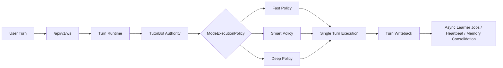

# PRD：三种回答模式统一挂载 TutorBot Authority

## 1. 文档信息

- 文档名称：TutorBot 模式统一权威 PRD
- 文档路径：`/docs/plan/2026-04-19-tutorbot-mode-policy-unified-authority-prd.md`
- 创建日期：2026-04-19
- 版本：Draft v2
- 适用范围：微信小程序主聊天入口、TutorBot、Turn Runtime、模式切换、模型路由、深度策略、Heartbeat、学员级个性化
- 关联文档：
  - [2026-04-15-unified-ws-full-tutorbot-prd.md](/Users/yehongchen/Documents/CYH_2/Markzuo/deeptutor/docs/plan/2026-04-15-unified-ws-full-tutorbot-prd.md)
  - [2026-04-15-learner-state-memory-guided-learning-prd.md](/Users/yehongchen/Documents/CYH_2/Markzuo/deeptutor/docs/plan/2026-04-15-learner-state-memory-guided-learning-prd.md)
  - [2026-04-16-tutorbot-context-orchestration-prd.md](/Users/yehongchen/Documents/CYH_2/Markzuo/deeptutor/docs/plan/2026-04-16-tutorbot-context-orchestration-prd.md)
  - [CONTRACT.md](/Users/yehongchen/Documents/CYH_2/Markzuo/deeptutor/CONTRACT.md)
  - [contracts/index.yaml](/Users/yehongchen/Documents/CYH_2/Markzuo/deeptutor/contracts/index.yaml)
  - [docs/zh/bi/deeptutor-bi-data-blueprint.md](/Users/yehongchen/Documents/CYH_2/Markzuo/deeptutor/docs/zh/bi/deeptutor-bi-data-blueprint.md)

## 2. 一句话决策

微信小程序主产品链路中的 `智能 / 快速 / 深度` 三种模式，全部继续挂在同一个 `TutorBot authority` 下；它们只表达单轮执行策略差异，不再表达三套顶层 runtime、三套会话世界或三套产品身份。

## 3. 执行摘要

这份 PRD 的核心不是“保留三种模式”，而是“保留三种模式，同时删掉三套 authority”。

最终要达成的是：

1. 学员始终面对同一个 TutorBot 身份
2. 三种模式共享同一个 workspace、memory、learner state、heartbeat、session continuity
3. 模式差异只落在单轮 policy 上：
   - 模型
   - 工具预算
   - 时延预算
   - 是否允许深度阶段
   - 回答长度与密度
4. `deep_question / deep_solve / chat pipeline` 不再作为与 TutorBot 并列的主产品 authority，而是作为 TutorBot 内部可委派能力或非主产品实验能力存在

这条路比“保留独立深度 4-step 顶层模式”更稳，因为它同时满足：

1. 你最看重的原版 TutorBot 价值
2. Fast / Smart / Deep 的明显体验差异
3. 学员级个性化和长期陪学连续性
4. 更短链路、更少概念、更低复杂度、更好观测

## 4. 背景与问题重述

当前项目已经完成一轮关键收口：

1. 微信小程序主聊天入口已经通过统一 `/api/v1/ws` 进入完整 TutorBot runtime
2. 学员级长期状态、独立 workspace、个性化 heartbeat 已被确定为核心产品方向
3. 建筑实务主场景已经围绕 `construction-exam-coach` 形成 TutorBot 主业务身份

但模式层还没有完全收口。

产品原始设想是：

1. 智能模式
   - 走原版 TutorBot 风格的中间态
2. 深度模式
   - 走 DeepTutor 原有 agentic 4 步模式
3. 快速模式
   - 走一次 RAG 后立刻回答的最快链路，可使用更快模型

这个设想的方向并不错误，真正危险的是如果把它实现成：

1. 智能 = 一套 authority
2. 深度 = 一套 authority
3. 快速 = 一套 authority

那么系统表面上只有一个 tutor，内部却会长期存在三套执行世界。这会持续制造：

1. 连续性断裂
2. 个性化错位
3. 链路复杂度失控
4. trace / BI / 故障排查不可解释

## 5. 第一性原理与一等业务事实

### 5.1 一等业务事实

对主产品聊天链路来说，真正的一等业务事实不是：

- 当前用了哪个 capability
- 当前是否展示 4 个阶段
- 当前调用了哪个模型供应商

真正的一等业务事实是：

> 同一个学员在主产品聊天入口中，应始终由同一个 TutorBot 身份承担上下文连续性、个性化状态、主动陪学协同与知识调用 authority；模式只决定这一轮“怎么答”，不决定“谁在答”。

### 5.2 单一 authority

本 PRD 明确规定：

- `TutorBot` 是主产品聊天链路中的唯一顶层 authority

它唯一负责：

1. tutor identity
2. workspace / soul / skills
3. session continuity
4. learner state 接入
5. heartbeat 协同
6. 本轮模式策略选择
7. 最终 turn writeback

### 5.3 Less Is More 的真实含义

这里的 `less is more` 不是“模式少一个按钮”，而是：

1. 更少的顶层概念
2. 更少的平行路由
3. 更少的状态镜像
4. 更少的 authority 竞争
5. 更短的执行链
6. 更直接的验证路径

## 6. 概念归一与字段纪律

这一节是 v2 必须新增的硬约束，否则后续实现极容易再次长出第二套语义。

### 6.1 用户看到的模式，与内部概念必须拆开

用户看到的是：

- 智能
- 快速
- 深度

但内部不能再把它们直接等同于一个含糊的 `teaching_mode` 概念，因为项目规则已经明确：

- `teaching_mode` 更适合表示表达风格、互动节奏、教学口吻
- 不应该继续承担知识链、身份路由、工具启用、执行引擎语义

### 6.2 推荐的内部归一方式

第一阶段保持兼容，但在入口层立即归一化：

1. `requested_response_mode`
   - 用户本轮显式选择的 `fast / smart / deep`
2. `effective_response_mode`
   - 系统最终生效的模式
3. `response_mode_degrade_reason`
   - 如果发生受控降级，记录原因
4. `teaching_style`
   - 若未来需要表示苏格拉底式、鼓励式、严格式等表达风格，用独立字段承载

兼容策略：

1. 外部历史字段仍可暂时接受 `teaching_mode`
2. 但必须在 ingress 立即归一到 `requested_response_mode`
3. 之后的运行时不允许再把旧 alias 当成一等控制字段到处传播

### 6.3 明确禁止

以下做法全部禁止：

1. 用 `deep` 模式名直接表示“切换到另一套 runtime”
2. 用 `teaching_mode` 同时承担：
   - 表达风格
   - 工具预算
   - capability 路由
   - 模型切换
3. 前端、Turn Runtime、TutorBot、子组件各自再解释一次模式语义
4. mode router、capability router、model router 各自独立决策，互相打架

## 7. 目标架构

### 7.1 统一主链

### 7.2 关键原则

1. 模式不切换顶层 authority
2. 模式不切换 tutor identity
3. 模式不切换 workspace ownership
4. 模式不切换 session key
5. 模式不切换 writeback pipeline
6. 模式不切换 heartbeat authority
7. 模式允许切换：
   - 本轮模型
   - 本轮工具预算
   - 本轮阶段语义
   - 本轮时延预算
   - 本轮回答密度

### 7.3 与 learner state / heartbeat 的关系

主产品需要同时满足两件事：

1. 每个学员都拥有独立 TutorBot workspace 和个性化体验
2. Heartbeat 不能退化成“每个 bot 一个常驻 loop”的不可扩展形态

因此本 PRD 继承已有 learner-state 方向：

1. `TutorBot` 负责学员侧身份与会话 authority
2. `heartbeat` 继续走 learner-job 级调度模型
3. 模式历史只能作为 heartbeat 的参考输入，不能成为 heartbeat 的独立 authority

也就是说：

- 学员本轮用了 `deep`，不代表系统要启动一个 `deep heartbeat`
- 学员最近偏爱 `fast`，可以影响提醒文案节奏，但不能长出第二套对话真相

## 8. ModeExecutionPolicy 设计

### 8.1 最小正确做法

第一阶段只引入一层显式的 `ModeExecutionPolicy`，由它统一描述：

1. `mode_name`
2. `model`
3. `max_tool_rounds`
4. `allow_deep_stage`
5. `response_density`
6. `latency_budget_ms`
7. `cost_tier`
8. `citation_requirement`
9. `fallback_policy`

### 8.2 ModeExecutionPolicy 的责任边界

它负责：

1. 单轮执行预算
2. 单轮模型选择
3. 单轮可用阶段与最大复杂度
4. 单轮失败时的受控降级

它不负责：

1. 改变 tutor 身份
2. 改变长期 memory authority
3. 改变 heartbeat scheduler
4. 改变 session / replay / resume contract

## 9. 三种模式的清晰定义

### 9.1 Smart

#### 定位

主产品默认模式，中等时延，中等到较高质量，个性化连续性优先。

#### 执行意图

1. 保持 TutorBot 原生陪学感
2. 保留建筑实务场景化教学约束
3. 对知识问答、一般追问、日常陪学足够稳
4. 在质量与时延之间取中间值

#### 推荐链路

`TutorBot`
-> `smart policy`
-> `有限上下文编排`
-> `最多 1-2 轮工具`
-> `直接响应`

#### 升级规则

Smart 可以受控提升到 Deep，但必须满足至少一个条件：

1. 用户明确要求“详细讲”“深度分析”“系统讲透”
2. 当前问题明显是复杂案例、条件分支题、规范冲突题
3. Smart 预算内无法给出可靠结论，且继续短答会显著损害质量

### 9.2 Fast

#### 定位

低延迟快答模式，优先满足“快”和“够用”，不是“最强”。

#### 执行意图

1. 让学员明显感知到比 Smart 更快
2. 对明确知识问答、短问题、查点式问题优先低时延闭环
3. 回答可更短，但不能破坏 TutorBot 连续性

#### 推荐链路

`TutorBot`
-> `fast policy`
-> `必要时一次 retrieval`
-> `短答结论先行`

#### 硬约束

1. 默认最多一次知识召回
2. 默认不进入重型工具循环
3. 默认不进入 deep stage
4. 默认不为了“看起来更聪明”而悄悄拖慢

#### 受控例外

Fast 模式默认不自动升到 Deep。

只允许一种窄例外：

1. 当前问题涉及明确事实判断，若不做最小检索就高风险误导

即便如此，也只能做：

1. 一次受控检索或一次 Smart 级最小补强

不能做：

1. 偷偷升级成完整 Deep 长链

### 9.3 Deep

#### 定位

最高质量模式，允许最慢，但必须让质量提升真实可感知。

#### 执行意图

1. 对复杂建筑实务问题提供更强分析
2. 对模糊、带条件、需要分情况判断的问题给出更稳结论
3. 对案例题、难题、复杂迁移题提供更高教学价值

#### 推荐链路

`TutorBot`
-> `deep policy`
-> `深度上下文编排`
-> `阶段化推演`
-> `综合写作`

#### 允许保留的深度体验

Deep 可以保留：

1. 阶段语义
2. 更强模型
3. 更高上下文预算
4. 更细致的答题骨架
5. 更稳的分情况分析

但这些都只是 TutorBot 内部执行轨迹，不是新的顶层 runtime。

## 10. 高风险使用场景覆盖

这一节是为了防止文档只在理想态成立。

### 10.1 同一会话中频繁切模式

场景：

1. 学员先用 Fast 问定义
2. 再切 Deep 问案例
3. 再切 Smart 做追问

要求：

1. 仍是同一个 session continuity
2. 仍写回同一个 learner state
3. 仍由同一个 TutorBot authority 承担
4. 只允许本轮执行预算变化

### 10.2 用户选了 Deep，但问题其实很简单

要求：

1. 不必机械拉满所有重链路
2. Deep 可以“认真但不冗长”
3. Deep 的本质是允许更深，不是强制每次都过度展开

### 10.3 用户选了 Fast，但问题其实很复杂

要求：

1. 默认保持 Fast 契约，不偷偷长成 Deep
2. 如果必须补强，只做最小必要检索或 Smart 级兜底
3. 如果复杂度过高，应优先给出简洁结论与边界说明，而不是无止境扩链

### 10.4 Deep 模式遇到模型超时或 provider 故障

要求：

1. 不能把整轮 turn 弄死
2. 必须在同一 TutorBot authority 内受控降级
3. 降级只能降到 Smart，不应直接降到 Fast
4. 必须留下 trace 与 BI 可观测证据

### 10.5 出题/批改/题后追问场景

要求：

1. `deep_question` 仍可保留为领域子能力
2. 但它应由 TutorBot 内部委派，不再成为并列主 authority
3. 模式影响的是这轮解释密度、工具预算、模型选择，不改变“由谁生成题、批改题、接追问”

### 10.6 跨端连续性

场景：

1. 学员在微信端用 Deep
2. 换到其他入口再用 Fast

要求：

1. 只要底层是同一个 learner / bot authority
2. 就不允许出现“模式不同导致像换了一个 tutor”

### 10.7 Heartbeat 与模式关系

要求：

1. Heartbeat 不得继承某个模式成为固定人格分身
2. 它可以参考近期模式偏好，调整提醒密度与措辞
3. 但最终仍按 learner-job 调度与全局仲裁运行

## 11. 预算、性能与模型策略

这一节给出的是初始目标，不是最终 contract；上线前必须用真实数据校准。

### 11.1 初始预算建议

| 模式 | 定位 | 建议模型策略 | 最大工具轮次 | 建议回答长度 | 初始时延目标 |
| --- | --- | --- | --- | --- | --- |
| Fast | 快答 | 低时延模型，可含 `qwen3.5-flash` 候选 | 1 | 短答、高密度 | P50 <= 6s, P95 <= 12s |
| Smart | 平衡 | 主力模型 | 1-2 | 中等长度 | P50 <= 12s, P95 <= 22s |
| Deep | 高质量 | 更强模型/推理模型 | 2-4 | 更完整但不空泛 | P50 <= 20s, P95 <= 45s |

### 11.2 模型选择原则

1. 模型是 policy 的一部分，不是新的产品身份
2. 不同模式可以使用不同模型
3. 但模型差异不能制造新的 authority 分裂

### 11.3 对 `qwen3.5-flash` 的判断

当前判断是：

1. 它适合作为 Fast 候选
2. 但不能在 PRD 中直接拍板为最终唯一方案
3. 必须经过真实建筑实务场景评测

评测维度至少包括：

1. 速度
2. 事实稳定性
3. 短答可用性
4. 用户满意度
5. 失败退化频率

## 12. 失败与降级策略

这一节是可交付性的关键，没有它，文档只是一份理念说明。

### 12.1 总原则

1. 降级发生在同一个 TutorBot authority 内
2. 降级是执行预算变化，不是切换产品世界
3. 降级必须可观测
4. 降级必须可统计
5. 降级必须可回滚调参

### 12.2 Fast 的降级规则

Fast 只允许两种结果：

1. 按 Fast 正常完成
2. 做一次最小必要补强后完成

Fast 默认不允许：

1. 悄悄升成 Deep
2. 因为追求完美而破坏“快”的契约

### 12.3 Smart 的降级规则

Smart 可以：

1. 正常完成
2. 因复杂度受控提升到 Deep
3. 因 provider 问题降到更稳的替代主力模型

但无论如何：

1. 仍是 TutorBot 在答
2. 仍是同一 turn writeback

### 12.4 Deep 的降级规则

Deep 可以：

1. 正常走完整 Deep policy
2. 因超时、供应商故障、成本阈值命中而退到 Smart 完成

Deep 不应：

1. 直接掉到 Fast
2. 因内部失败把本轮回复完全吞掉

### 12.5 用户可见语义

默认不向用户暴露底层降级细节。

但如果需要表达，可以只表达结果语义，例如：

1. “我先给你结论，再补关键理由”
2. “这题我先按最稳妥的判断给你框架”

不要把 provider、超时、模型名等基础设施细节直接甩给学员。

## 13. 现有能力的去留边界

### 13.1 保留

保留以下能力，但重新定义其位置：

1. `TutorBot`
   - 主产品唯一顶层 authority
2. `deep_question`
   - 题目生成、批改、题后追问的领域子能力
3. `deep_solve`
   - 可复用深度推演组件
4. `chat` agentic pipeline
   - playground、实验链路、内部复用能力

### 13.2 降级

对主产品微信小程序链路而言：

1. `chat` 不再作为与 TutorBot 并列的主 authority
2. `deep_solve` 不再直接成为用户切模式后的另一条顶层世界
3. 旧的“独立 4-step 产品世界”只能作为内部执行语义存在

### 13.3 明确防回潮

后续如果有人提出新增：

1. 专用 deep websocket
2. 专用 fast session
3. 专用 deep heartbeat
4. 专用 deep memory

默认视为错误方向，除非先证明：

1. 现有单一 authority 无法满足业务事实
2. 且不引入第二套真相

## 14. 观测、日志与 BI 要求

这一节决定了上线后能不能真正判断对错。

### 14.1 每轮至少要记录

1. `requested_response_mode`
2. `effective_response_mode`
3. `mode_degrade_reason`
4. `model`
5. `models_json`
6. `max_tool_rounds`
7. `actual_tool_rounds`
8. `latency_ms`
9. `retrieval_latency_ms`
10. `model_fallback_triggered`
11. `capability`
12. `surface`
13. `bot_id`
14. `session_id`
15. `turn_id`

### 14.2 关键判读问题

上线后至少要能回答：

1. Fast 是否真的比 Smart 快
2. Deep 是否真的比 Smart 质量高
3. Deep 的高质量是否值得额外时延和成本
4. 是否存在大量“用户选 Fast，系统却总偷偷走重链”
5. 是否存在大量“用户选 Deep，但质量并没有提升”

### 14.3 失败信号

以下任一指标显著恶化，都应视为失败或至少触发回滚评估：

1. Fast P95 与 Smart 接近，模式差异不可感知
2. Deep 质量提升不明显，但时延显著恶化
3. model fallback / degrade 率过高
4. 模式切换后 continuity 问题增多
5. 追问、题后讲解、跨端连续性出现明显断裂

## 15. 分阶段落地建议

### Phase 1：概念与字段收口

1. 明确主产品聊天入口唯一 authority 是 TutorBot
2. 把 `teaching_mode` 入口兼容值归一为 `requested_response_mode`
3. 明确 `teaching_style` 与 `response_mode` 是两种不同概念

### Phase 2：ModeExecutionPolicy 显式化

1. 把模型、预算、深度阶段开关、回答密度收敛到同一层
2. 不再让多个后端层重复解释模式

### Phase 3：能力边界收口

1. 让 Fast / Smart / Deep 都统一进入 TutorBot
2. Deep policy 内部按需委派深度组件
3. `deep_question` 收口为 TutorBot 内部领域子能力

### Phase 4：观测与灰度

1. trace 面板能看到：
   - requested mode
   - effective mode
   - budget
   - model
   - degrade reason
2. 先 shadow 统计，再小流量放量

### Phase 5：默认切换

在满足验收门槛后，再把统一 policy 作为默认主路径。

## 16. 灰度上线门槛

正式默认前，至少满足：

1. 有 feature flag，可单独开关：
   - fast policy
   - deep policy
   - mode normalization
2. 可一键回退到当前稳定模式行为
3. 有线下评测集与线上对照样本
4. trace 已能看清 mode / budget / loaded sources / fallback

## 17. 成功标准

当以下条件成立时，可以认为本次架构收口正确：

1. 同一个学员在三种模式切换时，不再切换顶层 authority
2. 三种模式继续共享同一个 tutor identity、workspace、learner state 与 heartbeat
3. Fast 明显快于 Smart
4. Deep 明显优于 Smart，且用户能感知到质量提升
5. 主产品链路的 trace、成本、故障排查比现在更清晰
6. 没有因为模式收口而重新长出第二套 `deep` 真相

## 18. 不确定性、验证与替代方案

### 18.1 当前不确定性

1. Fast 的最优模型目前未被真实业务评测锁定
2. Deep 的阶段提示做到什么粒度最合适，仍需产品验证
3. 初始时延预算是工程目标，不是当前已验证事实
4. Deep 对用户满意度的真实增益，需要用真实复杂题样本证明

### 18.2 验证方案

至少做三类验证：

1. 线下集评
   - 建筑实务知识问答
   - 案例题
   - 错题复盘
   - 出题与题后追问
2. 线上 shadow
   - 对比 Fast / Smart / Deep 的时延、成本、fallback 率
3. 小流量主链灰度
   - 对比用户停留、反馈、追问承接、满意度

### 18.3 替代方案

如果 Deep 内部 turn policy 在第一阶段难以稳定，可采用过渡方案：

1. 仍保留 Deep 的内部阶段组件
2. 但 UI 上只暴露 TutorBot 的单一身份与 mode 选择
3. 在实现层先做“内部委派 + 统一 writeback”，而不是马上追求很复杂的阶段展示

也就是说，替代方案可以放慢“展示层完整 deep 体验”，但不能回退“单一 authority”。

## 19. 最终结论

本 PRD 的最终选择仍然是：

> 智能、快速、深度三种模式继续存在，但全部收编到同一个 TutorBot authority 下，作为单轮 `ModeExecutionPolicy` 的三种执行策略存在。

这不是折中，而是当前条件下最优、最稳、最可交付的答案。原因很明确：

1. 它保住了你最看重的原版 TutorBot 价值
2. 它保住了三种模式的用户感知差异
3. 它把复杂度压回到“单一 authority + 单轮 policy”，而不是“三套产品世界”
4. 它与 learner state、heartbeat、统一 `/api/v1/ws`、BI 观测方向完全一致

如果后续真实评测证明某个模型不合适、某个预算不合理、某种阶段提示不值得保留，可以继续调参；但有一条不应再反复摇摆：

> 主产品链路必须只有一个 TutorBot authority，三种模式只能是它内部的执行策略，不能再回到三套平行 runtime。
