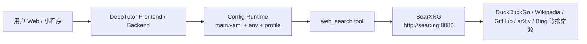
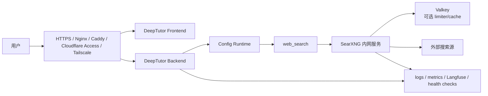

# PRD：DeepTutor 自部署联网搜索系统

## 1. 文档信息

- 文档名称：DeepTutor 自部署联网搜索系统 PRD
- 内部简称：DeepTutor Web Search Stack
- 文档路径：`/Users/yehongchen/Documents/CYH_2/Markzuo/deeptutor/docs/plan/2026-05-03-deeptutor-web-search-stack-prd.md`
- 创建日期：2026-05-03
- 文档状态：Proposed v1
- 适用仓库：`/Users/yehongchen/Documents/CYH_2/Markzuo/deeptutor`
- 目标读者：产品负责人、后端工程师、运维负责人、部署执行人、验收负责人
- 关联执行文件：[2026-05-03-deeptutor-web-search-stack-implementation-plan.md](2026-05-03-deeptutor-web-search-stack-implementation-plan.md)
- 关联约束：
  - [CONTRACT.md](/Users/yehongchen/Documents/CYH_2/Markzuo/deeptutor/CONTRACT.md)
  - [contracts/index.yaml](/Users/yehongchen/Documents/CYH_2/Markzuo/deeptutor/contracts/index.yaml)
  - [contracts/config-runtime.md](/Users/yehongchen/Documents/CYH_2/Markzuo/deeptutor/contracts/config-runtime.md)
  - [contracts/turn.md](/Users/yehongchen/Documents/CYH_2/Markzuo/deeptutor/contracts/turn.md)

## 2. 一句话结论

DeepTutor 的联网能力不应被定义为“旁边跑了一个 SearXNG”，而应被定义为：

> DeepTutor 在统一 config runtime 判定下，显式开启 `web_search` 工具，稳定调用内网 SearXNG，失败时 fail-closed，成功时把搜索结果、来源、日志和验收证据完整带回聊天、RAG 与 Deep Research 链路。

本 PRD 推荐的第一阶段方案是：

```text
DeepTutor runtime
  -> web_search tool enabled by tools.web_search.enabled
  -> provider resolved by resolve_search_runtime_config()
  -> internal SearXNG /search?format=json
  -> external engines
```

## 2.1 外部参考

本 PRD 的外部依赖以官方文档为准：

1. SearXNG Search API：`https://docs.searxng.org/dev/search_api.html`
2. SearXNG outgoing settings：`https://docs.searxng.org/admin/settings/settings_outgoing.html`
3. SearXNG limiter：`https://docs.searxng.org/admin/searx.limiter.html`
4. Docker Engine on Ubuntu：`https://docs.docker.com/engine/install/ubuntu/`

这些链接只作为部署和运行参考；DeepTutor 的搜索可用性最终仍以本仓 contract、runtime config 和 acceptance script 为准。

## 3. 背景与问题定义

### 3.1 当前背景

DeepTutor 已经有 `web_search` 工具、provider registry、SearXNG provider、搜索配置字段和 UI 设置入口。当前真正缺的不是“有没有搜索代码”，而是：

1. 部署侧没有稳定自托管搜索服务。
2. runtime 侧没有把 `web_search` 显式打开。
3. 验收侧没有同时覆盖 SearXNG、容器网络、DeepTutor provider、UI/turn 四层。
4. 过去容易把 `.env` 配了、服务跑了、UI 选了、工具可用这几件事混为一个事实。

### 3.2 根因重述

之前 Web Search 没配好的根因不是 fail-closed contract 太严格，而是缺少一条从配置到运行时再到真实回答的唯一验收链。

当前 contract 明确要求：

1. `tools.web_search.enabled` 是联网搜索唯一总开关。
2. provider/base_url/key 的解析由 config runtime 统一负责。
3. 未配置、缺 provider、缺 `base_url` 或缺 key 时不能隐式 fallback 到别的联网 provider。
4. 入口、capability、provider 不能各自决定 `web_search` 是否可用。

这意味着本项目必须把 fail-closed 当作产品能力的一部分：没有被显式配置并验收，就不暴露联网工具；一旦暴露，就必须可追踪、可观测、可回滚。

## 4. 一等业务事实与单一 authority

### 4.1 一等业务事实

本项目要维护的一等业务事实只有一句话：

> 当 DeepTutor 对外宣称具备联网搜索能力时，每一次需要联网的 turn 都必须沿同一条 runtime authority 调用已配置的搜索 provider，并在回答、日志、测试和运维面中留下可核验来源；如果链路不可用，系统必须明确失败，而不是假装搜索成功或悄悄切到其他 provider。

### 4.2 单一 authority

| 事实 | 唯一 authority | 不允许的 competing authority |
| --- | --- | --- |
| 是否暴露 `web_search` 工具 | `tools.web_search.enabled` + `is_web_search_runtime_available()` | UI toggle 自己决定、入口自动追加、capability 私自启用 |
| 使用哪个搜索 provider | `resolve_search_runtime_config()` | provider 内部 fallback、入口层猜测、prompt 约定 |
| SearXNG 地址 | `SEARCH_BASE_URL` / active search profile / `SEARXNG_BASE_URL` fallback | 写死在工具、写死在 UI、多个 compose service 名并存 |
| 搜索结果来源 | SearXNG JSON response 中的 `results` | LLM 自己编来源、模板伪造引用 |
| 是否验收通过 | acceptance script + `/api/v1/system/test/search` + 真实 turn smoke | 单个 curl 200、单个容器 running、只看 UI 文案 |

### 4.3 需要降级或删除的旧观念

1. “配置了 `SEARCH_PROVIDER` 就等于 Web Search 可用”：降级为 provider 解析输入。
2. “SearXNG 容器 running 就等于 DeepTutor 已联网”：降级为基础设施前置条件。
3. “缺 SearXNG 就 fallback DuckDuckGo”：删除。当前合同要求 fail-closed。
4. “UI 能选 provider 就等于 runtime 使用 provider”：降级为配置写入入口，必须通过 runtime config 验收。
5. “搜索失败时 LLM 可以凭常识回答最新信息”：删除。需要联网的问题必须明确搜索失败或注明未联网。

## 5. 产品目标

### 5.1 核心目标

1. DeepTutor 能稳定启用 `web_search` 工具。
2. `web_search` 默认调用自建 SearXNG，不依赖 Brave、Tavily、Serper、Perplexity 等付费搜索 API。
3. SearXNG 不暴露公网，只作为 DeepTutor 内部服务。
4. 搜索结果能进入 Chat、Deep Research、RAG + Web Search 混合链路。
5. 搜索结果必须带来源，不允许把无来源输出伪装成联网结果。
6. 搜索失败必须可见、可定位、可恢复。
7. 部署、配置、验收、备份、升级、故障处理都要可复现。

### 5.2 免费边界

这里的“免费”指：

1. 搜索 API 调用不产生第三方搜索 API 费用。
2. SearXNG 与 Valkey 是开源软件。
3. 可选本地 LLM / Embedding 可以不产生模型 API 费用。

不包括：

1. 服务器费用。
2. GPU 费用。
3. 出站流量费用。
4. 域名、HTTPS、反向代理、运维时间。
5. 搜索源风控导致的稳定性成本。

### 5.3 非目标

第一阶段不做：

1. 不把 SearXNG 做成公网搜索门户。
2. 不对外售卖 SearXNG 搜索 API。
3. 不做多租户搜索计费。
4. 不承诺搜索质量等同 Google 官方 API。
5. 不承诺所有免费搜索源长期稳定。
6. 不新增聊天 WebSocket 路由。
7. 不新增第二套 `web_search` runtime switch。
8. 不让 `rag`、`teaching_mode`、`TutorBot` 身份概念承担联网搜索启用语义。

## 6. 目标用户与场景

### 6.1 用户角色

| 角色 | 核心需求 |
| --- | --- |
| 管理员 | 部署、配置、升级、备份、排错 |
| 普通学员 | 对时效性问题得到带来源回答 |
| 教研/内容人员 | 用 Deep Research 生成带来源报告 |
| 内部知识使用者 | RAG + Web Search 混合查询 |
| 运维负责人 | 监控搜索链路是否可用 |
| 产品负责人 | 确认联网能力真实进入用户体验 |

### 6.2 关键使用场景

#### 场景 A：普通时效性问答

用户问：

```text
请联网搜索 HKUDS/DeepTutor 的最新 release，并列出来源链接。
```

期望：

1. DeepTutor 判断需要联网。
2. `web_search` 工具被允许使用。
3. SearXNG 返回 GitHub/release 相关结果。
4. 回答里有来源链接。
5. 后端日志能看到 `web_search` 调用，SearXNG 日志能看到查询。

#### 场景 B：RAG + Web Search 混合

用户问：

```text
结合我的建筑实务知识库和最近一年的政策变化，说明施工安全管理要点。
```

期望：

1. `rag` 提供内部权威知识。
2. `web_search` 补充时效性政策或公开来源。
3. 回答区分“知识库依据”和“联网来源”。
4. 如果联网失败，不影响 RAG 基础回答，但必须明确“联网补充失败”。

#### 场景 C：Deep Research 报告

研究人员要求生成专题报告。

期望：

1. Deep Research 可以在研究阶段使用 `web_search`。
2. 引用进入 citation manager。
3. 报告里可追踪来源。
4. 搜索失败不会被 LLM 编造成引用。

#### 场景 D：小程序 / Web 表面

用户从 Web 或小程序进入聊天。

期望：

1. 表面可以请求 `web_search`，但 runtime 不可用时必须被过滤。
2. runtime 可用时才允许显示或启用联网相关能力。
3. 不新增小程序专用搜索路由。

#### 场景 E：管理员健康检查

管理员点击 Settings / Provider / Search 或系统测试。

期望：

1. 能看到 provider、base_url、status。
2. `/api/v1/system/test/search` 能给出结构化结果。
3. 失败时能区分：未开启、缺 provider、缺 base_url、SearXNG 403、容器网络失败、搜索源无结果。

#### 场景 F：公网生产部署

DeepTutor 对公网开放，SearXNG 内网服务。

期望：

1. 外部用户无法访问 SearXNG 8080。
2. DeepTutor backend 能访问 `http://searxng:8080`。
3. HTTPS 与访问控制只覆盖 DeepTutor 公网入口。
4. SearXNG 出站访问外部搜索源受监控。

## 7. 功能需求

### FR-1：SearXNG 内部搜索服务

系统必须提供 SearXNG 服务：

1. Docker service name：`searxng`
2. 容器内部地址：`http://searxng:8080`
3. 宿主机测试地址：`http://127.0.0.1:8080`
4. 支持 `/search`
5. 支持 `q` 查询参数
6. 支持 `format=json`
7. 返回 JSON 中包含 `results` 数组
8. 每条结果至少包含 `title`、`url`，优先包含 `content` 或同等摘要字段

必须在 SearXNG `settings.yml` 中启用：

```yaml
search:
  formats:
    - html
    - json
```

如果 `format=json` 未启用，请求应被视为部署失败。SearXNG 官方 Search API 文档明确说明 JSON 输出格式需要启用，否则未启用格式会被拒绝。

### FR-2：DeepTutor Runtime 显式开启

DeepTutor 必须显式启用：

```yaml
tools:
  web_search:
    enabled: true
    max_results: 5
```

该配置位于运行时用户设置目录：

```text
/app/data/user/settings/main.yaml
```

在宿主机 compose 映射下对应：

```text
/opt/deeptutor-stack/data/user/settings/main.yaml
```

没有该开关，即使 `.env` 配了 SearXNG，也不能判定 Web Search 可用。

### FR-3：DeepTutor 搜索 provider 配置

`.env` 必须包含：

```env
SEARCH_PROVIDER=searxng
SEARCH_API_KEY=
SEARCH_BASE_URL=http://searxng:8080
SEARXNG_BASE_URL=http://searxng:8080
```

说明：

1. `SEARCH_PROVIDER` 是 provider 解析输入。
2. `SEARCH_BASE_URL` 是主要 base_url。
3. `SEARXNG_BASE_URL` 只作为兼容 fallback，不能作为第二套 authority。
4. `SEARCH_API_KEY` 对 SearXNG 必须为空。
5. 如果 active search profile 已经配置了别的 provider，可能覆盖 `.env`，验收必须打印 `get_current_config()`。

### FR-4：DeepTutor provider 行为

DeepTutor SearXNG provider 必须：

1. 调用 `${base_url}/search`
2. 传参 `q=<query>`、`format=json`
3. 不需要 API key
4. 限制 `max_results` 在 1 到 10 之间
5. 将 SearXNG `results` 转成 `search_results` 与 `citations`
6. 失败时抛出清晰错误，不 fallback 到 DuckDuckGo

### FR-5：回答链路

当用户启用或触发联网搜索时：

1. runtime 必须先判断 `is_web_search_runtime_available()`。
2. 可用时才把 `web_search` 暴露给 agent/tool registry。
3. 搜索结果进入回答链路。
4. 回答应包含来源链接或明确的来源摘要。
5. 搜索失败时必须明确说明失败，不允许编造最新信息。

### FR-6：系统测试接口

系统测试必须覆盖：

1. `get_current_config()`
2. `is_web_search_runtime_available()`
3. `web_search(... provider="searxng")`
4. `/api/v1/system/test/search`
5. SearXNG 宿主机 API
6. SearXNG 容器网络 API
7. 真实 UI 或 unified turn smoke

## 8. 非功能需求

### NFR-1：可用性

MVP：

1. SearXNG 单机 Docker 运行。
2. `restart: unless-stopped`。
3. DeepTutor 与 SearXNG 在同一 Docker network。
4. SearXNG root 和 JSON API 可探测。
5. DeepTutor web_search provider 可探测。

生产：

1. 监控 SearXNG HTTP 可用性。
2. 监控 JSON API 是否返回结果。
3. 监控 DeepTutor `provider_status`。
4. 每日备份数据与配置。
5. 升级前自动备份。

### NFR-2：安全性

要求：

1. SearXNG 只绑定 `127.0.0.1` 或 Docker 内网。
2. 不将 SearXNG 8080 直接暴露公网。
3. Valkey 不暴露公网。
4. Ollama/vLLM 不暴露公网。
5. DeepTutor 公网入口必须走 HTTPS 和访问控制。
6. `.env` 不提交 Git。
7. 如未来 SearXNG 公网化，必须另行设计 limiter、反向代理真实 IP、AGPL 合规和滥用防护。

### NFR-3：可维护性

要求：

1. 生产部署目录统一放在 `/opt/deeptutor-stack`。
2. SearXNG `settings.yml` 独立管理。
3. DeepTutor `.env` 独立管理。
4. DeepTutor runtime `main.yaml` 必须纳入备份。
5. Compose 可复现部署。
6. 验收脚本可重复执行。
7. 故障排查表必须覆盖四层：SearXNG、Docker network、DeepTutor runtime、UI/turn。

### NFR-4：可观测性

最低要求：

1. `docker compose logs searxng` 能看到请求或错误。
2. `docker compose logs deeptutor` 能看到 provider 错误。
3. `get_current_config()` 能输出 provider 状态。
4. `/api/v1/system/test/search` 能作为 admin health check。
5. 失败分类至少包括：
   - `WEB_SEARCH_DISABLED`
   - `SEARCH_PROVIDER_NOT_CONFIGURED`
   - `SEARCH_PROVIDER_MISSING_BASE_URL`
   - `SEARXNG_JSON_FORBIDDEN`
   - `SEARXNG_NO_RESULTS`
   - `SEARXNG_NETWORK_UNREACHABLE`
   - `SEARCH_UPSTREAM_RATE_LIMITED`
   - `SEARCH_UPSTREAM_CAPTCHA_OR_BLOCKED`

### NFR-5：性能与稳定性

MVP 目标：

1. 20 个混合查询成功返回不少于 18 个。
2. P95 响应时间不超过 8 秒。
3. 不出现连续 3 次失败。
4. 单次 SearXNG request timeout 建议 6 到 20 秒之间。

生产目标：

1. 搜索成功率按日统计。
2. 搜索 P50/P95 按日统计。
3. 搜索失败桶按日统计。
4. 对搜索源不稳定做降频、换 engine、出站代理或备用 provider 评估。

### NFR-6：开源合规

当前建议：

1. DeepTutor 按自身 license 使用。
2. SearXNG 只做配置级部署，不修改源码。
3. SearXNG 不公网开放。
4. 若未来商业化对外开放搜索 API，必须单独做 AGPL 合规评估。

## 9. 推荐架构

### 9.1 MVP 架构



### 9.2 生产架构



### 9.3 关键原则

1. DeepTutor 可以公网访问。
2. SearXNG 不公网访问。
3. 本地模型服务不公网访问。
4. 搜索 runtime 只有 config runtime 一个 authority。
5. provider 失败不 silent fallback。
6. 验收必须覆盖真实回答，不只覆盖 API。

## 10. 执行阶段

### Phase 0：确认部署对象

目标：

1. 确认是本地、阿里云单机，还是生产域名部署。
2. 确认 LLM/Embedding 使用外部 API 还是本地模型。
3. 确认是否需要出站代理。
4. 确认目标 DeepTutor 镜像版本。

输出：

1. 服务器信息。
2. 部署路径。
3. LLM/Embedding provider。
4. 网络暴露策略。

### Phase 1：部署 SearXNG

目标：

1. 创建 `/opt/deeptutor-stack`。
2. 创建 `searxng/core-config/settings.yml`。
3. 启动 `valkey` 与 `searxng`。
4. 验收宿主机 JSON API。

验收：

```bash
curl -sS --get "http://127.0.0.1:8080/search" \
  --data-urlencode "q=DeepTutor" \
  --data "format=json" | jq '.results | length'
```

### Phase 2：配置 DeepTutor runtime

目标：

1. `.env` 配置 `SEARCH_PROVIDER=searxng` 和 `SEARCH_BASE_URL=http://searxng:8080`。
2. `data/user/settings/main.yaml` 显式开启 `tools.web_search.enabled=true`。
3. 重启 DeepTutor。
4. 验收 `get_current_config()`。

验收：

```text
enabled: True
provider: searxng
provider_status: ok
base_url: http://searxng:8080
available: True
```

### Phase 3：联调 Web Search provider

目标：

1. DeepTutor 容器能访问 SearXNG。
2. `web_search(provider="searxng")` 有结果。
3. `citations` 或 `search_results` 非空。
4. 不 fallback 到 DuckDuckGo。

### Phase 4：UI / turn 验收

目标：

1. Web UI 中可启用或触发 Web Search。
2. 真实问题返回来源。
3. 后端日志与 SearXNG 日志均可核验。
4. 若小程序使用该能力，必须走统一 `/api/v1/ws`，不得新增专用路由。

### Phase 5：生产化

目标：

1. 固定镜像版本。
2. 配置 HTTPS 和访问控制。
3. 配置 Uptime Kuma 或等价监控。
4. 配置每日备份。
5. 配置升级前备份和验收。

## 11. 验收标准

### 11.1 P0 硬验收

必须全部通过：

1. `curl http://127.0.0.1:8080/search?...format=json` 返回 200。
2. JSON 可被 `jq` 解析。
3. `.results | length >= 1`。
4. DeepTutor 容器内访问 `http://searxng:8080/search` 返回 200。
5. `get_current_config()` 显示 `enabled=True`。
6. `provider=searxng`。
7. `provider_status=ok`。
8. `base_url=http://searxng:8080`。
9. `is_web_search_runtime_available()` 返回 `True`。
10. `web_search(provider="searxng")` 返回 `search_results` 或 `citations`。
11. UI 或真实 turn 返回来源链接。
12. SearXNG 8080 未公网暴露。

### 11.2 P1 稳定性验收

1. 20 个混合查询成功不少于 18 个。
2. P95 不超过 8 秒。
3. 连续失败次数小于 3。
4. 失败查询有明确失败桶。

### 11.3 P2 生产验收

1. HTTPS 入口可用。
2. DeepTutor backend 不裸露无认证管理能力。
3. `.env` 未提交 Git。
4. `data/user/settings/main.yaml` 已备份。
5. `searxng/core-config/settings.yml` 已备份。
6. 升级流程包含 acceptance script。
7. 监控包含 SearXNG JSON API 与 DeepTutor search test。

## 12. 风险与不确定性

### 12.1 搜索源稳定性

不确定性：

免费搜索源可能限流、CAPTCHA、返回少结果或受出口 IP 影响。

验证：

1. 连续跑 20 到 100 个查询。
2. 按 engine 统计失败。
3. 在目标服务器出口 IP 上实测。

替代方案：

1. 调整 SearXNG engines。
2. 配置 SearXNG `outgoing.proxies`。
3. 增加 Brave 免费额度作为备用 provider，但必须显式配置，不能 silent fallback。

### 12.2 国内云服务器出站访问

不确定性：

阿里云国内出口访问 GitHub、Wikipedia、DuckDuckGo 等源可能不稳定。

验证：

1. 在目标 ECS 上跑 SearXNG JSON API。
2. 测中文、英文、GitHub、政策类查询。
3. 观察 P95 与失败桶。

替代方案：

1. 海外轻量 SearXNG 节点，仅允许 DeepTutor 内网/VPN 访问。
2. 给 SearXNG 配出站代理。
3. 引入一个低成本备用 provider，并在 release gate 中显式标记 provider。

### 12.3 DeepTutor active profile 覆盖 `.env`

不确定性：

UI Settings 或 `model_catalog.json` 可能把 search active profile 配成其他 provider 或空 provider。

验证：

1. 打印 `get_current_config()`。
2. 检查 `requested_provider`、`provider`、`base_url`、`provider_status`。

替代方案：

1. 在 UI 中重新保存 search profile。
2. 用部署脚本写入 search profile。
3. 在 acceptance script 中 fail-closed，禁止只看 `.env`。

### 12.4 本地模型配置

不确定性：

Docker 容器内 `localhost` 指向容器自身，不指向宿主机。Ollama/vLLM 在宿主机时，DeepTutor 必须使用 `host.docker.internal`。

验证：

1. `docker compose exec deeptutor curl http://host.docker.internal:11434/...`
2. DeepTutor `/api/v1/system/test/llm`。

替代方案：

1. 模型服务也放入同一 Docker network。
2. 使用外部 LLM API。
3. 使用独立模型服务器的内网地址。

### 12.5 许可证

不确定性：

如果未来修改 SearXNG 源码或对外提供搜索 API，AGPL 合规边界需要重新评估。

当前替代：

1. 不修改源码。
2. 不公网暴露。
3. 只做内部配置级部署。

## 13. 不推荐方案

1. 不推荐公共 SearXNG 实例：JSON 常被禁用，稳定性和合规不可控。
2. 不推荐直接 DuckDuckGo provider 作为生产主链路：限流、观测、风控不可控。
3. 不推荐 SearXNG 公网暴露：会引入滥用、防护、真实 IP、AGPL 和运维风险。
4. 不推荐让 LLM 在搜索失败时继续回答“最新信息”：这是把失败伪装成成功。
5. 不推荐在小程序或 mobile router 中加专用搜索路由：违反统一入口方向。
6. 不推荐无版本 pin 的生产部署：rolling image 会让问题难以回滚。

## 14. 最小交付物

项目完成时必须交付：

1. `/opt/deeptutor-stack/docker-compose.yml`
2. `/opt/deeptutor-stack/.env`
3. `/opt/deeptutor-stack/searxng/core-config/settings.yml`
4. `/opt/deeptutor-stack/data/user/settings/main.yaml`
5. `/opt/deeptutor-stack/scripts/acceptance_searxng.sh`
6. DeepTutor 可访问地址
7. SearXNG 内部地址
8. 验收报告
9. 备份脚本
10. 运维说明
11. 故障排查表

## 15. 最终验收报告模板

```markdown
# DeepTutor 自部署联网搜索系统验收报告

- 验收日期：
- 服务器：
- 部署路径：/opt/deeptutor-stack
- DeepTutor 镜像版本：
- SearXNG 镜像版本：

## 一、基础服务

- [ ] Docker 正常
- [ ] Docker Compose 正常
- [ ] DeepTutor running
- [ ] SearXNG running
- [ ] Valkey running

## 二、SearXNG

- [ ] `/` 可访问
- [ ] `/search?q=xxx&format=json` 返回 200
- [ ] JSON 可解析
- [ ] results >= 1
- [ ] title/url 字段完整
- [ ] 不返回 403

## 三、DeepTutor Runtime

- [ ] `tools.web_search.enabled=true`
- [ ] `provider=searxng`
- [ ] `provider_status=ok`
- [ ] `base_url=http://searxng:8080`
- [ ] `is_web_search_runtime_available() == True`
- [ ] 没有 fallback 到 DuckDuckGo

## 四、真实回答

- [ ] Web UI 可启用或触发 Web Search
- [ ] 真实联网问题返回来源链接
- [ ] DeepTutor 日志有 web_search 调用
- [ ] SearXNG 日志有对应请求
- [ ] 搜索失败时明确报错

## 五、安全

- [ ] SearXNG 未公网暴露
- [ ] Valkey 未公网暴露
- [ ] .env 未提交 Git
- [ ] DeepTutor 公网入口 HTTPS
- [ ] 有访问控制
- [ ] 有备份

## 六、性能

- [ ] 20 个查询成功 >= 18 个
- [ ] P95 <= 8 秒
- [ ] 连续失败次数 < 3

## 七、结论

- [ ] 通过
- [ ] 有条件通过
- [ ] 不通过

备注：
```
