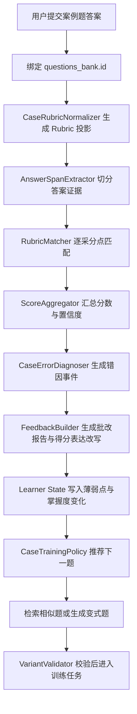
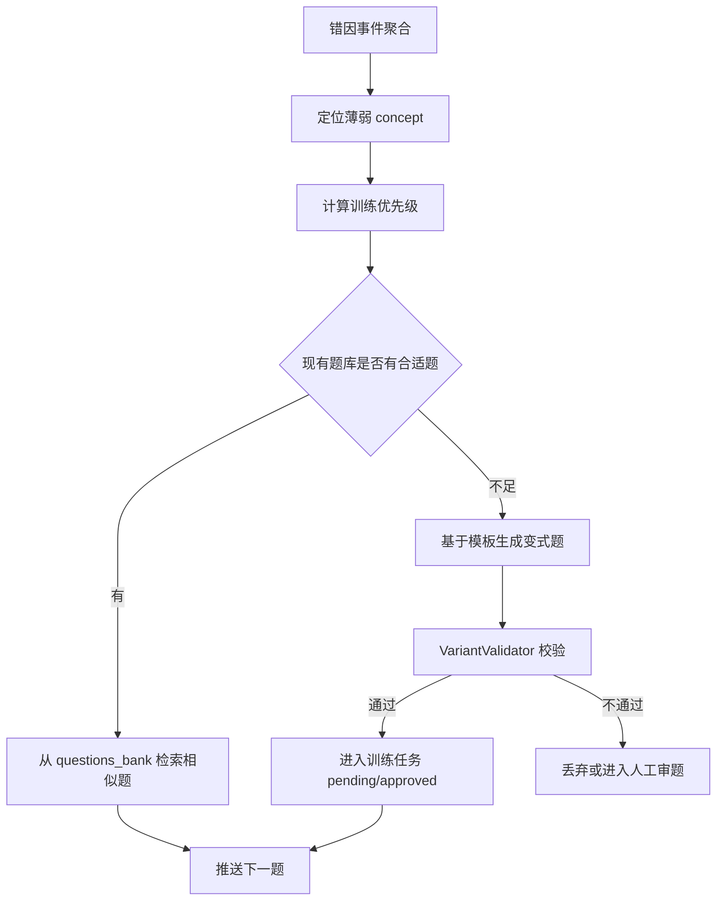

# PRD：鲁班智考案例题 AI 阅卷与错因变式训练闭环

## 1. 文档信息

- 文档名称：鲁班智考案例题 AI 阅卷与错因变式训练闭环 PRD
- 文档路径：`docs/plan/2026-05-13-luban-case-grading-error-map-prd.md`
- 创建日期：2026-05-13
- 状态：Proposed v1.1（2026-05-13 复审强化：明确复用现有 assessment / learner state / deep_question / questions_bank 基础，不另起炉灶）
- 适用范围：鲁班智考建筑实务案例题训练、AI 主观题阅卷、错因图谱、个性化变式训练、Learner State、Teaching Policy、Supabase `questions_bank`
- 关联文档：
  - [CONTRACT.md](../../CONTRACT.md)
  - [contracts/index.yaml](../../contracts/index.yaml)
  - [2026-04-15-learner-state-memory-guided-learning-prd.md](2026-04-15-learner-state-memory-guided-learning-prd.md)
  - [2026-04-20-luban-adaptive-teaching-intelligence-prd.md](2026-04-20-luban-adaptive-teaching-intelligence-prd.md)
  - [2026-04-20-teaching-methods-matrix-prd.md](2026-04-20-teaching-methods-matrix-prd.md)
  - [2026-05-02-luban-assessment-blueprint-prd.md](2026-05-02-luban-assessment-blueprint-prd.md)
  - [2026-05-13-luban-case-grading-error-map-implementation-plan.md](2026-05-13-luban-case-grading-error-map-implementation-plan.md)
  - [../openmaic/ADR-006-supabase-knowledge-base-reuse.md](../openmaic/ADR-006-supabase-knowledge-base-reuse.md)

## 2. 一句话结论

鲁班智考下一阶段不要做“建筑实务版 ChatGPT”，而要做：

> 建筑实务案例题 AI 阅卷官：基于现有题库与采分点投影，逐项判断用户答案能拿多少分、为什么丢分、下一题该练什么。

本 PRD 吸收前面讨论里的两个最高价值方向：

1. `AI 主观题阅卷系统`
   - 不是让 LLM 凭感觉打总分，而是用 Rubric 驱动的结构化判卷。
   - 每个给分都必须有用户答案原文证据。
   - 没有证据句，不给分。

2. `错因图谱 + 个性化变式训练`
   - 不只告诉用户“错了”，而是记录为什么错、错在哪个能力环节、下一步练哪类题。
   - 变式训练优先从现有题库和模板选择，生成题必须经过校验，不直接进入正式题库。

最重要的取舍：

> P0 不新建第二套 Rubric 题库。先复用 Supabase `questions_bank` 作为唯一题目资产 authority，从已有 `correct_answer / analysis / grading_keywords / grading_rubric / source_meta` 生成“Rubric 投影”。只有当人工校准证明字段表达力不够时，再增加 `question_rubric_items` 子表或人工覆盖层。

## 3. 背景与判断

### 3.1 为什么要做案例题 AI 阅卷

建筑实务考试的核心痛点不是“没有资料”，而是：

- 用户不知道自己写出来到底能拿几分。
- 用户看得懂标准答案，但自己写不出采分表达。
- 用户知道大方向，却漏掉程序性关键词。
- 用户做过原题会，换一个工程背景就不会。
- 老师无法低成本逐份批改大量主观题答案。

因此，鲁班智考的差异化不应押在“题库更多”或“讲解更长”，而应押在：

- 逐采分点批改
- 逐句诊断
- 得分表达改写
- 错因持续积累
- 下一题个性化训练

### 3.2 我们已有题库，不应重复造题库

当前项目已有 Supabase `questions_bank` 作为题目资产 authority。既有 Assessment Blueprint PRD 已明确：

- 生产题目资产不应绕过 `questions_bank`。
- 不应新建 assessment 专用题库。
- `questions_bank.id` 是 P0 provenance 的最低要求。
- `grading_keywords / grading_rubric / source_meta / exam_year / node_code` 是可用于评分和追溯的增强字段。

因此，本 PRD 不把“Rubric 题库”理解成第二套题库，而把它定义为：

> 对 `questions_bank` 中案例题资产的一种评分投影和人工校准层。

这能同时满足两个目标：

1. 快速启动：用现有题干、答案、解析、关键词先跑通 AI 阅卷。
2. 保持简单：避免在 Supabase 里再建一套并行题库，造成题目来源、版本、上下线状态漂移。

### 3.3 为什么不能直接让 LLM 打分

直接 prompt：“请给这个答案打分”，短期看起来可用，长期一定不稳定：

- 同一答案多次评分可能飘。
- 模型容易把“意思好像懂了”误判成得分。
- 模型可能新增 rubric 之外的采分点。
- 用户无法追溯每一分来自哪里。
- 老师无法校准和复用评分规则。

所以本系统的核心不是“LLM 打分”，而是：

> 题目 -> Rubric 投影 -> 答案证据 -> 逐项评分 -> 错因事件 -> 下一题策略。

### 3.4 复审结论：这不是另起炉灶，而是在现有基础上补主观题内核

当前 repo 已经有多块可复用基础。新增工作不应重建练题系统、画像系统、题库系统或聊天入口，而应补齐“建筑实务主观案例题的结构化评分内核”，再把结果接回已有链路。

| 现有基础 | 当前能力 | 本 PRD 应如何复用 | 明确不做 |
| --- | --- | --- | --- |
| Supabase `questions_bank` | 已作为 assessment 题目资产 authority，含 `question_type / source_type / node_code / source_meta / grading_keywords / grading_rubric` 等字段 | 继续作为案例题资产唯一来源；Rubric 只是从这些字段生成的评分投影 | 不建第二套 `rubric_questions` 题库 |
| `AssessmentBlueprintService` | 已负责正式测评抽样、题量、来源、session 交付与 fail-closed | 复用其“蓝图 + provider + coverage audit”的思想；新增 case readiness audit 时沿用同一风格 | 不把主观题训练硬塞进现有 20 题摸底蓝图 |
| `scripts/audit_assessment_blueprint_coverage.py` / `assessment.coverage` | 已有 Supabase 只读覆盖审计模式 | 扩展出 `case_rubric_readiness` 审计，检查 case 题是否有可拆 rubric 的答案、关键词、分值、来源 | 不靠人工感觉判断题库是否够用 |
| `deep_question` / `question_followup` | 已有练题生成、题目上下文、答题解析、批量题提交、active object 连续性 | 主观案例题沿用 question context / active object 绑定；在 grading route 中遇到 `case_study / written` 时转入 `CaseGradingService` | 不新增专用聊天 WebSocket，不绕开 `/api/v1/ws` |
| `SubmissionGraderAgent` | 当前更偏选择题/批量题反馈，能保留题目锚点并生成讲解 | 可复用其反馈表达经验，但不能作为主观题分数 authority | 不继续用“讲解 agent”承担结构化评分 |
| `LearnerStateService` | 已有 profile/progress/memory events/outbox/Supabase sync | 错因事件以 `case_grading_result / case_error_event` 等 memory/progress evidence 写入，聚合后再影响长期画像 | 不新建一套 learner 错因数据库 |
| `assessment.teaching_policy` | 已能把摸底结果转成节奏、支架、复习建议 | 增加 case 错因输入后，输出下一题、支架强度、复习节奏 | 不新建第二个 Teaching Policy 引擎 |
| `AgentCoordinator` / question generator | 已能按 topic 生成练题，带 RAG 和 validation 字段 | 变式训练优先检索 `questions_bank`；确需生成时复用生成链路，但必须加 case validator | 不让 AI 生成题直接进入正式题库 |
| RAG / exact authority | 已有 `rag` 与 Supabase RAG 管线 | rubric 解释、来源追溯、教材依据继续走现有 RAG / `questions_bank` provenance | 不新增 grounded mode 或第二套知识召回概念 |

因此，最稳妥的架构表述应改成：

> 在现有 DeepTutor 练题与 learner state 体系里，新增一个 `case_grading` 内核；它负责主观案例题的 Rubric 投影、证据匹配、错因事件和下一题信号，其他能力尽量复用现有系统。

### 3.5 现有基础的边界与缺口

当前已有基础足够支撑 P0，但不能直接等同于“已经有主观题阅卷系统”。

1. `AssessmentQuestionProvider` 当前偏摸底测评与选择题渲染。
   - 候选题构建会要求 `options` 和 `correct_answer` 可渲染，适合 assessment，不适合直接承载长案例作答。
   - 主观题应新增 `CaseQuestionAssetRepository` 或等价薄适配器，只读读取 `questions_bank` 的 case 字段，不能改掉 assessment provider 的职责。

2. `SubmissionGraderAgent` 当前是反馈生成能力，不是结构化判卷 authority。
   - 它可以继续用于自然语言解释和锚点保留。
   - 分数、采分点、错因必须由 `CaseGradingService` 的结构化结果决定。

3. Learner State 已能存事件，但还没有“案例题错因聚合语义”。
   - 第一版不需要新表。
   - 需要定义 memory event payload schema 和 mastery projection 规则，否则错因会变成不可用日志。

4. `deep_question` 已支持 written/case 请求识别，但主观题生成和主观题判卷是两件事。
   - 生成题时可以用现有 pipeline。
   - 判卷时必须绑定 `questions_bank.id` 或已验证的 variant task id。

5. `questions_bank` 是否已完整保留本地源数据，目前仍需 live 只读对账。
   - 本地源数据看起来足够做 P0。
   - Supabase 当前环境字段完整度必须用 audit 证明，不能口头假设。

## 4. 产品目标

### 4.1 P0 目标

用最小闭环验证用户是否愿意每天提交案例题答案，并认可 AI 批改价值。

P0 必须交付：

1. 用户选择或绑定一道建筑实务案例题。
2. 用户提交主观答案。
3. 系统从 `questions_bank` 生成或读取 Rubric 投影。
4. AI 逐采分点评分，输出结构化 JSON。
5. 系统展示：
   - 预计得分
   - 采分点命中表
   - 漏分点
   - 扣分原因
   - 得分表达改写
   - 下一题训练建议
6. 系统记录错因事件，并能生成个人错因摘要。

### 4.2 P1 目标

把一次批改升级成训练闭环。

P1 必须交付：

1. 错因图谱沉淀到 learner state 或其投影层。
2. 根据错因和掌握度推荐下一题。
3. 支持同考点变式训练：
   - 优先从现有题库检索相似题。
   - 不够时由模板生成新题。
   - 生成题必须经过 validator。
4. 用户二次改写后可再次评分，并看到提分变化。

### 4.3 P2 目标

引入老师校准，提升评分准确度和机构合作价值。

P2 必须交付：

1. 老师查看 AI 批改结果。
2. 老师修正采分点给分和理由。
3. 老师修正反哺 Rubric 投影和 few-shot 示例库。
4. 班级错因热力图。
5. 一键生成讲评提纲。

## 5. 非目标

第一阶段明确不做：

1. 不做“泛 AI 答疑”作为核心产品。
2. 不做全科、全考证平台。
3. 不新建第二套 `rubric_questions` 或独立题库来替代 `questions_bank`。
4. 不把 AI 生成题直接写入正式题库并对外宣称真题级质量。
5. 不做复杂 IRT / BKT 掌握度模型。
6. 不上 LangGraph 等重编排框架作为 P0 前置条件。
7. 不做图纸、照片、网络计划图的最终高精度判卷；多模态只能作为后续训练题生成入口。
8. 不新增专用聊天 WebSocket 路由；聊天仍走统一 `/api/v1/ws`。

## 6. Single Authority Hard Gate

### 6.1 One Business Fact

本 PRD 要维护的一等业务事实是：

> 对某个用户在某道建筑实务案例题上的一次作答，系统必须可信地回答：能得多少分、哪些采分点命中、哪些采分点漏掉、为什么漏、属于什么错因、下一步最该练什么。

### 6.2 One Authority

| 业务事实 | 唯一 authority |
| --- | --- |
| 题目资产、题干、答案、来源 | Supabase `questions_bank` |
| Rubric 投影生成口径 | `CaseRubricNormalizer` |
| 一次判卷结果 | `CaseGradingService` |
| 逐采分点得分 | `ScoreAggregator` 基于 matcher 结果确定 |
| 错因 taxonomy | `CaseErrorTaxonomy` |
| 学员长期薄弱点 | Learner State / Teaching Policy 的 learner projection |
| 下一题选择 | `CaseTrainingPolicy` |
| AI 生成变式题质量门槛 | `VariantValidator` |
| 用户聊天入口 | 统一 `/api/v1/ws`，不新增专用聊天 WS |

### 6.3 Competing Authorities

必须避免以下重复 authority：

1. LLM 直接给总分，而不是基于 rubric item 证据给分。
2. 前端自己重算总分或错因。
3. TutorBot prompt 旁路执行案例题评分。
4. 新建一套与 `questions_bank` 平行的 Rubric 题库。
5. 变式题生成器直接写入正式题库。
6. 老师工作台修改了批改结果但没有回写校准数据。

### 6.4 Canonical Path



### 6.5 Delete Or Demote

P0 必须降级或禁止：

1. “请 AI 打个分”的自由文本 prompt。
2. 前端根据文案自行判断得分等级。
3. 题目来源不明的临时案例题进入正式训练闭环。
4. 没有证据句却给分的评分结果。
5. 没有 validator 的 AI 生成变式题进入用户训练流。

## 7. 用户场景

| 场景 | 用户问题 | 系统承诺 |
| --- | --- | --- |
| 第一次体验 | “我这道题能拿几分？” | 30 秒内给出预计分、命中点、漏点和改写答案 |
| 反复丢分 | “我为什么安全题总写不好？” | 聚合最近错因，指出是程序漏项、关键词缺失还是审题错误 |
| 冲刺训练 | “明天练什么最能提分？” | 根据错因和考试权重推荐下一题 |
| 二次改写 | “按建议改了能不能多拿分？” | 支持再次评分并展示提分点 |
| 老师带班 | “这批学员最该讲什么？” | 输出班级错因热力图和讲评提纲 |
| 题库维护 | “哪些题能用于 AI 阅卷？” | 输出 Rubric readiness audit，不够的题进入人工精修队列 |

### 7.1 真实场景反推

为了避免 PRD 停在理想链路，以下场景必须作为设计约束。

| 场景 | 容易犯的设计错误 | 当前最稳方案 |
| --- | --- | --- |
| 用户在聊天里直接贴答案：“帮我批改这道案例题” | 没有绑定题目就强行评分 | 若 active object 中有当前题，绑定该题；否则先要求用户选择题目或粘贴完整题干，不能生成正式分数 |
| 用户在练题页提交今日案例题 | 练题页自己拼 prompt 批改 | 练题页只提交 `question_id + submission_text`，评分统一走 `CaseGradingService` |
| 用户提交很短答案：“加强管理，严格检查” | 模型为了鼓励用户乱给分 | 只能命中泛化表达，最高 partial，并标注 E04 口号化表达 |
| 用户答案很长但没有关键词 | 把长答案误认为高质量 | 逐采分点找证据句，没有证据句不给 full |
| 用户二次改写答案 | 把二次答案当新题，丢失对比 | 绑定同一 `grading_run_group_id`，显示新增命中的采分点 |
| 用户要求“再来一道类似的” | AI 随机生成一道看起来相似的题 | 先根据错因和 concept 从 `questions_bank` 检索；检索不足才生成变式并 validator |
| 变式题由 AI 生成 | 直接写入正式题库 | 只进入 `training_task` pending/approved 流，不进入正式 `questions_bank` |
| 老师修正 AI 分数 | 只改页面展示，不沉淀 | 写入 calibration event，后续更新 rubric few-shot 或人工覆盖层 |
| 用户连续乱答或秒交 | 错误写入长期画像 | 标记 low confidence，只给临时反馈，不更新稳定 mastery |
| Supabase 字段缺 rubric | 宣布不能做 | 从 `correct_answer / analysis / grading_keywords` 生成 L1 draft；人工确认后升级 L2 |
| 题目是进度/费用计算 | 让 LLM 直接算关键线路或费用 | P0 标记 `needs_review` 或走确定性计算插件；不把 LLM 结果当最终分 |
| 小程序移动端输入不便 | 一开始上 OCR / 拍照识别 | P0 先文本输入和粘贴；OCR 作为 P2 体验增强 |
| 老师/机构想要班级报告 | 先做大后台 | P2 先用错因聚合表和导出报告，不先做完整 SaaS |

这些场景反推后的产品口径是：

> P0 不是“万能批改器”，而是“绑定题目后的主观题结构化批改器”。绑定题目、Rubric 投影和证据句是三条硬门槛。

## 8. 核心功能设计

### 8.1 功能一：Rubric 投影生成

Rubric 投影不是新题库，而是从 `questions_bank` 中生成的评分结构。

输入字段优先级：

1. `grading_rubric`
2. `grading_keywords`
3. `correct_answer`
4. `analysis`
5. `source_meta`
6. `node_code / tags / attributes`

输出结构：

```json
{
  "question_id": "questions_bank.id",
  "rubric_version": "projection_v1",
  "total_score": 6,
  "items": [
    {
      "item_id": "r1",
      "criterion": "超过一定规模的危大工程应组织专家论证",
      "required_meaning": "学生必须表达该专项施工方案需要组织专家论证",
      "score": 1,
      "keywords": ["专家论证", "超过一定规模", "专项施工方案"],
      "acceptable_expressions": ["应进行专家论证", "专项方案需组织专家论证"],
      "non_credit_expressions": ["加强管理", "注意安全", "严格检查"],
      "concept_tags": ["危大工程", "专项施工方案", "安全管理"],
      "default_error_tags": ["E02", "E03", "E06"],
      "source_ref": {
        "question_id": "questions_bank.id",
        "source_type": "REAL_EXAM",
        "exam_year": 2024
      }
    }
  ]
}
```

Rubric 投影等级：

| 等级 | 来源 | 是否可用于正式评分 | 用途 |
| --- | --- | --- | --- |
| L0 | 只有标准答案文本 | 否 | 可用于讲解，不用于正式估分 |
| L1 | AI 从标准答案拆出的 draft rubric | 可用于灰度体验 | 需要标记低置信度 |
| L2 | 人工确认过的 rubric | 是 | P0 正式训练主力 |
| L3 | 有真实答案与老师校准数据 | 是 | 高可信评分与机构版 |

P0 只需要 20-50 道 L2 题即可上线验证，不追求全库覆盖。

### 8.2 功能二：AI 主观题阅卷

评分流程分为四步。

第一步：答案切分。

系统将学生答案切成若干可引用的原文证据：

```json
[
  {
    "span_id": "s1",
    "text": "施工单位未编制专项方案",
    "possible_concepts": ["专项施工方案"]
  },
  {
    "span_id": "s2",
    "text": "应加强现场安全检查",
    "possible_concepts": ["安全检查", "泛化表达"]
  }
]
```

第二步：逐采分点匹配。

每个 rubric item 输出：

```json
{
  "rubric_item_id": "r1",
  "status": "partial",
  "awarded_score": 0.5,
  "max_score": 1,
  "evidence_text": "施工单位未编制专项方案",
  "missing_meaning": "未写出专家论证要求",
  "reason": "识别到专项方案问题，但没有表达超过一定规模危大工程应组织专家论证",
  "error_tags": ["E02", "E03"],
  "confidence": 0.82
}
```

第三步：分数汇总。

总分由 `ScoreAggregator` 汇总，不由 LLM 自由生成。

规则：

1. `awarded_score` 不能超过 rubric item 分值。
2. 没有 `evidence_text` 的 item 不能给 full。
3. 只有泛化表达时最高 partial。
4. 低置信度评分进入“AI 初评，建议复核”状态。
5. 计算题进入确定性算法或人工复核，不能只靠 LLM。

第四步：反馈生成。

用户看到的报告不是 JSON，而是产品化解释：

- 预计得分：`3.5 / 6`
- 命中的采分点
- 漏掉的采分点
- 哪些句子是“管理口号”而不是采分表达
- 得分表达改写
- 下一题训练建议

### 8.3 功能三：错因图谱

第一版错因 taxonomy：

| Code | 名称 | 定义 |
| --- | --- | --- |
| E01 | 知识点缺失 | 根本不知道该考点 |
| E02 | 采分点遗漏 | 知道大方向，但漏掉关键点 |
| E03 | 关键词缺失 | 意思接近，但没有写出得分关键词 |
| E04 | 口号化表达 | 用“加强管理、严格检查”等空话替代具体做法 |
| E05 | 审题错误 | 题目问不妥之处，用户写成正确做法，或反之 |
| E06 | 程序顺序错误 | 审批、论证、交底、验收等流程顺序混乱 |
| E07 | 概念混淆 | 专项方案、施工组织设计、技术交底等概念混淆 |
| E08 | 背景信息提取失败 | 未从案例材料中抓住隐含条件 |
| E09 | 计算错误 | 进度、费用、索赔、流水等计算错误 |
| E10 | 规范适用错误 | 使用错误规范、旧规则或错误适用条件 |
| E11 | 迁移失败 | 原题会，换背景不会 |
| E12 | 表达冗余 | 写很多但不给分，影响时间效率 |

每次评分后产生错因事件：

```json
{
  "user_id": "u1",
  "submission_id": "sub1",
  "question_id": "q1",
  "rubric_item_id": "r1",
  "concept_tag": "危大工程专项施工方案",
  "error_code": "E03",
  "severity": 0.8,
  "evidence": "用户写了'加强管理'，但未写出'专家论证'",
  "diagnosis": "用户知道安全管理方向，但没有写出程序性采分关键词",
  "created_at": "2026-05-13T00:00:00Z"
}
```

用户报告应从“错题列表”升级为“错因画像”：

> 你在“危大工程专项方案流程”相关题中最近 5 次平均得分率为 42%。主要丢分不是不会安全管理，而是漏写“专家论证、审批程序、安全技术交底”这些程序性采分点。下一阶段不建议泛刷安全题，建议连续训练 3 道“危大工程流程类”变式题。

### 8.4 功能四：得分表达改写

用户提交原答案后，系统给出得分版改写。

改写原则：

1. 不编造用户未涉及的事实。
2. 明确标注“新增了哪些采分点”。
3. 使用短句、分点、关键词前置。
4. 避免口语化、口号化表达。
5. 与题目问法对齐。

示例：

用户答案：

> 施工单位未编制专项方案，现场安全管理不到位，应加强检查。

改写：

> 该做法不妥。施工单位应针对该分部分项工程编制专项施工方案，并按规定履行审核、审批程序；若属于超过一定规模的危大工程，还应组织专家论证。方案实施前应进行安全技术交底，实施过程中应按方案施工，并进行检查、验收和整改闭环。

### 8.5 功能五：个性化变式训练

变式训练遵循“检索优先，生成其次，校验必经”的原则。

推荐流程：



推荐分数：

```text
priority_score =
  exam_weight * 0.35
+ weakness_score * 0.35
+ recent_error_frequency * 0.20
+ forgetting_factor * 0.10
```

P0 先支持 5 个高频考点：

1. 危大工程专项方案流程
2. 合同索赔程序与证据
3. 进度计划关键线路与工期调整
4. 质量验收程序
5. 混凝土质量问题处理

变式生成要求：

1. 保持考点不变，更换工程背景。
2. 题干必须提供足够信息。
3. 标准答案必须能拆成 rubric items。
4. 设置 1-2 个常见陷阱。
5. 输出题干、标准答案、rubric、陷阱说明、来源依据。
6. 未通过 validator 的题不能推给用户。

### 8.6 功能六：老师校准闭环

老师工作台不是 P0 必需，但它是长期准确度护城河。

P2 功能：

1. Rubric 编辑器
   - 编辑采分点、分值、关键词、同义表达、不给分表达、常见错因。

2. AI 批改复核
   - 展示用户答案、AI 给分、证据句、漏点、置信度。
   - 老师只修正错误项。

3. 班级错因热力图
   - 按考点、错因、平均得分率聚合。

4. 一键生成讲评稿
   - 基于班级错因生成直播讲评顺序和典型答案对照。

5. 校准数据反哺
   - 记录 AI 原评分、老师修正、差异原因、rubric 更新记录。

## 9. 数据设计

### 9.1 P0 原则

P0 尽量不改 Supabase schema。

P0 可以先用：

- `questions_bank` 读取题目资产。
- 本地/服务内 `CaseRubricProjection` schema 生成评分投影。
- 评分结果作为应用事件或现有 learner state evidence 写入。
- golden fixtures 保存 20-50 道 L2 rubric。

只有当 P0 验证通过并需要规模化维护时，再加子表。

### 9.2 未来可选表：`question_rubric_items`

如果 `questions_bank.grading_rubric` 表达力不够，再新增子表，而不是新题库：

```sql
CREATE TABLE question_rubric_items (
  id UUID PRIMARY KEY,
  question_id UUID NOT NULL REFERENCES questions_bank(id),
  item_order INT NOT NULL,
  criterion TEXT NOT NULL,
  required_meaning TEXT NOT NULL,
  score NUMERIC NOT NULL,
  acceptable_expressions TEXT[],
  keywords TEXT[],
  non_credit_expressions TEXT[],
  common_wrong_expressions TEXT[],
  concept_tags TEXT[],
  error_tags TEXT[],
  source_ref JSONB,
  rubric_level TEXT NOT NULL DEFAULT 'L2',
  created_at TIMESTAMP DEFAULT now(),
  updated_at TIMESTAMP DEFAULT now()
);
```

关键点：

- `question_id` 必须引用 `questions_bank.id`。
- 不能脱离原题独立存在。
- 不能承担题目上下线 authority。

### 9.3 判卷运行结果

```json
{
  "grading_run_id": "run1",
  "user_id": "u1",
  "question_id": "q1",
  "submission_text": "用户答案",
  "rubric_version": "projection_v1:L2",
  "total_score": 3.5,
  "max_score": 6,
  "confidence": 0.82,
  "status": "ai_final",
  "rubric_results": [],
  "major_problems": [],
  "rewrite_answer": "得分表达改写",
  "next_training_suggestion": {}
}
```

状态枚举：

| 状态 | 含义 |
| --- | --- |
| `ai_draft` | AI 初评，置信度不足或 rubric 等级低 |
| `ai_final` | AI 可直接展示的评分 |
| `needs_review` | 需要老师复核 |
| `teacher_corrected` | 老师已修正 |
| `discarded` | 判卷无效，不写入长期画像 |

### 9.4 Learner Mastery 投影

掌握度第一版用简单、可解释算法：

```text
concept_mastery =
  recent_score_rate_last_5 * 0.70
+ historical_score_rate * 0.30
```

错因严重度：

```text
error_severity =
  lost_score_ratio * 0.60
+ error_recurrence * 0.25
+ exam_weight * 0.15
```

不要一开始上复杂模型。第一版目标是让用户和老师看得懂。

## 10. 交互设计

### 10.1 页面一：提交答案

入口：

- 今日案例题
- 历年真题案例题
- 我的薄弱点推荐题

表单：

- 题目背景
- 问题
- 分值
- 限时倒计时
- 答案输入框
- 提交批改按钮

P0 支持粘贴文本。拍照 OCR 后续再做。

### 10.2 页面二：AI 阅卷报告

展示结构：

1. 总分卡片
   - `预计得分 3.5 / 6`
   - `AI 置信度 82%`
   - `评分状态：AI 可展示 / 建议老师复核`

2. 采分点表
   - 采分点
   - 分值
   - 命中状态
   - 用户证据句
   - 漏掉含义
   - 错因标签

3. 最大扣分原因
   - 用自然语言解释，不堆术语。

4. 得分表达改写
   - 展示改写后的答案。
   - 标注新增采分关键词。

5. 下一题建议
   - 推荐 1 道最该练的题。
   - 解释推荐原因。

### 10.3 页面三：错因报告

用户做完 5 道题后展示：

- 当前案例题估计水平
- 最近 5 道题平均得分率
- 高频错因 Top 3
- 高频漏点 Top 10
- 薄弱考点 Top 5
- 7 天训练建议

报告文案必须像教练，不像后台统计：

> 你不是“安全管理不会”，而是安全题里经常把程序性采分点写成管理口号。下一阶段先练“方案-审批-论证-交底-实施-验收”链条。

## 11. 技术方案

### 11.1 代码模块建议

第一版建议新增内部服务模块：

```text
deeptutor/services/case_grading/
  schema.py
  rubric_normalizer.py
  answer_span_extractor.py
  rubric_matcher.py
  score_aggregator.py
  error_taxonomy.py
  error_diagnoser.py
  feedback_builder.py
  variant_recommender.py
  variant_validator.py
```

原则：

1. `rubric_normalizer.py` 只负责从 `questions_bank` 和人工覆盖层生成 Rubric 投影。
2. `rubric_matcher.py` 可以调用 LLM，但必须输出结构化结果。
3. `score_aggregator.py` 尽量 deterministic。
4. `error_diagnoser.py` 只消费 rubric result，不重新判卷。
5. `variant_recommender.py` 优先检索现有题。
6. `variant_validator.py` 是变式题进入训练流的硬 gate。

### 11.2 结构化输出

模型输出必须符合 schema：

```json
{
  "submission_id": "string",
  "question_id": "string",
  "total_score": 3.5,
  "max_score": 6,
  "confidence": 0.82,
  "rubric_results": [
    {
      "rubric_item_id": "string",
      "criterion": "string",
      "max_score": 1,
      "awarded_score": 0.5,
      "status": "partial",
      "evidence_text": "string",
      "missing_meaning": "string",
      "reason": "string",
      "error_tags": ["E02"],
      "confidence": 0.82
    }
  ],
  "major_problems": ["string"],
  "rewrite_answer": "string",
  "next_training_suggestion": {
    "focus_concepts": ["string"],
    "suggested_question_types": ["string"],
    "reason": "string"
  }
}
```

### 11.3 Prompt 原则

System prompt 核心规则：

```text
你是一级/二级建造师建筑实务案例题阅卷助手。
你的任务不是讲课，而是严格按评分规则判卷。
评分规则：
1. 只能依据给定 rubric_items 给分。
2. 每个采分点必须从学生答案中找到明确证据。
3. 如果学生答案只有泛泛表述，例如“加强管理”“严格检查”“注意安全”，但没有表达 rubric 的核心含义，不得给满分。
4. 如果学生表达部分正确，可给 partial，但必须说明缺失含义。
5. 如果学生答案与采分点相反，标记 wrong。
6. 不得新增 rubric 之外的采分点。
7. 输出必须符合指定 JSON schema。
```

User prompt 必须包含：

- 题目背景
- 问题
- 总分
- Rubric 投影 JSON
- 学生答案

### 11.4 与 TutorBot 的关系

TutorBot 仍是唯一业务身份。

案例题 AI 阅卷不是第二个 TutorBot，也不是新的聊天 agent 身份。它是 TutorBot 可以调用的一项内部能力：

- 用户在聊天里问“帮我批改这道案例题”时，TutorBot 调用 `CaseGradingService`。
- 用户在练题页面提交答案时，产品 API 调用同一服务。
- 两条入口都必须得到同一种判卷结果结构。

### 11.5 与 RAG 的关系

`rag` 仍是唯一知识召回工具。

案例题评分需要引用教材、规范、真题解析时，只能通过现有 RAG / `questions_bank` provenance 获取证据，不新增“grounded mode”之类概念。

### 11.6 与 Learner State 的关系

AI 判卷结果不能直接覆盖长期画像。

写入规则：

1. `ai_final` 且置信度达到阈值，才能写入稳定 mastery projection。
2. `ai_draft / needs_review` 只能写入候选 evidence。
3. 老师修正后，以老师修正结果为更高权重 evidence。
4. 低质量作答、空答、明显乱答不写入长期画像。

## 12. 验收标准

### 12.1 数据验收

1. 从 Supabase `questions_bank` 中筛出至少 50 道 case study 候选题。
2. 完成至少 20 道 L2 Rubric 投影。
3. 每道 L2 题必须包含：
   - `questions_bank.id`
   - 题干
   - 标准答案
   - 总分
   - 3 个以上 rubric items，或证明该题低于 3 个采分点
   - 每个 item 的分值、核心含义、关键词、错因标签
4. 输出 Rubric readiness audit：
   - 可直接用
   - 需 AI 拆解
   - 需人工精修
   - 暂不可用于主观题评分

### 12.2 判卷质量验收

1. 20 道 L2 题的结构化评分全部通过 schema 校验。
2. 所有给分项必须有 `evidence_text` 或明确 partial 解释。
3. AI 评分与人工老师评分在试点样本中达到：
   - 总分误差平均不超过该题满分的 15%，或
   - 逐采分点 weighted agreement 达到 0.75 以上。
4. 低置信度样本能进入 `needs_review`，不得伪装成最终评分。
5. 用户二次改写后，系统能指出提分来自哪些采分点。

### 12.3 错因图谱验收

1. 每次有效判卷至少能产生 1 个错因事件，满分答案除外。
2. 用户完成 5 道题后，能生成错因报告。
3. 错因报告必须指出：
   - 高频错因
   - 对应考点
   - 丢分证据
   - 下一步训练建议
4. 同一用户相同错因反复出现时，推荐策略必须提高该考点优先级。

### 12.4 变式训练验收

1. P0 支持 5 个高频考点的下一题推荐。
2. 推荐优先从 `questions_bank` 取题。
3. 生成题必须经过 validator。
4. Validator 至少检查：
   - 考点一致性
   - Rubric 可答性
   - 答案可溯源
   - 难度匹配
   - 是否存在多种合理答案导致不可判分
5. 未通过 validator 的题不能进入用户训练流。

### 12.5 产品验收

试点用户完成一次案例题批改后，应能回答：

1. 我这道题大概能拿几分。
2. 哪些点拿到了分。
3. 哪些点漏了。
4. 我的答案哪里是废话或口号。
5. 我应该怎么改写更像得分答案。
6. 下一题为什么推荐给我。

如果用户只觉得“这是一个讲解工具”，说明产品失败；如果用户觉得“这像老师在批我的卷子”，P0 成立。

## 13. 指标体系

### 13.1 产品有效性指标

| 指标 | 目标 |
| --- | --- |
| 首次批改完成率 | >= 80% |
| 批改报告展开率 | >= 70% |
| 得分表达改写查看率 | >= 60% |
| 用户二次改写率 | >= 30% |
| 7 天内提交答案次数 | >= 3 次 |
| 评分报告有用率 | 试点问卷 >= 80% |

### 13.2 评分质量指标

| 指标 | 目标 |
| --- | --- |
| AI/人工总分误差 | 平均不超过满分 15% |
| 采分点证据覆盖率 | >= 95% |
| 无证据给分率 | 0 |
| 低置信度正确拦截率 | 持续监控 |
| 老师修正率 | 越低越好，但 P0 重点看错误类型 |

### 13.3 学习闭环指标

| 指标 | 目标 |
| --- | --- |
| 二次改写提分率 | >= 50% 用户有提升 |
| 下一题完成率 | >= 40% |
| 高频错因复发率 | 随训练下降 |
| 7 天陪练完成率 | >= 35% |

## 14. 分阶段路线图

### Phase 0：数据核验与 Rubric readiness audit（1 周）

目标：

- 确认 Supabase `questions_bank` 中案例题字段是否保留完整。
- 对本地源数据与 Supabase 进行只读对账。
- 筛出 50 道候选案例题。
- 复用现有 assessment coverage audit 的风格，新增 case 专用 readiness 维度。

产出：

- `case_rubric_readiness_report.json`
- 20 道优先 L2 精修名单
- 字段缺失清单
- `questions_bank` 字段完整度与本地源数据差异清单

### Phase 1：AI 阅卷 P0（2 周）

目标：

- 完成 20 道 L2 Rubric。
- 跑通提交答案 -> 逐采分点评分 -> 报告展示。
- 接入现有 `deep_question` grading route 和练题页面 submission flow，不新增聊天入口。

产出：

- `CaseRubricNormalizer`
- `RubricMatcher`
- `ScoreAggregator`
- `FeedbackBuilder`
- 20 道 golden fixtures
- 评分报告 UI 原型
- `case_grading` 结构化结果 schema

### Phase 2：错因图谱与 learner writeback（2 周）

目标：

- 建立 E01-E12 错因 taxonomy。
- 判卷后写入错因事件。
- 用户完成 5 道题后生成错因报告。
- 复用 `LearnerStateService.append_memory_event / record_progress_event / merge_progress`，不新建 learner state authority。

产出：

- `CaseErrorTaxonomy`
- `CaseErrorDiagnoser`
- mastery projection
- 个人错因报告
- `case_error_event` payload schema

### Phase 3：个性化下一题与变式训练（2-3 周）

目标：

- 支持 5 个高频考点的下一题推荐。
- 优先检索题库，必要时生成变式题。
- 引入 `VariantValidator`。

产出：

- `CaseTrainingPolicy`
- `VariantTemplate`
- `VariantValidator`
- 5 个考点的变式模板
- `questions_bank` 检索优先的 next-task selector

### Phase 4：老师校准工作台（3-4 周）

目标：

- 让老师成为评分质量校准者，而不是被替代者。

产出：

- AI 批改复核列表
- Rubric 编辑器
- 班级错因热力图
- 讲评稿生成

### Phase 5：7 天 / 30 天陪练营（2-4 周）

目标：

- 把功能变成可售卖、可留存的训练服务。

产出：

- 每日案例题任务
- 限时作答
- AI 批改
- 二次改写
- 错因复盘
- 明日训练推荐

### 14.1 复审后的阶段降级规则

如果实际验证发现条件不足，按以下方式降级，而不是扩大工程面：

| 发现 | 不做什么 | 降级方案 |
| --- | --- | --- |
| Supabase 中 `grading_rubric` 覆盖不足 | 不急着改生产 schema | 从本地源数据和 `correct_answer` 生成 L1 draft，人工确认 20 道 L2 |
| 20 道 L2 人工精修速度慢 | 不做全库拆解 | 先做 5 个高频考点各 3-4 道题 |
| 主观题移动端输入完成率低 | 不先做 OCR 大工程 | 先在聊天/网页端跑种子用户；小程序只做粘贴输入 |
| AI/人工一致性不达标 | 不上线“正式分数” | 展示“AI 初评区间 + 漏点诊断”，分数标记试算 |
| 变式生成质量不稳 | 不开放生成题给用户 | 只做 `questions_bank` 检索推荐 |
| learner writeback 争议大 | 不写稳定画像 | 只写 memory event，等 5 次以上稳定证据再更新 mastery |

## 15. 实现优先级

### Must Have

1. `questions_bank.id` 绑定。
2. Rubric 投影。
3. 逐采分点评分。
4. 证据句给分。
5. 得分表达改写。
6. 错因标签。
7. 下一题推荐。

### Should Have

1. 二次改写再评分。
2. Rubric readiness audit。
3. 低置信度复核队列。
4. 个人错因报告。
5. 5 个高频考点变式模板。

### Could Have

1. 老师工作台。
2. 班级错因热力图。
3. 一键讲评稿。
4. OCR 上传答案。
5. 现场图片生成案例题。

### Won't Have In P0

1. 全自动大规模生成题库。
2. 多模态图纸精确判卷。
3. 复杂知识图谱数据库。
4. LangGraph 长流程编排。
5. 完整 B2B SaaS 后台。

### 15.1 实施落点：复用现有模块的最小改造

第一版代码落点应尽量薄，不应复制现有系统。

| 能力 | 推荐落点 | 说明 |
| --- | --- | --- |
| case 题读取 | `deeptutor/services/assessment/` 下新增 case asset adapter，或 `deeptutor/services/case_grading/assets.py` | 只读 `questions_bank`，不承担新题库 authority |
| rubric 投影 | `deeptutor/services/case_grading/rubric_normalizer.py` | 输入是 `questions_bank` row，输出是 runtime projection |
| 结构化判卷 | `deeptutor/services/case_grading/grader.py` | 统一返回 schema；LLM 只做匹配，汇总分 deterministic |
| 错因 taxonomy | `deeptutor/services/case_grading/error_taxonomy.py` | 对接 Teaching Methods Matrix 的错因族，不另设教学法 |
| learner 写回 | 现有 `LearnerStateService` | 使用 memory/progress event；稳定聚合后再写 progress |
| 下一题策略 | 扩展 `deeptutor/services/assessment/teaching_policy.py` 或新增同目录 case policy | 复用 assessment seed 思路，避免第二个策略引擎 |
| 变式生成 | 复用 `AgentCoordinator`，外加 case validator | 生成只是候选，不是正式题库资产 |
| 聊天接入 | 现有 `deep_question` grading route | `case_study/written` 分支调 `CaseGradingService` |
| 小程序接入 | 现有 practice / assessment 页面模式 | 先加提交入口，不重做练题表面 |

### 15.2 现有错因语义到 E-code 的桥接

当前选择题 grading 已有 `CORRECT / PARTIAL / CONFUSION / OVERSIGHT / MEMORY_DECAY / SLIP` 等诊断语义。主观题不应完全另建一套语言，而应做桥接：

| 现有诊断 | 对应主观题错因 | 说明 |
| --- | --- | --- |
| `CORRECT` | 无稳定错因 | 可记录命中采分点 |
| `PARTIAL` | E02 采分点遗漏 | 批量题/部分正确与主观题 partial 语义一致 |
| `CONFUSION` | E01 / E07 | 需结合 rubric 判断是知识缺失还是概念混淆 |
| `OVERSIGHT` | E05 审题错误 | 特别适合“不妥之处/错误项/补充做法”等题干 |
| `MEMORY_DECAY` | E01 / E03 | 事实型、数字型、规范型关键词缺失 |
| `SLIP` | 低权重行为错因 | 不应长期放大学习弱点 |

这样可以让新错因图谱和旧 grading 诊断在 report / learner state / Teaching Policy 中汇合。

## 16. 风险与缓解

| 风险 | 影响 | 缓解 |
| --- | --- | --- |
| 源题库答案能讲解但不能直接评分 | AI 阅卷不稳定 | P0 只选 L2 精修题；建立 readiness audit |
| Supabase 字段不如本地源数据完整 | Rubric 投影缺字段 | 先做只读对账；缺失字段走补录或人工覆盖层 |
| 模型给分过宽 | 用户误信分数 | 无证据不给分；低置信度复核；人工 golden eval |
| 变式题生成不严谨 | 用户练错题 | Validator 硬 gate；未通过不展示 |
| 错因 taxonomy 过细 | 用户看不懂 | 对用户展示自然语言，对系统保留 code |
| P0 做太大 | 上线慢 | 只做 20-50 道精品案例题，不追求全库覆盖 |
| 老师不信 AI | B 端难推进 | AI 做初批，老师做校准；展示证据句和可修正项 |

### 16.1 当前不确定性与验证方案

| 不确定性 | 为什么重要 | 验证方式 | 替代方案 |
| --- | --- | --- | --- |
| Supabase 是否完整保留本地源数据中的案例题答案、解析、分值、rubric 字段 | 直接决定 P0 能否从线上题库生成 Rubric 投影 | 执行只读 `case_rubric_readiness` audit，对比本地源数据与 `questions_bank` | 若字段缺失，先用本地源数据生成 L2 golden set，再补录回 `questions_bank` 或人工覆盖层 |
| `questions_bank.grading_rubric` 的结构是否稳定 | 决定 normalizer 能否通用 | 抽样 100 条 case 题，统计字段类型、可拆采分点数、分值一致性 | Normalizer 支持多来源优先级：`grading_rubric -> grading_keywords -> correct_answer -> analysis` |
| AI/人工评分一致性能否达标 | 决定能否展示明确分数 | 20 道题 x 每题 3-5 份真实/模拟答案，老师给分后算误差 | 不达标时只展示“AI 初评区间 + 漏点诊断”，分数弱化 |
| 用户是否愿意长文本作答 | 决定小程序体验策略 | 7 天种子用户测试：提交率、平均字数、二次改写率 | 先做半题/小问/粘贴输入，不急做完整大案例 |
| 变式生成质量是否稳定 | 决定是否开放 AI 生成题 | Validator + 老师抽检 50 道生成题 | P0 只做题库检索推荐，不开放生成 |
| learner writeback 会不会污染长期画像 | 决定错因是否进入稳定 profile | 先只写 memory event，观察 5 次以上同类错因再聚合 | 低置信度只做当前报告，不写长期 mastery |
| 老师是否愿意校准 | 决定 B2B 工作台优先级 | 找 3-5 位老师试用复核列表，记录每份节省时间 | 先找高分学员做校准，老师只抽检 |

## 17. 为什么这不会把简单事情做复杂

这套方案看起来有 Rubric、错因、变式，但 P0 的复杂度被控制在三个原则内：

1. 不新增第二套题库。
   - 题目仍以 `questions_bank` 为 authority。
   - Rubric 只是投影和校准层。

2. 不一次性全库结构化。
   - 先做 20-50 道 L2 精品题。
   - 验证用户愿不愿意反复提交答案。

3. 不让所有模块同时上线。
   - P0 只做“提交答案 -> AI 阅卷 -> 错因 -> 下一题建议”。
   - 变式生成、老师工作台、多模态都后置。

真正复杂的是“没有 Rubric 却让 AI 自由打分”，因为后期会出现评分飘、用户不信、老师无法校准、系统无法学习。Rubric 投影不是为了炫技，而是为了让每一分可解释、可复核、可积累。

## 18. 第一批实施建议

第一批只做 3 个可交付：

1. `Rubric readiness audit`
   - 对 Supabase case study 题做字段完整性分析。
   - 输出 50 道候选题。

2. `20 道 L2 Rubric golden set`
   - 由现有答案、解析、关键词自动拆解。
   - 人工快速校准。

3. `AI 阅卷报告 MVP`
   - 用户提交答案。
   - 系统逐采分点批改。
   - 输出得分、漏点、扣分原因、得分表达改写、下一题建议。

只要这三个成立，鲁班智考就从“题库/答疑产品”变成“案例题提分训练产品”。

## 19. 复审后的最终执行口径

当前条件下最优、稳健、可交付的答案是：

1. 先承认现有基础已经有价值。
   - `questions_bank` 是题目资产基础。
   - `AssessmentBlueprintService` 是蓝图和审计基础。
   - `deep_question/question_followup` 是练题连续性基础。
   - `LearnerStateService` 是错因沉淀基础。
   - `Teaching Methods Matrix` 是错因纠正和教学方法基础。

2. 再明确真正缺口只有一个主轴：
   - 建筑实务主观案例题缺少 Rubric 驱动的结构化评分内核。

3. 第一批只补这条主轴的最短闭环：
   - 只读对账 `questions_bank`
   - 选 20 道 L2 case rubric
   - 做 `CaseGradingService`
   - 接入已有 grading route
   - 写入 learner memory/progress event
   - 用现有题库推荐下一题

4. 任何新增模块都必须回答：
   - 它是在补主观题评分内核，还是在重建已有系统？
   - 它是否仍以 `questions_bank` / `LearnerStateService` / `/api/v1/ws` 为 authority？
   - 它是否可以先作为 adapter/projection，而不是新数据库、新路由、新平台？

5. Go / No-Go 门槛：
   - 若 20 道 L2 rubric 无法在 1 周内整理出来，先不要做完整产品页。
   - 若 AI/人工评分一致性不达标，先上线漏点诊断和得分表达改写，不展示确定分数。
   - 若用户 7 天内提交不足 3 次，先优化训练节奏和题目粒度，不扩老师工作台。
   - 若 next-task 推荐不能解释“为什么推荐这题”，不开放个性化变式训练。

这条路线的本质是：

> 用最小新增内核补齐主观题阅卷能力，把错因和下一题信号接回已有鲁班智考体系；先证明提分闭环，再扩老师工作台、多模态和陪练营。
