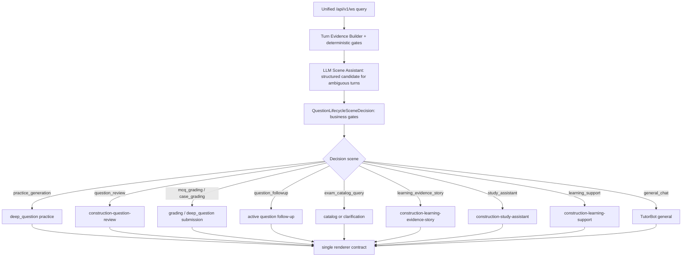

# DeepTutor Question Lifecycle Authority Consolidation Plan

> **For agentic workers:** REQUIRED SUB-SKILL: Use `superpowers:subagent-driven-development` for implementation batches and `root-cause-debugging` for every failing scenario. Steps use checkbox (`- [ ]`) syntax for tracking.

**Goal:** 收敛鲁班智考统一 query 入口下的题目生命周期单一权威，让 `QuestionLifecycleSceneDecision` 成为唯一业务裁判，让 TutorBot / deep_question / exact RAG / renderer 降级为执行者或证据提供者。

**Architecture:** `ChatOrchestrator` 每轮先收集 deterministic facts 并执行 hard gates；只有在低信息或模糊语义场景中，LLM scene assistant 才输出结构化候选。最终由 business gates 生成唯一 `QuestionLifecycleSceneDecision`。所有下游只读 decision；真正的教学输出交给 `construction-question-review`、`construction-learning-evidence-story`、`construction-study-assistant`、`construction-learning-support` 等 fat skills。

**Tech Stack:** Python runtime / `deeptutor/runtime/orchestrator.py` / `deeptutor/services/question_lifecycle_skills.py` / TutorBot skills / deep_question capability / Langfuse trace metadata / pytest.

**Implementation status (2026-05-26):**

- Tasks 1-6 are implemented in `/private/tmp/deeptutor-question-review-anchor-fix-20260526` and verified locally.
- Task 7 production matrix is release-stage validation. Health probes passed, but WeChat production matrix and Langfuse trace inspection require merge/deploy of this worktree and must not be marked complete before that.

---

## 1. Current Situation

This plan is a corrective consolidation on top of:

- `docs/plan/2026-05-24-deeptutor-question-lifecycle-skill-authority-execution-plan.md`
- `docs/plan/2026-05-22-luban-learning-state-inference-engine-transformation-plan.md`
- `docs/plan/2026-05-23-luban-learning-history-evidence-closed-loop-plan.md`

The current implementation has valuable pieces:

- `QuestionLifecycleSceneDecision` exists and can classify scenes such as `question_review`, `practice_generation`, `mcq_grading`, `learning_evidence_story`, `study_assistant`, and `learning_support`.
- LLM scene assistant can act as semantic candidate advisor.
- TutorBot skill pack exists, including `construction-question-review`, `construction-learning-evidence-story`, `construction-study-assistant`, and `construction-learning-support`.
- `deep_question` can generate interactive practice questions and render non-interactive review cards.

The remaining problem is authority drift:

- TutorBot exact-question fast path can override `question_review` and output `阅卷结论` without first anchoring the stem and options.
- Stale `active_object` / `question_followup_context` can steal requests such as `我最近哪里错`, sending them back to `deep_question`.
- `turn_runtime`, TutorBot, deep_question, exact RAG, response mode, and renderer still contain local intent guesses.
- Langfuse traces may show only partial `question_lifecycle_scene`, not the complete decision, candidate, gate, and blocked reason.

## 2. One Business Fact

Every user turn in the unified query entry must resolve one and only one business fact:

> What is the learner trying to do in this turn: generate practice, review a concrete question, submit an answer, ask a follow-up about the active question, query an exam catalog, inspect learning evidence, get a study plan, ask for learning support, or ask a general construction question?

The canonical owner of this fact is `QuestionLifecycleSceneDecision`.

## 3. Single Authority Contract

### 3.1 Writer

`ChatOrchestrator` writes the authoritative decision once per turn through `resolve_question_lifecycle_scene_decision(...)`.

Allowed projections after that point:

- trace metadata may mirror the already-resolved scene for observability
- skill loaders may read the scene to choose instructions
- legacy compatibility helpers may preserve an existing scene but must not derive a new one on the main `/api/v1/ws` path

They are not allowed to become route authority or last-writer-wins scene authority.

### 3.2 Inputs

The decision may consume:

- raw user message
- normalized active question object
- recent turn summary
- complete stem/options presence
- answer submission evidence
- low-information exam query evidence
- exact RAG candidate evidence
- teaching mode
- LLM scene assistant candidate

### 3.3 Final Authority

`QuestionLifecycleSceneDecision` is final. LLM output is a candidate, not authority.

### 3.4 Readers

Downstream readers may only consume the decision:

- TutorBot runtime
- deep_question
- exact RAG fast path
- response mode policy
- renderer / frontend view model
- Langfuse / surface events

They must not re-derive scene from regex or RAG hits.

## 4. Demote Or Delete Competing Authorities

| Competing point | Current risk | Required change |
| --- | --- | --- |
| `turn_runtime` | May preserve partial old scene metadata only | Evidence builder and trace propagator only |
| `ChatOrchestrator` legacy selector | Can select capability from old regex path | Runs only after lifecycle decision says no lifecycle scene |
| preselected TutorBot | Can bypass question lifecycle | Must not run before lifecycle decision |
| TutorBot exact fast path | Can output `阅卷结论` for `question_review` | Must skip exact-authority override when decision scene is `question_review` |
| deep_question active context | Can steal learning evidence / support turns | Must yield to `learning_evidence_story`, `study_assistant`, `learning_support` |
| RAG exact candidate | Can treat low-info query as concrete question | Must obey `required_anchor_status` and `exact_question_blocked_reason` |
| renderer | Can infer interactive card from options | Must read structured presentation type |

## 5. Canonical Flow



## 6. Red-Line Behavior Matrix

These cases are release gates, not optional manual checks.

| Input | Expected authority | Required output |
| --- | --- | --- |
| `2025真题` | `exam_catalog_query` / clarification | Directory or choices; no `标准答案`, no `阅卷结论`, no exact question claim |
| `防水真题` | `exam_catalog_query` / clarification | Same as above |
| `分析一道钢筋保护层真题` | `question_review` | 原题命中时先给 stem 和 A/B/C/D，再给答案、解析、逐项分析、采分点、易错点、口诀；无原题但有相似题库/RAG 来源时，生成并明确标注 source-backed 变式讲评卡；无相似来源时再要求补完整题干/选项 |
| `分析一道2025真题` | `question_review` only if concrete candidate has stem/options | Must anchor stem/options before analysis |
| `用3道题训练项目质量计划管理` | `practice_generation` | Three submit-able questions; no answer reveal |
| `再出3题练地下防水` | `practice_generation` | More practice questions; no review mode |
| `我选B` with active question | `mcq_grading` | Grade current active question |
| `我选B` without active question | `needs_clarification` | Ask which question to grade |
| `2025真题` while `active_capability=deep_question` | `needs_clarification` | Clarification/default TutorBot path; old deep_question context must not steal the turn |
| `我选B` while `active_capability=deep_question` but no active question | `needs_clarification` | Ask which question to grade; do not fabricate grading |
| `这题为什么B不对` with active question | `question_followup` | Explain the same active question |
| `我答B，再出3题` | compound turn | Grade B first; next action is practice generation |
| `q1 A, q3 C, q5 B` | batch grading | Preserve referenced item IDs; do not silently remap q5 to q3 |
| stale active object after question rotation | anchor gate | Do not grade against the wrong prior question |
| resume/replay of a resolved turn | decision snapshot | Reuse recorded decision metadata; do not re-run LLM and change scene |
| deterministic submission evidence conflicts with LLM candidate | deterministic gate wins | LLM candidate is logged but cannot override active-answer evidence |
| `2025真题第15题` without stem/options | missing anchor | Ask for stem/options or offer catalog lookup; no exact answer explanation |
| `我最近哪里错` | `learning_evidence_story` | Learning evidence story with evidence refs; no raw private chat text |
| `今天学什么` | `study_assistant` | Uses `study_plan` / `training_intent` |
| `我学不动了` | `learning_support` | Emotional support without pressure and without forced practice |
| `拿一道钢筋保护层题给我讲透` | `question_review` | Same anchored review contract |
| `横道图和网络图有什么区别` | `general_chat` | Concept explanation; no practice/review/grading card |

## 7. Implementation Tasks

### Task 1: Make lifecycle decision the preselected-capability gate

**Files:**

- Modify: `deeptutor/runtime/orchestrator.py`
- Test: `tests/runtime/test_orchestrator_autoroute.py`

- [x] **Step 1: Write failing tests**

Add tests proving:

- `分析一道钢筋保护层真题` routes to `deep_question` review even when stale `active_object` exists.
- `我最近哪里错` routes to TutorBot learning evidence story even when `active_capability=deep_question`.
- `我学不动了` routes to TutorBot learning support even when a question card exists.
- `2025真题` with `active_capability=deep_question` routes to clarification/default TutorBot, not stale deep_question.
- `我选B` without active question routes to clarification/default TutorBot, not fabricated grading.

Run:

```bash
python -m pytest tests/runtime/test_orchestrator_autoroute.py::test_orchestrator_new_review_request_replaces_stale_active_question tests/runtime/test_orchestrator_autoroute.py::test_orchestrator_learning_evidence_story_overrides_stale_question_context -q
```

Expected before implementation: FAIL with selected capability `tutorbot` or `deep_question` in the wrong place.

- [x] **Step 2: Implement minimal routing authority**

In `_select_capability`, handle lifecycle scenes before `context.active_capability`:

- `question_review` prepares free-text review context and suspends stale active question when the user asks for a new review.
- `practice_generation` prepares practice context.
- `learning_evidence_story`, `study_assistant`, and `learning_support` route to default chat/TutorBot with skill metadata intact.
- `needs_clarification` / blocked decisions route to default chat/TutorBot before preselected capability or legacy selector.
- Add an emergency kill-switch `QUESTION_LIFECYCLE_DECISION_AUTHORITY=0` (default on) for rollback only; it must not default-disable the main path.

- [x] **Step 3: Verify**

Run:

```bash
python -m pytest tests/runtime/test_orchestrator_autoroute.py -q
```

Expected: PASS.

### Task 2: Demote TutorBot exact authority during question review

**Files:**

- Modify: `deeptutor/tutorbot/agent/loop.py`
- Test: `tests/core/test_capabilities_runtime.py`

- [x] **Step 1: Write failing tests**

Add tests proving:

- `_maybe_run_exact_rag_fast_path(...)` returns `None` and does not call RAG when `runtime_metadata.question_lifecycle_scene == "question_review"`.
- `_run_agent_loop(... allow_exact_authority_override=True ...)` does not replace the model/skill response with `## 阅卷结论` for `question_review`.

Run:

```bash
python -m pytest tests/core/test_capabilities_runtime.py::test_tutorbot_fast_path_skips_exact_authority_for_question_review tests/core/test_capabilities_runtime.py::test_tutorbot_agent_loop_does_not_exact_override_question_review -q
```

Expected before implementation: FAIL with `阅卷结论` or RAG call.

- [x] **Step 2: Implement exact authority gate**

Add a single helper:

```python
@staticmethod
def _is_question_review_scene(runtime_metadata: dict[str, Any] | None) -> bool:
    return str((runtime_metadata or {}).get("question_lifecycle_scene") or "").strip() == "question_review"
```

Use it to block:

- `_maybe_run_exact_rag_fast_path`
- `_run_agent_loop` exact authority override
- direct `allow_exact_authority_override` calculation
- any downstream write-back of `metadata["question_lifecycle_scene"]`; TutorBot loop may read decision and record skill trace, but must not overwrite scene.

- [x] **Step 3: Verify**

Run:

```bash
python -m pytest tests/core/test_capabilities_runtime.py::test_tutorbot_agent_loop_forces_exact_authority_response tests/core/test_capabilities_runtime.py::test_tutorbot_fast_path_skips_exact_authority_for_question_review tests/core/test_capabilities_runtime.py::test_tutorbot_agent_loop_does_not_exact_override_question_review tests/core/test_capabilities_runtime.py::test_tutorbot_agent_loop_respects_exact_question_blocked_reason -q
```

Expected: existing exact authority still works outside `question_review`; question review no longer gets overwritten.

### Task 3: Make question-review output anchored and skill-shaped

**Files:**

- Modify: `deeptutor/capabilities/deep_question.py`
- Test: `tests/capabilities/test_deep_question_question_review.py`

- [x] **Step 1: Write failing test**

Assert a bank-hit review response includes:

- concrete question number
- stem
- A/B/C/D options
- correct answer
- analysis key points
- option-by-option analysis
- scoring points
- pitfalls
- memory cue

Run:

```bash
python -m pytest tests/capabilities/test_deep_question_question_review.py::test_question_review_bank_hit_renders_non_interactive_review_card -q
```

Expected before implementation: FAIL because response only has answer/explanation or lacks scoring points.

- [x] **Step 2: Implement anchored review rendering**

In review mode, render learner-facing sections from metadata if available. If metadata is incomplete, use conservative fallback text based on the concrete stem and correct answer. Do not fabricate source claims.

- [x] **Step 3: Verify**

Run:

```bash
python -m pytest tests/capabilities/test_deep_question_question_review.py -q
```

Expected: PASS.

### Task 4: Propagate full lifecycle observability

**Files:**

- Modify: `deeptutor/services/session/turn_runtime.py`
- Test: `tests/services/observability/test_turn_runtime_observer_event.py`

- [x] **Step 1: Write failing test**

Assert `_summarize_assistant_events(...)` preserves:

- `question_lifecycle_decision`
- `decision_source`
- `scene_confidence`
- `required_anchor_status`
- `exact_question_blocked_reason`
- `selected_skill_names`
- `llm_scene_candidate`
- `business_gate_result`

Run:

```bash
python -m pytest tests/services/observability/test_turn_runtime_observer_event.py::test_assistant_event_summary_keeps_lifecycle_decision_metadata -q
```

Expected before implementation: FAIL with missing keys.

- [x] **Step 2: Implement summary propagation**

Extend `_summarize_assistant_events` to copy lifecycle decision metadata from result event metadata and nested metadata. Then include those keys in final observation metadata.

- [x] **Step 3: Verify**

Run:

```bash
python -m pytest tests/services/observability/test_turn_runtime_observer_event.py -q
```

Expected: PASS.

### Task 5: Close batch answer and compound-turn gaps

**Files:**

- Inspect first: `deeptutor/services/question_lifecycle_skills.py`
- Inspect first: `deeptutor/capabilities/deep_question.py`
- Test: `tests/runtime/test_orchestrator_autoroute.py`
- Test: add or extend a focused grading test under `tests/capabilities/`

- [x] **Step 1: Write failing tests**

Add tests for:

- `q1 A, q3 C, q5 B` must not silently remap `q5` to `q3`.
- `我答B，再出3题` grades first, then records a follow-up generation action.

Run:

```bash
python -m pytest tests/runtime/test_orchestrator_autoroute.py -q
```

Expected before implementation: FAIL if references are silently remapped or compound action is dropped.

- [x] **Step 2: Implement only at the canonical parser**

Fix the submission parser / lifecycle decision path, not the renderer. Missing item IDs should become clarification or partial grading with explicit unmatched refs.

- [x] **Step 3: Verify**

Run:

```bash
python -m pytest tests/runtime/test_orchestrator_autoroute.py tests/capabilities/test_deep_question_question_review.py -q
```

Expected: PASS.

### Task 6: Add a release-gate eval suite for lifecycle authority

**Files:**

- Create or extend: `tests/services/test_question_lifecycle_acceptance.py`
- Modify only if needed: `scripts/check_contract_guard.py`

- [x] **Step 1: Add matrix tests**

Cover every case in Section 6. Each test should assert:

- decision scene
- required anchor status
- selected skill names
- exact-question block reason when relevant
- no answer reveal when not allowed

- [x] **Step 2: Add guard against new competing authorities**

The guard should fail if new code writes `question_lifecycle_scene` outside approved writer/adapters, or if TutorBot/deep_question directly call scene derivation in execution paths.

- [x] **Step 3: Verify**

Run:

```bash
python scripts/check_contract_guard.py
python -m pytest tests/services/test_question_lifecycle_acceptance.py tests/runtime/test_orchestrator_autoroute.py -q
```

Expected: PASS.

### Task 7: Production validation

**Files:**

- Create QA evidence if performing deploy validation: `docs/qa/YYYY-MM-DD-question-lifecycle-authority-canary.md`

- [ ] **Step 1: Deploy only after code review and tests pass**

Do not deploy from a dirty worktree. Do not add a feature flag that disables the main path.

- [x] **Step 2: Run health probes**

```bash
curl -fsS https://test2.yousenjiaoyu.com/healthz
curl -fsS https://test2.yousenjiaoyu.com/readyz
```

Expected: both return 200.

- [ ] **Step 3: Run production scenario matrix**

Use the Section 6 input list in WeChat DevTools or real device.

- [ ] **Step 4: Verify Langfuse traces**

Every tested turn must include:

- `question_lifecycle_decision`
- `decision_source`
- `llm_scene_candidate`
- `business_gate_result`
- `required_anchor_status`
- `exact_question_blocked_reason` when blocked
- `selected_skill_names`

Expected: no trace shows `question_review` converted into `阅卷结论` by exact authority.

## 8. Non-Goals

- Do not create a second learner memory.
- Do not create a second recommendation authority.
- Do not create a new public endpoint.
- Do not add a dedicated TutorBot WebSocket.
- Do not move teaching policy into frontend.
- Do not make LLM the final router.
- Do not use regex as the primary intent authority.

## 9. Acceptance Criteria

The plan is complete only when:

1. `QuestionLifecycleSceneDecision` is the only route authority for lifecycle scene; downstream trace/skill projections must mirror it and may not derive a new scene on the main path.
2. TutorBot exact authority cannot override `question_review`.
3. Stale active question cannot steal learning evidence, study plan, or support requests.
4. Question review always anchors stem and options before answer analysis.
5. Low-information exam queries never become exact-question answer explanations.
6. Batch answer references are not silently rewritten.
7. Langfuse trace proves candidate, gate, decision, and selected skills.
8. The Section 6 matrix passes locally and on production.

## 10. Current Known Uncertainties

1. **Long-context mixed intent stability**

   Example: `我答B，再出3题`. This needs a compound-action contract rather than more regex.

   Verification: add a deterministic parser test and one live LLM trace test.

2. **LLM proposal latency / failure**

   LLM scene assistant is advisory. Failure, timeout, malformed JSON, or low confidence must degrade to deterministic gate results (`general_chat`, `needs_clarification`, or blocked reason) without blocking the turn.

   Verification: inject an LLM exception and assert no exception escapes, decision metadata is still emitted, and p95 latency budget remains within the release gate.

3. **Resume / replay stability**

   A resumed turn must reuse the persisted decision snapshot where available. It must not re-run LLM scene proposal and silently change scene.

   Verification: replay a stored decision payload and assert selected scene / blocked reason remain byte-stable.

4. **Emergency rollback**

   `QUESTION_LIFECYCLE_DECISION_AUTHORITY=0` is an emergency kill-switch only. Default is enabled. It exists to stop a bad production route quickly; normal release validation must run with the authority path enabled.

5. **RAG exact candidate quality**

   For `分析一道2025真题`, retrieval may find multiple candidates. The business gate must require a concrete stem/options anchor before review.

   Verification: inspect exact candidate metadata in Langfuse and assert `required_anchor_status`.

6. **Renderer auto-card behavior**

   Some non-interactive review text with options can be misread by frontend as submit-able practice.

   Verification: front-end should consume explicit presentation type, not infer from options.

## 11. Suggested Commit Boundaries

- `fix: route lifecycle scenes before stale active context`
- `fix: prevent exact authority override during question review`
- `feat: render anchored construction question reviews`
- `feat: preserve lifecycle decision trace metadata`
- `test: add question lifecycle authority acceptance matrix`
