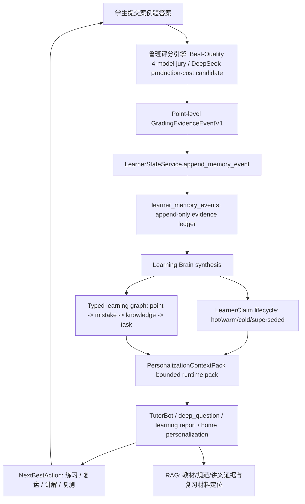

# 鲁班评分引擎 × Learning Brain 融合方案 v0

> Status: `Proposed v0.2`（2026-06-03 起草，2026-06-04 收口）。
> 本方案回答一个具体问题：鲁班评分引擎产出的采分点级证据，如何进入 Learning Brain，形成长期、可审计、可压缩、可运维的个性化教学闭环。
> 边界：不新增第二套 learner memory，不新增第二套 RAG，不新增 GBrain runtime，不把离线 shadow 结果直接宣称为生产门。
> 术语说明：本文中的 `GradingEvidenceEventV1`、`LearnerClaim`、`PersonalizationContextPack` 是 **existing container 内的 JSON payload / projection contract**，不是新增数据库 schema、不是新表、不是新 runtime authority。
>
> **v0.2 收口（权威唯一化）**：本计划**吸收并取代** `2026-06-03-luban-gbrain-deep-absorption-personalization-execution-plan.md`。此前两份同日计划在 claim lifecycle、`PersonalizationContextPack`、`next_best_action.py` 上并行定义同一批 canonical 落点，违反 Plan Directory Discipline「不要并行制造第二套主线」。自 v0.2 起，**本计划是 Learning Brain 个性化引擎的唯一主线 authority**；gbrain 计划标记 `Superseded`，仅作为 GBrain 源码概念吸收的研究记录保留。被吸收的 canonical 制品清单见 §0.0。
>
> 🚦 **实施策略：按评分来源解耦（2026-06-04 eng review D2，采纳 codex 对抗审查）**：**不把整条 loop 绑死在 DeepSeek 案例题评分器过门之上**。改为按 `engine.gate_status` 分流：MCQ、assessment、人工确认案例题、既有 v1 production 事件**现在就走 production loop**（验证 pack/report/practice/retest/降级/证据点击链）；**case-study list_rule 保持 shadow**，等评分器从 WEAK-GO 升到 production（见 `2026-06-03-luban-deepseek-production-shadow-v0-plan.md` 与 consensus-gold protocol §14-§16）再扩大案例题自动写权。
> 🧠 **模型分工修订（2026-06-04）**：DeepSeek gate **只约束 DeepSeek 单模型何时获得生产低成本自动写权**，不得阻塞当前打造期用 GPT5.5 + Opus4.8 + DeepSeek + Qwen3.7 四模型 Best-Quality jury 建设评分标准、证据链、teacher-review draft、GBrain pack/claim/next-action 与学员可解释体验。当前能力上限 = `Best-Quality 4-model jury`；未来生产成本线 = `DeepSeek production-cost grader`；Learning Brain 写权仍按 `engine.gate_status`、`artifact_status`、`teacher_final` 分流。
> **Phase 0/0A 必须现在就建，不得延后**——它就是 shadow 隔离的安全网：统一 eligibility helper + write-time 隔离 + 全读路径过滤 + mixed-claim 语义 + 全读面不变量 golden（详见 §6.1-1）。codex 论点（已采纳）：越等越危险——若因评分器未过门而不建隔离层，系统就没有统一 gate helper、没有读侧过滤、没有 shadow fixture，一旦有人先接 shadow writeback，污染面巨大。先把安全网建好，再按来源放量。

## 0.0 单一主线 authority 与被吸收的 canonical 制品

本计划同时拥有三段链路的唯一定义权与实现权：**上游**（评分引擎→证据桥）、**中游**（claim/pack/next-best-action，从 gbrain 计划吸收）、**下游**（微信学情页世界级表达）。中游制品的 canonical 落点（从 gbrain 计划吸收，不得在别处重新定义）：

| canonical 文件 | 职责 | 配套测试 |
| --- | --- | --- |
| `deeptutor/services/learner_state/learning_synthesis.py` | claim lifecycle 唯一编译者（active/improving/stable/contradicted/superseded/stale/needs_retest） | `tests/services/learner_state/test_learning_synthesis.py` |
| `deeptutor/services/learner_state/personalization_context.py` | `PersonalizationContextPack` 唯一 pure builder（不读 DB，只接收 projection/intent 入参） | `tests/services/learner_state/test_personalization_context.py` |
| `deeptutor/services/learner_state/next_best_action.py` | next-best-action 唯一排序器（纯函数，over claim/typed graph/recency/`training_intent`） | `tests/services/learner_state/test_next_best_action.py` |
| `deeptutor/services/learner_state/learning_brain_lint.py` | dream-cycle 检查（unsupported/stale/contradiction/missing retest/graph gap） | `tests/services/learner_state/test_learning_brain_lint.py` |
| `scripts/run_learning_brain_dream_cycle.py` | 离线 dream cycle（先 dry-run，后 cron） | `tests/scripts/test_run_learning_brain_dream_cycle.py` |
| fixtures | 个性化 golden 用例 | `tests/fixtures/learning_brain_personalization_cases.json` |

contract 同步落点（从 gbrain 计划吸收）：`contracts/learner-state.md`（claim lifecycle + pack 定义）、`contracts/learning-report.md`（`personalization_context` / `next_best_actions` / `today_prescription` 为 learning-report v2 字段）、`contracts/rag.md`（pack 如何影响 compiled truth 检索而不成为 RAG authority）、`contracts/index.yaml`（注册以上 surface 与测试）。

change boundary（允许改）：`deeptutor/services/learner_state/*`、`deeptutor/services/rag/*`、`deeptutor/api/routers/mobile.py`、`deeptutor/capabilities/deep_question.py`、`deeptutor/tutorbot/agent/loop.py`、相关 SKILL.md、聚焦测试。**禁止**：第二聊天路由、独立 gbrain runtime、第二向量库/RAG、新 learner profile 表（除非后续 scale gate 证明 JSON projection 不够）、notebook 卡片直接改 mastery、前端排序成为推荐 authority。

verification target（采样一个 learner 必须能答全 6 问，缺一即吸收未完成）：我们相信这个 learner 什么、哪些证据支撑、最近变了什么、下一步做什么、为什么是现在、怎么知道有效。

## 0. 执行摘要

1. **鲁班评分引擎不是 Learning Brain 的替代品。**它是高质量学习证据生产器；Learning Brain 是学员状态、时间衰减、复测和下一步行动的决策层。
2. **现有系统已经有闭环雏形**：`construction_grading.learning_evidence` 能把批改结果转成 `learning_evidence`，`writeback.py` 已走 `LearnerStateService.append_memory_event(... memory_kind="learning_evidence")`，`home_personalization.py` 已能从近期学习事件恢复首页投影。
3. **当前差距不是“没有记忆”，而是记忆还不够 typed、time-aware、claim-based。**它能记最近错了什么，但还没有把长期“反复漏项、已修复、复发、稳定掌握、待复测”做成硬契约。
4. **顶尖 agent memory 的共识是分层和压缩，不是无限上下文。**Letta/MemGPT 把核心记忆与外部归档分层；Zep 用 temporal knowledge graph；LangGraph 区分 semantic/episodic/procedural；OpenAI Agents SDK memory 强调 progressive disclosure；Mem0 强调持久记忆与压缩/检索。
5. **鲁班应采用“事件账本 + 学习 claim + 时间分层 + 小型 Context Pack”架构。**详细原始事件长期保留，运行时只读取 bounded `PersonalizationContextPack`。
6. **RAG 仍然有用。**评分标准和学员状态不靠 RAG 临时拼；但教材、规范、讲义、错因解释、复习资料定位仍由 RAG/知识库提供证据。
7. **后期运维必须从 v0 就设计进去**：schema version、artifact version、model run id、provenance、TTL、冷热分层、nightly lint、rebuild projection、cost/latency/pack-size guard。
8. **产品表面必须把闭环讲清楚。**世界顶尖学情页不是多几个模块，而是首屏让用户看懂“为什么今天练这个、证据来自哪里、练完如何证明变好”。学情页必须从 dashboard 升级为 Grading-to-Brain Loop 的可见证明面。
9. **最优落地路径**：先把 Best-Quality/Consensus-Gold/teacher-final 评分输出标准化为现有 `learning_evidence` payload 的扩展字段，写入现有 `learner_memory_events`；DeepSeek 单模型输出先作为 production-cost candidate 和蒸馏目标，不再作为打造期主线 blocker。再在现有 `learner_summaries.summary_structured_json.learning_brain` projection 内生成 `LearnerClaim` 与 `PersonalizationContextPack`；最后让 TutorBot、deep_question、学习报告、错题集、微信学情页都读取这一个 pack。
10. **交付策略必须先纵切、再扩面。**不要一次性铺满全部智能推荐。先交付一条可证明的端到端链路：一次案例题批改 -> 一条证据事件 -> 一个 claim -> 一个 pack -> 学情首屏一个 action -> 一次训练/复测 -> 一条变化证明。

## 1. 外部记忆架构调研结论

| 来源 | 可吸收思想 | 对鲁班的翻译 |
| --- | --- | --- |
| Letta / MemGPT memory docs: https://docs.letta.com/guides/agents/memory | 核心记忆在上下文内，归档记忆在上下文外；上下文窗口是稀缺资源 | 运行时只放当前最相关学习状态，历史明细留在事件账本和索引里 |
| Letta archival memory: https://docs.letta.com/guides/ade/archival-memory | 长期记忆可扩展到大量条目，但需要工具检索，不直接塞 prompt | 采分点历史、错题明细、教材证据可长期存储，按问题检索 |
| Zep concepts: https://help.getzep.com/v2/concepts | temporal knowledge graph，把用户事件融合成有时间关系的图 | 学员弱点、知识点、题型、错因、复测结果都要带时间边 |
| LangGraph memory overview: https://docs.langchain.com/oss/python/langgraph/memory | 长期记忆分 semantic、episodic、procedural | 鲁班分为知识事实、作答经历、学习策略/评分策略三类 |
| OpenAI Agents SDK memory: https://openai.github.io/openai-agents-js/guides/sandbox-agents/memory | progressive disclosure：先注入小 summary，再按需打开更细记录；记忆可能过期，要信当前环境 | TutorBot 每轮先拿小型 `PersonalizationContextPack`，需要时再点开证据 |
| OpenAI Agents SDK sessions: https://openai.github.io/openai-agents-js/guides/sessions/ | session 管短期对话历史；长期 memory 与 session memory 分开 | 对话上下文不是学情长期真相，学情必须写入 learner-state 事件流 |
| Mem0 overview: https://docs.mem0.ai/overview | 持久记忆层让系统跨会话持续学习用户 | 鲁班要让每次批改都沉淀成可复用的个性化证据 |

共识不是“记得越多越好”，而是：

1. 原始事件 append-only。
2. 稳定事实被编译成 claim。
3. 运行时只拿 bounded pack。
4. 老事件被压缩、聚合、降权，但可追溯。
5. 记忆要有时间、来源、置信度、冲突和过期状态。

## 2. 当前代码现状

### 已有能力

| 能力 | 证据 | 评价 |
| --- | --- | --- |
| 批改结果转学习证据 | `deeptutor/services/construction_grading/learning_evidence.py` | 已能输出 `rubric_items`、`rubric.scoring_points`、`evidence_refs`、`error_events`、`typed_edges`、`next_training_signal` |
| 批改证据写入长期事件流 | `deeptutor/services/construction_grading/writeback.py` | 已通过 `LearnerStateService.append_memory_event(... memory_kind="learning_evidence")` 写入，不是平行表 |
| 学员长期状态 authority | `contracts/learner-state.md` | 明确 `learner_memory_events` 是统一长期事件流，`learner_summaries.summary_structured_json.learning_brain` 是 projection |
| 首页个性化投影 | `deeptutor/services/learner_state/home_personalization.py` | 已从近期 learning events 恢复推荐，但更偏“最近一次信号” |
| GBrain 吸收路线 | `docs/plan/2026-06-03-luban-gbrain-deep-absorption-personalization-execution-plan.md` | 已提出 `PersonalizationContextPack`、claim lifecycle、next_best_action、dream-cycle lint |
| DeepSeek 评分影子路线 | `docs/plan/2026-06-03-luban-deepseek-production-shadow-v0-plan.md` | 已明确 DeepSeek 单模型 + high-risk fallback + 四模型离线 gold/policy |

### 关键短板

1. `learning_evidence` 还没有把评分引擎的 point-level typed policy 完整标准化为长期学习事件。
2. `home_personalization.py` 更像“最近信号转首页推荐”，还不是 time-aware learner model。
3. `LearnerClaim` 生命周期没有成为跨模块硬契约。
4. 错因、采分点、知识点、题型弱点之间的 typed edge 还不足以支撑稳定 next-best-action。
5. 当前运行时容易在不同 surface 各自拼上下文，缺一个唯一 `PersonalizationContextPack`。

## 3. 一等业务事实与单一 authority

### 一等业务事实

> 每一次案例题批改都产生一组可追溯的学习事实：某学员在某题、某采分点、某知识点、某评分策略下，命中/漏掉/部分命中/高风险，证据来自学生答案中的哪段文字，错因是什么，下一步应该如何复测。

### 单一 authority

| 事实 | 唯一写入 authority | 唯一持久 authority | 读取者 |
| --- | --- | --- | --- |
| 原始批改事件 | 鲁班评分引擎 normalizer | `learner_memory_events.memory_kind=learning_evidence` | synthesis、attempt detail、错题集 |
| 学习 claim | Learning Brain synthesis | `learner_summaries.summary_structured_json.learning_brain.claims` | report、TutorBot、deep_question |
| 下一步行动 | `next_best_action` read model | `learning_brain.next_actions` projection | 首页、学情页、对话入口 |
| 教材/规范依据 | RAG / knowledge source | KB chunks / compiled artifacts | 解释、复习定位、引用 |
| 用户笔记 | Notebook service | notebook card store + low-weight recall event | workspace、辅助上下文 |

禁止：

- 评分引擎直接改 `user_stats.mastery`。
- 前端根据最近错题自己算弱点。
- TutorBot wrapper 自己扫描历史事件拼画像。
- RAG 检索结果直接成为学员掌握度。
- Notebook 卡片被当作已掌握证据。

## 4. 目标架构



### 4.1 性能架构：热路径 / 温路径 / 冷路径

性能目标不是少做能力，而是把工作放到正确时机。鲁班评分引擎 × Learning Brain 必须从 v0 开始按三条路径拆分：

| 路径 | 用户是否等待 | 包含工作 | 不允许放入 |
| --- | --- | --- | --- |
| **热路径 Hot Path** | 是 | 读取题目 scoring artifact、评分引擎调用（QA 打造期可用 Best-Quality；生产成本线候选用 DeepSeek）、结构化 JSON parse、`evidence_span` 校验、exact_required high-risk fallback、返回总分/采分点反馈 | Learning Brain 全量 synthesis、RAG 临时找评分标准、长历史扫描、BI 聚合、复杂推荐生成 |
| **温路径 Warm Path** | 不阻塞首屏，但应尽快完成 | 写 `learner_memory_events`、写错题集、写 high-risk queue、刷新 `PersonalizationContextPack`、生成错因/下一步行动 | 二次改分、绕过 `LearnerStateService` 写学情 |
| **冷路径 Cold Path** | 否，离线/周期性 | `learning_synthesis`、claim lifecycle 压缩、long-term summary、dream-cycle lint、source drift audit、projection rebuild、Consensus-Gold/模型回归 | 任何用户请求热路径必需结果 |

### 4.2 可并行边界

| 阶段 | 可并行 | 必须串行 / 不得延后 |
| --- | --- | --- |
| 请求进入后 | 并行读取 scoring artifact、最近 `PersonalizationContextPack`、题目 metadata | scoring artifact 必须在模型调用前完成 |
| 模型调用前 | 预构造 prompt、预加载 artifact cache、预取解释用 RAG hints | 不得让 RAG 检索结果进入评分 authority |
| 模型返回后 | point-level 并行做 span guard、exact_required fallback、calculation validator、penalty/list consistency check | `unsupported_positive` 和 `auto_certified` 必须在返回前定稿 |
| 返回用户后 | 异步写 learner event、错题集、high-risk queue、刷新 context pack、BI/cost attribution | 原始批改结果不能等待异步学情成功才返回 |
| 离线周期 | 并行按 learner shard 跑 synthesis/lint/rebuild | 同一 learner 的 claim projection merge 必须串行或乐观锁 |

### 4.3 缓存策略

缓存只能加速读取，不能成为第二套 authority。

| 缓存对象 | Key | TTL / 失效 | 说明 |
| --- | --- | --- | --- |
| Scoring artifact cache | `question_id + artifact_version` | artifact version 变化失效 | 热路径必需；只读缓存，不改评分标准 |
| PersonalizationContextPack cache | `user_id + latest_event_id + learning_brain_hash` | 新 learning evidence 写入或 synthesis hash 变化失效 | 缓存事实层 pack，不缓存首页文案 |
| RAG source hint cache | `knowledge_node_id + source_version` | KB source hash 变化失效 | 只用于解释/复习定位，不进入评分 |
| Grader prompt prefix cache | `artifact_version + policy_version + engine_family` | policy/artifact/engine family 变化失效 | 只缓存稳定系统提示和评分协议前缀；Best-Quality 与 DeepSeek 不共用生产资格 |
| Learning Brain projection cache | `user_id + synthesis_run_hash` | 新事件或 rebuild 失效 | 读模型缓存；authoritative content 仍是 `learner_summaries.learning_brain` |

禁止：

- 缓存 `home_personalization` 的最终文案作为学习事实。
- 缓存 LLM 对学员状态的自由总结并直接复用为 mastery。
- 因缓存命中跳过 `evidence_span` / `unsupported_positive` guard。
- 用本地 JSON cache 竞争生产 Supabase learner-state authority。

### 4.4 分阶段响应

用户体验应按阶段返回，而不是等所有个性化工作完成：

1. **T0 接收确认**：300-500ms 内返回“已收到，正在按采分点批改”。
2. **T1 批改结果**：返回总分、采分点命中/漏点/partial、证据 span、high-risk 标记。
3. **T2 错因诊断**：补充漏术语、列举不全、算错、方向错、规范依据不足。
4. **T3 Learning Brain 更新**：显示“你的长期学情已更新”，附下一步行动。
5. **T4 深度复习包**：RAG 生成教材章节、讲义、规范条文和变式训练入口。

T1 是硬同步；T2 可跟随批改结果同批返回或短延迟；T3/T4 默认异步。

## 5. 核心数据结构

本节只定义 JSON 形态，不定义新表。落点必须保持如下映射：

| 逻辑结构 | 物理/持久落点 | 是否新增表 |
| --- | --- | --- |
| `GradingEvidenceEventV1` | `learner_memory_events.payload_json` 内的 `learning_evidence` 扩展字段 | 否 |
| `LearnerClaim` | `learner_summaries.summary_structured_json.learning_brain.claims` | 否 |
| `PersonalizationContextPack` | 由 Learning Brain projection + recent events 即时构造；必要时作为 projection cache 存在 `learning_brain` namespace 下 | 否 |
| 教材/规范证据 | 现有 KB/RAG source 和 compiled artifacts | 否 |

### 5.1 `GradingEvidenceEventV1`（现有扁平 payload 的扩展，非新结构）

> **v0.2 澄清（消除 schema 形状冲突）**：现有 `build_learning_evidence_payload(...)`（`deeptutor/services/construction_grading/learning_evidence.py:61`）产出的是**扁平** payload：顶层 `schema_version`（整数 `1`）、`score_awarded`/`max_score`/`score_ratio` 平铺、`rubric.scoring_points[]` / `rubric.scoring_point_hits[]`、`rubric_items[]`、`evidence_refs[]`、`typed_edges[]`、`quality{}`。`GradingEvidenceEventV1` **不是另一套树**，而是在这套扁平 payload 上**新增 point-level 与 engine 字段**，`schema_version` bump 为整数 `2`。**禁止**引入字符串命名空间（如 `grading_evidence_event.v1`），否则会击穿 `build_learning_evidence_dedupe_key`（:105）与现有 quality gate 测试。

新增字段落点（在现有扁平 payload 上叠加，下例只高亮 v2 新增项，未列出的现有字段一律保留原位）：

```jsonc
{
  "schema_version": 2,                       // 整数，由 1 bump 到 2（不是字符串）
  "event_type": "learning_evidence",         // 现有，保留
  "source": "construction_grading",          // 现有，保留
  "question_id": "Q10",                      // 现有，保留
  "question_type": "case",                   // 现有，保留
  "subject_id": "construction_exam_1",       // v2 新增（顶层，用于跨学科分键，见 §6）
  "score_awarded": 7.5,                      // 现有扁平字段，保留（不改成 score.awarded）
  "max_score": 10,                           // 现有，保留
  "score_ratio": 0.75,                       // 现有，保留
  "engine": {                                // v2 新增：评分引擎 provenance + 生产门状态
    "name": "luban_grading_engine",
    "model": "deepseek-v4-flash",
    "model_run_id": "run_20260603_001",
    "artifact_version": "grading_artifact_2026_v0",
    "policy_version": "policy_2026_v0",
    "gate_status": "shadow"                   // shadow | human_confirmed | production（硬隔离键，见 §6）
  },
  "rubric": {                                // 现有 block，v2 在 scoring_point_hits[i] 上叠加 point-level 新字段
    "rubric_mode": "grading_key",            // 现有
    "scoring_points": [ /* 现有 specs，保留 */ ],
    "scoring_point_hits": [
      {
        "point_id": "Q10-P4",                // 现有
        "hit": false,                        // 现有（沿用 bool；partial 由 awarded_score < max_score 表达）
        "awarded_score": 0.5,                // 现有
        "miss_reason": "...",                // 现有
        "evidence_text": "普通钢筋调直机",      // 现有（= evidence_span）
        // ↓ v2 新增 point-level 字段
        "policy_type": "exact_required",
        "knowledge_node_id": "1A432000",
        "required_terms": ["数控钢筋调直切断机"],
        "unsupported_positive": false,
        "auto_certified": false,
        "high_risk_review": true,
        "review_reason": "near_synonym_rationale",
        "mistake_type": "near_synonym_not_exact_term",
        "provenance": {
          "official_answer_id": "Q10-official-2026",
          "source_chunk_id": "1A432000_...",
          "source_quote": "数控钢筋调直切断机...",
          "content_hash": "sha1:..."
        }
      }
    ]
  }
  // rubric_items[]、evidence_refs[]、error_events[]、typed_edges[]、quality{} 等现有字段全部原位保留
}
```

**Phase 0 验收硬门（v0.2 新增）**：

1. 扩展后，现有 `tests/services/construction_grading/test_learning_evidence*.py` 与 `tests/services/learner_state/test_learning_evidence_quality_gate.py` **全绿**。
2. `build_learning_evidence_dedupe_key` 行为**不变**（新增字段不进 dedupe key，除非显式纳入并更新 golden）。
3. `engine.gate_status` 为必填（仅对 v2 新写）；缺失即 fail-closed，不写 ledger。
4. **遗留 v1 事件读取规则（eng review C1，2026-06-04 补）**：ledger 里已有的 `schema_version=1` 事件没有 `engine.gate_status` 与 point-level policy 字段。synthesis 读到 v1 事件时，必须按**显式规则**处理，不得崩或静默丢：v1 事件视为 `gate_status=production`（它们是 shadow 机制引入前、已上线路径产出的评分，非未过门 shadow），但 point-level 新字段缺失时按 keyword-only 粒度降级，不伪造 policy_type。该规则需有 golden 测试覆盖 v1/v2 混读。

### 5.2 `LearnerClaim`

Learning Brain 不应该每次重新读所有历史，而是把事件编译成 claim。claim 是 `learning_brain` projection 的内部对象，不是新 master table。

```jsonc
{
  "claim_id": "claim_u123_1A432000_exact_required",
  "claim_type": "weakness | mastery | misconception | recovery | relapse",
  "object_type": "knowledge_node | scoring_point | policy_type | mistake_type",
  "object_id": "1A432000",
  "status": "active | improving | stable | contradicted | superseded | stale | needs_retest",
  "evidence_level": "L0_observed | L1_repeated | L2_verified | L3_stable",
  "confidence": 0.82,
  "first_seen_at": "2026-06-01T10:00:00+08:00",
  "last_seen_at": "2026-06-03T12:00:00+08:00",
  "last_retested_at": null,
  "recency_score": 0.94,
  "stability_score": 0.41,
  "evidence_refs": ["event_1", "event_2"],
  "contradiction_refs": [],
  "next_action_hint": "retest_exact_required_term"
}
```

### 5.3 `PersonalizationContextPack`

运行时只读取这个小包，不读取全历史。pack 是 read model / projection contract，不拥有写 authority。

```jsonc
{
  "schema_version": "personalization_context_pack.v1",
  "user_id": "u_123",
  "generated_at": "2026-06-03T12:05:00+08:00",
  "budget": {
    "max_claims": 8,
    "max_recent_events": 5,
    "max_chars": 6000
  },
  "current_focus": {
    "title": "精确术语表达",
    "reason": "近 3 次案例题在 exact_required 点出现近义替代"
  },
  "top_claims": [
    {
      "claim_id": "claim_u123_exact_required",
      "summary": "容易用近义/大白话替代规范术语",
      "status": "active",
      "evidence_refs": ["event_1", "event_2"]
    }
  ],
  "recent_changes": [
    "上次复测 list_rule 已改善，但 exact_required 仍需复测"
  ],
  "next_best_actions": [
    {
      "action_type": "targeted_practice",
      "target": "exact_required_terms",
      "why_now": "近期高风险点被拦截，且未复测",
      "evidence_refs": ["event_2"],
      "success_measure": "下一次 exact_required auto_certified=true 且无 high_risk_review"
    }
  ],
  "rag_hints": {
    "knowledge_nodes": ["1A432000"],
    "source_groups": ["compiled_learning_truth", "textbook_2026"]
  }
}
```

## 6. 时间分层与压缩策略

这部分是防止“越用越卡、上下文爆炸”的核心。

| 层 | 内容 | 细度 | 默认窗口 | 存放位置 | 运行时是否直接注入 |
| --- | --- | --- | --- | --- | --- |
| Hot | 最近作答、最近错因、未复测高风险点 | point-level | 最近 7 天或最近 10 次 attempt | `learner_memory_events` + pack projection | 少量注入 |
| Warm | 反复出现的知识点弱项、题型弱项、错因模式 | claim-level | 7-60 天 | `learning_brain.claims` | 注入 top claims |
| Cold | 长期稳定掌握、长期稳定短板、阶段性总结 | summary-level | 60 天以上 | `learning_brain.long_term_summary` | 只在相关时注入 |
| Archived | 原始历史明细、旧模型输出、过期 projection | append-only audit | 永久/按合规策略 | event ledger / object storage | 不注入，只可追溯 |
| Superseded | 已被新证据推翻的旧判断 | claim tombstone | 永久保留索引 | claim history | 不注入，除非解释变化 |

关键规则：

1. **不删除真相，只减少运行时可见度。**旧事件仍在 ledger，可审计、可重建。
2. **近期记细，长期记结论。**最近 7 天保留 point-level；更久历史聚合成 claim。
3. **复测会改变 claim 状态。**一次正确不直接 mastery；连续正确且跨题型才稳定掌握。
4. **遗忘不是删除，而是降权。**长时间未出现的弱点变 `stale` 或 `needs_retest`。
5. **冲突必须显式存在。**新证据推翻旧 claim 时，旧 claim 变 `superseded`，不能悄悄覆盖。

### 6.1 v0.2 新增的四条硬规则（防生产事故）

1. **shadow 评分隔离（最高优先，eng review + codex 对抗审查加强）。**只在 synthesis 跳过 shadow **远远不够**——codex 读码证明真实泄漏点在 write-time 与多条绕开 synthesis 的读路径。隔离必须**三层同时做**，否则等于没做：
   - **统一 eligibility authority（单一 helper）**：新增唯一 `is_claim_eligible_evidence(event)`（落 learner_state，判 `gate_status in {production, human_confirmed}`），所有写/读/projection 都调它，**禁止各处各判**（否则又是第二套 authority）。
   - **write-time 隔离（第一泄漏点）**：`writeback.py` 必须在 payload 写出 `engine.gate_status`；`gate_status=shadow` 的事件**不得**触发错题本写入、`home_personalization` 首页投影刷新、mastery 累加——这些副作用现发生在 synthesis 之前（`writeback.py:55/252` → ledger + 错题本 + home projection），不堵这里 shadow 会在 synthesis 之前就泄漏到首页和错题本。
   - **read-time 全路径过滤**：以下读路径全部按 `is_claim_eligible_evidence` 过滤，shadow 只进 `needs_confirmation/shadow_stats`，不得提升 claim/action/mastery：`learning_synthesis`（`_is_learning_evidence`）、`learning_report_read_model`（`list_learning_evidence_events` → progress/diagnoses/truth_sections/next_action/scoring_point_map/learning_state/revalidation_queue/mastery）、`home_personalization`、`mastery_estimator`、RAG `compiled_truth_source`、`deep_question` context。注意 `_compiled_truth_shadow_only` 只是文本清洗标志、**不是** grading gate，不能复用。
   - **mixed-claim 语义（原计划缺）**：同一 claim 混有 production+shadow 证据时——只有 production/human evidence 能进入 `supporting_event_ids`、recurrence、improvement、verified outcome；shadow 只进 `shadow_refs/needs_confirmation`。shadow 与 production 冲突时只生成 reviewer queue，**不得**把 claim 标 `contradicted`。shadow 后被人工确认时，**追加一条 human_confirmation event**，而不是原地把 shadow event 提升。
   - **全读面不变量 golden（codex #10，取代「补一条 fixture」）**：单个 golden learner 含 `production + shadow + human_confirmed + missing_gate_status_v2 + v1_legacy` 五类事件，断言 synthesis、report、home、scoring map、learning_state、revalidation、RAG compiled truth、deep_question context **全部**只让 eligible evidence 提升 claim/action/mastery，shadow 只出现在 `needs_confirmation/shadow_stats`。
   - 只有 `human_confirmed` / `production` 评分才能提升 claim；Phase 0B demo learner 必须用 `human_confirmed`/fixture 评分，禁止 live shadow 演示闭环。

2. **claim 状态机基于事件序、不基于到达序（幂等）。**claim 状态迁移按事件 `(last_seen_at, event_id)` 单调序判定；晚到的旧事件**不得**把 `improving/stable` 打回 `active`。synthesis 复用 `learner_summaries` 既有 version 乐观锁；同一 learner 的 claim merge 串行或乐观锁（呼应 §4.2）。验收补 golden：乱序 + 重投（outbox 重试）不回退 claim 状态。

3. **claim 与 pack 按 `(user_id, subject_id)` 分键。**`claim_id` 必须含 subject 段，pack budget 按 subject 隔离，避免一建/二建等共用 knowledge_node 命名空间时串味（项目已在 `learner_mistake_book_items` 踩过 subject 隔离坑）。Gate C 的 coverage 报告也按 subject 分组，否则覆盖率被热门科目平均掉。

4. **retest「跨题型稳定」给可操作阈值。**默认（可调，但 baseline 必须写死且其 authority 在 `learning_synthesis`，复用既有 `DECAY_PROFILES`/ARRS，不另造）：`stable := 命中 ≥2 种题型 × ≥2 次正确 × 跨 ≥1 个 decay 周期`；不满足只到 `improving`。`recency_score`/`stability_score` 是**派生量**，要么不持久化为真相、要么带计算版本号，保证 §9.3「projection rebuild 100% deterministic」成立。

## 7. Grading-to-Brain Loop

### 7.1 当前闭环与新闭环的差别

| 维度 | 当前常见闭环 | Grading-to-Brain Loop |
| --- | --- | --- |
| 批改依据 | RAG/prompt 临时组织或规则结果 | 提前编译 scoring point + typed policy + evidence span |
| 学情写回 | 题级/错因级摘要 | point-level event + mistake_type + policy_type + provenance |
| 长期记忆 | 最近错题/弱点投影 | claim lifecycle + time decay + contradiction |
| 推荐下一步 | 根据最近一次错因生成 | 基于近期信号、长期趋势、复测状态、知识图谱联合排序 |
| 上下文大小 | 容易越塞越多 | 固定预算 `PersonalizationContextPack` |
| 可运维性 | 难知道推荐为什么变 | 每个 claim/action 都有 evidence_refs |

### 7.2 事件流

1. 学生提交案例题答案。
2. 鲁班评分引擎输出 point-level JSON：命中、漏点、分数、证据、policy、错因。
3. Normalizer 生成 `GradingEvidenceEventV1`。
4. `LearnerStateService` 写入 `learner_memory_events`。
5. Learning Brain synthesis 更新 claim：
   - 新弱点
   - 复发弱点
   - 已改善弱点
   - 待复测弱点
   - 稳定掌握点
6. `next_best_action` 选择下一步：
   - targeted practice
   - explanation
   - mistake review
   - retest
   - textbook reading
7. TutorBot / deep_question / 学情页读取 `PersonalizationContextPack`。
8. 下一次作答结果反向验证 action 是否有效。

### 7.3 微信学情页的世界级表达门槛

当前模块种类基本够，缺口不在“再加模块”，而在首屏叙事和 progressive disclosure。学情页必须让用户第一眼看到一条因果链，而不是看到一组彼此并列的卡片。

世界级首屏必须固定回答四个问题：

| 首屏问题 | 必须显示的事实 | 唯一来源 | 不允许 |
| --- | --- | --- | --- |
| 今天为什么练这个 | `next_best_action.why_now` + top evidence | `PersonalizationContextPack.next_best_actions` | 前端根据最近错题自算推荐 |
| 系统判断我卡在哪里 | scoring point / policy / mistake claim | `learning_brain.claims` | 用“近 3 天做了几题”伪装掌握度 |
| 证据是什么 | attempt、answer span、rubric point、错因 | `learning_evidence` / attempt detail read model | 只给泛泛“你比较薄弱” |
| 练完如何证明变好 | `success_measure` + retest state | `next_best_action` outcome + next grading event | 只给“继续练习”按钮 |

首屏推荐结构：

1. **今日处方**：一句话行动，例如“先补 exact_required 术语表达”。
2. **证据一句话**：例如“来自 3 次作答，2 次漏掉‘附加层/收头’采分点”。
3. **采分点归因**：展示“漏了哪个采分点、答案哪段证明、为什么扣分”。
4. **闭环状态条**：`诊断完成 -> 训练中 -> 待复测 -> 已改善/稳定掌握`。
5. **主 CTA**：开始训练 / 复测 / 看解析，按钮文案必须绑定当前 action type。

详细层级遵循：

`当前状态 -> 为什么 -> 下一步做什么 -> 证据 -> 历史变化`

这条顺序优先于视觉模块平铺。用户先理解“我现在处于什么学习状态”，再打开细节证据。

### 7.4 现有学情模块的保留与重排

不要继续堆新模块。保留现有模块，但按 Grading-to-Brain Loop 重新排序和命名：

| 模块 | 新定位 | 首屏优先级 | 设计要求 |
| --- | --- | --- | --- |
| 今日处方 | 下一步行动 | P0 | 必须展示 `why_now`、`success_measure`、action type |
| 学情证据 | 推荐可信度证明 | P0 | 必须能点开 attempt / rubric / answer span |
| 错题归因 / 采分点怎么补 | 鲁班评分引擎差异化亮点 | P0 | 必须前置，不能埋在深层详情 |
| 变化记录 / 进步反馈 | Loop 是否有效的证明 | P0 | 必须显示复测前后 claim 状态变化 |
| 掌握地图 | 长期状态地图 | P1 | 展示 claim status，不以刷题量或裸百分比当 mastery |
| 今日训练 | action 执行入口 | P1 | 必须承接今日处方，不做泛练习入口 |
| 摸底测试 | 冷启动/校准入口 | P2 | 证据不足时使用，不伪造个性化 |

模块文案示例必须沿用同一因果句式：

```text
今天先补：防水节点构造
因为：你最近 3 次作答里，2 次漏掉“附加层”和“收头处理”采分点
现在做：3 道同类变式
练完证明：新题不再漏这两个采分点，状态从“待复测”变“改善中”
```

### 7.5 微信入口与验收边界

主发布面是 `yousenwebview/packageDeeptutor`；`wx_miniprogram` 只能作为 shadow / legacy reference，不能替代真实微信小程序验收。

相关页面职责：

| 页面 | 职责 |
| --- | --- |
| `pages/report/report` | Grading-to-Brain Loop 证明面：处方、证据、采分点归因、变化、复测 |
| `pages/chat/chat` | 消费同一 focus / recommended prompt，不重算学情 |
| `pages/practice/practice` | 执行处方训练，不成为第二个推荐 authority |

微信验收必须覆盖：

1. 有证据用户：首屏出现今日处方、证据一句话、采分点归因、复测目标。
2. 无证据用户：显示 starter calibration / 摸底测试，不出现伪个性化。
3. 训练后改善：变化记录显示 claim 从 `needs_retest/improving` 进入更高状态。
4. 训练后未改善：下一步 action 能换策略，而不是重复同一泛练习。
5. 冲突证据：页面显示“待复测”，不直接覆盖长期状态。
6. DevTools / 真机：无文字溢出、无卡片嵌套卡片、首屏能看到下一段内容提示。

### 7.6 真实使用场景矩阵

计划必须覆盖真实用户状态，而不是只覆盖“已有足够证据且推荐顺利”的理想路径。

| 场景 | 用户问题 | 系统应答 | 必须证明 | 失败时降级 |
| --- | --- | --- | --- | --- |
| 刚完成案例题批改 | 我错在哪里，接下来练什么 | 显示采分点命中/漏点、证据 span、今日处方 | 处方来自本次 `learning_evidence` + pack action | 若写回失败，先显示批改结果并标“学情稍后更新” |
| 首次进入学情 | 系统还不了解我怎么办 | 显示摸底/校准入口 | 不伪造证据、不展示假薄弱点 | `pack_status=starter` |
| 有重复漏点 | 为什么老让我练这个 | 展示重复错因、attempt 列表、采分点归因 | 至少 2 条 evidence_refs 支撑 L1 repeated | evidence 不足则降为“待确认” |
| 训练后改善 | 我是不是真的进步了 | 展示复测前后 claim 状态变化 | 新 grading evidence 更新 claim，而不是页面自判 | 只展示训练完成，不宣称改善 |
| 训练后未改善 | 为什么练了还没好 | 更换 action 策略，如讲解/错题复盘/复测 | action outcome 写回 canonical event | 若无 outcome，保持原 action 并标待复测 |
| 长期弱点与近期正确冲突 | 我这次做对了，为什么还说薄弱 | 显示 `needs_retest`，解释需要跨题型稳定 | 不直接覆盖长期 claim | 安排复测，不标 stable |
| 家长/老师查看 | 为什么相信这份学情 | 展示证据链、题目、采分点、答案片段、复测结果 | 可点回原始 attempt / rubric / span | 缺证据则不输出肯定性结论 |
| 对话页接续 | 我想问今天该学什么 | 使用同一个 action/prompt intent | chat prompt 携带 action_id/evidence_refs | 无 pack 则显示 starter 问法 |
| 练习页执行 | 我点开始训练后练什么 | 根据 action type/target 出题 | practice 不自排弱点 | 缺 action 时进入普通练习并标非个性化 |
| 弱网/异步延迟 | 批改后学情没更新 | 分阶段反馈 T1/T2/T3 | read-after-write 观测和 outbox 状态 | 显示“学情更新中”，不重复写事件 |
| source / rubric drift | 教材/评分标准变了怎么办 | 标记受影响 claim 待复核 | artifact/source hash 可追踪 | 受影响处方暂停或降级为复习定位 |
| 隐私/权限受限 | 不能展示答案片段怎么办 | 展示脱敏证据摘要 | 权限控制不影响 claim authority | 无权限只展示概览，不泄露 span |

任何新增页面或入口都必须能映射到上表之一；映射不上，默认不是 P0。

## 8. RAG 的位置

RAG 仍然有用，但角色要降噪：

| 任务 | 是否用 RAG | 原因 |
| --- | --- | --- |
| 判定某采分点是否命中 | 默认不用 RAG | 评分必须依赖 scoring artifact + 学生答案 span + typed policy |
| 查教材/规范原文 | 用 RAG/KB | 提供可引用来源、章节定位 |
| 解释为什么错 | 用 RAG | 把错因和教材条文连接 |
| 推荐复习章节 | 用 RAG + taxonomy | 找到教材/讲义/规范路径 |
| 学情长期状态 | 不由 RAG 写 | 由 learner events + synthesis 写 |
| 对话辅导 | 用 RAG + context pack | RAG 提供知识，context pack 提供个性化 |

一句话：**RAG 是证据和知识来源，不是评分标准，也不是学员状态 authority。**

## 9. 运维设计

### 9.1 版本化

每条评分学习事件必须带：

- `schema_version`
- `engine_version`
- `model`
- `model_run_id`
- `artifact_version`
- `policy_version`
- `knowledge_source_version`
- `created_at`
- `provenance.content_hash`

用途：

1. 回放同一学生历史时知道当时用的哪版评分标准。
2. 教材/规范更新后能找出受影响 claim。
3. 模型替换后能比较学习状态漂移。
4. 线上问题可回放到 point-level。

### 9.2 Nightly Dream Cycle / Lint

每天离线跑：

| 检查 | 失败含义 | 动作 |
| --- | --- | --- |
| unsupported claim | claim 没有 evidence_refs | 降级或删除 projection |
| stale active weakness | 弱点长期未复测 | 生成 retest next action |
| contradiction | 最近表现和长期 claim 冲突 | 标 `contradicted`，等待复测 |
| high-risk backlog aging | 高风险队列堆积 | 提升复核优先级 |
| pack size overflow | context pack 超预算 | 压缩 long-term summary |
| source drift | artifact/source hash 变化 | 标记受影响 scoring points |
| generic fallback rate | 推荐过泛 | 追查缺 claim / 缺 knowledge edge |
| no-read-after-write | 批改后首页未读到新证据 | 检查 outbox / projection |

### 9.3 关键指标

| 指标 | 目标 |
| --- | --- |
| first visible response p95 | ≤ 500ms |
| scoring artifact read p95 | ≤ 50ms |
| production-cost grader p95 | ≤ 8s（DeepSeek 单模型候选，不约束 Best-Quality 打造期异步路径） |
| post-process guard p95 | ≤ 200ms |
| evidence write success rate | ≥ 99% |
| evidence read-after-write p95 | ≤ 2s |
| PersonalizationContextPack build p95 | ≤ 200ms |
| context pack p95 size | ≤ 6k chars |
| hot path DB round trips | ≤ 3 |
| cold synthesis in hot path | 0 |
| unsupported claim rate | 0 |
| generic next-action rate | ≤ 5% |
| retest completion lift | 逐周提升 |
| repeated mistake detection precision | ≥ 90% shadow |
| high-risk queue age p95 | ≤ 48h |
| projection rebuild reproducibility | 100% deterministic |
| learning report first-screen loop comprehension | ≥ 90% internal review pass |
| visible evidence coverage in report | 100% P0 actions show at least one evidence ref |
| WeChat report no-fake-personalization gate | 100% pass for cold-start fixtures |
| WeChat DevTools layout regression | 0 P0 overflow / overlap / hidden CTA |

## 10. 落地路线

### Phase 0A：Preflight Hard Gates（2-3 天）

目标：先收权、定 contract、量现状，再进入实现。没有过本阶段，不允许开始 Phase 1/2/3/4 的产品接线。

#### Gate A：处方源盘点与收编

当前已知 competing / adjacent prescription sources：

| 位置 | 当前职责 | 目标状态 | 处理方式 |
| --- | --- | --- | --- |
| `deeptutor/services/learner_state/home_personalization.py` | 从 learning signal 生成首页 `today_focus` / recommended prompts | 表达层 view over pack | 保留文案投影能力，但输入必须改为 `PersonalizationContextPack`；禁止独立生成处方原因 |
| `deeptutor/services/learner_state/scoring_point_map_read_model.py` | 给采分点地图 item 派生 `next_action` | view/explain over `training_intent` / pack action | 保留 item-level 展示，但 `intent` 必须来自 canonical action，不自排训练 |
| `deeptutor/services/assessment/report_read_model.py` | session-local `next_action` | 冷启动/本次测评局部建议 | 必须标 `scope=session_local`，不得写入长期 Learning Brain 处方 |
| `yousenwebview/packageDeeptutor/pages/report/report.js` | 从 body/read model 读 `next_action` 并展示 | 只展示 canonical action | 不根据页面局部 state 生成新处方 |
| `yousenwebview/packageDeeptutor/pages/chat/chat.js` | 根据 `today_focus` / recommended prompts 发起对话 | 消费 pack-derived prompts | prompt intent 必须携带 action/evidence ref，不能重算学情 |
| `yousenwebview/packageDeeptutor/pages/practice/practice.js` | smart/weak 模式触发训练 | 执行 canonical action | 入口文案可本地化，训练目标必须来自 action type / target / success_measure |

交付：

1. `docs/plan/...` 本表保持为 implementation checklist。
2. 新增/更新 contract：明确 `next_action`、`session_local_next_action`、`recommended_prompts`、`today_focus` 的 scope。
3. 自动化 guard：grep/AST 检查 report/chat/practice 不出现新处方决策函数或本地 scoring/weakness 排序。

验收：

- 每个处方形字段都能回答：canonical、view/explain、session-local、还是 legacy alias。
- 无证据用户只出现 calibration/starter action，不出现 pack-derived 个性化。
- `home_personalization.py` 不再是第二处处方 authority。

#### Gate B：`PersonalizationContextPack` contract-first

`PersonalizationContextPack` 与 `next_best_action` 目前是计划 contract，不是已存在稳定符号。先落 contract，再接页面。

最小 contract：

```jsonc
{
  "schema_version": "personalization_context_pack.v1",
  "user_id": "u_123",
  "generated_at": "2026-06-04T12:00:00+08:00",
  "pack_status": "ready | starter | degraded",
  "current_focus": {
    "title": "防水节点构造",
    "reason": "近 3 次作答，2 次漏掉附加层/收头采分点",
    "claim_id": "claim_u123_1A432000_waterproofing"
  },
  "top_claims": [
    {
      "claim_id": "claim_u123_1A432000_waterproofing",
      "status": "needs_retest",
      "evidence_level": "L1_repeated",
      "summary": "防水节点构造采分点不稳定",
      "evidence_refs": ["evt_1", "evt_2"]
    }
  ],
  "next_best_actions": [
    {
      "action_id": "act_u123_retest_waterproofing",
      "action_type": "targeted_practice",
      "target": {
        "object_type": "scoring_point",
        "object_id": "Q10-P4",
        "label": "附加层与收头处理"
      },
      "why_now": "反复漏同一采分点且未复测",
      "success_measure": "下一次同类题该采分点 hit=true 且无 high_risk_review",
      "evidence_refs": ["evt_1", "evt_2"],
      "claim_refs": ["claim_u123_1A432000_waterproofing"],
      "source": "learning_brain.next_actions"
    }
  ],
  "ui_contract": {
    "report_first_screen": {
      "headline": "今天先补：防水节点构造",
      "evidence_sentence": "来自 3 次作答，2 次漏掉附加层/收头采分点",
      "cta_label": "开始 3 题专项训练",
      "loop_state": "待复测"
    }
  }
}
```

验收 fixture：

1. `ready_retest`: 有重复错因 + 未复测 -> targeted practice / retest。
2. `ready_improved`: 训练后改善 -> report 展示改善 proof，但不由页面写 claim。
3. `ready_not_improved`: 训练后未改善 -> next action 换策略。
4. `conflict_needs_retest`: 近期正确与长期弱点冲突 -> `needs_retest`。
5. `starter_no_evidence`: 无 learning evidence -> starter/calibration，不伪造个性化。

#### Gate C：真实图 coverage 盘点

在写 `next_best_action` 排序前，先量真实 learner graph 是否有足够 actionable edge。

最低报告字段：

| 指标 | 目标 |
| --- | --- |
| learners_with_learning_evidence | 当前样本数 |
| events_with_rubric_items | 当前样本数 / 比例 |
| events_with_error_points_to_training | 当前样本数 / 比例 |
| events_with_training_outcome_edges | 当前样本数 / 比例 |
| actions_backed_by_real_evidence | P0 必须 100% |
| generic_action_fallback_rate | P0 必须 ≤ 5%；冷启动单独计 |

若真实图为空或 coverage 过低，Phase 3 必须先做 starter/degraded 和 evidence capture，不允许伪造“智能推荐”。

**v0.2 升级为 Phase 0B 准入前置**：`events_with_training_outcome_edges` 很可能接近 0（复测闭环本身尚未上线），而 Phase 3 排序、Phase 4「变化记录/改善证明」全押在这条 outcome edge 上。因此 Phase 0B 纵切**必须先用 1 个 fixture learner 人工种出一条真的「作答→证据→claim→训练→复测→改善」outcome edge**，证明链路能产出 outcome，再谈扩面。否则 v0 只能演示「诊断」，演示不了「闭环证明」——而后者才是本方案相对普通 dashboard 的唯一差异化卖点。此前置不过，Phase 4 世界级首屏默认降级为 starter 校准页。

#### Gate D：微信 UX 可测化

首屏世界级体验必须转成自动化与人工双门：

| Gate | 自动化验收 | 人工/DevTools 验收 |
| --- | --- | --- |
| 四事实完整 | view model fixture 断言 headline/evidence/cta/loop_state 全存在 | 5 秒内能说清“为什么练、证据、怎么练、如何证明” |
| 证据可点回 | fixture 断言 evidence_refs 映射 attempt/rubric/span | 点击证据进入详情不丢上下文 |
| 冷启动不伪造 | starter fixture 不出现 `evidence_sentence` 伪证据 | 页面明确提示先做校准/摸底 |
| 布局不破 | report page snapshot / miniprogram test 无溢出字段 | DevTools + 真机无文字重叠、隐藏 CTA、卡片套卡片 |
| 多入口同源 | chat/practice fixture 断言 action_id/evidence_refs 与 report 一致 | 从 report -> training -> chat 不换推荐理由 |

#### Gate E：derived proof 不能写回事实

`training_improved_error` / `training_not_improved_error` 属于 read model 派生 proof，只能用于展示“训练后结果链”。claim 状态变更必须来自新的 grading evidence / learning evidence event。

验收：

- 变化记录可展示 derived edge。
- 页面和 view model 不把 derived edge 写回 `learner_memory_events`。
- synthesis 更新 claim 时只消费 canonical events，不消费前端展示状态。

### Phase 0：证据桥接（1 周）

目标：让评分引擎输出以标准事件进入 Learning Brain。

交付：

1. `GradingEvidenceEventV1` payload contract（落在现有 `learning_evidence` payload 内）。
2. `learning_evidence.py` 扩展：保留现有字段，新增 `policy_type`、`auto_certified`、`high_risk_review`、`review_reason`、`artifact_version`。
3. `writeback.py` 保持现有 `learner_memory_events` 路径，不新表。
4. 热路径只做评分必需工作：artifact read、DeepSeek call、schema parse、span guard、fallback。
5. 温路径通过 outbox / background job 写 learner evidence、错题集、high-risk queue。
6. 10 个 fixture：命中、漏点、partial、list_rule、calculation、penalty、high_risk、复测改善、复发、无证据 fallback。

验收：

- 批改结果写入后，`LearnerStateService` 能读到同一 event。
- 无 `evidence_span` 的正向给分 fail closed。
- 不新增 learner memory 表。
- 批改响应不等待 Learning Brain 全量 synthesis。
- `learner_memory_events` 异步写失败时进入 durable outbox，不丢证据。

### Phase 0B：最小可交付纵切（1 周）

目标：在扩大能力前，先交付一条真实、可演示、可回滚的 Grading-to-Brain vertical slice。

纵切范围只覆盖一个窄场景：

```text
案例题一次作答
-> point-level learning_evidence
-> 一个 LearnerClaim(needs_retest)
-> 一个 PersonalizationContextPack(ready_retest)
-> 学情首屏显示今日处方/证据/采分点归因/复测目标
-> 用户进入训练或复测
-> 下一次批改更新 claim 或标未改善
```

交付：

1. 一个固定 fixture learner，含 2 条历史错因 + 1 条本次批改。
2. 一个 pack golden fixture：`ready_retest`。
3. 一个 report view-model golden fixture：首屏四事实字段齐全。
4. 一个 training CTA fixture：action_id / target / success_measure 不丢。
5. 一个 retest outcome fixture：改善与未改善各一条。
6. 一个 feature flag / kill switch 设计：pack 或 report 首屏异常时回退 starter/calibration，不回退到旧处方源。

验收：

- `pytest` / node test 能在无外部 LLM 情况下跑通纵切 fixture。
- `/wechat-harness` 或本地 report fixture 能展示完整首屏链路。
- 任何一步缺 evidence_refs，纵切 fail-closed。
- kill switch 后，页面不展示伪个性化，只展示校准入口。

非目标：

- 不覆盖所有题型。
- 不承诺生产模型已通过。
- 不做复杂排序。
- 不做多 learner 大规模运行。
- 不新增第二套 learner memory / RAG / planner。

### Phase 1：Claim lifecycle（1-2 周）

目标：把事件编译成可持续更新的学员状态。

交付：

1. `LearnerClaim` projection contract（落在现有 `learning_brain` namespace 内）。
2. `learning_synthesis` 支持 `active/improving/stable/contradicted/superseded/stale/needs_retest`。
3. 时间衰减和复测规则。
4. `claim_history` projection。

验收：

- 同一知识点 3 次漏项 -> L1 repeated weakness。
- 后续复测正确 -> `improving`，不直接 `stable`。
- 跨题型连续正确 -> `stable`。
- 新错因推翻旧判断 -> `contradicted/superseded`。

### Phase 2：PersonalizationContextPack（1 周）

目标：所有个性化入口只读一个 bounded pack。

交付：

1. `personalization_context.py` pure builder，输入只允许 `learning_brain.claims`、recent `learning_evidence`、canonical `training_intent` / next action projection。
2. `PersonalizationContextPack` schema contract + JSON fixtures：`ready_retest`、`ready_improved`、`ready_not_improved`、`conflict_needs_retest`、`starter_no_evidence`。
3. learning report / TutorBot / deep_question / home personalization 读取同一 pack。
4. pack budget guard、provenance explanation、degraded reason。
5. fact-level cache：缓存 `PersonalizationContextPack` 或 compiled truth，不缓存首页文案。
6. legacy projection adapter：`home_personalization.py` 只能把 pack 转成 `today_focus` / prompts，不再独立决定处方。

验收：

- pack 不超过预算。
- 每个 next action 有 evidence_refs。
- 无证据用户走 starter plan，不伪造个性化。
- pack builder p95 ≤ 200ms；chat turn 注入 pack 后 p95 不退化。
- `PersonalizationContextPack` 不存在时，report/chat/practice fail-closed 到 starter/calibration，不使用旧 fallback 生成伪推荐。
- 5 类 fixture 的 pack 输出通过 golden projection test。

### Phase 3：NextBestAction 与复测闭环（1-2 周）

目标：从“知道弱点”升级到“知道下一步做什么，并验证是否有效”。

交付：

1. `next_best_action.py` 作为 canonical action builder；不得从 report/chat/practice 反向生成处方。
2. action 类型：`targeted_practice`、`mistake_review`、`concept_explain`、`retest`、`textbook_reading`。
3. action outcome 写回 canonical learning event；derived graph edges 只做 proof，不做写 authority。
4. retest scheduling。
5. 收编旧读侧：`scoring_point_map_read_model._next_action`、assessment `session_local_next_action`、home recommended prompts 全部标 scope 并降级为 view/explain。

验收：

- action 被执行后，下一次批改能更新原 claim。
- 若 action 未改善，系统能换策略。
- 近期状态和长期状态冲突时，优先安排复测，而不是直接覆盖。
- `session_local_next_action` 不得进入长期 Learning Brain 处方。
- `training_improved_error` / `training_not_improved_error` 只展示，不写回 claim。
- grep/AST guard 证明 report/chat/practice 没有本地处方排序或弱点计算。

### Phase 3.5：RAG 个性化注入与 brain-first lookup（1 周，从 gbrain 计划吸收）

目标：让 `PersonalizationContextPack` 以**只读 request metadata** 的身份进入 RAG，开启/解释已有 `compiled_learning_truth` source group，但 RAG **绝不**成为学员状态或 claim 的 authority。这是 v0.2 吸收 gbrain 计划后唯一未展开的整段链路，单列一个 Phase 以免散落。

**一等业务事实**：检索 grounding 由 `RAGService` / `SupabasePipeline` 唯一负责；个性化只影响「召回哪些 compiled truth、如何解释」，不改 exact/standard/textbook/hidden-grading 的 authority 排序。

交付：

1. `deeptutor/services/rag/retrieval_plan.py`：intent planning 增加 `personalization_context_available` 标志（pack 在/不在都要可观测），不在 wrapper 里直读 `kb_chunks` 或 learner-state。
2. `deeptutor/services/rag/compiled_truth_source.py`：materialized doc 带上 claim `lifecycle status` 与 `evidence_refs`，使「为什么召回这条 compiled truth」可解释。
3. `deeptutor/services/rag/maintenance.py`：加 learning-brain personalization audit 检查（与 §9.2 dream-cycle lint 同源，不另造第二套检查）。
4. `deeptutor/capabilities/deep_question.py` / `deeptutor/tutorbot/agent/loop.py`：把 pack 作为 RAG preview args + session metadata 传入；**只作为 context**，不计算 learner truth、不算 claim lifecycle。
5. `contracts/rag.md` 新增契约语言（逐字吸收 gbrain 计划）：

   > `PersonalizationContextPack` 可作为只读 request metadata 传入 `RAGService.search(...)`。RAG 可用它开启或解释已有 `compiled_learning_truth` source group，但 **RAG 不得写 learner-state、不得计算 claim lifecycle、不得让 compiled truth 覆盖 exact question / standard / textbook / hidden grading authority**。

配套测试：`tests/services/rag/test_retrieval_plan.py`、`tests/services/rag/test_compiled_truth_source.py`、`tests/services/rag/test_maintenance.py`。

验收（吸收 gbrain Release Gate 第 4、7 条）：

- RAG preview **不**写 learner-state truth、**不**计算 claim lifecycle（断言失败即红）。
- `exact_question` 与 standard authority 在 RAG 中**仍然**排在 compiled truth 之前（`lbp_006_exact_question_conflict` 不变量）。
- routing metadata 含 `personalization_context_available`；pack 缺失时为 `false` 以便观测命中率。
- Langfuse / ClickHouse 采样含 `personalization_context_available=true`、`claim_status`、`evidence_ref_count`、`next_action_id`。
- 反模式硬拒：「RAG 找到 compiled truth 就可以覆盖 exact answer」「TutorBot wrapper 用 regex 查弱点」。

非目标：不新增第二套 RAG / 向量库；不让 compiled truth 进入评分 authority（呼应 §8）；不在本 Phase 改 exact/standard 排序逻辑本身。

### Phase 4：微信学情页世界级表达闭环（1 周）

目标：把 Grading-to-Brain Loop 从后端事实链变成用户一眼能懂、愿意行动、能感到系统变聪明的产品表面。

交付：

1. `yousenwebview/packageDeeptutor/pages/report/report` 首屏重排：今日处方、证据一句话、采分点归因、闭环状态条、主 CTA。
2. `learning-report-view-model` / report read model 只消费 `PersonalizationContextPack` 与 learning evidence，不在前端自算弱点。
3. `pages/chat/chat` 的 focus bar / recommended prompts 改为同读 pack，不生成第二处处方。
4. `pages/practice/practice` 的训练入口承接 action type、why_now、success_measure。
5. 冷启动 degraded state：证据不足时显示摸底/校准，不展示伪个性化。
6. 变化记录前置：展示 action outcome 对 claim status 的影响。

验收：

- 自动化 view-model gate：首屏 fixture 必须包含 `headline`、`evidence_sentence`、`cta_label`、`loop_state`、`action_id`、`evidence_refs`。
- 学情首屏能在 5 秒内回答“为什么今天练这个、证据是什么、练完怎么证明变好”。
- P0 action 100% 有 evidence_refs、why_now、success_measure。
- 点击证据能回到 attempt / rubric point / answer span；若缺 span，必须标 degraded。
- `掌握地图` 不使用 activity counters 伪装 mastery；只展示 claim status / evidence level / retest state。
- 微信开发者工具与真机至少各跑 1 次 report -> training -> report 回归。
- 有证据、无证据、改善、未改善、冲突证据 5 类 fixture 都有明确页面状态。
- `wx_miniprogram` 若仍保留，只能作为 shadow 对齐；不能作为 release authority。

### Phase 5：运维与规模化（持续）

目标：保证越用越懂，而不是越用越乱。

交付：

1. `run_learning_brain_dream_cycle.py`。
2. Lint report。
3. projection rebuild。
4. BI metrics。
5. 数据 retention / compaction runbook。

验收：

- 任意 learner 的 pack 可解释、可重建、可审计。
- 事件数增长不会导致运行时 token 增长。
- 老数据压缩后仍能追溯到原始事件。

## 10.1 不确定性、验证与替代方案

当前条件下，以下不确定性不能靠写计划消除，必须用数据或真实入口验证。

| 不确定性 | 风险 | 验证方式 | 替代方案 |
| --- | --- | --- | --- |
| 真实 learner graph 是否有足够 actionable edge | `next_best_action` 排不出真实建议，只能泛化 | Phase 0A Gate C coverage report | 先做 starter/calibration + evidence capture，不上线智能推荐 |
| `PersonalizationContextPack` build p95 是否 ≤ 200ms | chat/report 热路径变慢 | fixture benchmark + shadow trace | 预编译 projection cache；热路径只读上次 pack |
| 单模型 production-cost grader 是否足以支撑自动写权 | 错误评分污染 Learning Brain | shadow/human gate，unsupported-positive fail closed，并与 Best-Quality/teacher-final 对齐 | 打造期继续用 Best-Quality/teacher-final；单模型只写 shadow evidence，不提升 claim，过门后再升权 |
| 微信真实入口是否与 `/wechat-harness` 一致 | Web shadow 通过但真机布局/交互失败 | `yousenwebview/packageDeeptutor` DevTools + 真机 smoke | harness 只做预检，release gate 仍以 yousenwebview 为准 |
| 首屏文案是否真的提升理解和行动 | 技术闭环存在，但用户无感 | 5-10 人 hallway test：5 秒复述“为什么练/证据/如何证明” | 若失败，减少首屏模块，只留处方+证据+CTA |
| 家长/老师证据链是否过重 | 用户被证据淹没，反而不信 | progressive disclosure 点击率/停留/返回率 | 首屏只给一句证据，细节折叠到 evidence drawer |
| 冷启动用户比例过高 | 个性化亮点短期不明显 | BI 统计 `pack_status=starter` 占比 | 首页主打“一题校准”，把冷启动转为采证流程 |
| 训练后未改善比例高 | 用户觉得系统无效 | outcome distribution + repeated mistake analysis | 自动换策略：解释/错题复盘/教材定位，而非重复刷题 |
| source/rubric drift | 老 claim 建在旧评分标准上 | source hash / artifact version drift audit | 受影响 claim 标 `needs_retest` 或 `stale`，暂停强推荐 |

上线判断必须同时满足：

1. **事实真**：action 有 evidence_refs，claim 可追溯。
2. **体验清**：用户首屏看得懂为什么练。
3. **链路通**：训练/复测能回写 outcome。
4. **可降级**：证据不足、性能慢、入口失败时不撒谎。
5. **可回滚**：feature flag 关闭后不恢复旧处方源。

## 10.2 结果负责的交付切片

按当前条件，最稳妥的交付顺序不是“先做完整大脑”，而是四个可独立验收的切片：

| 切片 | 目标 | 完成标准 | 不通过时 |
| --- | --- | --- | --- |
| Slice 1: Contract & Fixture | pack/action/claim 字段稳定 | 5 类 pack fixture + golden tests 通过 | 停止 UI 接线 |
| Slice 2: Evidence-backed Report | 学情首屏讲清闭环 | 首屏四事实 + evidence click chain 通过 | 降级为证据页，不展示处方 |
| Slice 3: Action Execution | 训练/复测承接 action | practice CTA 不丢 action_id / success_measure | 回退普通练习，标非个性化 |
| Slice 4: Outcome Learning | 改善/未改善进入 claim lifecycle | 新 grading evidence 改变 claim 或生成未改善策略 | 只展示训练完成，不宣称学习改善 |

每个切片都必须有：

- 一个 fixture。
- 一个自动化测试。
- 一个可见页面或接口证据。
- 一个 fail-closed 降级状态。
- 一个不混入第二套 authority 的检查。

## 11. 与 GBrain / Hermes / OpenClaw 类记忆系统的关系

### 吸收

1. GBrain：compiled truth + timeline + brain-first lookup。
2. Hermes Agent：多 agent 运营中“任务记忆、策略记忆、结果回填”的分层。
3. OpenClaw / agentic memory：按任务边界保存可复用经验，不把所有历史都放入当前上下文。
4. Letta/MemGPT：核心记忆与归档记忆分层。
5. Zep：temporal graph。
6. OpenAI Agents memory：progressive disclosure。

### 不吸收

1. 不直接接外部 GBrain runtime。
2. 不把 generic agent memory 当学员学习真相。
3. 不让 LLM 自由写长期 mastery。
4. 不用“保存所有对话摘要”替代 scoring evidence。
5. 不让前端成为 recommendation authority。

## 12. 风险与防线

| 风险 | 防线 |
| --- | --- |
| 上下文无限扩大 | 固定 `PersonalizationContextPack` 预算，历史只索引不注入 |
| 记忆污染 | 只有结构化 learning evidence 可提升 claim，聊天总结只能 `needs_confirmation` |
| 学员状态被多处改写 | 只走 `LearnerStateService` 和 `learner_memory_events` |
| RAG 幻觉变成学情 | RAG 只能做 source evidence，不能写 mastery |
| 模型版本漂移 | 事件带 model_run_id + artifact_version，可回放 |
| 老证据过期 | claim 有 `stale/needs_retest`，不是永久有效 |
| 推荐泛化 | next action 必须绑定 evidence_refs 和 success_measure |
| 运维不可见 | nightly lint + BI 指标 + projection rebuild |
| 学情页像普通 dashboard | 首屏强制显示“处方 -> 证据 -> 采分点归因 -> 复测证明” |
| 刷题量伪装 mastery | activity counters 只能做活动指标，掌握度只读 claim / evidence level |
| 多入口各自推荐 | report、chat、practice 同读 `PersonalizationContextPack`，不自决处方 |
| 冷启动假个性化 | 证据不足时进入校准/摸底 degraded state |
| 旧处方源复活 | Phase 0A 处方源盘点 + scope 标记 + grep/AST guard |
| derived proof 被写回事实 | `training_improved_error` 只做展示，claim 只由 canonical evidence 更新 |
| UX gate 主观化 | 首屏四事实字段、证据点击链、冷启动、布局、同源性全部转 fixture / DevTools gate |
| **未过门 shadow 评分污染长期画像** | `engine.gate_status=shadow` 进 ledger 但 synthesis 跳过，不提升 claim；Phase 0B demo 用 `human_confirmed`/fixture（§6.1-1） |
| **乱序/重投事件回退 claim 状态** | claim 状态机按 `(last_seen_at, event_id)` 单调序 + 乐观锁，晚到旧事件不回退（§6.1-2） |
| **跨学科 claim 串味** | `claim_id`/pack 按 `(user_id, subject_id)` 分键，Gate C coverage 按 subject 分组（§6.1-3） |
| **evidence_span 越权暴露给家长/老师** | span 可见性按 viewer role × ownership 控制；脱敏摘要保留 `point_id+mistake_type` 归因骨架，不暴露作答原文 |
| **两份计划并行造同一 authority** | 本计划 v0.2 吸收并取代 gbrain-deep-absorption 计划，claim/pack/next_best_action 唯一定义权见 §0.0 |

## 13. 第一优先级实现清单

1. 先跑 Phase 0A：处方源盘点、`PersonalizationContextPack` contract、真实图 coverage、微信 UX 可测化、derived proof 写回禁令。
2. 定义 `GradingEvidenceEventV1`，把 DeepSeek/fallback/consensus 输出映射进去。
3. 扩展 `learning_evidence.py`，不破坏现有 payload。
4. 在 `learning_synthesis` 中增加 `LearnerClaim` 生命周期字段。
5. 新增 `personalization_context.py`，先 pure function，不读写 DB。
6. 新增 `next_best_action.py` canonical action builder；旧 `home_personalization` / scoring map / assessment local action 全部降级为 view/explain。
7. 让 `home_personalization.py` 从 pack 生成首页推荐，而不是只靠最近信号。
8. 让 TutorBot / deep_question 接收 pack，但不在 wrapper 里重算学情。
9. 把批改链路拆成 hot/warm/cold 三段：热路径只返回评分事实，温路径写证据，冷路径做 synthesis。
10. 增加 artifact cache / pack cache / prompt prefix cache 的读缓存设计，所有缓存都受 version/hash 失效。
11. 新增 latency gate：first visible response、DeepSeek grading p95、guard p95、pack build p95、chat turn p95。
12. 重排微信学情页首屏：今日处方、证据一句话、采分点归因、闭环状态条、主 CTA。
13. 让 report、chat、practice 三个入口同读 pack；前端只表达，不自算推荐。
14. 把变化记录 / 进步反馈前置为 loop proof，证明 action 是否真的改善 claim，但不把 derived edge 写回事实。
15. 新增冷启动 degraded state：证据不足时显示摸底/校准，不显示伪个性化。
16. 新增 dream-cycle dry-run report。

## 14. 决策结论

最终结论：

- 是否会无限扩大导致卡：**不会，如果从 v0 就坚持事件账本 + claim 编译 + bounded context pack。**
- 编译结果存在哪里：原始事件进 `learner_memory_events`；稳定投影进 `learner_summaries.summary_structured_json.learning_brain`；运行时短包由 `PersonalizationContextPack` builder 生成；教材/规范证据仍在 KB/RAG。
- RAG 是否还有用：**有，但角色从“临时组织评分标准”降为“证据、解释、复习定位和知识补充”。**
- 鲁班评分引擎与 Learning Brain 的关系：评分引擎负责把主观题答案变成高质量学习事件；Learning Brain 负责把事件变成长期画像、行动建议和复测闭环。
- 性能最优路径：**热路径只做评分必需工作；Learning Brain 更新、RAG 复习包、BI/cost 都异步或离线。**
- 产品最优路径：**不要再堆学情模块；把现有模块重排成“今天为什么练这个 -> 证据是什么 -> 采分点怎么补 -> 练完如何证明变好”。**
- v0 最该做的不是做大平台，而是把 `point-level grading evidence -> learner claim -> context pack -> next action -> retest -> 微信学情页可见证明` 这条链路跑通，同时守住 hot-path latency gate。

## GSTACK REVIEW REPORT

| Review | Trigger | Why | Runs | Status | Findings |
|--------|---------|-----|------|--------|----------|
| Eng Review | `/plan-eng-review` | Architecture & tests (required) | 1 | issues_open | 4 issues, 1 critical gap |
| Outside Voice | `codex` (对抗审查) | 独立模型挑刺 | 1 | issues_found | 10 findings, 隔离点放错 + 战略过度阻断 |
| CEO Review | `/plan-ceo-review` | Scope & strategy | 0 | — | — |
| Design Review | `/plan-design-review` | UI/UX gaps | 0 | — | — |

**Scope 决议（D1→D2, 2026-06-04）**：D1 初定「整条 loop 等评分过门」；经 codex 对抗审查 + D2 cross-model 决议**修订为按评分来源解耦**（见顶部 🚦 banner）——MCQ/assessment/人工确认/v1 production 现在就走 production loop，case-study list_rule 保持 shadow；**Phase 0/0A 隔离层必须现在就建**，不延后。

**Architecture (2)**：A1 [P2] `personalization_context.py` 纯 builder 缺单一 pack loader，风险 N caller 各自取数；A2 [P3] §4 mermaid 缺 pack_status fail-closed 状态图。
**Code Quality (2)**：C1 [P2] schema v1→v2 遗留事件读取规则缺失 → **已补进 §5.1 验收4**；C2 [P3] 新 point-level 字段应保持 `learning_evidence.py` 单一 producer。
**Outside Voice / CODEX (10)**：核心结论「隔离点放错了」——只在 synthesis 跳过不够，必须 write-time 隔离（`writeback.py:55/252`）+ 六条读路径统一过滤（report_read_model/home/mastery_estimator/compiled_truth_source/deep_question）+ mixed-claim 语义 + 全读面不变量 golden。**已采纳并重写 §6.1-1**。战略上反对 D1 全 gating，主张按来源解耦——**已采纳为 D2**。
**Test**：critical gap 升级——不是「补一条 fixture」，而是 codex #10 的**全读面不变量 golden**（production+shadow+human_confirmed+missing_gate_v2+v1_legacy 五类事件断言全读面只让 eligible evidence 提升 claim/action/mastery）。已落 §6.1-1。
**Performance**：0 new findings，热/温/冷 + 分阶段响应 + version/hash 失效缓存设计扎实。
**Failure modes**：1 critical gap — shadow 隔离原计划只放在 synthesis，codex 证明 write-time + 六读路径全漏；§6.1-1 已重写为三层隔离 + 全读面 golden。

**CROSS-MODEL**：codex 与 eng review 在「shadow 隔离不足」上一致（codex 更深，定位到具体 write/read 旁路）；在「是否 gating 全 loop」上 codex 反对 D1，用户 D2 采纳 codex 解耦方案。
**UNRESOLVED**：0（D2 已定，codex 10 findings 全部已折进 §6.1-1 / banner / §5.1）。
**VERDICT**：ENG REVIEW + OUTSIDE VOICE 完成，状态 issues_open。架构方向 CLEAR；实现按 D2 解耦推进（隔离层先行）；Phase 0/0A 必须含统一 eligibility helper + write-time 隔离 + 六读路径过滤 + mixed-claim 语义 + 全读面不变量 golden，否则不得接任何 grading writeback。
