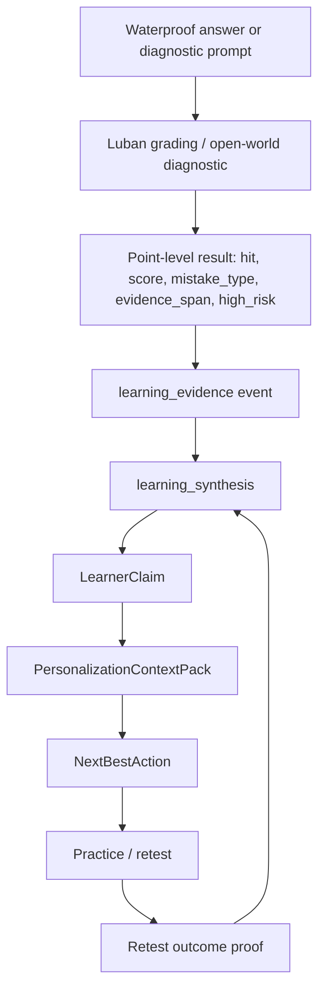

# Luban M32 Grading-to-Brain Waterproof Vertical Slice Implementation Plan

> **For agentic workers:** REQUIRED SUB-SKILL: Use superpowers:subagent-driven-development (recommended) or superpowers:executing-plans to implement this plan task-by-task. Steps use checkbox (`- [ ]`) syntax for tracking.

**Goal:** Prove the product loop where Luban grading produces point-level learning evidence and Learning Brain/GBrain turns it into learner claims, a PersonalizationContextPack, next action, retest, and updated learner state.

**Architecture:** Keep one authority per fact. Luban grading is the evidence producer; Learning Brain is the long-term learner decision layer; RAG/knowledge compiler supplies textbook, standard, question, and chapter evidence; DeepSeek/Qwen execute online grading and teaching but never sign release truth. The M32 slice uses one bounded topic, waterproofing, to avoid another broad compiler campaign before the Grading-to-Brain loop is product-real.

**Tech Stack:** Python services under `deeptutor/services/construction_grading`, `deeptutor/services/learner_state`, existing `/api/v1/ws`, RAG/KB v5, signed runtime supply bundles, pytest, hermetic fixtures, optional live TestClient.

---

## 0. Current Authority

Parent plan:

- [2026-06-04-luban-grading-engine-master-control-plan.md](2026-06-04-luban-grading-engine-master-control-plan.md) §0.C / §0.26 / §0.26.14 / §0.26.15.

Related plans:

- [2026-06-03-luban-grading-engine-learning-brain-loop-v0.md](2026-06-03-luban-grading-engine-learning-brain-loop-v0.md) defines the Grading-to-Brain integration layer.
- [2026-06-06-luban-m26-compiled-context-open-world-execution-plan.md](2026-06-06-luban-m26-compiled-context-open-world-execution-plan.md) is completed and should be reused as a safety/test template, not re-executed.
- [2026-06-06-luban-living-llm-artifact-compiler-design.md](2026-06-06-luban-living-llm-artifact-compiler-design.md) defines the candidate-write vs deterministic-sign compiler law.
- [2026-06-06-luban-textbook-verbatim-lane-design.md](2026-06-06-luban-textbook-verbatim-lane-design.md) defines the textbook signed shard and provenance lane.

M32 must preserve this split:

```text
评分引擎 = 高质量学习证据生产器
Learning Brain / GBrain = 长期个性化学习决策器
RAG / 知识编译 = 教材、规范、真题证据供应器
DeepSeek / Qwen = 在线批改与教学执行器
```

## 1. Non-Goals

- Do not make Learning Brain re-score answers.
- Do not add a second learner memory, second RAG, second chat route, or second recommendation authority.
- Do not publish a registry, flip production default, write canonical learner truth, or write remote/Aliyun/DB state without separate user authorization.
- Do not expand to all topics before the waterproof vertical slice has one full retest outcome proof.
- Do not let a mutable KB chunk, RAG hit, model vote, or council vote become answer-key or mastery truth.

## 2. One Business Fact

M32 protects this single fact:

```text
A point-level grading/diagnostic result can become a learning evidence event, then a learner claim, then a personalized next action, and finally a retest outcome that updates the claim.
```

## 3. Data Flow



## 4. Task List

### Task 1: No-Clobber Audit + M32 Artifact Skeleton

**Files:**

- Create: `scripts/run_luban_m32_grading_to_brain_waterproof_slice.py`
- Create: `tests/scripts/test_luban_m32_grading_to_brain_waterproof_slice.py`
- Output: `artifacts/luban_grading_artifacts/grading_to_brain_m32_waterproof_YYYYMMDD/`

- [ ] Record `git status --short --branch`, `realpath .`, current HEAD, and dirty file groups.
- [ ] Create the artifact skeleton with these required files:
  - `waterproof_topic_manifest_m32.json`
  - `compiled_context_consumption_m32.json`
  - `grading_event_ledger_m32.jsonl`
  - `learning_evidence_ledger_m32.jsonl`
  - `learner_claim_projection_m32.jsonl`
  - `personalization_context_pack_m32.json`
  - `next_best_action_m32.json`
  - `retest_outcome_proof_m32.jsonl`
  - `safety_invariant_report_m32.json`
  - `go_no_go_m32.json`
  - `FINDING_grading_to_brain_m32_waterproof_YYYYMMDD.md`
- [ ] Add a script test that fails if any required artifact is missing.

**Acceptance:**

- The package has all required outputs.
- No unrelated dirty file is modified.
- No reset, stash, checkout, or remote write is used.

### Task 2: Waterproof Topic Shard and Runtime Resolver Example

> **命名澄清（"waterproof" 是双关，别混淆）**：本计划标题里的 **"Waterproof Vertical Slice"** 是质量形容词——指一条**滴水不漏 / 不漏权威**的端到端纵切；而 **"防水 / waterproof topic"** 是被选作样本的**建筑实务考试专题**。两者同名纯属顺带的双关。`topic_id=waterproof` 指的是后者（专题样本）。
>
> **为什么选防水做样本**：M32 不重跑全量 compiler，只用**一个有界专题**把 Grading-to-Brain 闭环跑成产品级证据（§0.26.15）。防水是 §0.26.14 列出的并列专题之一（`waterproof / concrete / contract_claim / schedule_network`），被选为第一个试验田；它必须是**可丢弃 / 可泛化的标本**，闭环证明后第二个专题应能复用同一机制（`v_topic_<name>` + canonical manifest lane），而不是固化成 `v_topic_waterproof` 专属特例。

**Files（命名对齐实际已签发产物）：**

- Shard（已建，commit `68cf8cd7`）：`deeptutor/services/construction_grading/runtime_supply/v_topic_waterproof/topic_waterproof.json`
  - 实际命名是 `v_topic_waterproof`，**不是**早期草拟的 `v_waterproof_topic_m32`；以已签发产物为准，不重命名已签 shard（§3 Surgical Changes）。
  - 生成脚本：`scripts/run_luban_waterproof_topic_shard.py`。
- Manifest pointer：由 Task 1/7 runner `scripts/run_luban_m32_grading_to_brain_waterproof_slice.py` 产出 `waterproof_topic_manifest_m32.json`（`topic_id=waterproof` + `content_hash` + `signature` + `published=false` + `canonical_pointer` 指向上面的 shard）。
- Resolver：`deeptutor/services/construction_grading/canonical_knowledge_manifest.py`（`v_topic_*` → lane `topic_<name>`）+ `compiled_registry_resolver.py`。

- [x] Build a small signed waterproof topic shard from existing compiled textbook/source supply（44 节点：教材 21 + 讲义 36 + 题 98 源计数；manifest 含 `schema_version / status=release_candidate / published=false / content_hash / signature / namespace / node_count`）。
  - 注：shard 内部 manifest 用 `topic` / `namespace` 字段；Task 1/7 的 `waterproof_topic_manifest_m32.json` 把它规范化为 `topic_id` + `canonical_pointer` 对外指针。
- [x] Include source refs for waterproofing concepts, textbook chapter/node, required terms, and at least one practice/retest mapping（manifest pointer 带 `source_refs`：`point_id` + `required_term` + `knowledge_point`；practice/retest 由 Task 1/7 的 `next_best_action_m32.json` + `retest_outcome_proof_m32.jsonl` 体现）。
- [x] Load the shard through a resolver path that never scans artifacts by mtime or filename（经 canonical manifest lane + `compiled_registry_resolver`，按 namespace/topic 解析，非目录扫描）。
- [ ] Prove tampered/missing/malformed shard fails closed to open-world diagnostic, not release truth —— **未做专项测试**：`tests/services/construction_grading/test_m32_waterproof_topic_runtime_supply.py` 尚未创建；fail-closed 目前由 `compiled_registry_resolver` 既有 `verify_bundle`（四层校验）通用覆盖，但缺防水专项断言。M32 GO 已在 `go_no_go_m32.json` 的 live_blockers 中体现 candidate 级限制。

**Acceptance:**

- `waterproof_topic_manifest_m32.json` points to the exact signed shard（`canonical_pointer` = `…/v_topic_waterproof/topic_waterproof.json`）。✓
- Runtime example resolves by `topic_id=waterproof`, not by free-text directory scan. ✓
- `published=false`, `production_default_connected=false`, `canonical_truth_written=false`. ✓（见 Task 1/7 `safety_invariant_report_m32.json`）

### Task 3: GradingEvent Schema over Existing Learning Evidence Payload

**Files:**

- Modify: `deeptutor/services/construction_grading/learning_evidence.py`
- Modify only if needed: `deeptutor/services/construction_grading/writeback.py`
- Test: `tests/services/construction_grading/test_m32_grading_event_learning_evidence.py`

- [ ] Extend the existing flat `learning_evidence` payload shape; do not introduce a new DB table or string schema namespace.
- [ ] Add point-level fields needed by Learning Brain:
  - `point_id`
  - `knowledge_point`
  - `policy_type`
  - `hit`
  - `score`
  - `max_score`
  - `mistake_type`
  - `evidence_span`
  - `required_term`
  - `high_risk_review`
  - `engine.gate_status`
  - `artifact_status`
- [ ] Use this concrete waterproof example as a fixture seed:

```json
{
  "event_type": "learning_evidence",
  "student_id": "qa_m32_waterproof",
  "question_id": "waterproof_case_001",
  "attempt_id": "attempt_m32_001",
  "scoring_points": [
    {
      "point_id": "waterproof_exact_required_001",
      "knowledge_point": "防水施工规范术语",
      "policy_type": "exact_required",
      "hit": "miss",
      "score": 0,
      "max_score": 1,
      "mistake_type": "near_synonym_not_accepted",
      "evidence_span": "普通防水砂浆处理",
      "required_term": "聚合物水泥防水砂浆",
      "high_risk_review": true
    }
  ]
}
```

**Acceptance:**

- Existing `build_learning_evidence_dedupe_key` remains stable for existing v1 payloads.
- Shadow/candidate/open-world evidence can be stored or previewed but cannot raise mastery.
- Teacher-final or real retest proof remains the only path toward confirmed/stable claim.

### Task 4: LearnerClaim Projection for the Waterproof Weakness

**Files:**

- Modify: `deeptutor/services/learner_state/learning_synthesis.py`
- Test: `tests/services/learner_state/test_m32_waterproof_learning_synthesis.py`

- [ ] Convert repeated waterproof learning evidence into a `LearnerClaim` with:
  - `claim_id`
  - `subject_id`
  - `concept_id`
  - `claim_status`
  - `evidence_level`
  - `supporting_event_ids`
  - `evidence_refs`
  - `requires_retest`
  - `last_seen_at`
- [ ] Ensure near-synonym exact-required misses can create `observed` or `needs_retest`, but not mastery.
- [ ] Ensure a real retest pass can move the claim toward `confirmed` or clear a stale weakness according to existing claim lifecycle rules.
- [ ] Ensure missing evidence, cross-user, cross-subject, or shadow-only events do not produce a promoted claim.

**Acceptance:**

- One learner can answer: what do we believe, what evidence supports it, what changed, what should happen next, why now, and how we will know it worked.
- `unsupported_claim_rate=0`.
- `shadow_promoted_to_mastery=0`.

### Task 5: PersonalizationContextPack + NextBestAction Consumption

**Files:**

- Modify: `deeptutor/services/learner_state/personalization_context.py`
- Modify: `deeptutor/services/learner_state/next_best_action.py`
- Modify only if needed: `deeptutor/services/learner_state/learning_report_read_model.py`
- Modify only if needed: `deeptutor/tutorbot/agent/tools/deeptutor_tools.py`
- Test: `tests/services/learner_state/test_m32_waterproof_personalization_context.py`
- Test: `tests/services/learner_state/test_m32_waterproof_next_best_action.py`

- [ ] Build a PCP that includes the waterproof claim, evidence refs, active training intent, and one next action candidate.
- [ ] Generate a next action of this shape:

```json
{
  "action_type": "retest_or_targeted_practice",
  "target": "防水 exact_required 术语训练",
  "why_this_now": "最近防水采分点出现近义替代原文术语的问题，需复测确认是否改善。",
  "materials": ["教材防水章节", "相似真题", "术语踩字清单"],
  "success_measure": "复测中命中 required_term 且不再使用近义替代表达",
  "evidence_refs": ["attempt_m32_001"]
}
```

- [ ] Ensure report, TutorBot, and practice surfaces read PCP / next action from the same backend projection.
- [ ] Add a negative test proving the frontend or wrapper cannot invent a different recommendation when PCP exists.

**Acceptance:**

- `PersonalizationContextPack` remains read-only.
- `training_intent` remains the prescription authority; `next_best_action` is a view/explain layer.
- No evidence learner gets a starter/calibration action, not fake personalization.

### Task 6: Retest Outcome Proof and Claim Update

**Files:**

- Modify only if needed: `deeptutor/services/learner_state/training_intent.py`
- Modify only if needed: `deeptutor/services/learner_state/learning_synthesis.py`
- Test: `tests/services/learner_state/test_m32_waterproof_retest_outcome.py`

- [ ] Generate a retest event linked to the waterproof claim and action id.
- [ ] Record outcome fields:
  - `retest_happened`
  - `passed`
  - `target_point_id`
  - `previous_event_id`
  - `new_event_id`
  - `improved_points`
  - `not_improved_points`
- [ ] If retest passes, update the claim or produce an improvement edge.
- [ ] If retest fails, keep the claim active and generate a different strategy, such as textbook review before another practice.
- [ ] If retest is simulated, keep it preview-only and do not update canonical claim.

**Acceptance:**

- No `improved` claim without real retest evidence.
- The learner-facing report can show before/after proof.
- `simulated_retest_as_real=0`.

### Task 7: End-to-End Runner and Go/No-Go

**Files:**

- Modify: `scripts/run_luban_m32_grading_to_brain_waterproof_slice.py`
- Test: `tests/scripts/test_luban_m32_grading_to_brain_waterproof_slice.py`

- [ ] Run the waterproof slice end-to-end using hermetic fixtures.
- [ ] Optionally run a live `/api/v1/ws` TestClient scenario when credentials and safe environment are available.
- [ ] Write `safety_invariant_report_m32.json` with:
  - `official_score_laundering`
  - `answer_key_override`
  - `source_laundering`
  - `rag_chunk_as_answer_key`
  - `candidate_used_as_release_truth`
  - `shadow_promoted_to_mastery`
  - `simulated_retest_as_real`
  - `cross_user_leak`
  - `cross_subject_leak`
  - `production_write_count`
  - `canonical_truth_written`
- [ ] Write `go_no_go_m32.json` with verdict `GO`, `WEAK-GO`, or `NO-GO`.

**Acceptance:**

- M32 can only be `GO` if the full loop has at least one evidence event, one claim, one PCP, one next action, one retest outcome, and all safety invariants pass.
- If live `/api/v1/ws` is not run, verdict must say `hermetic_only` and list exact live blockers.
- `production_write_count=0` and `canonical_truth_written=false` unless separately authorized.

## 5. Required Test Command

```bash
python -m pytest \
  tests/scripts/test_luban_m32_grading_to_brain_waterproof_slice.py \
  tests/services/construction_grading/test_m32_grading_event_learning_evidence.py \
  tests/services/construction_grading/test_m32_waterproof_topic_runtime_supply.py \
  tests/services/learner_state/test_m32_waterproof_learning_synthesis.py \
  tests/services/learner_state/test_m32_waterproof_personalization_context.py \
  tests/services/learner_state/test_m32_waterproof_next_best_action.py \
  tests/services/learner_state/test_m32_waterproof_retest_outcome.py \
  -q
```

## 6. Go/No-Go Interpretation

| Verdict | Meaning |
|---|---|
| `GO` | The waterproof slice proves Grading-to-Brain with a real or hermetic retest outcome and clean safety invariants. It can be expanded to the next topic. |
| `WEAK-GO` | The architecture works but is missing live `/api/v1/ws`, real retest, or product-surface evidence. Do not expand beyond one more controlled slice. |
| `NO-GO` | Any authority violation, unsafe promotion, missing PCP, missing retest outcome, or surface-specific recommendation path. Fix before continuing. |

## 7. Product Acceptance

The learner-facing surface must answer these four questions in one screen or one API payload:

1. 今天为什么练这个？
2. 证据来自哪一次作答、哪个采分点、哪段答案？
3. 这次训练要证明什么改善？
4. 练完后 Learning Brain 如何更新画像？

If the answer is only “你掌握度提高了” without evidence, M32 is not done.
