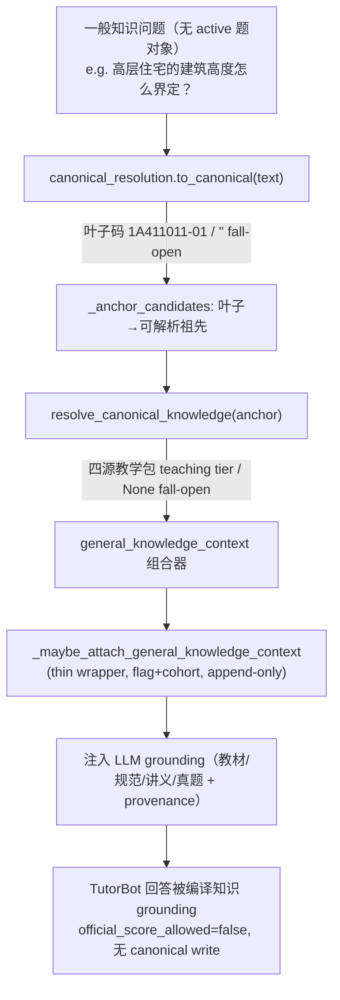

# Luban M34 — Compiled-Knowledge Dividend: Nexus-Wide Teaching Context for Every Conversation

> **For agentic workers:** REQUIRED SUB-SKILL: Use superpowers:subagent-driven-development (recommended) or superpowers:executing-plans to implement this plan task-by-task. Steps use checkbox (`- [ ]`) syntax for tracking. Bug investigation → root-cause-debugging / superpowers:systematic-debugging. Before "完成" → superpowers:verification-before-completion.

> **Status: `Execution plan / M34 / capability track (parallel to M33-ACT authorization track)`.** 这是一条**能力放大**主线，不是生产授权门。它把已编译的知识红利从"做题才有"泛化到"任何知识对话都有"，全程 teaching tier，不碰 published registry / production default flip / canonical learner-truth write / 远端写（那是 M33-ACT 的事）。

**Goal:** 让系统里**任何一次知识类对话**（不只是做题/评分）都自动吃到鲁班已编译的四源教学知识（教材 + 规范 + 讲义 + 真题），把 Nexus-style 编译层从"题库闸门"变成"全对话能力放大器"。

**Architecture:** 纯接线，零新权威。三个组件**都已存在**：① `canonical_resolution.to_canonical(text)` 把自由问题文本确定性解析成 canonical 叶子码（IDF 加权、registry 去重、从签名 `v_canonical_taxonomy_index` 加载、fall-open）；② `canonical_knowledge_runtime.resolve_canonical_knowledge(node)` 把一个 canonical 节点解析成四源教学包（teaching tier，`official_score_allowed=False`，fall-open）；③ `deep_question` 现有 `_maybe_attach_*` thin-wrapper 模式 + RAG grounding 注入点。本计划只新增**一个 fat-skill 组合器**（把 ①→②串起来 + 节点粒度桥接）和**一个 thin wrapper**（在一般对话回合注入，flag/cohort gated，append-only，fail-closed），并把教学包喂进 LLM grounding 让回答真正变好。

**Tech Stack:** Python（`deeptutor/services/construction_grading`、`deeptutor/capabilities/deep_question.py`）、签名 runtime_supply bundles、现有 `/api/v1/ws` TestClient、pytest、hermetic fixtures。

---

## 0. Current Authority

父计划：

- [2026-06-04-luban-grading-engine-master-control-plan.md](2026-06-04-luban-grading-engine-master-control-plan.md) §0.12.6（"Nexus-style compiler 是能力放大器，不是题库闸门"）、§0.26（authority-aware open-world expert system）、§0.26.14（知识编译 storage/serving contract）、§0.26.9 M27（五面同消费 `luban_context_pack.v1`）。

并行轨（**不同主线，不要混**）：

- [2026-06-08-luban-production-canonical-activation-authorization-package.md](2026-06-08-luban-production-canonical-activation-authorization-package.md)（M33-ACT 生产/canonical 授权门）—— 那是**评分 release-truth 上生产**；本计划是**教学知识泛化**，不需要任何授权门。
- [2026-06-08-luban-grounded-remaining-audit.md](2026-06-08-luban-grounded-remaining-audit.md)（接地气剩余审计）。

M34 必须保持的 single authority 切分：

```text
评分引擎          = 高质量学习证据生产器（不因本计划改变判分）
canonical_resolution = 唯一的「任何 key/文本 → canonical 码」归一器（复用，不另造）
canonical_knowledge_runtime = 唯一的「canonical 节点 → 四源教学包」（复用，不另造）
本计划新增        = 一个组合器 + 一个 thin wrapper，把已有能力接到一般对话
```

## 1. Non-Goals（硬边界）

- **不开第二套** RAG / registry / taxonomy / route / learner memory / context schema。复用 `canonical_resolution`、`resolve_canonical_knowledge`、`LubanContextPack`。
- **不把教学知识当 answer key / official score**。注入物结构上 `official_score_allowed=False`、`tier="teaching_context_not_answer_key"`、`llm_may_decide_correctness=False`。mutable KB chunk 永不当答案权威（§0.26.14）。
- **不写** DB / canonical learner truth / 远端 / production default。`production_write_count=0`、`canonical_truth_written=false` 全程。
- **不碰判分链路**：grading-followup 分支（有 active question 对象）行为字节不变；本计划只作用于**没有 active 题对象的一般知识回合**。
- **off-syllabus / 低置信 → fail-open**：解析不到或低置信就回落现有 open-world / RAG 行为，绝不硬塞错章节、不伪造引用。
- 不为省 token 牺牲能力；不顺手重构无关代码（§3 Surgical Changes）。

## 2. One Business Fact

M34 protects this single fact:

```text
任何一次知识类对话，只要能确定性映射到 canonical 节点，就能在不改变判分、不写真值、不冒充官方答案的前提下，
自动获得该节点的四源教学上下文（教材逐字 + 规范条款 + 讲义讲解 + 真题），并让 LLM 的回答被这份编译知识 grounding。
```

## 3. Data Flow



## 4. Verified Building Blocks（已核实的真实签名，实现时直接对照）

| 组件 | 位置 | 签名 / 返回 |
|---|---|---|
| 自由文本→canonical 码 | `deeptutor/services/construction_grading/canonical_resolution.py:85` | `to_canonical(text: str, native_code: str = "") -> str`（"" = fall-open；lru-cached；从签名 `v_canonical_taxonomy_index` 加载；registry 去 deprecated） |
| canonical 节点→四源教学包 | `deeptutor/services/construction_grading/canonical_knowledge_runtime.py:113` | `resolve_canonical_knowledge(node_code, *, learner_context=None, per_source=6) -> dict\|None`；返回 `{authority, mode, node_code, tier:"teaching_context_not_answer_key", official_score_allowed:False, sources:{textbook,standard,lecture,question}, graph_neighbors, remediation, selected_counts, node_source_totals}`；None = fall-open |
| 节点 name_path | `canonical_resolution.py:121` | `name_path(code: str) -> str` |
| thin-wrapper 模式参考 | `deeptutor/capabilities/deep_question.py:2554` | `_maybe_attach_textbook_knowledge(...)`（flag + env kill + cohort + append-only） |
| 一般回合分流点 | `deeptutor/capabilities/deep_question.py:3008` | `followup_question_context = question_context_from_active_object(...)`；**空** = 一般知识回合（本计划作用域） |
| RAG grounding 格式化参考 | `deep_question.py:963` | `_format_grading_grounding_context(rag_result) -> (str, list)` |

**粒度桥接事实**：`to_canonical` 可能返回 L5/L6 叶子码（如 `1A411011-01-a`），而 `v_canonical_unified_knowledge` 节点在 `1A411011-01` 粒度（395 节点）。`resolve_canonical_knowledge._subtree_items` 用 `code == node or code.startswith(node + "-")` 收子树。因此组合器必须从叶子码**逐级向上**尝试祖先，取第一个非 None 的教学包。

---

## 5. Task List

### Task 1: No-Clobber Audit + 组合器 fat skill（核心）

**Files:**

- Create: `deeptutor/services/construction_grading/general_knowledge_context.py`
- Create: `tests/services/construction_grading/test_general_knowledge_context.py`

- [ ] **Step 1.0：记录基线**

Run: `git status --short --branch && git rev-parse HEAD`
记录 dirty 文件组；本任务只新增上面两个文件，不碰任何其他文件。

- [ ] **Step 1.1：写失败测试 —— 自由问题解析出四源教学包**

```python
# tests/services/construction_grading/test_general_knowledge_context.py
"""M34 Task 1: general_knowledge_context composes canonical_resolution.to_canonical +
resolve_canonical_knowledge into a TEACHING-tier pack for any free-text knowledge question.
Off-syllabus / low-signal text falls open to None. Never an answer key."""
from __future__ import annotations

from deeptutor.services.construction_grading import general_knowledge_context as gkc


def test_anchor_candidates_walk_leaf_to_ancestors() -> None:
    assert gkc._anchor_candidates("1A411011-01-a") == ["1A411011-01-a", "1A411011-01", "1A411011"]
    assert gkc._anchor_candidates("1A411011") == ["1A411011"]
    assert gkc._anchor_candidates("") == []


def test_free_text_resolves_to_teaching_pack() -> None:
    # A real on-syllabus question; to_canonical classifies it, resolver returns the four-source pack.
    out = gkc.resolve_general_knowledge_context("高层住宅的建筑高度是怎么界定的？")
    assert out is not None, "on-syllabus knowledge question must resolve to a teaching pack"
    assert out["tier"] == "teaching_context_not_answer_key"
    assert out["official_score_allowed"] is False
    assert out["llm_may_decide_correctness"] is False
    assert out["classified_leaf"]  # the canonical leaf to_canonical chose
    assert out["resolved_anchor"]  # the unified node that actually carried content
    assert isinstance(out["sources"], dict)
    assert any(out["sources"].get(s) for s in ("textbook", "standard", "lecture", "question"))


def test_off_syllabus_text_falls_open_to_none() -> None:
    assert gkc.resolve_general_knowledge_context("今天天气怎么样啊随便聊聊") is None


def test_empty_text_falls_open() -> None:
    assert gkc.resolve_general_knowledge_context("") is None
    assert gkc.resolve_general_knowledge_context("   ") is None
```

- [ ] **Step 1.2：跑测试确认 RED**

Run: `python -m pytest tests/services/construction_grading/test_general_knowledge_context.py -q`
Expected: FAIL（`No module named ...general_knowledge_context`）。

- [ ] **Step 1.3：实现组合器（fat skill，全策略在此）**

```python
# deeptutor/services/construction_grading/general_knowledge_context.py
"""General-knowledge compiled teaching context — the Nexus-wide dividend (M34, TEACHING tier).

Composes the two existing single-authority components so that ANY free-text knowledge question
(not just an in-bank exam question) can pull the four-source compiled teaching context:

    canonical_resolution.to_canonical(text)        # free-text -> canonical leaf code  (""=fall open)
      -> _anchor_candidates(leaf)                  # leaf -> resolvable ancestor codes
      -> canonical_knowledge_runtime.resolve_canonical_knowledge(anchor)  # node -> 4-source pack

Authority discipline: this MINTS nothing. It is TEACHING context, never an answer key. The result is
structurally non-official (``official_score_allowed=False``, ``llm_may_decide_correctness=False``) and
performs no writeback. Off-syllabus / low-signal / tamper -> None (caller falls open; no wrong-chapter
attribution, no fabricated citation).
"""
from __future__ import annotations

import logging
from typing import Any

from deeptutor.services.construction_grading import canonical_resolution as _CR
from deeptutor.services.construction_grading.canonical_knowledge_runtime import (
    resolve_canonical_knowledge,
)

_log = logging.getLogger(__name__)
AUTHORITY = "luban_general_knowledge_context"


def _anchor_candidates(leaf_code: str) -> list[str]:
    """A classified leaf (``1A411011-01-a``) and its prefix-ancestors (``1A411011-01``, ``1A411011``),
    longest first. resolve_canonical_knowledge gathers a node's subtree, so the first ancestor that
    carries unified content is the right granularity. Empty list for empty input."""
    code = str(leaf_code or "").strip()
    if not code:
        return []
    parts = code.split("-")
    return ["-".join(parts[:i]) for i in range(len(parts), 0, -1)]


def resolve_general_knowledge_context(
    question_text: str,
    *,
    learner_context: dict[str, Any] | None = None,
    per_source: int = 6,
) -> dict[str, Any] | None:
    """Resolve a free-text knowledge question into a TEACHING-tier four-source pack, or None to fall open.

    Deterministic: classification is IDF-weighted keyword match (canonical_resolution); no LLM, no RAG
    side effects. The learner's question text focuses each source to its most relevant items."""
    text = str(question_text or "").strip()
    if not text:
        return None
    leaf = _CR.to_canonical(text)
    if not leaf:
        return None  # off-syllabus / low-signal -> fall open (current open-world behaviour)
    lc = dict(learner_context or {})
    lc.setdefault("question_text", text)  # focus the four sources to this turn's question
    for anchor in _anchor_candidates(leaf):
        pack = resolve_canonical_knowledge(anchor, learner_context=lc, per_source=per_source)
        if pack:
            return {
                "authority": AUTHORITY,
                "mode": "general_knowledge_teaching_context",
                "classified_leaf": leaf,
                "leaf_name_path": _CR.name_path(leaf),
                "resolved_anchor": anchor,
                "tier": pack.get("tier", "teaching_context_not_answer_key"),
                "official_score_allowed": False,            # structural — never an official score
                "llm_may_decide_correctness": False,
                "canonical_taxonomy_version": pack.get("canonical_taxonomy_version"),
                "selected_counts": pack.get("selected_counts"),
                "sources": pack.get("sources") or {},
                "graph_neighbors": pack.get("graph_neighbors") or {},
                "remediation": pack.get("remediation"),
                "writeback_performed": False,
            }
    return None  # classified, but no ancestor carried unified content -> fall open


__all__ = ["AUTHORITY", "resolve_general_knowledge_context"]
```

- [ ] **Step 1.4：跑测试确认 GREEN**

Run: `python -m pytest tests/services/construction_grading/test_general_knowledge_context.py -q`
Expected: PASS（4 passed）。若 `test_free_text_resolves_to_teaching_pack` 因该问题在签名 bundle 里无内容而失败，**先用 `gkc._CR.to_canonical("高层住宅的建筑高度...")` 打印实际叶子码、再用 `canonical_knowledge_runtime.available_nodes()` 确认哪个真有内容的节点存在**，把测试 fixture 换成一个确有四源内容的真实问题（不要为了过测试放宽断言）。

- [ ] **Step 1.5：commit**

```bash
git add deeptutor/services/construction_grading/general_knowledge_context.py \
        tests/services/construction_grading/test_general_knowledge_context.py
git commit -m "feat(luban): M34 general-knowledge compiled teaching-context composer (teaching tier, fall-open)"
```

**Acceptance:**

- 自由问题 → 四源教学包；off-syllabus / 空文本 → None。
- 结构上 `official_score_allowed=False`、`tier=teaching_context_not_answer_key`、`writeback_performed=False`。
- 复用 `to_canonical` + `resolve_canonical_knowledge`，零新权威、零 I/O 之外副作用。

### Task 2: Thin Wrapper —— 在一般知识回合注入（gated, append-only）

**Files:**

- Modify: `deeptutor/capabilities/deep_question.py`（新增 `_maybe_attach_general_knowledge_context` + 两个 gating helper；在一般回合分支调用）
- Test: `tests/capabilities/test_deep_question_general_knowledge_context.py`

- [ ] **Step 2.1：写失败测试 —— wrapper 行为（默认关 / flag 开 / kill / cohort / fail-open）**

```python
# tests/capabilities/test_deep_question_general_knowledge_context.py
"""M34 Task 2: the thin wrapper attaches general-knowledge teaching context ONLY on a general turn,
ONLY when flag+cohort allow, append-only, default OFF -> legacy byte-identical. Fail-open on any error."""
from __future__ import annotations

from types import SimpleNamespace

import deeptutor.capabilities.deep_question as dq


def _ctx(*, user_id: str, message: str, flag: bool) -> SimpleNamespace:
    return SimpleNamespace(
        user_message=message,
        metadata={
            "general_knowledge_context": flag,
            "learner_user_id": user_id,
        },
    )


def test_default_off_attaches_nothing() -> None:
    payload: dict = {}
    dq._maybe_attach_general_knowledge_context(
        context=_ctx(user_id="qa_alice", message="高层住宅的建筑高度怎么界定？", flag=False),
        result_payload=payload,
    )
    assert "luban_general_knowledge_context" not in payload  # flag off -> legacy unchanged


def test_flag_on_cohort_on_syllabus_attaches_teaching_context() -> None:
    payload: dict = {}
    dq._maybe_attach_general_knowledge_context(
        context=_ctx(user_id="qa_alice", message="高层住宅的建筑高度怎么界定？", flag=True),
        result_payload=payload,
    )
    blk = payload.get("luban_general_knowledge_context")
    assert blk and blk["official_score_allowed"] is False
    assert blk["tier"] == "teaching_context_not_answer_key"


def test_kill_switch_overrides_flag(monkeypatch) -> None:
    monkeypatch.setenv("LUBAN_GENERAL_KNOWLEDGE_CONTEXT_ENABLED", "false")
    payload: dict = {}
    dq._maybe_attach_general_knowledge_context(
        context=_ctx(user_id="qa_alice", message="高层住宅的建筑高度怎么界定？", flag=True),
        result_payload=payload,
    )
    assert payload.get("luban_general_knowledge_context", {}).get("killed_by_switch") is True


def test_non_cohort_user_attaches_nothing() -> None:
    payload: dict = {}
    dq._maybe_attach_general_knowledge_context(
        context=_ctx(user_id="real_student_42", message="高层住宅的建筑高度怎么界定？", flag=True),
        result_payload=payload,
    )
    assert "luban_general_knowledge_context" not in payload


def test_off_syllabus_falls_open_no_block() -> None:
    payload: dict = {}
    dq._maybe_attach_general_knowledge_context(
        context=_ctx(user_id="qa_alice", message="今天天气怎么样随便聊聊", flag=True),
        result_payload=payload,
    )
    assert "luban_general_knowledge_context" not in payload  # fall-open, no wrong-chapter attribution
```

- [ ] **Step 2.2：跑测试确认 RED**

Run: `python -m pytest tests/capabilities/test_deep_question_general_knowledge_context.py -q`
Expected: FAIL（`_maybe_attach_general_knowledge_context` 不存在）。

- [ ] **Step 2.3：实现 thin wrapper（复用现有 cohort/flag 取值约定）**

在 `deep_question.py` 紧挨 `_maybe_attach_textbook_knowledge`（2554 区段）新增。**只读 flag/cohort/user_message，调用 fat skill，append 一个字段；绝不 mutate legacy、绝不碰 `construction_grading_result`、绝不写库。** 复用文件里既有的 `_learner_user_id_from_context` 取 user_id。

```python
def _general_knowledge_cohort_prefixes() -> tuple[str, ...]:
    """Default cohort for the general-knowledge dividend. Broadened later via env (Task 5), gated now."""
    import os
    raw = os.environ.get("LUBAN_GENERAL_KNOWLEDGE_CONTEXT_COHORT", "qa_,test_,operator_")
    return tuple(p.strip() for p in raw.split(",") if p.strip())


def _general_knowledge_flag_enabled(context) -> bool:
    md = getattr(context, "metadata", None) or {}
    return bool(md.get("general_knowledge_context"))


def _maybe_attach_general_knowledge_context(*, context, result_payload: dict) -> None:
    """Attach four-source compiled TEACHING context for a GENERAL knowledge turn (no active question
    object). Thin wrapper — ALL policy lives in ``general_knowledge_context`` (fat skill). flag + env
    kill + cohort; default OFF -> legacy byte-identical. Never mutates legacy result, never writes DB /
    canonical truth; the attached pack is teaching/source context (official_score_allowed False)."""
    import os

    KEY = "luban_general_knowledge_context"
    if not _general_knowledge_flag_enabled(context):
        return
    if os.environ.get("LUBAN_GENERAL_KNOWLEDGE_CONTEXT_ENABLED", "").strip().lower() in (
        "false", "0", "off", "no",
    ):
        result_payload[KEY] = {"authority": KEY, "status": "killed_by_switch", "killed_by_switch": True}
        return
    student_id = _learner_user_id_from_context(context)
    if not str(student_id).startswith(_general_knowledge_cohort_prefixes()):
        return
    try:
        from deeptutor.services.construction_grading.general_knowledge_context import (
            resolve_general_knowledge_context,
        )

        text = str(getattr(context, "user_message", "") or "")
        learner_context = {
            "student_id": student_id,
            "weak_codes": _learner_weak_canonical_codes({}),  # read-only; learner_state stays authority
        }
        pack = resolve_general_knowledge_context(text, learner_context=learner_context)
        if pack is not None:
            result_payload[KEY] = pack
    except Exception as exc:  # noqa: BLE001 — teaching lane must never break legacy
        result_payload[KEY] = {"authority": KEY, "status": "unavailable",
                               "unavailable_reason": type(exc).__name__}
```

- [ ] **Step 2.4：在一般回合分支调用 wrapper**

在 `run()`（2966）的**非 grading-followup 出口**（即 `followup_question_context` 为空、走一般问答/RAG 的那条路径）的 result/metadata 组装处调用一次：`self._maybe_attach...` 等价的模块函数 `_maybe_attach_general_knowledge_context(context=context, result_payload=<该回合的 result payload dict>)`。**精确定位**：用 `grep -n "followup_question_context.get(\"question\")" deeptutor/capabilities/deep_question.py` 找到 3036-3043 的判分分支，在其 `else` / 一般问答出口处挂载（确保只在无 active 题对象时触发）。若该回合无独立 result dict，则挂到 emit 前的 metadata teaching-context 容器，键 `luban_general_knowledge_context`。

- [ ] **Step 2.5：跑测试确认 GREEN + 回归**

Run:
```bash
python -m pytest tests/capabilities/test_deep_question_general_knowledge_context.py -q
python -m pytest tests/capabilities/test_deep_question_reference_feedback.py -q   # 既有判分回归不破
```
Expected: 新测试 PASS；既有判分/followup 测试全绿（legacy 不变）。

- [ ] **Step 2.6：contract guard + commit**

```bash
python scripts/check_contract_guard.py   # deep_question.py 是 protected：把新测试登记进 contracts/index.yaml 的 deep_question domain test_files
git add deeptutor/capabilities/deep_question.py \
        tests/capabilities/test_deep_question_general_knowledge_context.py contracts/index.yaml
git commit -m "feat(luban): M34 thin wrapper attaches general-knowledge teaching context (gated, append-only, fail-open)"
```

**Acceptance:**

- 默认 OFF → legacy 字节不变；flag on + cohort + on-syllabus → 附 teaching context；kill switch 立即关闭；非 cohort 不附；off-syllabus fall-open。
- 只在**无 active 题对象**的一般回合触发；判分链路零回归。
- protected 文件改动已登记 domain 测试（见 memory `contract-guard-protected-files-need-registered-domain-test`）。

### Task 3: 把教学包喂进 LLM grounding（真正的红利落地）

> 仅 attach 字段还不够——红利要体现在**回答质量**。本任务把教学包格式化成 grounding 文本，注入一般问答的 LLM 上下文，让回答引用教材/规范/讲义并带 provenance。

**Files:**

- Modify: `deeptutor/capabilities/deep_question.py`（新增 `_format_general_knowledge_grounding`；在一般问答 LLM 调用前注入）
- Test: `tests/capabilities/test_deep_question_general_knowledge_grounding.py`

- [ ] **Step 3.1：写失败测试 —— grounding 文本含四源 + provenance，且声明非官方**

```python
# tests/capabilities/test_deep_question_general_knowledge_grounding.py
"""M34 Task 3: the teaching pack is formatted into grounding text the general-answer LLM consumes —
verbatim textbook + standard + lecture + question, each provenance-labelled, explicitly non-official."""
from __future__ import annotations

import deeptutor.capabilities.deep_question as dq


def test_grounding_text_includes_four_sources_and_non_official_marker() -> None:
    pack = {
        "authority": "luban_general_knowledge_context",
        "tier": "teaching_context_not_answer_key",
        "official_score_allowed": False,
        "leaf_name_path": "建筑工程技术 > ... > 按建筑高度分类",
        "sources": {
            "textbook": [{"text_preview": "建筑高度大于27m的住宅为高层住宅", "provenance": "2026教材"}],
            "standard": [{"text_preview": "民用建筑设计统一标准 GB50352", "provenance": "规范"}],
            "lecture": [{"text_preview": "讲义：高度界定要点", "provenance": "讲义"}],
            "question": [{"text_preview": "真题：判断高层住宅", "provenance": "真题"}],
        },
    }
    text = dq._format_general_knowledge_grounding(pack)
    assert "建筑高度大于27m" in text
    assert "GB50352" in text
    assert "讲义" in text
    assert "真题" in text
    # must explicitly tell the model this is teaching context, not an official answer key
    assert ("非官方" in text) or ("teaching" in text.lower()) or ("不得作为官方" in text)


def test_grounding_text_empty_pack_returns_empty() -> None:
    assert dq._format_general_knowledge_grounding(None) == ""
    assert dq._format_general_knowledge_grounding({"sources": {}}) == ""
```

- [ ] **Step 3.2：跑测试确认 RED**

Run: `python -m pytest tests/capabilities/test_deep_question_general_knowledge_grounding.py -q`
Expected: FAIL（函数不存在）。

- [ ] **Step 3.3：实现 grounding 格式化器**

```python
def _format_general_knowledge_grounding(pack: dict | None) -> str:
    """Render the teaching pack into grounding text for the general-answer LLM. Verbatim four-source
    context, each labelled with provenance, prefixed with a HARD non-official disclaimer so the model
    treats it as teaching material, never as an official answer key. Empty string when no pack."""
    if not isinstance(pack, dict):
        return ""
    sources = pack.get("sources") or {}
    if not any(sources.get(s) for s in ("textbook", "standard", "lecture", "question")):
        return ""
    labels = {"textbook": "教材", "standard": "规范", "lecture": "讲义", "question": "真题"}
    lines = [
        "【编译教学上下文 — 仅供讲解，非官方答案，不得作为官方判分依据】",
        f"知识点路径：{pack.get('leaf_name_path') or pack.get('resolved_anchor') or ''}",
    ]
    for src in ("textbook", "standard", "lecture", "question"):
        items = sources.get(src) or []
        for it in items:
            preview = str((it or {}).get("text_preview") or "").strip()
            if preview:
                prov = str((it or {}).get("provenance") or labels[src])
                lines.append(f"- [{labels[src]}·{prov}] {preview}")
    return "\n".join(lines) if len(lines) > 2 else ""
```

- [ ] **Step 3.4：在一般问答 LLM 调用前注入 grounding**

在 Task 2 的一般回合出口处：当 `luban_general_knowledge_context` 已 attach 时，调用 `_format_general_knowledge_grounding(pack)`，把返回文本拼进该回合传给 LLM 的 grounding/system 上下文（与 `_format_grading_grounding_context` 在判分路径的拼接方式对齐：作为额外 grounding 段落，不覆盖用户消息、不覆盖既有 RAG grounding）。**append-only**：教学 grounding 是追加的一段，不替换 RAG，不改 system 角色定义。

- [ ] **Step 3.5：跑测试确认 GREEN + 回归**

Run:
```bash
python -m pytest tests/capabilities/test_deep_question_general_knowledge_grounding.py -q
python -m pytest tests/capabilities/test_deep_question_general_knowledge_context.py -q
```
Expected: 全 PASS。

- [ ] **Step 3.6：commit**

```bash
git add deeptutor/capabilities/deep_question.py \
        tests/capabilities/test_deep_question_general_knowledge_grounding.py
git commit -m "feat(luban): M34 inject compiled teaching context into general-answer LLM grounding (non-official, provenance-labelled)"
```

**Acceptance:**

- grounding 文本含四源 + provenance + 硬性"非官方/不得判分"声明；空包 → 空串。
- 注入 append-only，不覆盖用户消息 / 既有 RAG grounding / system 角色。

### Task 4: 真实 /api/v1/ws 一般知识对话 live gate

**Files:**

- Test: `tests/integration/test_luban_m34_general_knowledge_dividend_ws.py`

- [ ] **Step 4.1：写 live 集成测试（复用 M32 WS smoke 工装）**

参考 `tests/integration/test_luban_m32_grading_to_brain_waterproof_ws.py` 与 `scripts/run_luban_ws_runtime_shadow_turn_smoke.py` 的 `_install_fakes / _build_ws_app / _receive_result / _auth_ctx`。构造一个 **start_turn**（`capability=deep_question`，**无 followup_question_context**，`config.general_knowledge_context=true`，user=`qa_m34_*`），发一个真实建筑实务知识问题，断言：

```python
def test_general_knowledge_question_ws_attaches_teaching_context() -> None:
    frame = {
        "type": "start_turn",
        "content": "高层住宅的建筑高度是怎么界定的？",
        "capability": "deep_question",
        "language": "zh",
        "config": {"general_knowledge_context": True},
    }
    # ... build ws app with user qa_m34_alice, receive result ...
    md = result.get("metadata") or {}
    blk = md.get("luban_general_knowledge_context")
    assert blk, "general knowledge WS turn must attach compiled teaching context"
    assert blk["official_score_allowed"] is False
    assert blk["tier"] == "teaching_context_not_answer_key"
    # authority invariants: no grading result fabricated, no canonical write
    assert "construction_grading_result" not in md  # general turn must NOT mint an official score
    preview = md.get("learning_evidence_preview")
    if preview is not None:
        assert preview.get("canonical_truth_written") is False


def test_off_syllabus_ws_falls_open_no_teaching_block() -> None:
    # an off-domain chit-chat turn must fall open (no wrong-chapter attribution)
    ...
    assert "luban_general_knowledge_context" not in (result.get("metadata") or {})
```

- [ ] **Step 4.2：跑 + 调通**

Run: `python -m pytest tests/integration/test_luban_m34_general_knowledge_dividend_ws.py -q`
Expected: PASS。若 attach 未出现，按 Task 2 Step 2.4 复核挂载点是否真在无-active-题对象出口。

- [ ] **Step 4.3：commit**

```bash
git add tests/integration/test_luban_m34_general_knowledge_dividend_ws.py
git commit -m "test(luban): M34 live /api/v1/ws general-knowledge dividend gate (teaching tier, no official score)"
```

**Acceptance:**

- 真实 `/api/v1/ws` 一般知识问题 → 附编译教学上下文；off-syllabus → fall-open。
- 一般回合**不**产出 `construction_grading_result`、`canonical_truth_written=false`。

### Task 5: Observability + Cohort 广开（gated）+ Go/No-Go

**Files:**

- Create: `scripts/run_luban_m34_general_knowledge_dividend_slice.py`
- Test: `tests/scripts/test_luban_m34_general_knowledge_dividend_slice.py`
- Output: `artifacts/luban_grading_artifacts/general_knowledge_dividend_m34_YYYYMMDD/`

- [ ] **Step 5.1：写 runner 测试（required artifacts + safety + verdict）**

要求 runner 产出并断言：`coverage_report_m34.json`（N 个真实建筑实务问题里命中 teaching context 的比例 + off-syllabus fall-open 比例）、`safety_invariant_report_m34.json`、`go_no_go_m34.json`。

- [ ] **Step 5.2：实现 runner**

跑一组真实建筑实务知识问题（覆盖教材/规范/讲义/真题不同知识点）+ 一组 off-domain 问题，统计：
  - `teaching_context_hit_rate`（on-syllabus 命中率）
  - `off_syllabus_fall_open_rate`（应为 1.0：off-domain 全 fall-open）
  - 安全不变量：`official_score_allowed=false`（全程）、`answer_key_minted=0`、`canonical_truth_written=false`、`production_write_count=0`、`mutable_chunk_as_answer_key=0`、`wrong_chapter_attribution=0`（off-syllabus 不硬塞）。
  - verdict：`GO`（命中率达阈值 + off-syllabus fall-open=1.0 + 安全全清 + live WS 通过）/ `WEAK-GO`（仅 hermetic）/ `NO-GO`（任一安全违背 / off-syllabus 误塞 / 冒充官方答案）。

- [ ] **Step 5.3：跑全套 M34 测试**

```bash
python -m pytest \
  tests/services/construction_grading/test_general_knowledge_context.py \
  tests/capabilities/test_deep_question_general_knowledge_context.py \
  tests/capabilities/test_deep_question_general_knowledge_grounding.py \
  tests/integration/test_luban_m34_general_knowledge_dividend_ws.py \
  tests/scripts/test_luban_m34_general_knowledge_dividend_slice.py -q
```

- [ ] **Step 5.4：cohort 广开开关（gated，默认仍窄）**

`LUBAN_GENERAL_KNOWLEDGE_CONTEXT_COHORT` 已支持广开（Task 2）。**广开到真实学员**前必须：runner GO + off-syllabus fall-open=1.0 稳定 + 无 wrong-chapter 误塞 + 你确认。**本计划默认 cohort 仍 `qa_,test_,operator_`**；广开是单独一步（改 env，可秒退），写进 go_no_go 的"广开前置"。

- [ ] **Step 5.5：commit + 文档回写**

```bash
git add scripts/run_luban_m34_general_knowledge_dividend_slice.py \
        tests/scripts/test_luban_m34_general_knowledge_dividend_slice.py
git commit -m "feat(luban): M34 general-knowledge dividend slice runner + go/no-go (teaching tier, off-syllabus fall-open)"
```

更新 master plan（新增 §0.26.17 M34 closure）+ 挂 `docs/plan/INDEX.md`（§Plan Directory Discipline）。

**Acceptance:**

- on-syllabus 命中率达阈值；off-syllabus fall-open=1.0；安全不变量全清。
- 广开 cohort 是独立、可逆、需确认的一步；默认仍窄。

## 6. Required Test Command

```bash
python -m pytest \
  tests/services/construction_grading/test_general_knowledge_context.py \
  tests/capabilities/test_deep_question_general_knowledge_context.py \
  tests/capabilities/test_deep_question_general_knowledge_grounding.py \
  tests/integration/test_luban_m34_general_knowledge_dividend_ws.py \
  tests/scripts/test_luban_m34_general_knowledge_dividend_slice.py \
  -q
```

## 7. Go/No-Go Interpretation

| Verdict | Meaning |
|---|---|
| `GO` | 一般知识对话能确定性吃到四源编译教学红利，回答被 grounding，off-syllabus 全 fall-open，安全全清，live WS 通过。可广开 cohort（独立确认）。|
| `WEAK-GO` | 组合器/wrapper/grounding 已建且 hermetic 安全，但缺 live `/api/v1/ws` 证据或命中率未达阈值。不广开。|
| `NO-GO` | 任一：冒充官方答案 / mutable chunk 当 answer key / off-syllabus 误塞错章节 / 写 canonical/DB/远端 / 判分链路回归。先修。|

## 8. Product Acceptance（用户可感知）

一个真实学员（广开后）在 TutorBot 里随口问一个建筑实务知识问题，回答必须：

1. 被**编译教材/规范/讲义/真题** grounding，而不是泛泛而谈。
2. 带**知识点路径 + provenance**（来自哪本教材/哪条规范）。
3. 明确**不冒充官方判分**（teaching tier）。
4. 问到题库外/非建筑实务 → 正常 open-world 回答，不硬塞错知识点。

若一般知识问题的回答和接入前**毫无差别**（没吃到任何编译），M34 未达成。
