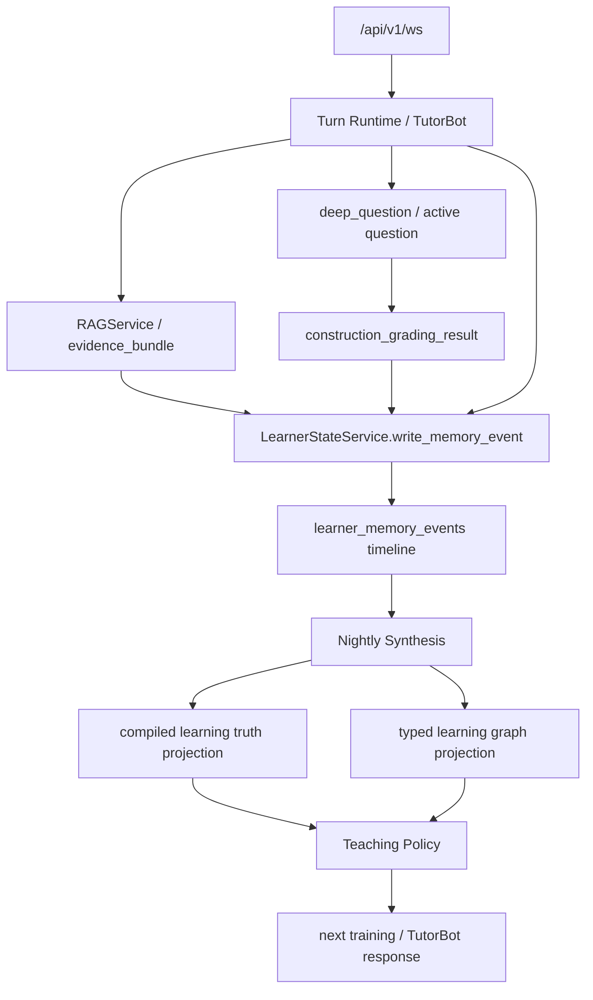

# PRD：鲁班智考学习事实编译层与 Evidence-first Memory

## 1. 文档信息

- 文档名称：鲁班智考学习事实编译层与 Evidence-first Memory PRD
- 文档路径：`docs/plan/2026-05-18-luban-learning-brain-gbrain-absorption-prd.md`
- 创建日期：2026-05-18
- 状态：Implemented locally for all PRD phases with `/wechat-harness` live visible-chain verified
- 适用范围：鲁班智考建筑实务教培、Learner State、RAG、题库、案例题阅卷、错因图谱、Teaching Policy、nightly synthesis
- 外部参考：GBrain 的 `compiled truth + timeline`、typed graph、evidence-first memory、dream cycle 结构
- 关联 contract：
  - [CONTRACT.md](../../../CONTRACT.md)
  - [contracts/index.yaml](../../../contracts/index.yaml)
  - [contracts/learner-state.md](../../../contracts/learner-state.md)
  - [contracts/rag.md](../../../contracts/rag.md)
- 关联计划：
  - [2026-04-15-learner-state-memory-guided-learning-prd.md](2026-04-15-learner-state-memory-guided-learning-prd.md)
  - [2026-04-20-luban-adaptive-teaching-intelligence-prd.md](../题目生命周期与助教运行时/2026-04-20-luban-adaptive-teaching-intelligence-prd.md)
  - [2026-05-13-luban-case-grading-error-map-prd.md](../题目生命周期与助教运行时/2026-05-13-luban-case-grading-error-map-prd.md)
  - [2026-05-14-luban-skill-first-grading-thin-shell-execution-plan.md](../题目生命周期与助教运行时/2026-05-14-luban-skill-first-grading-thin-shell-execution-plan.md)
  - [2026-05-18-deeptutor-launch-readiness-dashboard-implementation-plan.md](../观测发布与生产上线/2026-05-18-deeptutor-launch-readiness-dashboard-implementation-plan.md)

## 2. 一句话结论

鲁班智考不应照搬 GBrain 做一套通用“第二大脑”，也不应把长期记忆继续做成聊天总结。

本 PRD 要吸收的是 GBrain 背后的工程结构：

> 把建筑实务学习过程中的题目、采分点、知识点、错因、作答、训练建议，编译成带证据、带时间线、带图谱关系、可夜间整理的学习事实系统。

这个系统的产品名可以叫 `Learning Brain`，但架构上它不是新 authority。它必须服从现有四个主 authority：

| 业务事实 | 现有唯一 authority | Learning Brain 的定位 |
| --- | --- | --- |
| 学员长期状态 | `LearnerStateService` / `learner_memory_events` / `learner_summaries` | 只生产结构化 evidence 与编译视图，不私写长期画像 |
| 知识召回 | `RAGService` / `evidence_bundle` | 只消费统一 RAG 证据，不新增 grounded mode |
| 题目资产 | Supabase `questions_bank` 与 active question object | 只建立题目到知识点、rubric、错因的 typed link |
| 阅卷结果 | `construction_grading_result` / case grading kernel | 只把评分结果沉淀成可聚合 evidence |

## 3. 背景

传统 RAG 的核心价值是“找得到资料”。它通常停在：

1. chunking
2. embedding
3. indexing
4. query retrieval

这对一般问答有用，但对建筑实务教培不够。我们的核心问题不是“资料找不到”，而是：

1. 学员到底在哪个采分点反复丢分。
2. 这个丢分是否有足够证据进入长期画像。
3. 某个错因和哪个知识点、题型、教材依据、下一题训练有关。
4. 系统昨天、上周、最近三次练习的结论是否一致。
5. 夜间是否能把零散答题事件整理成更稳的教学判断。

GBrain 值得吸收的不是仓库本身，而是四个结构：

1. `compiled truth + timeline`
2. typed graph
3. evidence-first memory
4. nightly synthesis

鲁班智考应把它们落到建筑实务学习事实，而不是做泛个人知识库。

## 4. Root-cause 判断

### 4.1 真正坏掉或缺失的一等业务事实

当前系统已有 learner state、RAG、题库、案例题阅卷、错因事件写回计划，但还缺一个稳定事实：

> 每个学员在每个建筑实务知识点、题型和采分点上的当前可信学习判断，必须能从可追溯证据流中重建，并能反向驱动下一步教学。

如果没有这个编译层，系统会出现三种长期问题：

1. `learner_memory_events` 变成事件垃圾堆，有记录但没有可执行教学判断。
2. `learner_summaries` 变成聊天总结，缺少证据链和冲突处理。
3. 错因图谱只停留在单次批改结果，无法形成“这位学员为什么总错”的长期判断。

### 4.2 单一 authority

Learning Brain 不新增长期主真相。它只补“事实编译”职责：

```text
raw evidence
  -> structured memory event
  -> fact claim with provenance
  -> compiled learning truth
  -> runtime projection
  -> teaching policy / next training
```

唯一写入与读取边界：

| 层 | 唯一 authority | 允许写 | 不允许写 |
| --- | --- | --- | --- |
| 原始学习事件 | turn / grading / RAG / trace / manual correction | 原始事件与来源引用 | 直接改画像 |
| 长期事件流 | `learner_memory_events` | 结构化 evidence payload | 普通聊天随意写 memory |
| 当前可信摘要 | `learner_summaries` 或后续 learner compiled projection | nightly synthesis 生成的 projection | 单轮 LLM 覆盖整份 summary |
| 学员进度 | `user_stats` | 经过阈值的 mastery / weak point projection | prompt 层猜测 |
| 教学动作 | Teaching Policy Layer | 读取 compiled projection 后选择动作 | 另建第二个 policy engine |

### 4.3 需要删除或降级的概念

本 PRD 明确不新增这些概念：

1. 不新增 `gbrain` 运行时依赖。
2. 不新增第二套 learner profile / progress / memory 表。
3. 不新增 `grounded mode`、`learning brain mode`、`case brain mode` 之类入口模式。
4. 不新增专用聊天 WebSocket，继续走 `/api/v1/ws`。
5. 不把 markdown brain page 当唯一真相；markdown 只能是 projection / report。
6. 不让 bot-local overlay 承担全局 weak point 或 mastery 主真相。

## 5. 产品目标

### 5.1 P0 目标

把每次建筑实务答题、批改、RAG 命中和人工修正，沉淀成可追溯、可聚合、可复用的学习证据。

P0 用户价值：

1. 学员看到的诊断不再只是“这题错了”，而是“你最近反复漏的是哪类采分点”。
2. 下一题推荐不再随机，而是能说明基于哪个错因和知识点。
3. 老师或运营能追溯某个画像判断来自哪些真实作答。

P0 系统价值：

1. 定义统一 memory event payload。
2. 定义 compiled truth 与 timeline 的 projection 形状。
3. 定义题目、知识点、采分点、错因、作答、下一题之间的 typed graph。
4. 定义 nightly synthesis 的最小 job 与验证 gate。

### 5.2 P1 目标

让 Learning Brain 开始驱动真实教学动作：

1. `deep_question` 能读取最近高置信错因，优先检索相关题。
2. TutorBot 能在合适时机显性表达“你这几次真正卡点是什么”。
3. Teaching Policy 能根据 evidence level 决定讲解深度、提示强度、是否先给骨架。
4. Member Console / BI 能查看学员级证据链与编译结论。

### 5.3 P2 目标

形成数据飞轮：

1. 高频错因自动聚类。
2. 过期事实自动降权。
3. 人工修正能反向修复 compiled truth。
4. 题库和 rubric 的薄弱覆盖能从真实错因中反推出来。
5. 形成“概念页 / 案例 rubric 页 / 易错点页”的 compiled assets。

## 6. 非目标

本 PRD 不做：

1. 通用个人第二大脑产品。
2. 邮件、会议、联系人、社交媒体摄取。
3. 老师工作台完整 B2B 后台。
4. OCR / 拍照批改。
5. 新题库中台。
6. 新向量库或新 RAG provider。
7. 实时在线对话里做重型 synthesis。
8. 把所有聊天都写进长期记忆。

## 7. 四个吸收结构

### 7.1 Compiled truth + timeline

每个学习对象都有两层：

1. `compiled truth`
   - 当前最可信的学习判断。
   - 面向 TutorBot、Teaching Policy、运营查看。
   - 可以被 nightly synthesis 重写。

2. `timeline`
   - append-only evidence trail。
   - 记录每次答题、阅卷、RAG 命中、人工修正、训练结果。
   - 不被重写，只能追加、作废或标记过期。

首批对象：

| 对象 | compiled truth 示例 | timeline 示例 |
| --- | --- | --- |
| 知识点 | “该学员在危大工程专项方案流程上掌握不稳，专家论证程序反复漏写。” | 2026-05-18 第 3 题漏专家论证；2026-05-19 案例题得分 1/3 |
| 案例题 | “此题主要考程序链条与责任主体，当前适合训练采分表达。” | 用户提交答案、评分结果、RAG evidence_bundle |
| rubric / 采分点 | “专家论证是高频漏点，用户常写成加强管理。” | 每次漏点证据句、改写后是否命中 |
| 学生薄弱点 | “责任主体混淆比知识点缺失更突出。” | 多题 error_code 聚合、人工确认、后续训练结果 |

P0 projection 可以先存入 `learner_memory_events.payload_json` 与 `learner_summaries.summary_structured_json.learning_brain`，不急于新建表。只有当查询与规模证明需要稳定 schema 时，再补 contract / migration。

### 7.2 Typed graph

图谱不是为了炫技，而是为了让下一题和诊断能走结构化关系，而不是每次靠向量相似。

P0 最小边类型：

| Edge | 说明 | 来源 |
| --- | --- | --- |
| `question_tests_concept` | 题目考哪个知识点 | `questions_bank.node_code` / RAG metadata / syllabus |
| `question_has_rubric_item` | 题目有哪些采分点 | `grading_rubric` / projected rubric |
| `rubric_item_maps_to_error` | 采分点对应哪些错因 | grading taxonomy |
| `submission_missed_rubric_item` | 某次作答漏了哪个采分点 | `construction_grading_result` |
| `error_points_to_training` | 错因推荐哪类训练 | `next_training_signal` |
| `training_uses_question` | 下一题选择了哪道题 | `deep_question` / active object |
| `training_improved_error` | 训练后错因是否改善 | subsequent grading result |

P0 不要求引入图数据库。可以先把 typed edges 作为结构化 JSON 存在 memory event 或 compiled projection 中，配套 query helper 做本地读取。

### 7.3 Evidence-first memory

长期画像必须先有证据，再有判断。

允许进入 learner long-term memory 的来源：

1. `construction_grading_result`
   - 分数、采分点命中、错因、证据句、下一题信号。
2. RAG `evidence_bundle`
   - 召回的教材、标准、题库、exact question metadata。
3. 答题历史
   - active question id、submission text、时间、题型、结果。
4. trace / observability
   - turn id、session id、retrieval status、grading run id。
5. 人工修正
   - 老师、运营或用户明确纠正。

禁止进入长期画像的来源：

1. 单轮普通聊天的自由推断。
2. 模型没有 evidence 的性格判断。
3. 微信前端 redacted context。
4. TutorBot workspace memory 反向覆盖 learner state。
5. 账户、钱包、会员等非学习事实。

Evidence level：

| Level | 定义 | 可用动作 |
| --- | --- | --- |
| `L0_observed` | 单次作答或单次 RAG evidence | 只作本轮解释，不进稳定画像 |
| `L1_repeated` | 同一错因或知识点在多次事件中重复 | 可进入 weak point candidate |
| `L2_confirmed` | 多次重复且无冲突，或人工确认 | 可进入 compiled truth / Teaching Policy |
| `L3_mastery_signal` | 后续训练证明改善或稳定掌握 | 可更新 mastery / 降权旧错因 |

### 7.4 Nightly synthesis

在线对话只负责低延迟响应和结构化证据写入。夜间 job 负责重活：

1. 错因聚合
2. 弱点归并
3. 训练建议生成
4. 重复事实合并
5. 过期事实降权
6. evidence conflict 标记
7. compiled truth 刷新

P0 synthesis 输入：

1. 当日或最近 N 天 `learner_memory_events`
2. 最近 `construction_grading_result`
3. 最近 RAG evidence metadata
4. active training result
5. 人工 correction event

P0 synthesis 输出：

1. learner-level compiled truth projection
2. concept-level weak point list
3. error-level next training queue
4. stale / superseded fact marker
5. audit summary

Job 必须幂等：

1. 同一事件重复消费不能重复制造 weak point。
2. 同一 compiled truth 重跑无输入变化时应 no-op。
3. 失败不能阻塞在线对话。

## 8. 目标架构



关键原则：

1. Wrapper 只负责事件适配、幂等键、错误语义和 trace。
2. 事实编译、错因归并、降权规则属于 fat service / skill kernel。
3. Teaching Policy 只消费 compiled projection，不直接扫原始聊天。
4. RAG evidence 仍由 `RAGService` 产生和命名。

## 9. 核心对象模型

### 9.1 Learning evidence event

P0 可以复用 `learner_memory_events`：

```json
{
  "source_feature": "construction_grading",
  "source_id": "grading_run_id",
  "source_bot_id": "construction-exam-tutor",
  "memory_kind": "learning_evidence",
  "dedupe_key": "user_id:question_id:submission_hash:grading_run_id",
  "payload_json": {
    "schema_version": 1,
    "turn_id": "turn_x",
    "session_id": "session_x",
    "question_id": "qb_123",
    "question_type": "case_study",
    "concept_refs": [
      {"type": "syllabus_node", "id": "1A424000", "label": "危大工程安全管理"}
    ],
    "rubric_results": [
      {
        "rubric_item_id": "r1",
        "status": "missed",
        "awarded_score": 0,
        "max_score": 1,
        "evidence_text": "用户答案原句",
        "missing_meaning": "未写专家论证",
        "error_tags": ["procedure_missing"]
      }
    ],
    "rag_evidence_refs": [
      {"source_id": "kb_chunk_1", "retrieval_status": "ok"}
    ],
    "next_training_signal": {
      "focus_concepts": ["危大工程专项方案"],
      "focus_error_tags": ["procedure_missing"],
      "preferred_question_type": "case_study"
    },
    "quality": {
      "evidence_level": "L0_observed",
      "writeback_eligible": true
    }
  }
}
```

### 9.2 Compiled learning truth

P0 projection 可以写入 `learner_summaries.summary_structured_json.learning_brain` 的受控字段：

```json
{
  "schema_version": 1,
  "generated_by": "nightly_synthesis",
  "generated_at": "2026-05-18T23:30:00+08:00",
  "subject": "construction_exam_learning_truth",
  "weak_points": [
    {
      "concept_id": "1A424000",
      "label": "危大工程安全管理",
      "claim": "专家论证程序与责任主体反复漏写",
      "evidence_level": "L1_repeated",
      "supporting_event_ids": ["evt_1", "evt_2"],
      "conflicting_event_ids": [],
      "last_observed_at": "2026-05-18T20:10:00+08:00",
      "valid_until": null,
      "recommended_training": {
        "question_type": "case_study",
        "focus_error_tags": ["procedure_missing", "responsibility_confusion"]
      }
    }
  ],
  "stale_claims": []
}
```

如果后续 query 性能或 schema 稳定性证明需要新表，再升级为 contract：

- `learning_fact_claims`
- `learning_fact_edges`
- `learning_synthesis_runs`

P0 不直接建这些表。

### 9.3 Typed edge projection

```json
{
  "schema_version": 1,
  "edges": [
    {
      "edge_type": "submission_missed_rubric_item",
      "from": {"type": "submission", "id": "sub_1"},
      "to": {"type": "rubric_item", "id": "r1"},
      "evidence_event_id": "evt_1",
      "observed_at": "2026-05-18T20:10:00+08:00"
    },
    {
      "edge_type": "error_points_to_training",
      "from": {"type": "error_tag", "id": "procedure_missing"},
      "to": {"type": "training_signal", "id": "train_1"},
      "evidence_event_id": "evt_1"
    }
  ]
}
```

## 10. 功能需求

### 10.1 P0 - 事件形状与写回

1. 每次结构化阅卷必须生成 `learning_evidence` event。
2. event 必须包含 `turn_id / session_id / question_id / grading_run_id` 中可用字段。
3. event 必须包含 evidence level，默认 `L0_observed`。
4. event 必须有 `dedupe_key`。
5. event 写入必须经过 `LearnerStateService` 或其 writeback pipeline。

验收：

1. 单次案例题批改生成 1 条 memory event。
2. 重复提交同一 `dedupe_key` 不重复写入。
3. event payload 不包含 provider reasoning scratchpad。

### 10.2 P0 - Compiled truth projection

1. nightly synthesis 从 events 聚合 weak point candidates。
2. 同一 `concept_id + error_tag` 重复出现才升级为 `L1_repeated`。
3. 人工确认可直接升级为 `L2_confirmed`。
4. 后续训练改善可生成 `L3_mastery_signal` 并降权旧错因。
5. compiled truth 必须保留 supporting event ids。

验收：

1. 两次相同错因后生成 weak point candidate。
2. 单次错因不会进入稳定画像。
3. compiled truth 可以追溯到 event ids。

### 10.3 P0 - Typed graph projection

1. 从 grading result 生成最小 typed edges。
2. `question -> concept -> rubric -> error -> submission -> training` 链路可查询。
3. 如果题目缺 `node_code`，不得编造 concept；只记录 `unknown_concept` 并进入 audit。

验收：

1. 给定一个 case grading fixture，可以导出 edge list。
2. 通过 `error_tag` 能找到推荐训练信号。
3. 缺 concept 的题被列入 readiness gap。

### 10.4 P0 - Nightly synthesis job

1. job 默认离线或后台执行，不在在线 turn 内阻塞。
2. job 支持 dry-run。
3. job 输出 synthesis run summary。
4. job 失败必须可观测，不影响 `/api/v1/ws`。

验收：

1. dry-run 不写入。
2. 同输入重复运行 no-op。
3. 失败时有明确 `synthesis_status`。

### 10.5 P1 - Teaching Policy 消费

1. Teaching Policy 可读取 compiled truth projection。
2. 只有 `L1_repeated` 以上证据才可驱动显性诊断。
3. 只有 `L2_confirmed` 以上证据才可进入长期强个性化。
4. TutorBot 输出必须像老师诊断，不像后台字段播报。

验收：

1. `L0_observed` 只用于本轮解释。
2. `L1_repeated` 可触发“你最近反复漏...”表达。
3. `L2_confirmed` 可影响后续题目选择和讲法。

## 11. 非功能需求

### 11.1 隐私与安全

1. 只存学习必要事实，不存无关聊天。
2. payload 不存 `<think>`、provider reasoning、内部工具原始错误。
3. 人工修正必须记录 operator / source。
4. 学员导出或删除数据时，event 与 projection 必须可关联处理。

### 11.2 性能

1. 在线批改写 event 的额外开销 P95 不超过 100ms，失败可 outbox。
2. synthesis 离线批处理，不影响 active turn capacity。
3. P0 不做全量图数据库查询，避免引入重依赖。

### 11.3 可观测性

1. 每次 event 写入记录 `source_feature / memory_kind / status`。
2. 每次 synthesis 记录输入 event 数、生成 claim 数、降权 claim 数、失败原因。
3. 每次 Teaching Policy 使用 compiled truth 时记录 evidence level 和 selected action。

## 12. 实施阶段

### Phase 0 - Contract alignment

目标：先把边界写清楚，避免又长出第二套记忆系统。

任务：

1. 确认 `learner_memory_events` 是 P0 evidence ledger。
2. 确认 `learner_summaries.summary_structured_json.learning_brain` 是 P0 compiled truth projection。
3. 确认 typed graph P0 是 projection，不是新数据库。
4. 确认 RAG evidence 只来自 `RAGService.evidence_bundle`。

验证：

```bash
pytest tests/services/learner_state/test_service.py -q
pytest tests/services/rag/test_rag_pipelines.py -q
```

### Phase 1 - Learning evidence event

目标：把案例题阅卷结果稳定写成 evidence-first memory。

任务：

1. 定义 `learning_evidence` payload helper。
2. 在 case grading learner writeback 中生成 event。
3. 加 dedupe key。
4. 加 payload hygiene。

验证：

```bash
pytest tests/services/case_grading/test_learner_writeback.py -q
pytest tests/services/learner_state/test_service.py -q
```

### Phase 2 - Compiled truth + timeline

目标：从 event 聚合出可追溯 weak point。

任务：

1. 新增 synthesis service 或 learner-state 子服务。
2. 支持 dry-run。
3. 输出 summary projection。
4. 处理 repeated / confirmed / mastery signal。

验证：

```bash
pytest tests/services/learner_state/test_learning_synthesis.py -q
```

### Phase 3 - Typed graph projection

目标：建立最小可查询训练关系链。

任务：

1. 从 grading result 生成 typed edges。
2. 支持按 `error_tag`、`concept_id` 查询推荐训练。
3. 将缺失关系写入 readiness audit。

验证：

```bash
pytest tests/services/learner_state/test_learning_graph_projection.py -q
```

### Phase 4 - Teaching Policy consumption

目标：让编译后的学习事实驱动真实教学。

任务：

1. Teaching Policy 读取 compiled projection。
2. deep_question 下一题选择优先使用 high-confidence training signal。
3. TutorBot 表达层显性但不过度暴露后台字段。

验证：

```bash
pytest tests/services/test_tutorbot_teaching_modes.py -q
pytest tests/core/test_deep_question_submission_grading.py -q
```

### Phase 5 - Web QA and release gate

目标：用真实可见入口验证行为，而不是只看单元测试。

任务：

1. 在 `/wechat-harness` 跑一次案例题提交、批改、下一题推荐链路。
2. 确认 Web 快速 QA 与微信小程序真入口边界。
3. Langfuse / trace 能看到 grading、memory event、synthesis projection 关联。

验证：

```bash
pytest tests/api/test_unified_ws_turn_runtime.py -q
node wx_miniprogram/tests/test_ai_message_state.js
```

## 13. 指标

### 13.1 产品指标

1. 案例题提交后，用户能看到明确错因和下一题建议。
2. 同一错因重复两次后，系统能在后续练习中优先命中相关训练。
3. 用户二次训练后，系统能显示“这个错因是否改善”。

### 13.2 质量指标

1. `learning_evidence` event write success rate >= 99%。
2. synthesis no-op 重跑重复率为 0。
3. compiled truth 中 100% claim 可追溯到 event ids。
4. 不允许 L0 单次观察进入稳定画像。

### 13.3 教学效果指标

1. next training 命中率：推荐题确实覆盖目标错因。
2. weak point precision：人工抽样判断 weak point 是否成立。
3. improvement signal：同一错因后续得分提升或漏点减少。

## 14. 风险与对策

| 风险 | 表现 | 对策 |
| --- | --- | --- |
| 又长出第二套 memory | 新表、新 service 开始绕过 LearnerStateService | P0 只用 `learner_memory_events` 和 projection，所有写入走 LearnerStateService |
| 编译结论过度自信 | 单次作答就说“你总是...” | evidence level gate，L0 只本轮使用 |
| 图谱变成重工程 | 引入图数据库、复杂查询 | P0 用 JSON edge projection 和小 helper |
| RAG 被绕开 | 新增所谓 learning brain retrieval | 只消费 `RAGService.evidence_bundle` |
| 夜间 job 影响在线服务 | synthesis 占用在线资源 | 后台 job、dry-run、限流、失败不阻塞 |
| 事件太多不可治理 | memory event 成为日志堆 | dedupe、schema version、retention / compaction 策略 |

## 15. Open Questions

1. P0 compiled projection 是否只写 `learner_summaries.summary_structured_json.learning_brain`，还是需要单独 projection file 便于调试？
2. `learning_evidence` payload 是否应进入 `deeptutor/contracts/learner_state.py` 的机器可读 schema，还是先保持内部 schema？
3. typed graph 查询 P0 是否只服务 next training，还是同时服务 BI / Member Console？
4. 人工修正的入口先放在哪：Member Console、BI audit tab，还是内部脚本？
5. synthesis 频率先 daily，还是按用户活跃度触发？

## 16. 首批验收场景

### 场景 A：单次案例题批改

1. 用户提交案例题答案。
2. 系统生成 `construction_grading_result`。
3. 系统写入 `learning_evidence` event。
4. 用户看到得分、漏点、改写和下一题建议。
5. compiled truth 不因单次事件更新稳定画像。

### 场景 B：同一错因重复出现

1. 用户两次漏写同一程序性采分点。
2. nightly synthesis 生成 `L1_repeated` weak point。
3. 下一轮练题优先推荐同 concept / error_tag 的题。
4. TutorBot 可以显性说明“最近两次都漏了这个程序点”。

### 场景 C：训练后改善

1. 用户完成推荐训练题。
2. 后续 grading 显示该采分点命中。
3. synthesis 生成 improvement signal。
4. 旧 weak point 降权，Teaching Policy 减少重复提醒。

### 场景 D：人工纠正

1. 老师确认某个错因判断不准确。
2. 写入 correction event。
3. synthesis 标记旧 claim superseded。
4. compiled truth 不再使用旧判断。

## 17. Done Definition

P0 Done 必须同时满足：

1. 文档和 contract 边界清楚：没有第二套 learner truth、RAG entry、chat route。
2. case grading writeback 能生成 evidence event。
3. synthesis dry-run 能从 fixture events 生成 compiled truth。
4. typed edge projection 能支持 next training 查询。
5. 关键 claim 可追溯到 event ids。
6. 相关 pytest 通过。
7. `/wechat-harness` 完成至少一次案例题可见链路验证。
8. 若涉及小程序真实表面改动，补微信开发者工具 smoke。

## 18. 后续实施建议

下一步不应直接上大表和图数据库。推荐执行顺序：

1. 先在现有 case grading writeback 后补 `learning_evidence` payload。
2. 用 5-10 条真实/fixture grading events 写 synthesis dry-run。
3. 用 JSON projection 跑通 weak point -> next training。
4. 再决定是否把 schema 升级进 `deeptutor/contracts/learner_state.py`。
5. 最后才考虑 Member Console / BI 可视化。

## 19. v0.2 深度复审与加强项

### 19.1 复审结论

v0.1 的方向是对的：它没有把 GBrain 当成外部依赖引入，也没有新增第二套 RAG、第二套 learner memory、第二套聊天入口；它把 GBrain 的核心思想压回 DeepTutor 既有 authority：`construction_grading_result`、`LearnerStateService`、`RAGService.evidence_bundle`、`questions_bank`、`deep_question`。

但 v0.1 还不能算完全吸收 GBrain 的亮点。它更像“安全的第一版吸收”，不是“足够强的学习第二大脑”。主要缺口是：

| 结构 | v0.1 评分 | 当前问题 | v0.2 必须加强 |
| --- | ---: | --- | --- |
| Compiled truth + timeline | 6.5/10 | 已有 learner-level weak point projection，但还不够对象级；知识点、案例题、rubric、错因没有统一 compiled object | 增加 `compiled_objects`，每个对象都有当前可信结论、证据等级、支持/冲突事件、timeline |
| Typed graph | 5.5/10 | 已有 typed edges，但链路偏短，容易只变成 missed rubric edges | 固化完整链路：题目 -> 知识点 -> 采分点 -> 错因 -> 学生作答 -> 下一步训练 |
| Evidence-first memory | 7/10 | 已强调 evidence，但执行计划主要从 grading event 起步，对 RAG 命中、trace、人工修正的等级闸门不够硬 | 增加证据来源 schema 和 evidence level cap，禁止无题目、无评分、无来源的画像写入 |
| Nightly synthesis | 6/10 | 已离线化，但缺少冲突、过期降权、幂等审计、manual correction supersede | 增加 synthesis run audit、input hash、conflict policy、stale decay、manual override |

结论：当前计划值得做，收益大于风险；但只有补上本节加强项，才算真正从“RAG 增强”升级为“建筑实务学习事实编译层”。

### 19.2 一等业务事实

v0.2 必须把一等业务事实写得更窄：

> 对每个学生，每一个可被教学动作使用的学习结论，都必须能追溯到结构化证据；每一个稳定结论都必须绑定对象、证据等级、时间线和下一步训练动作。

这意味着系统不能只维护一组松散的 `weak_points`。必须能回答：

1. 这个结论属于哪个对象：知识点、案例题、rubric、错因、学生作答、训练动作？
2. 当前最可信说法是什么？
3. 它从哪些事件来？
4. 有没有冲突事件或人工修正？
5. 它是否还新鲜，是否已经因后续表现改善而降权？
6. 它会驱动什么下一步训练？

### 19.3 对象级 compiled truth

P0 不新增表，但 `learner_summaries.summary_structured_json.learning_brain` 中必须支持 `compiled_objects`：

```json
{
  "schema_version": 2,
  "generated_by": "nightly_synthesis",
  "compiled_objects": {
    "concept:1A432000": {
      "object_type": "concept",
      "object_id": "1A432000",
      "current_truth": "该学生在危险性较大分部分项工程程序链条上有重复漏项。",
      "evidence_level": "L1_repeated",
      "confidence": 0.72,
      "supporting_event_ids": ["evt_101", "evt_118"],
      "conflicting_event_ids": ["evt_133"],
      "superseded_by_event_ids": [],
      "valid_since": "2026-05-18T00:00:00Z",
      "last_observed_at": "2026-05-18T12:30:00Z",
      "decay_state": "active",
      "timeline_refs": [
        {
          "event_id": "evt_101",
          "event_type": "grading_result",
          "observed_at": "2026-05-18T10:20:00Z",
          "summary": "漏写专家论证相关采分点"
        }
      ]
    }
  }
}
```

对象 key 必须稳定：

| 对象 | key 示例 | 说明 |
| --- | --- | --- |
| 知识点 | `concept:1A432000` | 来自题库或课程知识点体系 |
| 案例题 | `question:case_2026_001` | 来自 active question / questions_bank |
| 采分点 | `rubric_item:case_2026_001:r1` | 来自 grading rubric |
| 错因 | `error:1A432000:E02` | 来自 grading taxonomy |
| 学生作答 | `submission:turn_abc` | 来自本轮提交或 grading trace |
| 训练动作 | `training:1A432000:E02:rewrite` | 来自 next training generator |

P0 验收要求：任何被 Teaching Policy 使用的 claim，都能从 `compiled_objects[*].supporting_event_ids` 找回原始 `learner_memory_events`。

### 19.4 typed graph 完整链路

v0.2 不允许 typed graph 只停留在“作答漏了采分点”。P0 的最小完整链必须覆盖：

```text
question -> concept -> rubric_item -> error -> submission -> next_training
```

推荐 edge taxonomy：

| Edge type | from | to | 来源 |
| --- | --- | --- | --- |
| `question_tests_concept` | question | concept | `questions_bank` / active question metadata |
| `question_has_rubric_item` | question | rubric_item | grading rubric |
| `rubric_item_maps_to_error` | rubric_item | error | grading taxonomy |
| `submission_answered_question` | submission | question | turn / active question |
| `submission_missed_rubric_item` | submission | rubric_item | `construction_grading_result` |
| `submission_triggered_error` | submission | error | grading error event |
| `error_points_to_training` | error | next_training | synthesis / deep_question |
| `training_uses_question` | next_training | question | question selection |
| `training_improved_error` | next_training | error | later grading improvement |

每条 edge 必须有：

```json
{
  "edge_type": "submission_missed_rubric_item",
  "from": {"type": "submission", "id": "turn_abc"},
  "to": {"type": "rubric_item", "id": "case_2026_001:r1"},
  "evidence_event_id": "evt_101",
  "source_feature": "construction_grading",
  "observed_at": "2026-05-18T10:20:00Z",
  "confidence": 0.82
}
```

P0 查询必须支持：

1. 给定学生和错因，找到下一步训练。
2. 给定题目，看到覆盖的知识点、rubric、常见错因。
3. 给定学生和知识点，看到最近支持/冲突证据。
4. 给定训练建议，追溯它为什么被推荐。

### 19.5 evidence-first memory 硬闸门

`learning_evidence` 必须显式记录来源类型，不能只靠自然语言总结：

```json
{
  "evidence_refs": [
    {"source_type": "grading_result", "source_id": "grading_turn_abc"},
    {"source_type": "active_question", "source_id": "question_case_2026_001"},
    {"source_type": "rag_evidence", "source_id": "rag_chunk_789"},
    {"source_type": "answer_history", "source_id": "turn_abc"},
    {"source_type": "trace", "source_id": "langfuse_trace_xyz"},
    {"source_type": "manual_correction", "source_id": "teacher_fix_001"}
  ]
}
```

证据等级必须有 cap：

| 条件 | 最高等级 | 原因 |
| --- | --- | --- |
| 只有一次作答观察 | `L0_observed` | 只能解释本轮，不进稳定画像 |
| 没有 `question_id` 或 active question bundle | `L0_observed` | 不知道用户到底答的是什么题 |
| 只有聊天总结，没有 grading / answer history | 不可写入 | 不能用聊天印象写死学生画像 |
| RAG degraded 或 citation 丢失 | `L0_observed` | 不能把不可靠知识命中升级成事实 |
| open-skill 评分且无人工确认 | `L1_repeated` | 开放题判断可用，但不能直接 confirmed |
| 两次以上同错因、无强冲突 | `L1_repeated` | 可作为弱点候选 |
| 人工确认或多次重复且后续未改善 | `L2_confirmed` | 可进入稳定 Teaching Policy |
| 后续训练明显改善 | 降权或 `improving` | 不能永久贴标签 |

禁止写入画像的场景：

1. 账号、支付、登录、课程咨询等非学习事件。
2. 用户闲聊里的自我评价，除非后续被作答证据支持。
3. 无 active question 的孤立答案文本。
4. LLM 根据一次对话推断出的性格、努力程度、学习能力。

### 19.6 nightly synthesis 加强

nightly synthesis 必须是可审计、可重跑、可回滚的离线合成：

```json
{
  "synthesis_run": {
    "synthesis_run_id": "syn_20260518_student_001",
    "user_id": "student_001",
    "input_event_count": 42,
    "input_event_ids_hash": "sha256:...",
    "previous_projection_hash": "sha256:...",
    "output_projection_hash": "sha256:...",
    "created_claim_count": 3,
    "updated_claim_count": 5,
    "decayed_claim_count": 2,
    "conflict_count": 1,
    "manual_override_count": 1,
    "status": "dry_run_ok"
  }
}
```

合成规则：

1. 输入不变时输出 hash 必须不变。
2. 手工修正优先级高于模型判断和 grading 自动判断。
3. 冲突证据不覆盖旧事实，必须进入 `conflicting_event_ids`。
4. 后续改善不删除历史证据，只改变 `decay_state` 和 training priority。
5. 过期事实降权，不能永久影响下一题推荐。
6. dry-run 必须能输出 diff：新增、更新、降权、冲突、无变化。

### 19.7 场景矩阵

| 场景 | 正确行为 | 验收重点 |
| --- | --- | --- |
| 冷启动学生第一次答题 | 只形成 L0 观察，不贴长期标签 | compiled truth 不产生 stable weak point |
| 同一错因两次出现 | 形成 L1 weak point candidate | supporting event ids 完整 |
| 老师纠正错因判断 | 旧 claim superseded，人工修正进入 timeline | manual correction 优先 |
| 后续训练命中采分点 | weak point 降权，training_improved_error edge 生成 | 不重复推荐已改善错因 |
| RAG citation 缺失 | 不能升级为 L1/L2 | evidence cap 生效 |
| 题目 metadata 缺 concept_id | 可以保留事件，但不得进入 concept truth | graph 缺边时 fail closed |
| 多题覆盖同一知识点 | concept truth 聚合，question truth 保留各自 timeline | 不混淆题目与知识点 |
| 同一题不同版本 | question id / variant id 必须区分 | 不把变体误当同题 |
| 用户追问“我哪里薄弱” | 只引用 L1/L2，并给证据来源 | 不输出聊天印象 |
| 用户要求下一题 | 使用 compiled signal 锚定 deep_question | 不新增 practice router |

### 19.8 不确定性与验证

| 不确定性 | 风险 | 验证方式 | 替代方案 |
| --- | --- | --- | --- |
| 当前 grading kernel 是否稳定产出 error_code / rubric_item_id | typed graph 边不稳定 | 用 20 道真实/fixture 案例题跑 golden snapshot | P0 先以 rubric_item_id 为主，error_code 作为可选 |
| `summary_structured_json.learning_brain` 是否能承载 `compiled_objects` | projection 过大，读写慢 | 用 1000 条事件 synthetic dry-run 测 payload 大小和 writer latency | P1 再拆 projection 表，P0 只保留 top-N active objects |
| RAG evidence bundle 是否在 grading 链路完整可见 | evidence-first 不完整 | 在 `/wechat-harness` 和 Langfuse trace 对照一次真实链路 | P0 允许 rag refs 为空，但禁止因此升到 L1/L2 |
| 人工修正入口短期能否做完 | L2 confirmed 缺运营闭环 | 先用内部脚本写 correction event | P1 接 Member Console / BI audit |
| next training 是否真实提升学习效果 | 产品收益不确定 | A/B：有 compiled signal vs 只按题库顺序推荐 | P0 只影响推荐排序，不强制改用户路径 |

### 19.9 v0.2 后的交付判断

补齐 v0.2 后，本计划的正确交付形态不是“做了一个记忆系统”，而是：

1. 评分事实仍由评分内核负责。
2. 学生长期事实仍由 `LearnerStateService` 负责。
3. 知识证据仍由 `RAGService.evidence_bundle` 负责。
4. 题目训练仍由 `deep_question` / active question 链路负责。
5. 新增的只是一个离线、可追溯、可审计的学习事实编译层。

只要新增实现开始绕开上述四个 authority，就必须停下来重审，而不是继续补兼容逻辑。

## 20. 2026-06-03 Deep Absorption Execution Mapping

| GBrain discipline | DeepTutor current state | Gap | Target task |
| --- | --- | --- | --- |
| Brain-first lookup | Compiled truth can enter RAG | Not shared across report/TutorBot/deep_question | 2026-06-03 plan Task 2/4 |
| Claim lifecycle | L0/L1/L2/stale exists in synthesis tests | Not a cross-surface contract | 2026-06-03 plan Task 1 |
| Typed graph | Projection exists | Not used for next-best-action ranking | 2026-06-03 plan Task 3 |
| Dream cycle | Maintenance helpers exist for RAG | No learner-brain nightly lint | 2026-06-03 plan Task 5 |
| Eval gate | Retrieval/grading gates exist | No personalization correctness gate | 2026-06-03 plan Task 6 |

The 2026-06-03 execution plan closes this PRD's P0/P1 bridge by adding
`PersonalizationContextPack` as a read-only context pack, keeping
`training_intent` as the only prescription authority, and routing
`compiled_learning_truth` into retrieval only as evidence metadata.
