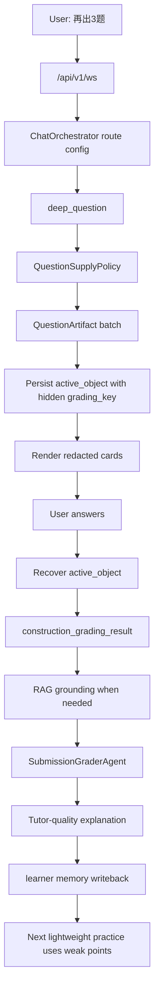

# 鲁班智考轻量出题与深度阅卷解释执行计划

> **For agentic workers:** REQUIRED SUB-SKILL: Use `root-cause-debugging` before changing route, follow-up, active object, or grading logic. Use `superpowers:executing-plans` when implementing this document step-by-step.

**Status:** Proposed v3  
**Owner surface:** `deep_question` / `question_followup` / `construction_grading` / `SubmissionGraderAgent` / learner memory  
**Created:** 2026-05-20  
**Related trace:** `f49977b5937b4a4bde720e99a4232c29`  
**Goal:** 让“出题”尽可能轻、快、稳定，同时保证用户作答后的解释像专业个人导师：讲知识点、采分点、易错点、记忆口诀、为什么错，并把错因沉淀到后续个性化练习。  

---

## 0. 结论先行

这次不应该把所有练题请求改成普通 chat，也不应该绕开 `deep_question` 做一条“轻量出题专线”。

正确方向是：

```text
轻量题目供给仍归 deep_question
  -> 出题阶段只生成题面 + 隐藏评分要点
  -> active object 保存 canonical question artifact
  -> 用户作答后由 construction_grading 先结构化判分
  -> 需要解释时再用 RAG + SubmissionGraderAgent 深度讲解
  -> 错因 / 采分点 / 下一题信号写入 learner memory
  -> 下一轮轻量出题优先消费这些学习事实
```

也就是说：

1. `deep_question` 仍然是题目生命周期 authority。
2. “轻量出题”不是少走 authority，而是少做出题时不必要的深度生成。
3. 出题时不需要生成完整答案解析给用户，也不需要生成长篇解析给后续备用。
4. 但必须保存最小评分 authority：选择题标准答案、主观题采分点、知识点、证据来源、常见陷阱。
5. 答后解释才是重计算阶段，应根据用户真实答案、错因、知识库证据、学习画像即时生成。

---

## 1. 本次触发问题与根因

### 1.1 现象

用户输入：

```text
很好，再出3题
```

生产 trace `f49977b5937b4a4bde720e99a4232c29` 最终返回：

```text
本轮生成失败，后台已记录问题。请稍后重试。
```

trace 关键事实：

| 事实 | 证据 |
| --- | --- |
| 请求被识别为练题生成 | `looks_like_practice_generation_request("很好，再出3题") = True` |
| 数量识别正确 | `_infer_question_count("很好，再出3题") = 3` |
| 但没有进入轻量出题 | `_should_use_lightweight_generation("很好，再出3题", None) = False` |
| turn 超时 | `Turn exceeded runtime deadline after 75.0s` |
| LLM 调用过重 | 7 次 `llm.stream` 合计约 102.5s |
| RAG 调用也重 | 15 次 retriever 合计约 21.8s |

### 1.2 根因判断

真正坏掉的一等事实不是“3 题识别失败”，而是：

> 用户要求继续练习时，系统应该以最短路径生成可作答题目，但当前把轻量练题请求送进了完整 `deep_question` 多阶段生成链路，导致 turn deadline 前没有完成。

根因分两层：

1. **策略层根因：** 轻量出题触发条件过窄，只覆盖“答完再分析 / 不显示答案”这类显式表达，没有覆盖普通的“再出 3 题 / 再来几道 / 继续练”。
2. **执行层根因：** 完整 `deep_question` 生成链路在 3 题场景下仍可能走 idea agent、多次生成、多次检索、逐题 LLM 调用，超出 fast turn 75s 预算。

还有一个必须单独修的运行时风险：

> `TurnRuntimeManager` timeout 后，外层 turn 已经失败，但 `ChatOrchestrator.handle()` 内部 capability task 可能继续运行，造成 trace 中 LLM 调用超过父 turn deadline。

这个风险不改变本计划的产品方向，但必须作为 Phase 0 修复项进入执行。

---

## 2. Karpathy Gate

### 2.1 assumptions

本计划采用以下解释：

1. 用户的核心目标是“出题质量高、速度快、答后解释质量高、系统越来越懂用户”。
2. “尽可能轻量出题”不等于“不要标准答案”，而是“不要在出题阶段生成完整长解析”。
3. 用户端不显示答案，但服务端必须保存隐藏评分 authority，否则答后判分和解释会退化。
4. 对建筑实务题，后续解释质量主要依赖题目评分要点、知识库证据、用户答案和 learner memory，而不是出题时预生成的完整解析。

### 2.2 simplest path

最短路径不是新增一个 `light_question` capability，而是改造现有 `deep_question` 内部策略：

1. 保留 `deep_question` 作为题目 lifecycle authority。
2. 扩大 `lightweight_generation` 的触发范围。
3. 将轻量出题输出收敛为 `QuestionArtifact`，保存隐藏评分要点，不生成长解析。
4. 答后复用现有 `construction_grading` + `SubmissionGraderAgent` 做深度解释。
5. 把错因和下一题信号写回现有 learner memory，不新增画像系统。

### 2.3 change boundary

允许触碰：

| 模块 | 允许改动 |
| --- | --- |
| `deeptutor/runtime/orchestrator.py` | 练题生成配置、轻量策略、timeout cancellation 边界 |
| `deeptutor/agents/question/coordinator.py` | 轻量生成路径、批量生成、跳过 idea agent |
| `deeptutor/agents/question/agents/generator.py` | 轻量 prompt 和返回结构 |
| `deeptutor/capabilities/deep_question.py` | `QuestionArtifact` 兼容、答后 grading/explanation 消费 |
| `deeptutor/services/question_followup.py` | active object / hidden authority 归一化与防泄露 |
| `deeptutor/services/construction_grading/*` | 最小评分 authority 消费、错因事件、下一题信号 |
| `deeptutor/agents/question/agents/submission_grader_agent.py` | 答后解释质量协议 |
| `tests/**` | 对应 regression、contract、performance guard |

不允许触碰：

1. 不新增聊天 WebSocket 路由。
2. 不新增第二套 `light_question` capability。
3. 不让微信前端传回标准答案成为评分 authority。
4. 不创建平行 learner state / memory 表。
5. 不把 `TutorBot`、`teaching_mode`、`lightweight_generation` 升级成题目业务身份。

### 2.4 verification target

完成标准：

1. “很好，再出3题”在 fast 模式下进入轻量题目供给链路。
2. 1-3 题出题 P95 小于 5s，5 题 P95 小于 10s。
3. 1-3 题生成 LLM 调用不超过 1 次，4-5 题不超过 2 次。
4. 出题结果不向用户显示答案、解析、采分点。
5. 服务端 active object 保留隐藏 `correct_answer / grading_key / knowledge_context / evidence_refs`。
6. 用户作答后，正确/错误先由 `construction_grading` 或确定性 authority 判定。
7. 错题解释必须包含知识点、采分点或逐项解析、易错点、记忆口诀、为什么错、下一步建议。
8. 错因和下一题信号写入 learner memory，下一轮出题能消费。
9. timeout 后内部 capability task 不继续消耗 LLM。

---

## 3. Single Authority Hard Gate

### 3.1 one business fact

本计划维护的一等业务事实：

> 每一道给用户作答的题，都必须有一个服务端 canonical question artifact；用户看到的是 redacted 题卡，服务端保存隐藏评分 authority；用户作答后，解释必须基于该 artifact、用户答案和知识库证据即时生成。

### 3.2 one authority

| 业务事实 | 唯一 authority |
| --- | --- |
| 题目生命周期 | `deep_question` capability |
| 当前可作答对象 | persisted `active_object` / `question_followup_context` adapter |
| 标准答案与采分点 | canonical `QuestionArtifact.grading_key` |
| 评分结果 | `construction_grading_result` |
| 答后解释 | `SubmissionGraderAgent` 读取 grading result + RAG grounding |
| 个性化弱点 | learner memory event / compiled learning truth |

### 3.3 competing authorities

必须降级或防止越权的对象：

| 对象 | 风险 | 处理 |
| --- | --- | --- |
| 生成时长篇 `explanation` | 让出题阶段变重，还可能成为过期解释 | 轻量模式默认不生成，答后再生成 |
| 微信 redacted context | 可能用空答案覆盖服务端标准答案 | 只允许作为提交载体，不作为评分 truth |
| 普通 TutorBot chat | 可能自由解释、自由改分 | 不承担题目评分 authority |
| `lightweight_generation` flag | 可能被误认为新业务身份 | 只作为 per-turn execution strategy |
| regex / follow-up fallback | 可能承担主理解职责 | 只做稳定格式保底，主链路使用 active object |

### 3.4 canonical path



### 3.5 delete or demote

本计划优先做减法：

1. 轻量出题跳过 `idea_agent`。
2. 轻量出题不逐题调用 LLM。
3. 轻量出题不生成完整长解析。
4. 出题阶段不做“答后解释”的工作。
5. renderer 不再从公开文本反解析题目 authority。
6. follow-up adapter 不再保存一份与 active object 竞争的标准答案。

---

## 4. 目标数据形态

### 4.1 `QuestionArtifact`

P0 可以先兼容现有 `QAPair`，但实现上应向以下结构收敛：

```json
{
  "question_id": "q_...",
  "question_type": "single_choice",
  "stem": "下列关于...",
  "options": [
    {"id": "A", "text": "..."},
    {"id": "B", "text": "..."}
  ],
  "public": {
    "show_answer": false,
    "show_explanation": false
  },
  "grading_key": {
    "correct_answer": ["B"],
    "scoring_points": [
      {
        "id": "p1",
        "text": "识别施工现场安全管理主体责任",
        "score": 1
      }
    ],
    "common_traps": [
      "把建设单位责任误认为施工单位责任"
    ],
    "minimal_rationale": "用于服务端判分和答后解释，不直接展示"
  },
  "knowledge_context": {
    "subject": "建筑实务",
    "knowledge_points": ["安全管理", "责任主体"],
    "difficulty": "medium"
  },
  "evidence_refs": [
    {
      "source": "questions_bank",
      "id": "..."
    }
  ],
  "personalization": {
    "target_weak_points": ["安全管理责任主体"],
    "reason": "recent_error_event"
  }
}
```

### 4.2 公开题卡

用户可见只允许包含：

1. 题干。
2. 选项。
3. 题型。
4. 题号。
5. 必要的作答提示。

用户可见禁止包含：

1. `correct_answer`
2. `grading_key`
3. `scoring_points`
4. `minimal_rationale`
5. `evidence_refs`
6. 任何“正确选项是...”形式的解析。

### 4.3 答后解释输入

答后解释使用：

```json
{
  "question_artifact": "...canonical server object...",
  "learner_answer": "...",
  "grading_result": "...construction_grading_result...",
  "rag_grounding": "...retrieved source snippets...",
  "learner_memory_context": "...recent weak points...",
  "conversation_context": "...minimal necessary history..."
}
```

禁止从最终 Markdown 或小程序题卡反推标准答案。

---

## 5. 真实使用场景复审

本计划必须覆盖真实学习链路，而不是只修“再出3题”这一句话。

### 5.1 场景分类与最优执行策略

| 场景 | 用户例子 | 执行策略 | 不能做 |
| --- | --- | --- | --- |
| A. 普通快速练题 | “再出3题”“来5道安全管理题” | `deep_question + lightweight_generation`；题库优先；只展示题卡 | 不能走普通 chat；不能显示答案 |
| B. 做完再分析 | “给我3题，做完再分析” | 轻量出题；隐藏评分要点；答后再深度解释 | 不能在出题时提前生成完整解析 |
| C. 用户明确要带解析 | “出3题并每题详细解析” | 这是教学展示，不是考试练习；可走 heavy 或明确 reveal 模式 | 不能伪装成不泄露答案的练题卡 |
| D. 继续同考点 | “类似的再来几道”“继续练刚才薄弱点” | 读 active object / latest grading signal / learner weak points 后轻量出题 | 不能随机换知识点；不能只靠最近 Markdown 猜 |
| E. 单题作答 | “我选B”“第2题选C” | 恢复服务端 artifact，进入 `answer_questions` | 不能被“下一题”等词误路由到 generation |
| F. 批量作答 | “1B 2C 3A”“第1题B，第3题D” | 按 `question_id` 或题号映射 canonical items，批量 grading | 不能按前端 redacted 顺序覆盖标准答案 |
| G. 改答案 | “第二题改选D” | 读取同一 active object，重算该题 grading，保留修订事件 | 不能创建新题；不能把旧评分当最终结论 |
| H. 问为什么错 | “为什么我选B错了”“这个考点怎么记” | 使用上一轮 grading result + RAG grounding + `SubmissionGraderAgent` | 不能重新出题；不能让普通 TutorBot 自由改分 |
| I. 案例题批改 | “我这样写能得几分” | 如果有 active case artifact，走 case grading；否则构建 open-skill 临时 bundle | 不能把 open-skill 伪装成校准 rubric |
| J. 无当前题上下文 | “为什么错了？”但 session 无题 | 澄清或要求提供题目；若有最近题 trace，可尝试恢复 | 不能编造上一题 |
| K. 大批量练习 | “出20题” | P0 拆成分批：先给 5 题，答完再继续；P1 再做异步/分页 | 不能一次 heavy 生成 20 题导致 timeout |
| L. 题库/知识库不足 | 某冷门考点无题库 anchor | 轻量生成后必须提高 validation；必要时降级为 heavy 或澄清范围 | 不能生成无法校验的题并进入评分链 |
| M. RAG 或模型异常 | 答后解释失败 | 已有 deterministic grading 仍可返回安全简版；提示稍后补充深度解析 | 不能把内部错误暴露给用户 |

### 5.2 P0 必须优先覆盖的高频路径

P0 不追求一次覆盖所有高级场景，先保证高频主链路稳定：

1. 普通快速练题：1-5 道选择题。
2. 做完再分析：不显示答案，答后解释。
3. 单题 / 批量作答。
4. 答错后为什么错。
5. 继续同考点 / 继续薄弱点。
6. timeout cancellation。
7. answer leak 防线。

P1 再做：

1. 大于 5 题的分页/渐进式练习。
2. 更完整的案例题 rubric 样本库。
3. 老 session 缺少 hidden grading key 的迁移修复。
4. 个性化出题的多目标优化，如知识点覆盖、难度曲线、遗忘曲线。

### 5.3 场景判定原则

当一个输入同时像“作答”和“继续练”时，优先级固定：

```text
可解析作答
  -> 先判分 / 解释当前题
  -> 再把继续练作为 next_training_suggestion
```

例如：

```text
第2题选B，再来几道类似的
```

必须先处理第 2 题作答，再把“类似题”放入下一步建议或后续 action，不能直接生成新题覆盖当前作答。

---

## 6. 当前条件下的最优交付切分

### 6.1 P0: 必须交付

P0 的目标是用最少改动拿到确定收益：

| P0 项 | 结果 |
| --- | --- |
| 轻量策略扩大 | “再出3题 / 再来几道 / 继续练”默认进入 lightweight `deep_question` |
| cancellation 修复 | timeout 后内部 task 停止，避免继续烧 LLM |
| batch lightweight generator | 1-3 题一次 LLM，4-5 题最多两次 |
| hidden grading key | 不显示答案，但服务端保留判分依据 |
| answer-time explanation | 答错后再深度 RAG + `SubmissionGraderAgent` |
| redaction regression | 小程序题卡、presentation、public response 不泄露答案 |
| trace gate | 能证明 strategy、LLM 次数、RAG 次数、orphan call、writeback |

P0 不做：

1. 不重建完整 rubric 数据库。
2. 不做 20 题一次性生成。
3. 不做新 capability。
4. 不做新的 learner profile 系统。
5. 不承诺每道 AI 生成题都达到真题质量；P0 先把“可校验、可作答、可解释”稳定住。

### 6.2 P1: 做强题目质量和个性化

P1 在 P0 稳定后推进：

1. `questions_bank` exact / similar retrieval 的排序与去重。
2. 小样本 rubric asset：优先 20-50 个高质量案例小问。
3. learner weak point selection：最近错因、长期薄弱、考试高频三者加权。
4. difficulty pacing：连续答对升难，连续答错降难并补概念题。
5. explanation evaluator：自动抽检“是否讲清楚为什么错”。

### 6.3 P2: 规模化体验

P2 才考虑：

1. 大题量分页练习。
2. 异步生成剩余题。
3. 多考试方向统一策略。
4. 老历史 session 的离线补 artifact。
5. 老师复核和高质量 goldens 工作台。

---

## 7. 顶尖产品体验复审

### 7.1 CEO Review Mode

本次复审采用 **SELECTIVE EXPANSION**：

1. 不扩大底层架构范围，不新增 capability、路由、画像系统或大 rubric 平台。
2. 扩大产品验收范围，把“快”和“准”升级成“学员愿意一直做下去”。
3. 只增加能直接提高复用率、留存和学习效果的体验闭环。

当前 v2 的强点是工程稳健；短板是还偏“后台链路计划”。如果要达到全球顶尖，P0 不能只证明出题快、解释全，还要证明用户的一个学习回合足够顺：

```text
看到题
  -> 愿意点
  -> 立即知道对错
  -> 明白为什么
  -> 感觉被理解而不是被训
  -> 立刻知道下一步
  -> 自然继续下一题
```

### 7.2 学员爱用的 5 个微循环

| 微循环 | 用户感受 | 系统行为 | P0 验收 |
| --- | --- | --- | --- |
| 快速开始 | “我一打开就能练” | 默认给 1-3 道当前最相关题；不先追问一堆条件 | 从输入“再出3题”到首题可答 <= 5s |
| 无摩擦作答 | “点一下就能继续” | 选择题一键点选；批量题支持逐题提交，也支持最后提交 | 题卡点击区域、提交按钮、下一题按钮在微信模拟器无遮挡 |
| 立即反馈 | “我马上知道自己卡在哪” | 先出判分结论，再渐进补解释；慢解释不阻塞知道对错 | 作答后 <= 2s 显示判分结论或安全等待态 |
| 温和纠错 | “它像老师，不像审判” | 错题表达用“你卡在 X 这个判断”而不是“你错了”；先肯定已掌握部分 | 错题解释不得只有否定句；必须指出一个可改进点和一个下一步动作 |
| 下一步自然 | “不用想下一步干嘛” | 每次解释结尾给 1 个主行动 + 最多 2 个辅助行动 | action chips: `再练3题` / `讲透这个点` / `看记忆口诀` 至少一个可用 |

### 7.3 答后解释的用户可见节奏

答后解释不应该一次性砸一大段。顶尖体验是 progressive disclosure：

```text
第一屏：
  结论：对 / 错 / 部分正确
  一句话指出卡点
  主行动按钮：再练3题 / 展开解析

展开后：
  为什么错
  逐项解析 / 采分点
  易错点
  记忆口诀
  下一题训练方向
```

P0 不需要做复杂 UI，但输出结构必须支持前端这样渲染：

```json
{
  "verdict": "...",
  "one_line_diagnosis": "...",
  "primary_next_action": {"type": "practice_more", "label": "再练3题"},
  "sections": {
    "why_wrong": "...",
    "knowledge_point": "...",
    "option_analysis": {},
    "common_pitfall": "...",
    "mnemonic": "...",
    "next_practice": "..."
  }
}
```

约束：

1. 首屏不超过 120 个中文字符。
2. 复杂解释必须分块，不能是大段 Markdown。
3. 每轮只推一个最推荐动作，避免按钮太多。
4. 如果用户连续答错 2 次，下一步默认“讲透这个点”，不是继续加难题。
5. 如果用户连续答对 3 次，下一步默认“提高一点难度”。

### 7.4 移动端丝滑标准

微信小程序体验必须按手机真实使用设计：

| 场景 | 标准 |
| --- | --- |
| 单手操作 | 选项和主按钮可拇指点击，不靠长文本链接 |
| 弱网 | 先显示安全等待态，不能空白卡住 |
| 中断恢复 | 用户退出再回来，仍能看到当前题组和已答状态 |
| 解释过长 | 默认折叠详细解析，保留结论和下一步 |
| 多题组 | 当前题号、已答数、剩余数必须稳定显示 |
| 错题复练 | “再练3题”必须继承当前错因，不重新问方向 |

这些是体验 gate，不是视觉优化项。任何 P0 实现如果只在 API 层通过，但小程序真入口里题卡不顺、按钮遮挡、解释长到看不完，都不能算完成。

### 7.5 留存与喜爱指标

技术指标只能证明系统可用，不能证明学员喜欢用。P0 需要新增体验观测：

| 指标 | 含义 | P0 目标 |
| --- | --- | --- |
| `time_to_first_answerable_question_ms` | 从用户请求到首题可答 | P95 <= 5000ms |
| `time_to_grading_verdict_ms` | 作答到判分结论 | P95 <= 2000ms |
| `practice_loop_completion_rate` | 生成题后至少完成 1 题的比例 | >= 70% |
| `next_action_click_rate` | 解释后点击下一步动作的比例 | >= 35% |
| `same_weak_point_retry_rate` | 错题后继续同考点练习比例 | >= 25% |
| `explanation_helpful_signal_rate` | 用户点赞、继续追问、继续练中任一正向信号 | >= 40% |
| `rage_regenerate_or_abandon_rate` | 反复重试、直接退出、长时间无动作 | <= 15% |

这些指标不要求 P0 一开始全达标，但必须埋 trace / event，否则上线后无法知道“快了但没人爱用”。

### 7.6 语气与教学人格

专业个人导师不是“输出更多字”，而是稳定做到：

1. 先降低挫败感，再指出问题。
2. 先讲当前题最关键的一个点，不展开百科。
3. 给用户可马上执行的下一步。
4. 记住用户刚错过的点，但不夸大长期画像。
5. 解释口径稳定：结论、原因、采分点、易错点、口诀、下一步。

禁止：

1. 长篇空泛鼓励。
2. 管理咨询式总结。
3. “你基础薄弱”这类未经证据支持的判断。
4. 一次给 5 个建议让用户选择。
5. 答对时只说“正确”，没有补充提分点。

### 7.7 P0 体验验收脚本

除自动化测试外，P0 必须手工跑 4 个 5 分钟脚本：

1. **新用户第一次练题**
   - 输入“给我3道安全管理题”。
   - 5 秒内看到可答题卡。
   - 点错一题。
   - 2 秒内看到判分结论。
   - 展开后看到为什么错、记忆口诀、下一步。

2. **连续学习闭环**
   - 做错一题。
   - 点击“再练3题”。
   - 新题命中刚才错因。
   - 不重新问方向。

3. **中断恢复**
   - 出 3 题，答 1 题。
   - 退出页面再回来。
   - 当前题组、已答状态、下一步动作仍在。

4. **挫败感保护**
   - 连续答错 2 题。
   - 系统默认进入讲解/基础巩固，而不是继续提高难度。
   - 文案不出现羞辱、否定人格、泛化画像。

通过标准：4 条脚本都在微信开发者工具或真机路径通过；Web harness 只能做快速筛查，不能替代小程序真入口验收。

---

## 8. 执行阶段

### Phase 0: 锁住现有问题和 cancellation 边界

**目标：** 先证明“再出3题失败”的根因，并防止 timeout 后继续烧 LLM。

**Files:**

- Modify: `deeptutor/runtime/orchestrator.py`
- Modify: `deeptutor/services/session/turn_runtime.py` only if cancellation owner confirms需要在 runtime 侧补强
- Test: `tests/runtime/test_orchestrator_autoroute.py`
- Test: `tests/api/test_unified_ws_turn_runtime.py`

- [ ] **Step 0.1: 固化 3 题识别与轻量策略测试**

新增测试覆盖：

```python
assert looks_like_practice_generation_request("很好，再出3题")
assert orchestrator._infer_question_count("很好，再出3题") == 3
assert orchestrator._should_use_lightweight_generation("很好，再出3题", context) is True
```

Acceptance:

```text
"很好，再出3题" 不再进入完整 heavy generation 默认路径。
```

- [ ] **Step 0.2: 修 cancellation propagation**

<!-- review-2026-05-20: A4 — 原伪代码只在外层 try/except 套 task.cancel()，但 ChatOrchestrator.handle 真正的 cancel 注入点是 `async for event in stream: yield event` 这条；不同时 close bus + 处理 GeneratorExit 会出现 task cancelled 但 stream 仍在迭代的死锁尾巴，且 _publish_completion 在 cancel 路径不会触发。下面给出完整版。 -->

要求：

1. `ChatOrchestrator.handle()` 内部 capability task 必须在外层 consumer cancel 时被取消。
2. timeout 后不得继续执行 `llm.stream`。
3. trace 中 parent turn deadline 之后不再出现该 turn 的新 generation observation。
4. **正常完成、client disconnect、turn timeout 三条路径**都必须把 `bus` 关闭并发出 `_publish_completion`。

完整修法（review-2026-05-20）：

```python
# deeptutor/runtime/orchestrator.py::ChatOrchestrator.handle
bus = StreamBus()

async def _run() -> None:
    try:
        await capability.run(context, bus)
    except Exception as exc:
        logger.error("Capability %s failed: %s", cap_name, exc, exc_info=True)
        await bus.error(str(exc), source=cap_name)
    finally:
        await bus.emit(StreamEvent(type=StreamEventType.DONE, source=cap_name))
        await bus.close()

stream = bus.subscribe()
task = asyncio.create_task(_run())
cancel_grace_s = float(os.getenv("DEEPTUTOR_CANCEL_GRACE_S", "2.0") or 2.0)

try:
    async for event in stream:
        yield event
except (asyncio.CancelledError, GeneratorExit):
    # 父 turn 被 deadline 取消 / client disconnect / FastAPI middleware shut down
    task.cancel()
    try:
        await asyncio.wait_for(task, timeout=cancel_grace_s)
    except (asyncio.TimeoutError, asyncio.CancelledError, BaseException):
        pass
    with contextlib.suppress(BaseException):
        await bus.close()
    context.metadata["turn_cancel_propagated"] = True
    raise
else:
    await task
finally:
    with contextlib.suppress(BaseException):
        await self._publish_completion(context, cap_name)
```

关键点：

- 同时捕获 `asyncio.CancelledError` 与 `GeneratorExit`（FastAPI client disconnect 走后者）。
- `cancel_grace_s` 给 task 2s 收尾（允许 capability 在 finally 里写完 trace 与 outbox）；超时硬切断。
- `bus.close()` 在 cancel 路径必须显式 await，否则订阅端可能挂死。
- `_publish_completion` 移到 `finally`，三条路径都发完成事件（含 cancel）。
- `context.metadata["turn_cancel_propagated"]` 让 trace gate 可断言（详见 §Step 0.3）。

Acceptance:

```bash
pytest tests/api/test_unified_ws_turn_runtime.py -k "timeout or cancel" -q
# 必须覆盖：正常 stream 完、client disconnect、turn timeout、capability 内部 LLM 调用被取消后立即停。
```

回归注意：

- 必须新增一条压测/慢 LLM mock 用例（`asyncio.sleep(120)`）确保 cancel 在 75s 后及时生效，避免 cancel_grace_s 误延长。
- `bus.close()` 多次调用必须幂等（若 `_run` 的 finally 已经 close 过）。

- [ ] **Step 0.3: 记录 trace guard**

<!-- review-2026-05-20: B3 — grep 显示当前代码中无 practice_generation.* 字段。如果不锁单一 writer，orchestrator 与 coordinator 可能各写一份，值不一致；gate 也无法稳定测量。下表增加 "writer / 写入时机" 列。 -->

新增观测字段或复用现有 trace metadata：

| 字段 | 含义 | Writer（唯一） | 写入时机 |
| --- | --- | --- | --- |
| `practice_generation.strategy` | `lightweight` / `heavy` | `orchestrator._prepare_practice_request_context` | classify 完成时 |
| `practice_generation.question_count` | 请求题数 | 同上 | 同上 |
| `practice_generation.llm_calls` | 出题阶段 LLM 次数 | `coordinator._lightweight_batch_generate / _generation_loop` counter | 每次 LLM 调用累加 |
| `practice_generation.retriever_calls` | 出题阶段检索次数 | `coordinator._resolve_lightweight_topic_knowledge_anchor` counter | 每次 retrieval 累加 |
| `practice_generation.bank_hits` | exact + similar 命中数 | `coordinator._resolve_lightweight_topic_knowledge_anchor` | retrieval 完成时 |
| `practice_generation.bank_hit_ratio` | 命中比例（0-1） | 同上 | 同上 |
| `practice_generation.lightweight_batch_fallback` | `none` / `parallel` / `heavy_retry` | `coordinator._lightweight_batch_generate` | 完成或降级时 |
| `practice_generation.generated_explanation` | 是否生成长解析 | `coordinator` post-flight summary | generation 完成时 |
| `practice_generation.span_name` | `practice_supply.lightweight` / `practice_supply.heavy` | `coordinator` 入口 | turn 开始 |
| `practice_explanation.span_name` | `practice_explanation.<question_type>` | `SubmissionGraderAgent` 入口 | 解释开始 |
| `practice_explanation.section_miss` | 缺失段落列表 | `validate_explanation_sections` | 校验完成 |
| `personalization_source` | `active_object_only` / `compiled_truth` / `memory_events_only` / `cold_start` | `coordinator._select_personalization_source` | weak point 解析时 |
| `turn.cancel_propagated` | timeout / disconnect 后内部 task 是否被取消 | `orchestrator.handle` except 路径 | cancel 触发时 |
| `construction_grading_result.grading_source` | `grading_key` / `questions_bank` / `llm_judge` | `construction_grading/mcq.py` 或 `case_kernel.py` | grade 完成时 |

**契约硬约束（review-2026-05-20）**：

1. 表中每个字段只允许一个 writer；其它模块**禁止**写同名字段。
2. 所有字段写入 `context.metadata["trace_metadata"]` 统一字典，不允许 capability 内部直接打 Langfuse。
3. `turn_runtime` 在 turn 结束时把 `trace_metadata` 一次性 flush 到 Langfuse / access log。
4. 静态扫描 lint：`rg -n "trace_metadata\\[.*practice_generation"` 必须只命中表中规定的 writer 文件。

---

### Phase 1: 扩大轻量出题策略，但不绕开 `deep_question`

**目标：** 普通“再出几题 / 继续练 / 来3道”默认轻量；只有明确要求深度命题、押题分析、完整讲解时才走 heavy。

**Files:**

- Modify: `deeptutor/runtime/orchestrator.py`
- Modify: `deeptutor/tutorbot/teaching_modes.py`
- Test: `tests/runtime/test_orchestrator_autoroute.py`
- Test: `tests/tutorbot/test_teaching_modes.py` 或现有对应文件

- [ ] **Step 1.1: 定义轻量策略**

<!-- review-2026-05-20: A2 — 当前 _should_use_lightweight_generation 只接受 reveal_preference is False 或 delayed_feedback patterns，"再出3题"会判 False。本表只列了 6 个条件，没给出 "fast/smart 默认轻量但识别 heavy negative keyword" 的可执行规则。下面追加 _classify_practice_strategy() 单一规约函数。 -->

轻量出题条件：

| 条件 | 规则 |
| --- | --- |
| capability | 仍为 `deep_question` |
| request intent | practice generation / related questions / continue weak-point practice |
| count | `1 <= num_questions <= 5` |
| reveal answer | false |
| user asks explanation | false |
| mode | fast / smart 默认轻量；deep 可按请求走 heavy |
| object context | 当前 active object 存在时优先继承知识点、错因、题型 |

必须走 heavy 的条件：

1. 用户要求“详细解析每题”。
2. 用户要求“高质量原创案例题并给命题依据”。
3. 用户要求“模拟真题卷 / 综合卷 / 押题分析”。
4. 题型是案例主观题且需要完整 rubric 生成。
5. 题库和知识库均无足够 anchor，轻量生成无法校验。

**单一规约函数（review-2026-05-20 追加）**：

> 现状：策略判断散落在 `orchestrator._should_use_lightweight_generation` 与 `_prepare_practice_request_context` 中，且后者只接受 `inferred_question_count <= 3`（详见 A3）。下面定义一个**唯一策略函数**，由 orchestrator 与 coordinator 共同消费，避免两处判断不一致。

```python
# deeptutor/tutorbot/teaching_modes.py（单一定义点）
def classify_practice_strategy(
    *,
    message: str,
    reveal_preference: bool | None,
    mode: str,                    # "fast" | "smart" | "deep" | "custom"
    num_questions: int,
    has_active_object: bool,
) -> Literal["lightweight", "heavy"]:
    HEAVY_KEYWORDS = (
        r"详细解析|逐题解析|每题解析|完整解析",
        r"命题依据|押题分析|押题预测|考点预测",
        r"模拟真题|综合卷|套题|真题卷|全真模拟",
        r"高质量原创案例|完整案例题|完整 ?rubric|完整评分标准",
    )
    text = (message or "").strip()
    if not text:
        return "heavy"
    if any(re.search(p, text) for p in HEAVY_KEYWORDS):
        return "heavy"
    if reveal_preference is True:           # 用户明确要"显示答案"
        return "heavy"
    if mode == "deep":
        return "heavy"
    if num_questions <= 0 or num_questions > 5:
        return "heavy"                       # 超量必须 heavy，并由调用方触发分页提示
    if looks_like_practice_generation_request(text):
        return "lightweight"
    return "heavy"
```

调用方契约：

- `orchestrator._prepare_practice_request_context` 用本函数填 `config_overrides["lightweight_generation"]`。
- `coordinator.generate_from_topic` 不再独立判断，只读 `config_overrides["lightweight_generation"]`。
- 任何新增策略入口（如 retry、`question_followup` 衔接）都必须复用本函数；禁止内嵌新的 regex / keyword 列表。

Negative case 测试矩阵补充：

| 输入 | 期望 strategy | 期望 num_questions |
| --- | --- | --- |
| `给我3题并每题详细解析` | heavy | 3 |
| `出3题，给出命题依据` | heavy | 3 |
| `综合卷一套` | heavy | 1 |
| `押题3道` | heavy | 3 |
| `继续练我刚才错的，3题` | lightweight | 3 |
| `再来5道类似的` | lightweight | 5 |
| `出6题` | heavy | 6 （触发分页提示） |

- [ ] **Step 1.1b: 修齐 orchestrator 题数上限**

<!-- review-2026-05-20: A3 — orchestrator.py:545 当前 `inferred_question_count <= 3 and _should_use_lightweight_generation(...)`，上限是 3，与本计划 §2.2 "4-5 题最多两次 LLM batch" 直接冲突。必须显式列入 P0 修订项。 -->

修改点：

- `deeptutor/runtime/orchestrator.py::_prepare_practice_request_context`：
  - 把 `inferred_question_count <= 3` 改为 `1 <= inferred_question_count <= 5`。
  - 由 `classify_practice_strategy(...)`（见 Step 1.1）统一决定，**不再独立判断 count**。
- `num_questions > 5` 时：路由 strategy = `heavy`，并在 turn 起手返回客户端可识别的 `pagination_required=true` hint（plan §5.1 场景 K：P0 不一次生成 20 题，先给 5 题 + 提示）。

Acceptance：

```python
assert classify_practice_strategy(message="再来5道类似的", reveal_preference=None,
                                  mode="fast", num_questions=5, has_active_object=True) == "lightweight"
assert _prepare_practice_request_context(ctx, "出5道安全管理题") \
    -> ctx.config_overrides["lightweight_generation"] is True \
    -> ctx.config_overrides["num_questions"] == 5
```

- [ ] **Step 1.2: 不新增概念**

`lightweight_generation` 只能作为 per-turn config：

```json
{
  "capability": "deep_question",
  "config": {
    "lightweight_generation": true,
    "num_questions": 3,
    "reveal_answers": false
  }
}
```

禁止出现：

1. `light_question` capability。
2. `/api/v1/light-question/ws`。
3. `TutorBot-light-question` 业务身份。
4. 用 `chat` 直接生成题卡并伪装成 active question。

- [ ] **Step 1.3: 测试矩阵**

```python
cases = [
    ("很好，再出3题", True, 3),
    ("再来三道类似的", True, 3),
    ("继续练我刚才错的点，5题", True, 5),
    ("给我3题，做完再分析", True, 3),
    ("给我3题并每题详细解析", False, 3),
    ("出一套完整案例题并给评分标准", False, 1),
]
```

Acceptance:

```bash
pytest tests/runtime/test_orchestrator_autoroute.py -k "lightweight_generation or practice_generation" -q
```

---

### Phase 2: 题目供给链路瘦身

**目标：** 轻量出题阶段用最少调用生成高质量可作答题，不做答后解释。

**Files:**

- Modify: `deeptutor/agents/question/coordinator.py`
- Modify: `deeptutor/agents/question/agents/generator.py`
- Modify: `deeptutor/capabilities/deep_question.py`
- Test: `tests/agents/question/test_generator.py`
- Test: `tests/agents/question/test_coordinator_followup_anchor.py`
- Test: `tests/capabilities/test_deep_question_lightweight_generation.py` <!-- review-2026-05-20: B5 — 文件目前不存在，本计划明确"必须新建"。最小 case 集：(a) lightweight=True 跳过 idea_agent；(b) batch generator 一次返回 N 题；(c) public payload 不含 correct_answer / grading_key；(d) state_snapshot.items[i].grading_key.correct_answer 存在；(e) bank_hits 命中时 LLM calls = 0。 -->

- [ ] **Step 2.1: 轻量路径跳过 idea agent**

规则：

```text
if lightweight_generation:
  skip idea_agent
  use topic / active_object / learner weak points / exact question anchors
  call batch generator once for 1-3 questions
else:
  keep existing ideation -> evaluation -> generation -> validation
```

Acceptance:

```text
1-3 题轻量路径中不出现 idea_agent observation。
```

- [ ] **Step 2.2: 批量生成，不逐题 LLM**

<!-- review-2026-05-20: A1 — 当前 coordinator._generation_loop 即使 lightweight=True 也仍逐题 await generator.process()，违反本 Step 目标。Plan 必须明确"如何"达到一次 LLM batch，否则 P95<5s 拿不到。 -->

要求：

1. 1-3 题：一次 LLM batch。
2. 4-5 题：最多两次 LLM batch。
3. exact question bank 命中足够时：0 次生成 LLM，只做 redaction 和 artifact assembly。
4. validation 必须是轻量校验：JSON schema、答案在选项内、题干非空、选项唯一、无答案泄露。

**实现路径（review-2026-05-20 追加）**：

> 现状：`deeptutor/agents/question/coordinator.py:_generation_loop` 对 templates 逐题 `await generator.process(template)`，无论 `lightweight_generation` 是否为 True。直接接到 P0 会卡在物理时间 = sum(单题)。

落地方案（按收益从高到低）：

1. **首选**：在 lightweight 路径**短路** `_generation_loop`，新增 `_lightweight_batch_generate(templates, ...)`：
   - 单次 prompt 输出 `{"questions": [{"stem":..., "options":..., "correct_answer":..., "grading_points":..., "common_traps":..., "knowledge_points":..., "source_hints":...}, ...]}`。
   - 复用现有 `Generator` 的 LLM client 与 prompt assembler，**不新增 agent 类**（避免引入 "BatchGenerator" 成为新业务身份）。
   - 1-5 题统一一次 LLM；prompt 内显式约束 `len(questions) == requested_count`。
2. **降级**：schema fail / count mismatch 时，对剩余题用 `asyncio.gather(*[generator.process(t) for t in remaining])`，物理时间 ≈ max(单题) 而非 sum(单题)；trace 标记 `lightweight_batch_fallback="parallel"`。
3. **禁止**：在 lightweight 路径走 `for ... await generator.process()` 串行循环。

Validation（lightweight schema）：

- `questions[*].stem` 非空且不重复。
- `questions[*].options[*].id ∈ {A,B,C,D,E}`，至少 2 个选项。
- `questions[*].correct_answer` 是 `options[*].id` 的子集。
- 整体不出现"答案是 X"等公开答案文案（denylist 正则）。
- schema 不通过 → 触发降级路径 (2)；降级仍失败 → 抛 `LightweightGenerationFailure`，coordinator 上报 trace 并由 capability 降级为 heavy 单次重试或返回 graceful "本题暂未生成" 卡。

Acceptance:

```text
trace 中 practice_generation.llm_calls == 1 for num_questions in [1, 5] (primary path)
trace 中 practice_generation.llm_calls <= 1 + ceil((requested - returned)/requested) (fallback)
practice_generation.lightweight_batch_fallback ∈ {"none","parallel","heavy_retry"}
```

- [ ] **Step 2.3: prompt 改成生成隐藏评分要点，不生成长解析**

轻量 prompt 输出字段：

```json
{
  "questions": [
    {
      "stem": "...",
      "options": [{"id": "A", "text": "..."}],
      "correct_answer": ["A"],
      "grading_points": ["..."],
      "knowledge_points": ["..."],
      "common_traps": ["..."],
      "source_hints": ["..."]
    }
  ]
}
```

禁止轻量 prompt 要求：

1. 长篇 `explanation`。
2. 每题完整教学解析。
3. 答案展示文案。
4. 与用户答案有关的解释，因为此时用户还没答。

Acceptance:

```bash
pytest tests/agents/question/test_generator.py -k "lightweight" -q
```

- [ ] **Step 2.4: 题库优先**

<!-- review-2026-05-20: B1 — retrieval_plan.py:58-62 已经有 "exact_question" 和 "questions_bank" source group，deep_question.py:127-128 已在消费。Plan 必须明确复用现有 RAG source group，不允许另建 lookup helper（否则会出现两套排序与去重逻辑）。 -->

优先级：

```text
exact / curated questions_bank
  -> same knowledge point variants
  -> template-constrained generated questions
  -> heavy generation fallback
```

题库题必须转换成同一 `QuestionArtifact` 形态，不能走一条题库专属评分链路。

**复用现有 RAG（review-2026-05-20 追加）**：

> 现状：`deeptutor/services/rag/retrieval_plan.py` 已注册 `exact_question` 与 `questions_bank` source group；`deeptutor/capabilities/deep_question.py:127-128` 已经按 `["exact_question","questions_bank"]` 顺序消费。

实施约束：

- `deeptutor/agents/question/coordinator.py::_resolve_lightweight_topic_knowledge_anchor`：
  - 调 `RetrievalPlan(source_groups=["exact_question","questions_bank"], top_k=requested)` 一次。
  - 命中：直接构造 `QuestionArtifact`，`grading_key.correct_answer` 来自题库字段，不调 LLM。
  - 未命中 / 命中数 < requested：仅缺口部分进入 `_lightweight_batch_generate`（A1），不重复 retrieval。
- **禁止新增** `_exact_question_lookup` / `_curated_bank_helper` 等独立 helper；任何题库读取都必须经过 `RetrievalPlan`。
- trace 字段：`practice_generation.bank_hits = exact_count + similar_count`、`practice_generation.bank_hit_ratio = bank_hits / requested`。

Acceptance：

```python
# coordinator 测试矩阵
def test_lightweight_anchor_reuses_existing_rag_source_groups():
    ...
def test_lightweight_anchor_does_not_introduce_parallel_lookup_helper():
    # 静态扫描：coordinator.py 不出现 questions_bank 直查 SQL / supabase 调用
    ...
```

---

### Phase 3: 保存 hidden authority，公开输出 redacted cards

**目标：** 用户看不到答案，但服务端答后能稳定恢复评分要点。

**Files:**

- Modify: `deeptutor/services/question_followup.py`
- Modify: `deeptutor/capabilities/deep_question.py`
- Modify: `deeptutor/services/session/sqlite_store.py` only if persistence shape needs compatibility
- Test: `tests/services/test_question_followup.py`
- Test: `tests/api/test_unified_ws_turn_runtime.py`
- Test: `wx_miniprogram/tests/test_ai_message_state.js`

- [ ] **Step 3.1: canonical artifact 入 active object**

要求：

1. `state_snapshot` 保存完整 hidden grading key。
2. public presentation 只保存 redacted view。
3. 多题 `items` 每题都有 `question_id`。
4. 顶层 `correct_answer / explanation` 在多题公开 context 中保持 redacted。
5. 服务端 canonical items 不被前端空字段覆盖。

Acceptance:

```bash
pytest \
  tests/api/test_unified_ws_turn_runtime.py::test_redacted_public_followup_context_does_not_override_grading_authority \
  tests/services/test_question_followup.py::test_merge_redacted_batch_submission_restores_all_authoritative_items_by_id \
  -q
```

- [ ] **Step 3.2: 防答案泄露测试**

新增 golden case：

```text
用户请求：再出3题
最终 response / presentation / wx card 中不得出现：
答案、正确选项、解析、correct_answer、grading_key、scoring_points
```

Acceptance:

```bash
node wx_miniprogram/tests/test_ai_message_state.js
pytest tests/services/test_question_followup.py -k "redacted or answer_leak" -q
```

- [ ] **Step 3.3: 兼容旧 QAPair**

P0 不需要一次性重命名全系统。允许内部兼容：

```text
QAPair.correct_answer -> QuestionArtifact.grading_key.correct_answer
QAPair.explanation -> deprecated, heavy only or answer-time generated
```

但新测试必须围绕 `QuestionArtifact` 语义写，防止未来继续依赖生成时长解析。

- [ ] **Step 3.4: grading_key 到 grader 的数据通路（review-2026-05-20 追加）**

<!-- review-2026-05-20: A5 — Step 3.1-3.3 锁了 state_snapshot 保存 hidden grading_key 的写入侧，但没规约"construction_grading 怎么读到它"。grep 显示 question_followup.py 当前是平铺 correct_answer / explanation，没有 grading_key 字段。对 AI 生成题（无 questions_bank 匹配），grader 必须从 active object 拿 grading_key，否则确定性判分会退化为 LLM judge，违反 §4 "判分先于解释"硬约束。 -->

数据通路：

```text
BatchGenerator / questions_bank
  -> QuestionArtifact.grading_key {correct_answer, scoring_points, common_traps, minimal_rationale}
  -> question_followup_context.items[i].grading_key （hidden，仅服务端）
  -> active_object.state_snapshot.items[i].grading_key
  -> 用户作答时，construction_grading 通过 turn_id / question_id 恢复
  -> construction_grading/mcq.py 或 case_kernel.py 优先消费 grading_key.correct_answer / scoring_points
```

实施清单：

- `deeptutor/services/question_followup.py`：
  - `items[i]` 新增 `grading_key` 字段（dict），与原 `correct_answer / explanation` 并存。
  - public payload serializer **必须** drop `grading_key` 和原平铺 `correct_answer`；只保留 `question_id, stem, options, question_type`。
- `deeptutor/services/construction_grading/mcq.py`：
  - 新增 `grade_choice(submission, grading_key, *, questions_bank_hit=None)`。
  - 优先级：`grading_key.correct_answer` > `questions_bank_hit.correct_answer` > LLM judge fallback。
  - trace 字段 `construction_grading_result.grading_source ∈ {grading_key, questions_bank, llm_judge}`。
- `deeptutor/services/construction_grading/case_kernel.py`：
  - case 题 `grading_key.scoring_points` 作为 rubric authority；缺失时退化到 `open_skill`，trace 标记 `case_grading_mode=open_skill`。
- `deeptutor/capabilities/deep_question.py`：
  - 接收用户作答时，先从 `active_object.state_snapshot` recovery `grading_key`，再调用 grader；不允许从 public payload 反推。

Acceptance（review-2026-05-20）：

```bash
pytest tests/services/test_question_followup.py \
  -k "grading_key_persisted_in_state_snapshot or grading_key_dropped_in_public_payload" -q
pytest tests/services/construction_grading/test_mcq_grading.py \
  -k "grade_choice_prefers_grading_key_over_questions_bank or grade_choice_falls_back_to_llm_judge_when_grading_key_absent" -q
pytest tests/core/test_deep_question_submission_grading.py \
  -k "ai_generated_question_grading_uses_active_object_grading_key" -q
```

防泄露双保险：

- public payload serializer 单测：`grading_key` 在 wire format 中**不出现**任何 key。
- redaction lint：`json.dumps(public_payload).find("grading_key") == -1`。

---

### Phase 4: 答后深度解释走专业导师链路

**目标：** 出题轻，但解释不能轻。用户答完后，系统必须像专业老师一样讲清楚。

**Files:**

- Modify: `deeptutor/capabilities/deep_question.py`
- Modify: `deeptutor/agents/question/agents/submission_grader_agent.py`
- Modify: `deeptutor/agents/question/prompts/zh/submission_grader_agent.yaml`
- Modify: `deeptutor/services/construction_grading/mcq.py`
- Modify: `deeptutor/services/construction_grading/case_kernel.py`
- Test: `tests/core/test_deep_question_submission_grading.py`
- Test: `tests/agents/question/test_submission_grader_agent.py`
- Test: `tests/services/construction_grading/test_mcq_grading.py`
- Test: `tests/services/construction_grading/test_case_grading_kernel.py`

- [ ] **Step 4.1: 判分先于解释**

固定顺序：

```text
recover active question artifact
  -> deterministic construction_grading when possible
  -> RAG grounding if wrong / partial / subjective / asks why
  -> SubmissionGraderAgent explanation
```

不得让 `SubmissionGraderAgent` 重新决定正确答案。

Acceptance:

```bash
pytest tests/core/test_deep_question_submission_grading.py -q
```

- [ ] **Step 4.2: 错题解释必备结构**

<!-- review-2026-05-20: B2 — §6.2 gate "错题解释必备段落完整率 >= 98%" 是发布门槛，但本 Step 只列段落，没规定如何"程序化检测段落是否齐全"。靠 LLM 自觉到不了 98%。必须加 schema validator + missing section retry。 -->

答错或部分正确时，最终输出必须包含：

1. 阅卷结论。
2. 正确答案或采分点。
3. 为什么用户答案错。
4. 对应知识点讲解。
5. 易错点。
6. 记忆口诀或记忆抓手。
7. 下一步练什么。

选择题额外要求：

1. 逐项解析。
2. 明确干扰项为什么错。

案例题额外要求：

1. 采分点命中。
2. 漏点。
3. 得分表达改写。

**程序化校验（review-2026-05-20 追加）**：

> 现状：当前 `submission_grader_agent.yaml` 是开放 prompt，输出是自由文本；§6.2 的 98% gate 没有程序化测量手段。

实施：

- 新增 `deeptutor/agents/question/agents/submission_grader_schema.py`：

  ```python
  from pydantic import BaseModel, Field
  class ExplanationSections(BaseModel):
      verdict: str             # 阅卷结论
      correct_answer: str      # 正确答案或采分点
      why_wrong: str           # 为什么用户答案错
      knowledge_point: str     # 对应知识点讲解
      common_pitfall: str      # 易错点
      mnemonic: str            # 记忆口诀（不严格要求 N 字）
      next_practice: str       # 下一步练什么
      option_analysis: dict[str, str] | None = None    # 选择题逐项解析
      scoring_points_hit: list[str] | None = None      # 案例题
      scoring_points_missed: list[str] | None = None   # 案例题
      rewritten_answer: str | None = None              # 案例题得分表达改写
  ```

- `SubmissionGraderAgent` prompt 改为强制输出 JSON（与上述 schema 对齐）。
- Agent 内部流程：
  1. 调 LLM 输出 JSON。
  2. 用 pydantic 校验；缺段 / 空字符串 → 触发 self-repair（再调一次 LLM，附上 missing fields list）。
  3. 仍缺 → trace 标记 `explanation_section_miss=[...]`，对缺段用模板兜底（来自 grading_key 内 `scoring_points / common_traps`），保证用户不会看到空段。
- 最终序列化前的 `validate_explanation_sections(...)` 是单一校验入口；旁路输出（如 capability 直接拼接）必须经此校验。

Acceptance:

```bash
pytest tests/agents/question/test_submission_grader_agent.py -q

# 必须包含：
#   - test_explanation_includes_all_seven_required_sections
#   - test_self_repair_fills_missing_sections
#   - test_template_fallback_when_repair_still_misses
#   - test_choice_question_includes_option_analysis
#   - test_case_question_includes_scoring_points
#   - test_no_choice_explanation_leaks_grading_key
```

测量与 gate 对齐：

- §6.2 "错题解释必备段落完整率 >= 98%" 的统计源 = trace 中 `explanation_section_miss` 长度为 0 的占比。
- "逐项解析存在率 选择题错题 >= 98%" 的统计源 = `option_analysis` 非 null 且 keys 覆盖所有选项 ID。
- "采分点解释存在率 案例题 >= 98%" 的统计源 = `scoring_points_hit + scoring_points_missed` 至少有一项非空。

- [ ] **Step 4.3: RAG 只在答后解释阶段重用**

触发 RAG 的条件：

| 场景 | 是否 RAG |
| --- | --- |
| 选择题答对，只要简单确认 | 可不 RAG |
| 选择题答错，需要解释 | RAG |
| 用户追问为什么错 | RAG |
| 案例题批改 | RAG |
| 生成轻量题卡 | 默认不做重 RAG，除非题库 anchor 不足 |

Acceptance:

```text
轻量出题 trace 中 retriever_calls 显著下降；答后解释 trace 中 grounding_context 存在。
```

---

### Phase 5: 个性化闭环

**目标：** 系统不是每次随机出题，而是越来越懂用户。

<!-- review-2026-05-20: B5 — recommendation.py 仓库里不存在；现有 writeback.py / learning_evidence.py 已承担 next_training_signal 写回。原文 "if existing, otherwise create only when required" 措辞过软，会诱导开发者新建文件。明确：不新建 recommendation.py。test_recommendation.py 同理删除。 -->

**Files:**

- Modify: `deeptutor/services/construction_grading/writeback.py`
- Modify: `deeptutor/services/construction_grading/learning_evidence.py`（已存在，复用其 `next_training_signal` 构造逻辑）
- Modify: `deeptutor/agents/question/coordinator.py`
- Modify: `deeptutor/services/learner_state/*` only if using existing write APIs requires adapter
- Test: `tests/services/construction_grading/test_audit_and_writeback.py`
- ~~Test: `tests/services/construction_grading/test_recommendation.py`~~ ← review-2026-05-20: 删除；统一在 `test_audit_and_writeback.py` 中加 `test_next_training_signal_persisted_for_lightweight_replay`

- [ ] **Step 5.1: 错因事件写回**

写入事件形态：

```json
{
  "event_type": "construction_grading_error",
  "source": "construction_grading",
  "question_id": "...",
  "knowledge_points": ["..."],
  "scoring_points_missed": ["..."],
  "error_tags": ["concept_confusion", "missed_condition"],
  "next_training_signal": {
    "target_weak_points": ["..."],
    "recommended_question_type": "single_choice",
    "difficulty": "medium"
  }
}
```

Acceptance:

```bash
pytest tests/services/construction_grading/test_audit_and_writeback.py -q
```

- [ ] **Step 5.2: 下一轮轻量出题消费 weak points**

轻量出题 context priority：

```text
explicit user request
  -> active object knowledge point
  -> latest grading next_training_signal
  -> learner compiled weak points
  -> bot default subject
```

Acceptance:

```text
用户说“继续练刚才薄弱的点”时，题目 knowledge_points 命中最近错因。
```

- [ ] **Step 5.3: 不编造画像**

如果 learner memory 不足：

1. 不输出“我发现你长期薄弱...”。
2. 可以说“这次先围绕刚才这道题的考点继续练”。
3. trace 标记 `personalization_source=active_object_only`。

---

### Phase 6: 性能、质量、发布 gate

**目标：** 用数据证明轻量出题更快，答后解释不降级。

**Files:**

- Modify: existing benchmark / observer config if available
- Test: `tests/benchmark` or current benchmark runner
- Docs: update `docs/plan/2026-05-13-luban-grading-chain-regression-matrix.md` if new gates become permanent

- [ ] **Step 6.1: 性能指标**

<!-- review-2026-05-20: B4 — 原表只给数字，没规定"基线在哪测、什么算 end"。不同模型/网络/cold-start 差异可达 3-5 倍，gate 永远过不了或永远通过。下面追加"基线来源"列与定义。 -->

| 指标 | Gate | 基线来源 | "end" 定义 |
| --- | --- | --- | --- |
| 1-3 题轻量出题 P50 | <= 2.5s | 离线 fixture | first card `template_ready` 事件 |
| 1-3 题轻量出题 P95 | <= 5s | 离线 fixture + 生产 shadow 7 天 | 最后一题 `template_ready` 事件 |
| 5 题轻量出题 P95 | <= 10s | 离线 fixture + 生产 shadow 7 天 | 最后一题 `template_ready` 事件 |
| 选择题答错解释 P95 | <= 8s | 生产 shadow 7 天 | `validate_explanation_sections` 通过事件 |
| 案例题解释 P95 | <= 15s | 生产 shadow 7 天 | 同上 |
| 1-3 题出题 LLM calls | <= 1 | 离线 fixture | trace `practice_generation.llm_calls` |
| 4-5 题出题 LLM calls | <= 2 | 离线 fixture | 同上（含 fallback 计数） |
| 轻量出题答案泄露率 | 0 | redaction lint + 单测 | public payload `correct_answer/grading_key` keys |
| timeout 后 orphan LLM calls | 0 | 注入 75s deadline 集成测试 | `turn.cancel_propagated=true` 后还出现的 `llm.stream` span |

**基线测量约定（review-2026-05-20 追加）**：

1. **离线 fixture**（必跑 / 阻塞发布）：
   - 文件：`tests/benchmark/test_lightweight_practice_latency.py`（新增）。
   - 固定模型（`fast_model=...` 与 `smart_model=...` 在 `.env.benchmark` 中锁定）。
   - 固定 seed，单 turn 跑 10 次，取 P50/P95。
   - 仅算 LLM call latency + retrieval latency，不算客户端渲染。
2. **生产 shadow**（连续 7 天观察期，发布 gate 用）：
   - Langfuse `practice_generation.span_name=practice_supply.lightweight` 的 95% 分位 wall-clock。
   - 必须按 fast / smart 分桶；deep mode 不进 gate。
   - 网络抖动剔除：丢弃 RTT > 1s 的 sample。
3. **gate 触发**：fixture 红或 shadow 连续 3 个 24h 窗口红 → block release（详见 §6.3 回滚条件）。
4. **Cold-start 单独标记**：进程冷启的 first turn 不计入 P95 统计（trace 字段 `cold_start=true` 标记并过滤）。

- [ ] **Step 6.2: 质量指标**

| 指标 | Gate |
| --- | --- |
| 题干完整率 | >= 99% |
| 选项唯一率 | >= 99% |
| correct_answer 在选项内 | 100% |
| grading_key 存在率 | 100% |
| 错题解释必备段落完整率 | >= 98% |
| 逐项解析存在率 | 选择题错题 >= 98% |
| 采分点解释存在率 | 案例题 >= 98% |
| learner writeback 成功率 | >= 99% |

- [ ] **Step 6.3: 发布顺序**

建议 flag：

```text
DEEPTUTOR_LIGHTWEIGHT_PRACTICE_SUPPLY_V1
```

灰度顺序：

1. Local unit tests。
2. Local `/api/v1/ws` smoke。
3. 微信开发者工具模拟器。
4. Aliyun shadow trace only。
5. 10% fast mode practice generation。
6. 50% fast + smart mode。
7. 默认开启。

回滚条件：

1. 答案泄露任意一次。
2. correct_answer 恢复失败率大于 0.1%。
3. 错题解释必备段落完整率低于 95%。
4. timeout 后 orphan LLM calls 不为 0。
5. 1-3 题 P95 连续 30 分钟大于 8s。

---

## 9. 测试清单

### 6.1 单元测试

```bash
pytest \
  tests/runtime/test_orchestrator_autoroute.py \
  tests/agents/question/test_generator.py \
  tests/agents/question/test_submission_grader_agent.py \
  tests/services/test_question_followup.py \
  tests/services/construction_grading/test_mcq_grading.py \
  tests/services/construction_grading/test_case_grading_kernel.py \
  tests/services/construction_grading/test_audit_and_writeback.py \
  -q
```

### 6.2 回归矩阵

```bash
pytest \
  tests/api/test_unified_ws_turn_runtime.py::test_redacted_public_followup_context_does_not_override_grading_authority \
  tests/api/test_unified_ws_turn_runtime.py::test_answered_active_question_can_generate_related_questions_without_regrading \
  tests/services/test_question_followup.py::test_canonical_presentation_keeps_choice_aliases_as_interactive_cards \
  tests/services/test_question_followup.py::test_merge_redacted_single_submission_with_authoritative_question_set \
  tests/services/test_question_followup.py::test_merge_redacted_batch_submission_restores_all_authoritative_items_by_id \
  tests/core/test_deep_question_submission_grading.py \
  -q
node wx_miniprogram/tests/test_ai_message_state.js
```

### 6.3 手工验收脚本

本地 `/api/v1/ws` 或微信开发者工具验证：

1. 输入“很好，再出3题”。
2. 确认 5s 内出现 3 道题卡。
3. 确认题卡无答案和解析。
4. 回答第 2 题错误。
5. 确认解释包含逐项解析、知识点、易错点、记忆口诀、为什么错、下一步建议。
6. 输入“继续练刚才薄弱的点”。
7. 确认新题围绕刚才错因，而不是随机换知识点。

### 6.4 Langfuse / trace 验收

trace 必须看到：

```text
practice_generation.strategy = lightweight
practice_generation.question_count = 3
practice_generation.llm_calls <= 1
practice_generation.generated_explanation = false
active_object.object_type = question_set
construction_grading_result.authority = construction_grading
grading_explanation_grounded = true when answer is wrong
learner_memory.writeback.status = success or explicit skipped reason
```

---

## 10. 不确定性与验证方案

当前计划仍有几类不确定性，不能在实现前假装已经确定。

| 不确定性 | 为什么重要 | 验证方式 | 替代方案 |
| --- | --- | --- | --- |
| `questions_bank` 对高频考点覆盖是否足够 | 如果题库 anchor 不够，轻量生成质量会下降 | 抽取最近 100 个练题/错题请求，统计 exact/similar 命中率、知识点覆盖率、重复率 | 命中不足时，P0 允许轻量 LLM 生成；P1 建小样本高频题库 |
| 轻量 prompt 能否稳定产出可判分题 | 轻量不等于低质；必须保证答案在选项内、题干清楚、干扰项合理 | golden set 100 条，跑 schema + answer-in-options + human spot check | 校验失败时自动重试一次；仍失败则 fallback heavy 或题库题 |
| 不生成长解析是否会影响答后解释 | 答后解释质量依赖 hidden grading key 和 RAG，不依赖预生成解析，这是需要验证的假设 | A/B：同题同答，对比“预生成解析”与“答后解释”的人工评分 | 如果答后解释变浅，增加 `minimal_rationale / common_traps / scoring_points`，仍不回到长解析 |
| `SubmissionGraderAgent` 是否能稳定输出专业导师结构 | 当前 prompt 有要求，但模型可能漏段落 | 结构化 output checker 检查必备段落，失败时要求 self-repair 一次 | P0 用模板包裹 deterministic grading，再让 LLM 填解释槽位 |
| learner memory 写回是否及时可读 | “越来越懂用户”依赖写回和下一轮读取闭环 | 写回后同 session 下一轮读取 test；生产 trace 看 writeback latency / miss rate | 若异步写回延迟，下一轮先读 latest grading result，再补 learner memory |
| cancellation 修复是否会误杀正常流式输出 | 取消边界改错会造成正常 turn 被提前取消 | 压测 slow LLM stream、client disconnect、server timeout 三种 case | cancellation 只绑定 parent task lifecycle；保留 terminal failed/cancelled 物化 |
| fast mode 性能 gate 是否过紧 | 不同模型和网络波动会影响 P95 | 本地、Aliyun、生产 shadow 分别记录 P50/P95/P99 | P0 以 LLM calls 和 timeout 为硬 gate，P95 阈值可用 7 天数据校准 |
| 案例题 rubric 资产是否足够 | 主观题解释质量比选择题更依赖采分点 | 先选 20-50 个高质量小问做人工 rubric 样本 | 没有 rubric 时只标 `open_skill`，不承诺精确分，只给参考批改 |

不确定性处理原则：

1. 能用测试确认的，不靠主观判断。
2. 能降级的，必须给用户安全、诚实的降级结果。
3. 不能确认 authority 的，不能进入可持续个性化画像。
4. 任何 fallback 都必须有 trace reason，不能静默吞掉质量问题。

---

## 11. 失败模式与防线

| 风险 | 用户感知 | 防线 |
| --- | --- | --- |
| 轻量题质量下降 | 题目像模板题、考点不准 | 题库优先、schema 校验、knowledge_points 必填、重题去重 |
| 答后解释变浅 | 只告诉答案，不像老师 | `SubmissionGraderAgent` 必备段落测试、RAG grounding、错因标签 |
| 答案泄露 | 题卡直接显示正确答案 | redacted presentation golden test、wx test、public context denylist |
| 标准答案丢失 | 用户答对却判错 | active object hidden authority persistence test |
| 个性化编造 | 系统假装了解用户 | personalization source trace、无 memory 时只用当前错因 |
| timeout 后继续调用 LLM | 成本浪费、trace 混乱 | cancellation propagation test |
| 轻量 flag 变成新概念 | 系统多一套业务身份 | contract 注释：flag 仅为 per-turn execution strategy |

---

## 12. 与既有计划的关系

| 文档 | 关系 |
| --- | --- |
| [2026-05-14-luban-skill-first-grading-thin-shell-execution-plan.md](2026-05-14-luban-skill-first-grading-thin-shell-execution-plan.md) | 本计划继承其“薄外壳、Skill-first、结构化判分先于表达”的方向；新增出题阶段轻量化与性能 gate。 |
| [2026-05-13-luban-grading-chain-regression-matrix.md](2026-05-13-luban-grading-chain-regression-matrix.md) | 本计划必须继续满足 G1-G9，并建议新增轻量出题性能与 cancellation guard。 |
| [2026-04-18-llm-native-active-object-semantic-router-prd.md](2026-04-18-llm-native-active-object-semantic-router-prd.md) | 本计划不新增 follow-up router，只复用 active object 与语义连续性原则。 |
| [2026-05-18-luban-learning-brain-gbrain-absorption-implementation-plan.md](../学习脑与学员记忆/2026-05-18-luban-learning-brain-gbrain-absorption-implementation-plan.md) | 本计划的错因和下一题信号应进入 learning evidence / compiled truth，不新增平行学习画像。 |

---

## 13. 最小实施顺序

建议按以下小批次执行，避免大改：

1. **Batch A: timeout + routing guard**
   - 修 cancellation propagation。
   - 让“很好，再出3题”进入 lightweight config。
   - 添加 trace 字段。

2. **Batch B: lightweight supply**
   - 跳过 idea agent。
   - 批量生成 1-3 题。
   - prompt 改为 hidden grading key，不生成长解析。

3. **Batch C: artifact persistence + redaction**
   - hidden authority 入 active object。
   - public presentation 防泄露。
   - 微信题卡回归。

4. **Batch D: answer-time deep explanation**
   - 确保 grading result 先于 explanation。
   - 错题解释强制专业导师结构。
   - RAG 只在答后解释阶段重用。

5. **Batch E: personalization loop**
   - 错因写回。
   - 下一轮轻量出题消费 weak points。
   - Langfuse / benchmark gate。

每批都必须能独立合入、独立回滚、独立验证。

---

## 14. Done Definition

本计划只有在以下全部满足后才算 Done：

1. `很好，再出3题` 本地和线上都不再 75s timeout。
2. 轻量出题默认不生成长解析，LLM 调用数符合 gate。
3. 小程序题卡不泄露答案。
4. 服务端 hidden grading key 可恢复，前端 redacted context 不覆盖。
5. 用户答错后的解释达到专业导师结构。
6. 错因写入 learner memory，下一轮练习能命中弱点。
7. Langfuse trace 能证明轻量出题和答后深度解释是两段不同工作。
8. 回归矩阵 G1-G9 全部通过。
9. timeout cancellation guard 通过，orphan LLM calls 为 0。
