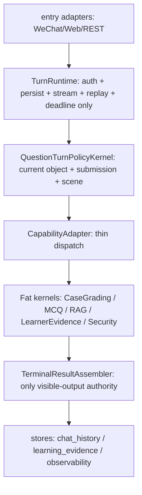

# DeepTutor 控制面单一权威收权 + Fast / Deep Mode 与 Orchestrator 简化改造计划

> Status: Proposed v0.4 / Canonical control-plane authority collapse, Phase -1 thin-slice, Phase 0 WEAK-GO, Phase 1-3 gated
> Created: 2026-06-26
> Revised: 2026-06-26
> Type: Architecture authority collapse + simplification + latency execution plan
> Scope: `/api/v1/ws`, `TurnRuntimeManager`, `ChatOrchestrator`, TutorBot, question lifecycle, semantic router, `deep_question`, grading, observability, WeChat true-entry
> Goal: 彻底收敛控制面单一权威，让每个 turn 的 relation、submission、active object、scene、reveal、capability、terminal visibility 都只有一个 canonical writer；在这个前提下把 `ChatOrchestrator` 削薄、fast 首个有用内容变快、deep 更早给出可靠中间结果，并保证题目、评分、答案揭示、上下文连续和安全红线不退化。

## 0.A 专家评审视角与收权裁决（v0.4）

本次用户要求的不是再补一个局部 bugfix，也不是另写一份“总纲”。本文件升级为控制面收权的 canonical umbrella，但它仍是 `Proposed` 计划，不凌驾于已落地 contract。`2026-05-26 question lifecycle authority consolidation`、`2026-06-20 cross-capability context continuity`、`2026-06-23 grading/routing single authority`、`2026-06-24 grading-state/submission authority collapse` 都降级为本计划的 evidence / child execution plan；若本计划与 `CONTRACT.md`、`contracts/turn.md`、`contracts/index.yaml` 中已固化的不变量冲突，以 contract 为准。本计划只有在对应实现合并并同步 contract/test 后，才成为该事实的新裁决口径。

专家团队分工：

- 总指挥 / 架构裁决：判定是否做系统性重组、哪些计划收口、哪些对象禁止升级为新 authority。
- 控制面架构专家：收敛 `/api/v1/ws -> TurnRuntimeManager -> ChatOrchestrator -> capability` 的 writer/reader 边界。
- 题目生命周期专家：收敛 question lifecycle、semantic router、submission confidence、active object transition。
- TutorBot / `deep_question` 专家：把 TutorBot 和 `deep_question` 定位为 fat skill / capability sink，不允许各自重判同一业务事实。
- Reveal / terminal result 专家：收敛 public reveal、visible sink、WS redaction、terminal result。
- QA / live gate 专家：把 hard corpus、same-SHA replay、WeChat true-entry、observability 变成删除前置门。
- 红队 / less-is-more 专家：阻止把收权做成更大的 orchestrator、更厚的 envelope 或第二套控制面。

评审最终判断：

1. 需要系统性架构收权，但不需要 big-bang rewrite。问题根因是 **control-plane authority fragmentation**，不是某一个函数写得丑。
2. 系统性重组的正确形态是“逐事实收权 + 逐 writer 降权 + 逐阶段删除”，不是先建一个新的 central brain。
3. `ChatOrchestrator` 的目标不是变成更聪明的总裁判，而是变成更薄的 dispatcher：它只请求 canonical decision、做边界归一化和 dispatch，不写业务事实。
4. 若为了收权新增 `TurnRoutingDecision`、`FastTurnExecutionPolicy`、`PublicRevealDecision` 或任何 aggregate helper，必须证明它只携带既有 per-fact authority 输出，并且同一 PR 的 writer/decider 数量下降；否则禁止实现。
5. 每个 PR 必须至少满足一条：删除一个 production writer、降级一个 duplicate decider、把一个 bypass reader 改成只读 canonical decision、或补足一个删除所需的 hard gate。纯文档、纯 telemetry、纯 wrapper 不算收权。

本计划的一等事实集合：

> 每个 user turn 在统一 `/api/v1/ws` 链路内，relation、submission、active object、question scene、capability dispatch、public reveal 和 terminal visibility 这些 turn facts 必须各自由唯一 canonical writer 写入；其他层只能读、投影、观测或做 last-mile defensive guard。

这里的 canonical control closure 是逻辑闭包和验收口径，不是默认新增的持久化字段、schema、resolver、metadata 或中央平台。禁止新建 `canonical_control_decision` metadata、`ControlPlaneResolver`、new fast orchestrator 或 central brain。任何 aggregate helper 都只能读取并转发 §5.A.1 的 per-fact authority 输出；同一 PR 删除旧 writer 也不能把 aggregate helper 升级成新的业务事实 writer。

物理落点按 §5.A.1 的 per-fact 既有字段读取，例如 lifecycle decision、`turn_semantic_decision`、reveal decision、terminal result event；不新建统一持久化对象。任一 reader 不得重算闭包，只能读取这些既有字段或只读 projection。

共同病因：

```text
same turn fact
  -> written by multiple modules
  -> read back through metadata aliases / fallback / shadow knobs
  -> reinterpreted by Orchestrator, QLS, semantic_router, deep_question, TutorBot, WS, renderer
  -> live bug looks like latency, wrong grading, lost context, answer leak, or terminal pending
```

因此本计划不是 latency-only。fast/deep 体验问题、判分态误判、跨能力失忆、fabricated semantic decision、reveal 双 sink、terminal pending，本质都要先问同一个问题：

> 这个 turn fact 的唯一 writer 是谁？如果答不上来，先收权，再谈优化。

## 0.B 目标拓扑（v0.4 必须收成这个形状）

本计划不照搬 HKUDS，但吸收它的拓扑：**一个 turn engine，一个 agent loop；TutorBot / Partner 是产品身份与 skill stack，不是第二套执行引擎。**

目标结构：



命名约束：

- `QuestionTurnPolicyKernel` 是目标架构角色，不要求第一 PR 就新增同名 class。它可以先由现有 `question_lifecycle_skills`、semantic router、`question_followup` 组成，但对外必须表现为唯一 question-turn policy writer。
- `QuestionTurnPolicyKernel` 只拥有 current object、submission、scene、active-object patch 这些 question-turn facts；它不拥有 reveal、terminal result、case score、RAG truth 或 learner truth。
- `QuestionTurnPolicyKernel` 有 fact ceiling：只允许写 `scene`、`relation`、`submission intent/evidence`、`current object identity`、`active-object patch` 这五类 question-turn facts。任何第六类事实都视同新增 control object，必须先删除或降级旧 writer，不能把 ChatOrchestrator 的中央大脑搬进 QTPK。
- `CapabilityAdapter` 是 `ChatOrchestrator` 的目标角色。它只读 `QuestionTurnPolicyKernel` 输出并 dispatch，不解释 message、不重判 submission、不写 reveal、不拼业务策略。
- `TurnRuntime` 只能做 auth、deadline、stream、persist、replay、store handoff。它可以恢复和保存事实，但不得推断或改写 question lifecycle、submission、grading receipt、terminal metadata 的业务含义。
- `TurnRuntime` 不得 pre-stamp、pre-classify 或推断 current submission / scene / active-object patch。任何历史 pre-stamp 只能作为 `compat_projection`，并必须由 `QuestionTurnPolicyKernel` 或对应 canonical authority 产出；runtime 只负责保存、恢复、应用已签发 patch。
- `TerminalResultAssembler` 是唯一 visible-output authority。它可以先落在 runtime 内部，但它的职责必须从 capability payload、WS redaction、renderer presentation 中收出来：capability 只产业务 payload，assembler 负责可见输出、redaction 后终态和 terminal metadata。
- TutorBot / Partner / bot profile 是身份、语气、工具绑定和 skill stack；不是第二套 engine，不持有评分、题目生命周期、current-object 或 terminal-result authority。

冻结规则：

```text
freeze_new_router_classifier_fallback = true
```

新增 router / classifier / interpreter / fallback / special-case state 只有在同一 PR 同时删除或降级旧判断点，且 `authority_count_after < authority_count_before` 时才允许进入。否则不进入实现，只能登记为 evidence / hard-case。

## 0. 总指挥裁决

本计划不是“推翻本仓架构”，也不是“直接照抄 HKUDS/DeepTutor”。2026-06-26 只读抽样确认：上游 HKUDS/DeepTutor HEAD `30b92dfe86f5b5e86ab345f250c51c7abad611aa` 已经有 `deeptutor/runtime/orchestrator.py`，但它是约 126 行的 thin dispatcher：取 `context.active_capability or "chat"`，查 registry，创建 `StreamBus`，执行 capability，发布 completion event。上游的简洁性值得吸收，但它没有承载我们本地的 TutorBot 题目生命周期、hidden grading、active object、微信真入口、Learning Brain、release observability 等业务安全层。

最终路线：

1. 保留统一入口和关键 runtime authority：`/api/v1/ws`、`TurnRuntimeManager + SQLiteSessionStore`、`QuestionLifecycleDecision`、semantic router、`deep_question`、grading kernel、public redaction。
2. 把 `ChatOrchestrator` 从“业务决策堆叠点”削薄成“薄编排器”：只做边界归一化、调用唯一 authority、发 trace、分发 capability；它不再散写 relation、submission、active object、scene、reveal、response mode。
3. 把控制面事实收进一个 canonical path：turn-start restore、lifecycle scene、semantic relation、submission confidence、active-object transition、capability dispatch、reveal、terminal result 必须有唯一 writer 和只读 reader 列表。
4. 把 fast 模式定义为强执行策略：短链路、权威优先、低前置、单次生成、早公开安全内容；fast 不是低质量模式，也不能绕过题目、评分、答案揭示和上下文连续 authority。
5. deep 模式也要优化，但目标不同：不是把 deep 做浅，而是先给 ack / first conclusion / first evidence-backed claim，再继续完整检索、推理、评分和讲解。
6. 先做 48 小时 thin-slice，但 thin-slice 的输出不只是 latency attribution，还必须证明一个 authority writer/decider 被删除、降级或改成只读。
7. Phase 0 才扩展到观测、盘点、契约映射和反证实验。Phase 1-3 必须等 gate 通过后再实施，且每阶段都要让 production writer/decider 数量下降。

一句话：**先收权，再加速；先用真实 turn 证明减法有效，再扩展治理；先证明，再删除；只吸收上游的 thin dispatcher 思路，不复制上游代码替代本地业务 authority。**

## 0.1 三大原则落地

### Thin Wrappers And Fat Skills

- API、WS、Orchestrator、adapter 只能做归一化、鉴权、trace、redaction、dispatch。
- 题目生命周期、答题判定、评分协议、答案揭示、response mode、知识召回、上下文连续必须归明确的 skill / kernel / service authority。
- wrapper 中增长的 regex、fallback、prompt 拼接、状态推断、路由判断，一律先按架构异味处理。

### First Principles

本次真正的一等结构事实不是“代码行数要少”，也不是“首 token 数字好看”，而是：

> 每个 user turn 的 relation、submission、active object、scene、dispatch、reveal、terminal visibility 只有一个 canonical writer；其他层只能读这个事实、投影这个事实或防御性校验这个事实。

用户可感知的结果指标是：

> 用户发出一个 turn 后，多久能看到第一个真正有用、可公开、不会泄露隐藏事实、不会误判场景的业务内容。

这不是 progress，不是 provider 首 token 本身，也不是 Langfuse total latency。它必须由 `TurnRuntimeManager` 写入 turn event，provider 只写 provider-stage telemetry，frontend 只写 consume telemetry。

### Less Is More

本计划优先减少：

- 概念数量。
- authority 数量。
- 决策点数量。
- 首 token 前状态读取。
- 首 token 前工具和 source loader。
- shadow/fallback 的长期驻留。

不允许减少：

- hidden answer / grading key 防泄露。
- active object continuity。
- unresolved follow-up context continuity。
- public redaction last-mile guard。
- open-world grading provenance。
- WeChat true-entry 验收。

## 0.2 2026-06-26 对抗评审修订裁决

专家组初稿 v0.1 被红队判为：Phase 0 可做，Phase 1-3 暂时 NO-GO。主要原因是 v0.1 把“删除复杂度”写得太顺，容易误删 safety guard，也可能把 `TurnRoutingDecision` / `FastTurnExecutionPolicy` 做成新的第二权威。

v0.2 修订：

1. Phase 0 状态改为 WEAK-GO：只允许盘点、观测、contract mapping、hard-case corpus 和 provider/queue/context/frontend 归因实验。
2. Phase 1-3 改为 gated：没有 shadow parity、live zero-hit、contract guard、hard corpus 通过，不允许删主链路 guard。
3. 明确所有新对象都是 read-only envelope / projection，不是新 decider。
4. 明确不能删除的安全带。
5. 把 TTFT 改为 `first_useful_content`，progress 不得计入。
6. 把 provider attribution、WeChat true-entry、frontend terminal consume 写成独立验证面。
7. 删除“删行数大于新增行数”这类可被游戏化指标，改用 authority count、decision count、pre-token work count、shadow diff 和场景质量 gate。

## 0.3 2026-06-26 Claude 辅助对抗后的收缩裁决

Claude CLI 定向审查指出 v0.2 仍有一个危险倾向：前 60 天偏向新增 inventory、typed object、event grammar 和大 telemetry 表，真正删除被推到 Phase 3。这会落入“先测量、以后再简化，但以后永远不删”的常见陷阱。

v0.3 接受这条批评，并把路线收缩：

1. **authority baseline first, latency thin-slice second**：先做最小 authority inventory、hard corpus 和 writer allowlist baseline；再抓一个真实慢 turn，最小补足能定位它的 telemetry，找到单一最大 stall，再做一个可回滚减法。
2. **apparatus gated**：`TurnRoutingDecision`、`FastTurnExecutionPolicy`、`PublicRevealDecision`、`UserVisibleEventBoundary` 都是候选对象，不是默认必建对象；只有证明 authority 数量或决策点数量下降，才允许进入实现。
3. **per-fact authority preferred**：如果 Orchestrator 需要手写合并 5-6 个子决策才得到 routing，说明它仍是业务路口。优先让 §5.A.1 的 per-fact authority 各自写事实；任何 aggregate helper 只能读取和转发这些既有输出，禁止自算 lifecycle、relation、submission、reveal、execution budget。若 per-fact writer map 与“单一 resolve”不可兼得，以 per-fact writer map 为准，撤销单一 resolve。
4. **SLO 不许靠分桶逃避**：任何被“单列”的 provider-bound、current-info、exact/RAG、deep-upgrade 桶，都必须有独立 SLO、占比上限和总体兜底指标。
5. **删除 gate 必须有覆盖量**：7 天 0-hit 只有在 shadow 真跑过 hard corpus 和代表性生产分布时才有效。

## 0.4 2026-06-26 单一权威收口修订裁决

并行窗口已经发现“单一权威没有真正收口”的核心问题：计划目录里其实做过多次局部收口，但每次只压住一个症状，未把控制面事实统一落到 writer/reader/path/delete-gate 上。因此 v0.4 做三件事：

1. **合并而非新建**：本文件成为 `docs/plan/题目生命周期与助教运行时/` 下控制面收权主入口；后续不再新建与本文件并行的控制面总计划。
2. **收权优先级高于 latency**：fast/deep latency 仍在本计划内，但任何优化必须先证明不会新增 relation/submission/active-object/reveal/terminal 的第二 writer。
3. **旧计划降级为子证据**：5/26 question lifecycle、6/20 context continuity、6/23 routing/grading、6/24 submission authority 都是本计划的 case files；它们的修复必须挂回 §5.A authority map 和 §14.A execution tasks。
4. **文档收口必须带实现收口**：INDEX 只登记本文件为 umbrella 不等于问题解决。真正 pass 只能来自 `authority_count_after < before`、legacy production hits 清零、hard corpus/live/WeChat gate 对齐。
5. **不允许“再包一层总控”**：如果实现方案把 `ChatOrchestrator`、new `ControlPlaneResolver` 或 new envelope 变成更大的策略引擎，判为失败。正确方向是 fat skill/service authority 写事实，wrapper 只转发。

v0.4 的 implementation stance：

```text
systemic architecture reorganization = yes
big-bang rewrite = no
parallel plan = no
canonical umbrella = this file
first implementation principle = reduce writers before adding carriers
```

## 1. Karpathy Gate

### 1.1 Assumptions

- 用户当前最痛的是“发出消息后很久才看到有用回答”，包括 server latency、TTFT、provider wait、public delta gate 和前端终态消费。
- 慢不只来自 provider。近期 test2 和代码结构显示，慢段可能来自 generator start 到 first token，也可能来自 traffic control、context build、RAG/web search prefetch、notebook/history analysis、memory consolidation、post-turn refresh 或前端 pending 不释放。
- 当前 fast 模式还不像强契约，更像 hint 或局部策略。它没有从入口、routing、context budget、tool exposure、provider call、public gate 到 frontend consume 的闭环定义。
- 上游 DeepTutor 更简洁，原因主要是它的 Orchestrator 只是通用 dispatcher，业务教学场景大多沉到 agent loop / capability。我们可以吸收 thin dispatcher 原则，但不能直接丢掉本地业务 guard。

### 1.2 Simplest Path

最短路径不是重写 runtime，也不是新增一个 fast orchestrator。最短路径是：

1. 从一条真实最慢 fast turn 开始，不从全仓治理开始。
2. 只补定位这条 turn 最大 stall 所需的最小 telemetry。
3. 先验证一个低风险减法，例如 fast 首 useful 前禁用 memory consolidation、notebook/history analysis、forced web prefetch 或 post-turn refresh。
4. 如果减法有效，再扩展到 decider inventory 和 hard-case corpus。
5. 如果减法无效，停止扩大治理，改查 provider、traffic control 或 frontend consume。

### 1.3 Change Boundary

允许触碰：

- turn runtime / WS streaming metadata、first useful content telemetry、provider telemetry 接线。
- `ChatOrchestrator` 编排、legacy fallback 降级、decision envelope。
- TutorBot response mode policy、context budget、agent loop fast/deep 分流。
- `question_lifecycle_skills`、semantic router、`deep_question`、grading kernel 的接口和 provenance，不改变其 ownership。
- eval replay、golden corpus、Langfuse/turn event、WeChat true-entry gate。

不授权：

- 新增第二聊天 WebSocket 入口。
- 新增 fast 专用 WS route。
- 让 `teaching_mode` 承担身份、工具、知识库绑定或 routing。
- 让 fast 绕过 `QuestionLifecycleDecision`、active object、submission confidence、hidden grading、answer reveal。
- 让 renderer/WS 表面过滤答案来掩盖后端 reveal 错误。
- 为了快删除 context continuity 或 public redaction。

### 1.4 Verification Target

完成必须同时证明：

- fast ordinary QA `server_turn_start_to_first_useful_content_ms` p95 < 4s。
- fast 题目生成 `time_to_first_answerable_question_ms` p95 <= 5s。
- fast 答题 `time_to_grading_verdict_ms` p95 <= 2s，仅限 active object + deterministic/lightweight grading。
- `provider_to_public_content_gate_ms` p95 < 300ms；超过需归因到 safety buffer、agent gate、runtime persist 或 frontend consume。
- hidden answer / grading key / “只出题不要答案”泄露为 0。
- routing hard-case misroute 为 0，整体 misroute <= 2%，且按场景分层统计。
- 同一 SHA 的 `/api/v1/ws` replay、turn event/Langfuse、WeChat `yousenwebview` true-entry 能对齐。

## 2. 上游对照结论

### 2.1 上游现在也有 Orchestrator

上游 `deeptutor/runtime/orchestrator.py` 的责任很窄：

- 确保 session_id。
- 根据 `context.active_capability or "chat"` 查 capability registry。
- 创建 `StreamBus`。
- 执行 capability。
- 发送 `SESSION`、`DONE` 和 completion event。

这说明“原项目没有 Orchestrator”这个记忆已经过期。真正差异不是有没有 Orchestrator，而是 Orchestrator 是 thin dispatcher 还是业务裁判堆叠点。

### 2.2 上游可吸收的东西

- dispatcher 极薄。
- capability registry 清晰。
- chat / solve / mastery 等能力倾向复用同一 agent loop。
- request contract 与 capability config 相对轻。
- RAG / parsing / memory / partner 都放在服务或工具侧，入口不直接拼复杂策略。

### 2.3 上游不能直接复制的原因

本仓本地产品面更重：

- 建筑/鲁班题目生命周期。
- 可提交题卡、答题、判分、讲评。
- hidden grading key 和答案揭示。
- active object / resume / replay。
- 微信小程序 true-entry。
- learner state、Learning Brain、BI/observability、release truth。

直接照抄上游会短期变快，但会丢掉本地业务 safety guard。正确做法是 clean-room 吸收它的结构原则：**Orchestrator 越薄越好，业务事实越集中越好，首 token 前工作越少越好。**

## 3. 候选非权威对象定义

本节对象默认**不新增**。它们只有在满足以下 creation gate 时才允许进入实现：

- register-before-use：先查 `CONTRACT.md`、`contracts/index.yaml`、schema registry、已有 metadata 字段，证明没有撞名或复刻旧概念。
- authority count must drop：写清楚当前 authority/decision 节点数量和目标数量；如果新增 carrier 后节点数不降，禁止实现。
- Orchestrator business logic must drop：新增对象必须让 Orchestrator 的业务判断减少，而不是把判断换成“组装”。
- downstream read rule：下游只能读 envelope，不得回写，不得把 envelope 当新的 canonical writer。
- rollback owner / expiry：任何 compat projection 必须有 owner、expiry、kill switch。

### 3.1 TurnRoutingDecision

`TurnRoutingDecision` 是只读 carrier，不是新 authority。

它只聚合已有 authority 的输出：

- lifecycle decision。
- semantic relation / active object transition。
- response execution policy。
- public reveal decision。
- capability dispatch target。
- authority provenance。

禁止：

- 自己用 regex 重判 scene。
- 自己生成 canonical semantic decision。
- 自己覆盖 lifecycle / active object / grading。
- 被 downstream 当作可写 metadata bag。

硬约束：

> 若 `TurnRoutingDecision` 进入实现，它只能在删除 metadata scatter / legacy production reader 后，作为 routing / lifecycle / semantic / response policy 的只读 carrier；它不是 fast execution policy 的前置必建项。Orchestrator 只转发已有 authority 输出，不在 metadata 上散写第二套业务判断。

更优落点：

> 如果实现时发现 Orchestrator 需要手动合并 lifecycle、semantic、response、reveal、capability 五类子决策，应该暂停 `TurnRoutingDecision` 实现，先回到 §5.A.1 的 per-fact writer map：缺哪个 canonical writer 就补哪个 writer 的 contract/test，不能把合并逻辑下沉成新的 central resolver。Orchestrator 的目标不是“更会组装”，而是“没有业务组装”。

### 3.2 FastTurnExecutionPolicy

`FastTurnExecutionPolicy` 是 response/execution policy 的只读视图，不是 route authority。

它声明：

- 首个有用公开内容前允许读取哪些 input。
- 首个有用公开内容前禁止哪些 loader/tool/work。
- 允许的 max tool rounds。
- 是否允许 RAG exact。
- 是否允许 web search。
- latency budget。
- no-public-content reason。

默认规则：

- fast ordinary QA 首个有用公开内容前 tool rounds = 0。
- exact/RAG 单次命中可例外，但必须标 `execution_path=exact` 或 `rag_single`，并从 ordinary QA SLO 单列。
- fast 默认不允许 web search。只有 `current_info_required=true` 或用户显式要求联网时才能启用，且该 turn 不再计入 fast ordinary QA SLO。

### 3.3 PublicRevealDecision

`PublicRevealDecision` 是答案揭示的只读 carrier，不是 renderer filter。

它声明：

- 是否允许公开答案。
- 是否允许公开解释。
- 哪些字段必须隐藏。
- 本轮 reveal provenance。

Reveal authority 负责写入或返回 reveal decision；Orchestrator 只调用该 authority 并转发结果。TutorBot visible sink、`deep_question` result、WS redaction event 只读同一 decision。WS redaction 仍是 last-mile defensive guard，不能删除。

实现前必须先证明 reveal authority count 会下降。例如当前是 Orchestrator flags、TutorBot sink、`deep_question` result、WS redaction 四处；目标应是一个 canonical reveal writer + 多个只读 sink。若 `PublicRevealDecision` 只是第 5 个节点，禁止新增。

### 3.4 UserVisibleEventBoundary

必须把用户可见事件分开：

| 事件 | Writer | 是否计入 TTFT | 禁止 |
| --- | --- | --- | --- |
| `ack` | runtime transport boundary only | 否 | 带答案、评分点、路由结论、current object |
| `progress` | runtime transport boundary; capability may request transport-safe status only | 否 | 承载业务事实、评分、答案、解析或冒充内容 |
| `first_useful_content` | `TerminalResultAssembler` role inside runtime | 是 | 空泛流程话术、process-only token |
| `first_answerable_card` | `deep_question` presentation via runtime | 是，题目场景 | 泄露答案/解析 |
| `grading_verdict` | grading authority via runtime | 是，答题场景 | 缺 authority 冒充标准答案 |
| `terminal_result` | `TerminalResultAssembler` role inside runtime | 否，completion 指标 | 反向成为评分/routing authority |

机器定义：

`first_useful_content` 只有在满足以下条件时才计入：

- public-safe。
- 非 progress。
- 非 ack。
- 非 process-only phrase。
- 已经由 `TerminalResultAssembler` 批准，并通过 runtime 传输边界发布/持久化，或进入可被前端消费的等价边界。
- 命中场景正向谓词：
  - ordinary QA：包含可独立理解的结论句或操作性答案，不少于一个完整 sentence / clause。
  - practice generation：题干非空、选项可渲染、选项数量合法、未泄露答案，前端能把卡片置为 answerable。
  - answer submission：包含 verdict label 和至少一个最短原因或 next action。
  - deep explanation：包含先行结论或关键判断，不只是“我会详细分析”。

“我来判断一下”“正在分析”不算 first useful content。

Visible-frame hard rule:

- `ack` / `progress` 只能是纯 transport 帧，payload 不得包含答案、评分点、route/lifecycle/submission/current-object 业务事实、reveal flags、terminal metadata 或可被前端当成内容渲染的教学文本。
- 一旦某个帧包含 contentful / answerable / grading / reveal-sensitive 内容，它就不再是 `ack` 或 `progress`，必须先由 `TerminalResultAssembler` 批准，并按 `first_useful_content` / `terminal_result` / typed card 语义发布。
- Task 1 的 writer guard 必须扫描 `StreamEventType.ACK`、`StreamEventType.PROGRESS`、`first_useful_content`、`stream.progress(...)`、`stream.ack(...)` 或等价 visible-frame publish call；否则 TerminalResultAssembler 单一 visible-output authority 不算成立。

## 4. Root Cause Map

### 4.1 One Business Fact

本次真正要维护的一等事实：

> 每个 turn fact 必须各自由唯一 canonical writer 写入；可选 carrier 只能只读这些 per-fact decisions，不形成新的总决策对象。在保证业务 authority 不漂移的前提下，系统再尽快产出第一个对用户有用的公开内容。

这些 per-fact decisions 至少覆盖：

- lifecycle scene。
- relation to active object。
- submission intent and confidence。
- active-object patch。
- capability dispatch。
- response execution budget。
- public reveal。
- terminal visibility。

如果某个 turn 能给出快速内容，但上述事实由多个 writer 各自推断，本计划判定为架构失败；速度只是表面绿灯。

### 4.2 One Authority

- Per-fact decision truth：lifecycle / semantic / reveal / execution policy 的 canonical writer 按 §5.A 表唯一写入，其他层只读。
- TTFT truth：`TurnRuntimeManager` 写 turn event。
- Provider stage：provider telemetry 写 provider request / first chunk / first content delta。
- Public visibility：runtime 根据 event type、redaction、content capture 规则判断。
- Frontend consume：WeChat/Web 写 consume telemetry。

### 4.3 Competing Authorities

当前需要盘点和收权的竞争面：

1. Capability routing：preselected capability、legacy capability、semantic router、question lifecycle。
2. Question scene：question lifecycle、TutorBot exact path、`deep_question` active context、RAG exact candidate。
3. Submission intent：LLM followup action、deterministic fallback、`deep_question` full-submission fallback、legacy selector。注意：`submission_confidence` 是共享置信信号，不是可删 authority。
4. Active object：turn-start identity writer、turn-end merge guard、pasted MCQ、answer revision、non-answer follow-up。不能简单删除 active object mirror，必须先证明 canonical read/write 覆盖。
5. Answer reveal：Orchestrator reveal flags、TutorBot visible sink、WS redaction、renderer presentation。
6. Response mode：`teaching_mode`、`requested_response_mode`、fast/deep/lightweight、tool permission 混用。
7. Knowledge authority：`rag`、grounded mode、construction-exam binding、compiled truth/source-backed variant。
8. Latency truth：Langfuse total、turn runtime、provider first token、frontend consume、post-turn refresh。
9. Runtime config：start_turn allowlist、shadow knobs、feature flags、environment prerequisite。
10. Public terminal sink：body redaction、nested metadata redaction、citation/evidence bundle redaction。
11. Current submission pre-stamp：历史 turn_runtime pre-stamp 只能降级为 `compat_projection` 或删除候选；current submission / scene / active-object patch 必须由 `QuestionTurnPolicyKernel` 或对应 canonical authority 产出，runtime 不再预判业务含义。
12. Exact-question/TutorBot presentation：exact question 命中是否可升级成 submit-able object 必须由 question lifecycle/deep_question 决定。

### 4.4 Canonical Path

```text
request
  -> /api/v1/ws boundary normalize
  -> TurnRuntimeManager.start_turn
  -> cheap restore: session / active_object / requested mode
  -> QuestionLifecycleDecision authority
  -> semantic relation / active object transition authority
  -> response execution policy authority
  -> optional gated read-only carrier only if §3 creation gate passes
  -> capability dispatch
  -> first useful content event
  -> runtime redaction / persist / publish
  -> frontend consume telemetry
  -> terminal result
  -> post-turn async refresh
```

### 4.5 Delete Or Demote

优先顺序：

1. mirror state competing with canonical state。
2. duplicate decision points。
3. bypass routing / bypass readers。
4. transport 层对 canonical result 的二次改写。
5. 兼容层中继续参与执行决策的 alias。
6. 无 owner、无 expiry、无 kill switch 的 shadow knobs。

## 5. Legacy Summary Authority Map（以 §5.A.1 为准）

本节保留历史阅读便利，但不再作为最终执行 authority。若本节与 §5.A.1 不一致，以 §5.A.1 的目标拓扑和 per-fact writer map 为准。

| 业务事实 | 唯一 authority | 允许薄 wrapper | 禁止 |
| --- | --- | --- | --- |
| 统一聊天入口、session、resume/replay | `/api/v1/ws` + `TurnRuntimeManager` + `SQLiteSessionStore` | API adapter、WS transport | 新增专用聊天 WS route |
| capability 入口 | `CapabilityAdapter` / demoted `ChatOrchestrator` 只读 policy decision | request normalizer、compat alias normalizer | API / renderer 自行决定 capability |
| question lifecycle scene | `question_lifecycle_skills.resolve_question_lifecycle_scene_decision` / `QuestionLifecycleDecision` | LLM scene assistant 结构化候选 | TutorBot exact path、RAG candidate 反向推翻 |
| semantic relation / active object transition | semantic router + active object authority | telemetry projection | sticky preselect 绕过 active object |
| 可提交题目生成、答题、批改 | `deep_question` + grading kernel | TutorBot delegated surface | TutorBot 自己生成 submit-able grading truth |
| public answer reveal | canonical reveal authority / decision；TutorBot visible sink 只读 | frontend renderer 只读 presentation flags | WS/renderer 过滤答案冒充修复 |
| response mode | `deeptutor/tutorbot/response_mode.py` policy | requested mode preference | `teaching_mode` 承担路由/工具/身份 |
| practice generation strategy | `classify_practice_strategy` 或后续单一 strategy authority | Orchestrator 只读 | `deep_question`/Orchestrator 本地再 OR lightweight |
| RAG/知识召回 | `rag` tool / RAG service | capability 请求 tool binding | grounded mode 再包一层知识 authority |
| learner state / personalization | `LearnerStateService` / PersonalizationContextPack | read-only context pack | fast 首 token 前默认刷新长期画像 |
| latency truth | turn event + provider telemetry + frontend consume telemetry | Langfuse / BI projection | progress event 当 TTFT |

## 5.A 控制面收权总蓝图（v0.4）

### 5.A.1 Authority Of Authorities

本表是后续代码重组的最高优先级地图。任何实现 PR 进入前，先在 PR 描述中引用对应行，并证明 `current competing writers -> target single writer` 的变化。

| Turn fact | Canonical writer | Persistence / transfer | Allowed readers | Must delete or demote |
| --- | --- | --- | --- | --- |
| transport/session/replay/deadline | `/api/v1/ws` + `TurnRuntimeManager.start_turn` + session store | turn event / session store | CapabilityAdapter、capability、frontend | 专用聊天 WS route、renderer 自建 session truth、runtime 推断业务事实 |
| restored active object identity | `TurnRuntimeManager` restore/persist only; policy patch comes from `QuestionTurnPolicyKernel` | turn metadata / session active object | QuestionTurnPolicyKernel、`deep_question` | capability 本地猜 active object、turn-end blind overwrite、runtime 反向推断 object identity |
| lifecycle scene | `QuestionTurnPolicyKernel` using `question_lifecycle_skills.resolve_question_lifecycle_scene_decision` | canonical lifecycle decision in turn metadata | CapabilityAdapter、semantic router、TutorBot、`deep_question` | TutorBot exact path / RAG candidate / renderer 反向推翻 scene |
| relation to active object | `QuestionTurnPolicyKernel` using semantic router / existing semantic authority | `turn_semantic_decision` canonical field | QLS projection、CapabilityAdapter dispatch、`deep_question` | `_default_turn_semantic_decision`、metadata alias、legacy selector |
| submission intent | `QuestionTurnPolicyKernel` using `question_followup.submission_confidence` as evidence signal | `turn_semantic_decision.next_action` + submission evidence | grading、`deep_question` | `resolve_submission_attempt` 被多层当 final authority、LOW confidence fast-path-as-authority |
| active-object transition | `QuestionTurnPolicyKernel` allowed patch; `TurnRuntimeManager` only persists/applies | allowed patch in canonical decision | TurnRuntimeManager merge、`deep_question` | turn-start sticky mirror、turn-end merge 反向改 identity |
| capability dispatch | `CapabilityAdapter` / demoted `ChatOrchestrator` reading canonical decision | `semantic_router_selected_capability` as projection only | runtime/capability runner | `_select_legacy_capability` production writer、API/renderer self-route |
| response mode / execution budget | `tutorbot/response_mode.py` policy + canonical dispatch result | execution policy projection | TutorBot loop、provider caller | `teaching_mode` 承担 identity/tool/route |
| practice generation strategy | `deep_question` / practice fat kernel writes generation strategy; `QuestionTurnPolicyKernel` only writes scene/intent/object constraints | practice request context | CapabilityAdapter、`deep_question` | Orchestrator / QLS / `deep_question` 双 OR lightweight 或 QLS helper 升级为策略 authority |
| grading truth | `deep_question` + grading kernel / rubric authority | grading result / learning evidence | TutorBot visible sink、frontend | TutorBot 自建 submit-able grading truth、open-world 冒充 official |
| public reveal | one canonical reveal writer | reveal decision + visible sink flags | TutorBot、`deep_question`、WS redaction、renderer | renderer/WS 字符串过滤冒充修复、双 sink flags |
| terminal result / visible output | `TerminalResultAssembler` role; initially may live inside runtime, but only it writes visible terminal output | terminal result event | frontend、observability、BI | capability terminal payload 反向覆盖 canonical decision、renderer/WS 二次定义终态 |
| visible transport frames | `TerminalResultAssembler` for all contentful visible frames; TurnRuntime only publishes zero-domain-payload `ack` / `progress` | stream event | frontend、observability | progress/ack/first_useful_content 绕过 assembler 泄露答案、评分、route、current-object 或 terminal metadata |
| first useful content / latency truth | runtime event + provider telemetry + frontend consume telemetry | turn event / Langfuse projection | dashboard、eval gate | progress/ack 当 TTFT、后端 done 当手机 done |

### 5.A.2 Canonical Path After Reorganization

目标链路：

```text
/api/v1/ws boundary
  -> TurnRuntimeManager.start_turn
  -> restore session + active_object
  -> QuestionTurnPolicyKernel writes lifecycle scene + relation + submission + active_object patch
  -> reveal / execution budget authorities write their own facts
  -> CapabilityAdapter dispatches capability by reading canonical decision
  -> fat capability/skill executes
  -> TerminalResultAssembler assembles and approves first_useful_content / grading_verdict presentation / reveal-safe deltas / terminal result
  -> TurnRuntime persists and publishes assembler-approved visible events
  -> frontend consumes read-only events
  -> post-turn async refresh writes only its own facts
```

禁止链路：

```text
metadata hint
  -> Orchestrator branch
  -> capability branch
  -> deep_question fallback
  -> TutorBot visible sink flags
  -> WS/renderer cleanup
  -> looks correct in one surface but canonical turn fact is still inconsistent
```

### 5.A.3 Non-negotiable Demotions

- `ChatOrchestrator` demoted to dispatcher + trace writer. It may choose a capability only from canonical decision; it may not infer relation/submission/reveal by local regex.
- `_select_legacy_capability` demoted to shadow / emergency-only, then removed after live coverage. It cannot drive production under normal flags.
- `QuestionLifecycleDecision` remains scene authority, but does not own final submission confidence or active-object patch if semantic decision is present.
- `submission_confidence` is evidence, not standalone writer. It helps the canonical semantic decision decide, but no downstream layer may treat it as a separate route authority.
- `deep_question` must fail loud or request canonical decision when missing; it may not fabricate `_default_turn_semantic_decision`.
- TutorBot exact / RAG exact / source-backed variant are supply or presentation facts, not lifecycle authority.
- WS redaction and renderer are last-mile defensive guards, never primary reveal authority.
- `teaching_mode` stays expression rhythm only; any route/tool/identity effect is a bug.

### 5.A.4 Closure Metrics

每个阶段必须写出 before/after：

```text
control_plane_decider_count_before
control_plane_decider_count_after
canonical_writer_count_per_fact == 1
orchestrator_business_branch_count_after < before
new_control_object_count <= deleted_or_demoted_decider_count
legacy_production_decision_hits == 0
compat_projection_production_reads == 0
canonical_semantic_decision_missing_live_7d == 0 with coverage proof
hard_case_replay_pass == true
same_sha_ws_replay_pass == true
wechat_true_entry_pass == true for affected surfaces
```

以下不算 closure：

- 只把旧字段搬进新 envelope。
- 只加 telemetry，没有删除或降级任何 production writer。
- 只改 INDEX，没有改 contract / tests / code path。
- legacy fallback 改名为 shadow，但 production 仍读。
- easy replay 绿灯，hard corpus 未跑。
- 后端 terminal done，微信端 pending 或 presentation flags 未验证。

### 5.A.5 Red-team Stop Conditions

出现任一情况，停止该 PR / 阶段，不进入下一步：

```text
new ControlPlaneResolver / canonical_control_decision / central brain computes business facts instead of carrying existing authority output
new carrier or envelope is not paired with deletion or demotion of at least one production writer/decider
new_control_object_count > deleted_or_demoted_decider_count
ChatOrchestrator business decision count does not decrease
Orchestrator still assembles lifecycle + semantic + response + reveal + capability decisions by hand
fast path bypasses QuestionLifecycleDecision, submission_confidence, active object restore/merge, grading kernel, reveal authority, or public redaction
Phase -1 shows max stall is provider, traffic control, or frontend consume, but the plan still expands Orchestrator governance
excluded SLO bucket lacks independent SLO, share cap, overall p95 inclusion, or alert
hard corpus misses tentative answer, answer revision, no-active-object answer, pasted MCQ/case, only-question-no-answer, unresolved-switch, or source-backed variant
leak scan covers only public body and not nested metadata, citation/evidence bundle, presentation flags, and WeChat card payload
/wechat-harness is reported as true-entry PASS
compat_projection is read by production execution
new telemetry table, dashboard, shadow knob, or feature flag lacks owner, expiry, rollback/kill switch, and named deletion candidate
contract fields change without CONTRACT.md, contracts/index.yaml, packaged deeptutor/contracts/index.yaml, and protected test_files staying aligned
INDEX and plan disagree on status/version/authority role before implementation begins
```

## 6. 不能删除的安全带

以下对象在 Phase 0-2 不允许按“复杂”直接删除：

- `/api/v1/ws` public redaction last-mile guard。
- unresolved-switch 路由到 TutorBot 的 context-continuity guard。
- clarification terminal truth。
- MCQ grading preselect bypass recovery。
- open-world grading fallback，但必须保留 provenance，不能冒充 official answer。
- `submission_confidence`，它是共享置信信号，不是 competing authority。
- turn-start active_object restore。
- turn-end active_object merge guard，防止题组塌缩成单题。
- TutorBot visible sink 中的 reveal/reference flags。
- `teaching_mode` adapter normalization，直到旧入口 alias 全部迁完。

## 6.5 单一权威改善验收门

本计划只有在以下指标变好时，才算真正改善了单一权威；否则只能算“更会描述单一权威问题”。

必须改善：

- Orchestrator 业务判断数量下降；如果只是把判断换成 envelope 组装，判失败。
- 每个业务事实只有一个 canonical writer，并在 inventory 中写明 writer / reader / persistence / replay path。
- compat projection 只读、可删、有 owner 和 expiry，不参与 execution decision。
- `_select_legacy_capability` 不再驱动 production decision，只能 shadow / emergency-only，最终删除。
- `turn_semantic_decision` 只由 lifecycle / semantic authority 写；compat fallback 必须改名为 `compat_projection`。
- reveal writer 收敛为一个 canonical reveal writer；TutorBot visible sink、`deep_question` result、WS redaction 只读同一 reveal decision。
- `deep_question` 不保留第二份 full MCQ/case parser 主逻辑，只调用 `question_lifecycle_skills` 投影 helper。
- response mode、practice generation strategy、tool permission 三者分开；`teaching_mode` 不参与 route/tool/identity。
- active object turn-start restore 和 turn-end merge guard 保留，并有 replay 证明答题、改单题、多题编号、非答案 QA、完整 pasted MCQ/case 全绿。

禁止用以下情况冒充改善：

- 新增 `TurnRoutingDecision` / `FastTurnExecutionPolicy` / `PublicRevealDecision` 后 authority count 没下降。
- 新增 telemetry 后没有删除任何重复 decision point。
- 把 legacy fallback 改名为 shadow，但 production path 仍然读取它。
- 把答案泄露修复下沉到 renderer / WS 字符串过滤。
- 用 easy replay 证明 parity，却没覆盖 §12.2 hard corpus。

最低 pass criteria：

```text
authority_count_after < authority_count_before
orchestrator_business_decision_count_after < before
legacy_production_decision_hits == 0
canonical_semantic_decision_missing_live_7d == 0 with coverage proof
hard_case_replay_pass == true
wechat_true_entry_pass == true for affected surfaces
```

## 7. Decider Inventory

Thin-slice 阶段不要求一次性产出全仓 inventory。先围绕一条真实慢 turn 和一个候选删除点产出最小 inventory；只有证明该方法能定位 stall 或支持删除，才扩展到全链路。

最小字段：

```text
file
symbol
business_fact
current_role
target_role
authority_owner
reads
writes
execution_effect
contract_dependency
delete_condition
shadow_gate
test_or_trace_gate
rollback_owner
expiry
```

`current_role` 只能取：

```text
canonical_writer
compat_projection
shadow
defensive_guard
trace_projection
dead_code
```

首批盘点对象：

- `deeptutor/runtime/orchestrator.py` `_select_capability`
- `deeptutor/runtime/orchestrator.py` `_select_capability_after_lifecycle`
- `deeptutor/runtime/orchestrator.py` `_select_legacy_capability`
- `deeptutor/runtime/orchestrator.py` `_prepare_practice_request_context`
- `deeptutor/services/question_lifecycle_skills.py` `resolve_question_lifecycle_scene_decision`
- `deeptutor/services/question_lifecycle_skills.py` `derive_question_lifecycle_scene`
- `deeptutor/services/semantic_router.py` `_decision_from_fallback`
- `deeptutor/services/question_followup.py` `resolve_submission_attempt` / `submission_confidence`
- `deeptutor/capabilities/deep_question.py` `DeepQuestionCapability.run`
- `deeptutor/capabilities/tutorbot.py` `_reveal_reference_flags`
- `deeptutor/services/session/turn_runtime.py` `TurnRuntimeManager.start_turn`
- `deeptutor/services/session/turn_runtime.py` result active_object persistence / merge guard
- `deeptutor/api/routers/unified_ws.py` public redaction
- `deeptutor/tutorbot/response_mode.py` `select_response_mode` / `build_mode_execution_policy`
- `deeptutor/tutorbot/agent/loop.py` tool exposure / memory consolidation / web prefetch gates

## 8. Latency Truth 与用户可感知事件

### 8.1 主指标

主指标：

```text
server_turn_start_to_first_useful_content_ms
```

定义：

```text
TurnRuntimeManager.start_turn entry
  -> first public, non-progress, non-ack, business-useful content
  -> runtime persisted/published or equivalent public delivery boundary
```

按场景派生：

- ordinary QA：`time_to_first_substantive_answer_ms`
- practice generation：`time_to_first_answerable_question_ms`
- answer submission：`time_to_grading_verdict_ms`
- deep explanation：`time_to_first_conclusion_ms`

### 8.2 必须并列记录的阶段

| 指标 | 定义 |
| --- | --- |
| `turn_start_at` | `start_turn()` 入口 |
| `worker_run_start_at` | `_run_turn()` 开始，含 subscriber wait 后真实执行起点 |
| `pre_capability_ms` | capability 决策前置耗时 |
| `capability_stream_start_at` | `orch.handle(context)` 前 |
| `provider_traffic_control_wait_ms` | traffic control / queue wait |
| `provider_request_at` | provider request 发出 |
| `provider_stream_created_at` | provider stream 建立 |
| `provider_first_chunk_at` | provider 第一个 chunk |
| `provider_first_content_delta_at` | provider 第一个 content delta |
| `provider_callback_to_agent_gate_ms` | provider callback 到 agent gate |
| `agent_stream_gate_ms` | agent safety/buffer/process-only gate |
| `tutorbot_public_buffer_gate_ms` | TutorBot 二次 buffer gate |
| `first_public_content_seen_at` | runtime 收到第一个 public content |
| `first_public_content_persisted_at` | `_persist_and_publish()` 返回 |
| `provider_to_public_content_gate_ms` | provider first content 到 runtime public persisted |
| `terminal_result_at` | terminal result |
| `frontend_terminal_consume_ms` | WS terminal 到 UI release pending |
| `post_turn_refresh_start/end` | learner state / memory / BI 后置刷新，排除 TTFT |

### 8.3 维度

Phase -1 只按必要维度聚合，避免先建组合爆炸的观测系统。最小维度是 `surface / response_mode / execution_path / provider / scene`。Phase 0 扩展时再按以下维度聚合 p50/p95/p99：

- `surface`: web / wechat / api / eval
- `response_mode`: fast / deep / smart
- `execution_path`: exact / single_llm / rag_single / agent_loop / grader
- `capability`: tutorbot / deep_question / grading / chat
- `scene`: ordinary_qa / question_generation / answer_submission / review / case_grading
- `provider`
- `model`
- `bot_id`
- `has_active_object`
- `has_cross_session_context`

### 8.4 Attribution Stop Rule

如果同一 provider/model/region/concurrency 下 `provider_first_content_delta` p95 已经超过 fast SLO，架构侧结论必须写成“provider-bound / not attributable to local architecture”，不能用本地删逻辑来伪装解决。

如果 provider 首 content 已快但 public gate 慢，必须归因到 agent gate、TutorBot buffer、runtime persist、redaction、frontend consume 之一。

所有被排除出 fast ordinary QA 的桶必须同时有：

- 独立 SLO。
- 占比上限。
- 总体兜底 p95。
- 自动告警条件。

不能靠把 slow turn 重分类成 `provider_bound`、`current_info_required`、`rag_single` 或 `deep_upgrade` 来让 headline fast SLO 变绿。

## 9. Fast / Smart / Deep 策略

### 9.1 Fast

Fast 是短链路：

- 普通知识问答。
- 简单概念解释。
- 已有上下文内追问。
- 1-5 道 MCQ 轻练。
- 已有 active question 的明确作答、改答案、问为什么错。
- exact question / curated bank 命中且 scoring authority 明确。

Fast 首个有用公开内容前默认禁止：

- full multi-step agent loop。
- subagent / 专家团队 / MCP。
- web search。
- notebook/history/source loader 跨 session 分析。
- learner_state refresh。
- memory consolidation。
- overlay / PCP deep context。
- RAG + web search 双 prefetch。
- long skill instruction expansion。
- post-turn summary / BI projection。

Fast 允许：

- cheap lifecycle gate。
- cheap semantic relation / active object gate。
- cheap exact authority hit。
- single LLM call。
- public-safe ack/progress。
- first useful content 后再做 progressive enrichment。
- post-turn async refresh。

### 9.2 Explicit Fast vs Smart

显式 Fast 不静默升级完整 Deep。它只能：

- 给最小查证。
- 给边界说明。
- 请求用户允许深入。
- 对高风险场景走 clarification / honest boundary。

Smart 可以自动升级 Deep，但必须 trace 出原因。

用户显式 Deep 允许用深链路，但不等于输出冗长废话；仍要尽早给结论。

### 9.3 Deep

Deep 适用：

- 案例题批改。
- 按评分标准 / 采分点 / 规范条文讲解。
- 综合卷、长题组、跨知识点复盘。
- 用户明确要求“讲透”“详细解析”“按评分标准”。
- 低置信 routing、active object 不确定、source-needed、硬事实/高风险知识。
- 轻量生成无法校验题干、答案在选项内、grading_key 或来源。

Deep 可以使用完整 context pack、RAG/web search、multi-tool、grader agent、rubric、learner state，但必须在 0.3-0.8s 内给 ack，在合理时间内给 first conclusion，不能让用户看长时间空转。

### 9.4 Deep Mode Optimization Lane

Deep 也必须优化，但优化目标不是 fast 化，而是把长任务拆成可验证阶段：

```text
ack
  -> first_conclusion_or_working_thesis
  -> first_evidence_backed_claim / grading_verdict_if_safe
  -> full_reasoning / citations / rubric details
  -> terminal_result
  -> post_turn_refresh
```

Deep 的核心优化指标：

| 指标 | 定义 | 目标口径 |
| --- | --- | --- |
| `deep_time_to_ack_ms` | turn start 到 public-safe ack | p95 <= 1s |
| `deep_time_to_first_conclusion_ms` | 第一个可公开结论 / working thesis | 先 baseline，再要求同类场景下降 30% |
| `deep_time_to_first_evidence_backed_claim_ms` | 第一个带来源/采分点/题面依据的有效判断 | 先 baseline，不许用空话替代 |
| `deep_time_to_grading_verdict_ms` | 案例/主观题可安全给出 verdict 的时间 | 仅在评分 authority 已完成时计入 |
| `deep_time_to_terminal_result_ms` | 完整 deep 结果完成 | 分 provider/model/题型看 p50/p95/p99 |
| `deep_post_turn_refresh_ms` | 后置画像/BI/summary | 排除用户等待指标 |

Deep 可以优化的地方：

- **先结论后展开**：对可安全判断的问题，先给结论或 working thesis，再补 source / rubric / reasoning。
- **证据分层**：先发第一条 evidence-backed claim，后续 citation bundle 渐进补齐。
- **并行但不抢权**：RAG、source lookup、rubric preparation、learner context 可以并行准备，但最终评分/答案 authority 仍由 grading / lifecycle / source authority 写。
- **上下文预算化**：deep 可以用完整上下文，但必须先裁剪重复历史、空 notebook、无关 PCP；不允许把“深度”当成无限加载。
- **工具调度瘦身**：deep 允许多工具，但必须声明 tool plan，禁止 RAG + web + source compilation + memory refresh 全部串行阻塞 first conclusion。
- **评分分段**：案例题可以先发 public-safe progress 和题意确认；只有 grading authority 完成后才给 verdict。
- **后置刷新后移**：learner state、memory consolidation、BI projection、summary 不得阻塞 first conclusion 或 terminal result。

Deep 质量红线：

- 不为提速跳过 rubric / source / grading authority。
- 不把 working thesis 冒充最终评分。
- 不把 open-world candidate 冒充 official answer。
- 不因 streaming 先发未核实事实。
- 不牺牲 anti-over-credit、漏小问检查、source citation。
- 不让 deep 自动变成冗长；用户要求“讲透”也要结构化、可扫描。

Deep 的第一阶段 thin-slice：

1. 选 1 条真实慢 deep turn，例如案例题批改、source-needed 讲解、长题组复盘。
2. 拆 `turn_start -> ack -> first_conclusion -> first_evidence -> verdict -> terminal -> post_refresh`。
3. 找最大 stall。若最大 stall 是 provider，转 provider/model/timeout；若是 context/source/tool 串行，优先做一个低风险并行或后移。
4. before/after replay 必须同时检查质量：rubric 覆盖、source 引用、anti-over-credit、hidden metadata redaction。

## 10. 首 token 前工作预算

Fast 首个有用公开内容前允许：

- request/auth/session minimal validation。
- active object cheap read。
- lifecycle cheap gate。
- semantic relation cheap gate。
- response execution policy。
- minimal conversation context。
- provider request。
- ack/progress。

Fast 首个有用公开内容前禁止：

- learner state refresh。
- notebook/history source analysis。
- memory consolidation。
- forced web search prefetch。
- PCP deep pack。
- compiled truth/source compilation。
- post-turn refresh。

例外必须带字段：

```text
exception_reason
authority_owner
latency_budget_ms
excluded_from_fast_ordinary_slo=true
bucket_slo
bucket_share_cap
overall_slo_included=true
```

## 11. 最高优先级收权对象

### 11.1 `_select_legacy_capability`

当前风险：semantic router shadow/disabled/scope-excluded path 仍可让 legacy fallback 驱动 production decision。

路线：

1. Phase 0 标记为 blocking inventory。
2. 产出 `shadow_decision vs canonical_decision` 差异表。
3. 按 misroute / leak / clarification / latency 分类。
4. 转 emergency-only。
5. live shadow 达标后删除。

删除后必须有 rollback window：至少保留 emergency kill switch 一个灰度周期，直到 hard corpus、live shadow 和 WeChat true-entry 都稳定。

### 11.2 Fabricated `turn_semantic_decision`

规则：

- `turn_semantic_decision` 只有 semantic router / lifecycle authority 可写。
- compat fallback 若必须保留，字段名必须带 `compat_projection`。
- 下游不得把 compat projection 当 canonical decision。
- `deep_question_canonical_decision_missing` live shadow 连续 7 天为 0，且这 7 天覆盖 §12.2 hard corpus replay、代表性生产分布、低流量日补充 synthetic replay，才允许删 fabricated fallback。

### 11.3 Full-submission Parser 重复

规则：

- full MCQ/case 投影 helper 归 `question_lifecycle_skills`。
- `deep_question` 只能调用 helper，不能保留第二份主 parser。
- Phase 0 加 grep gate，防止 parser 回流。

### 11.4 Reveal Decision 双 Sink

规则：

- 同一 turn 的 `PublicRevealDecision`、TutorBot visible response、`deep_question` result、WS redacted event 必须同源。
- “不要答案/只出题”泄露为 0。
- WS redaction 是 last-mile guard，不是 primary reveal authority。

### 11.5 Response Mode / Lightweight / Practice Strategy 混线

规则：

- `ResponseModePolicy` 只决定表达与执行预算。
- `PracticeGenerationStrategy` 决定轻量出题策略。
- `teaching_mode` 只表达风格，不承担 route/tool/identity。
- TutorBot 只执行 `response_execution_policy`，不得根据 active_object、message regex、interaction hints 二次选择 fast/deep。

### 11.6 Fast Tool Exposure

当前疑点：现有 fast policy 如仍允许 `web_search_allowed=True`，必须重新审查。

规则：

- fast ordinary QA 默认不启用 web search。
- fast 首个有用公开内容前 `tool_rounds_before_first_content=0`。
- exact/RAG 例外单列，不混进 ordinary QA SLO。
- subagent/team/MCP 禁止默认进入 fast。

## 12. 反证实验矩阵

Phase 0 必须先跑反证实验，不允许只跑 happy path。

### 12.1 Provider Attribution

同一 SHA、provider、model、concurrency 下做：

- 注入 provider latency。
- 注入 traffic-control latency。
- 注入 context-build latency。
- 注入 public gate latency。
- 注入 frontend consume latency。

目标：证明每段指标能定位责任，不互相甩锅。

### 12.2 Safety Belt Deletion Corpus

必须覆盖：

- `我猜A但先别判`
- `如果选D对不对`
- `答案改成D`
- no active object: `我选B`
- 完整 pasted MCQ
- 完整 pasted case
- low-info: `2025第15题答案`
- `只出题不要答案`
- unresolved-switch old-question follow-up
- question_review with missing original question
- exact/RAG source-backed variant

### 12.3 Context Continuity

流程：

1. 新题。
2. 引用旧题。
3. capability 切换。
4. unresolved follow-up。

必须走持有 `conversation_context_text` 的主链路，不能 fail-closed 失忆。

### 12.4 Deep Redaction

扫描面：

- public body。
- nested metadata。
- citation bundle。
- evidence bundle。
- presentation flags。
- WeChat card payload。

目标：hidden answer、grading key、scoring points 泄露为 0。

### 12.5 WeChat True-entry

必须记录：

- `devtools_project_root=/Users/yehongchen/Documents/CYH_2/Markzuo/deeptutor/yousenwebview`
- `target_subpackage=packageDeeptutor`
- `target_page`
- `entry_flow`
- `auth_state`
- `auth_mode`
- backend turn id
- frontend consume timestamp

`/wechat-harness` 只能算 shadow，不算 true-entry PASS。

## 13. Gaming-proof Metrics

禁止：

- 用 progress 当 TTFT。
- 用 ack 当 first useful content。
- 用平均值宣布成功。
- 用 easy cohort 稀释 hard-case misroute。
- 用 body-only scan 宣称没有泄露。
- 用后端 done 宣称手机已完成。
- 用 LOC 删除量作为质量指标。
- 把 provider-bound latency 算成本地架构失败。

必须：

- p50/p95/p99 分场景。
- hard-case corpus 单独统计。
- provider/model/surface 分层。
- body + metadata + card payload 全面 redaction scan。
- first useful content 机器判定。
- same-SHA replay / live / WeChat 三面对齐。

## 14. Thin-slice + 30/60/90 天实施路线

### Phase -1: 0-2 天，authority baseline + 真实慢 turn 薄切片

Owner: Runtime + Observability + Architecture

交付：

- 先完成 §14.A Task 1 的最小 authority inventory、hard corpus、writer allowlist baseline；没有 baseline，不允许开始 latency thin-slice。
- 选 1-2 条真实最慢 fast turn 和 1 条真实最慢 deep turn，记录输入、surface、provider/model、turn_id、当前耗时。
- 把 turn_id、输入摘要、surface、provider/model、before timeline、artifact 路径落盘到 `artifacts/authority_baseline/` 或等价 QA artifact；没有可复核工件，不允许进入 before/after 结论。
- 只补定位这些 turn 最大 stall 所需的最小 timeline，不建全量指标平台。
- fast 判定最大 stall：provider、traffic control、context build、agent gate、TutorBot buffer、runtime persist、frontend consume、post-turn refresh。
- deep 判定最大 stall：provider、traffic control、source/RAG/rubric/tool 串行、context overpack、grader wait、first conclusion gate、terminal persist、post-turn refresh。
- 选择一个低风险减法候选，例如 fast 首 useful 前禁用 memory consolidation、notebook/history analysis、forced web prefetch 或 post-turn refresh。
- 对 deep 选择一个低风险优化候选，例如 source/RAG 并行、rubric preparation 并行、post-turn refresh 后移、first conclusion 先行、重复历史裁剪。
- before/after replay，同 SHA 对比。

Pass criteria：

- §14.A Task 1 最小 authority inventory、hard corpus、writer allowlist baseline 已落盘。
- 至少一条真实慢 fast turn 和一条真实慢 deep turn 被拆出单一最大 stall，或明确证明某一类当前不是主痛点。
- 若最大 stall 是本地前置/公开 gate，完成一个可回滚减法并证明 first useful content 改善。
- 若 deep 最大 stall 是 source/tool/context 串行，完成一个可回滚并行/后移/裁剪优化，并证明 first conclusion 或 terminal result 改善且质量不退。
- 若最大 stall 是 provider 或 frontend consume，停止扩大 Orchestrator 治理，转对应 owner。
- 不新增 typed envelope，不新增全量 schema，不新增长期 shadow knob。

### Phase 0: 3-14 天，局部真相表和反证，不改主行为

Owner: Runtime + Observability + Architecture

前置条件：Phase -1 先证明 authority baseline 已完成，再证明本地 runtime / routing / context / public gate / deep source-tool chain 至少有一个可优化 stall。

交付：

- 围绕已验证 stall 扩展 `decider_inventory`，不做全仓一次性盘点。
- `first_useful_content` 正向谓词和测试。
- `deep_first_conclusion` / `deep_first_evidence_backed_claim` 正向谓词和测试。
- provider telemetry 接入 turn-level SLO，只补缺口字段。
- provider/queue/context/frontend attribution 实验。
- deep source/RAG/rubric/tool 串行 attribution 实验。
- safety-belt deletion corpus。
- upstream comparison memo。
- contract mapping 表。

Pass criteria：

- 选定 fast 场景的慢 turn 可拆成 setup、routing、context、provider、agent gate、TutorBot buffer、runtime persist、frontend consume、post-turn refresh。
- 选定 deep 场景的慢 turn 可拆成 setup、routing、context、source/RAG/rubric/tool、provider、grader、first conclusion、terminal result、post-turn refresh。
- stratified replay 覆盖选定场景和 §12.2 hard cases。
- 选定 competing authority 有 owner、current_role、target_role、delete_condition、shadow_gate、expiry。
- Phase 1 需要改的 contract 文件清单明确。

### Phase 1: 15-30 天，最小 contract / envelope 或直接下沉

Owner: Architecture + Contract + Runtime

交付：

- 优先让 §5.A.1 的 per-fact authority 各自写事实；aggregate helper 只能转发既有输出，不能自算新的业务事实。
- 只有在 authority count 下降时，才实现 `TurnRoutingDecision` read-only envelope。
- 只有在 fast pre-token work count 下降时，才实现 `FastTurnExecutionPolicy` read-only execution view。
- 只有在 reveal writer 数量下降时，才实现 `PublicRevealDecision` read-only carrier。
- `UserVisibleEventBoundary` 先以测试/trace 规则落地，避免过早升成新 schema。
- `CONTRACT.md`、`contracts/turn.md`、`contracts/capability.md`、`contracts/index.yaml` 如涉及字段必须先更新。
- no behavior deletion，只改可观测 carrier 和 trace。

Pass criteria：

- Orchestrator 业务判断数量下降；若只是把判断移到“组装 envelope”，判失败。
- compat projection 命名明确，不被 downstream 当 canonical。
- contract guard 通过。
- existing golden corpus 行为不变。

### Phase 2: 31-60 天，fast 首个有用公开内容短链路

Owner: TutorBot + Runtime + Observability

交付：

- existing context builder 的 fast budget profile；禁止默认新增独立 `fast_context_builder` authority。
- fast 首个有用公开内容前禁止 notebook/history/source loader、PCP deep pack、memory consolidation、forced web prefetch。
- post-turn refresh async 化并证明不进入 TTFT。
- `provider_to_public_content_gate_ms` gate。
- Observer p50/p95/p99 分维度聚合。
- fast ordinary QA / lightweight practice single-shot by default。

Pass criteria：

- fast ordinary QA p95 < 4s；provider-bound/current-info/exact/RAG/deep-upgrade 桶有独立 SLO、占比上限和总体兜底 p95。
- `source_loader_count_before_first_content=0`，除非 explicit source-needed。
- `history_reference_analysis_count_before_first_content=0`，除非 context-continuity hard gate 明确要求。
- `tool_rounds_before_first_content=0`，exact/RAG 例外单列。
- hidden answer / hidden grading leak regression 0。

### Phase 3: 61-90 天，Orchestrator 削薄与 legacy 删除

Owner: Architecture + Question Runtime + QA

交付：

- `_select_legacy_capability` 从 production writer 转 emergency-only，再按 gate 删除。
- Orchestrator 本地 lightweight 判断删除或 hard deprecated。
- fabricated default semantic decision fail-closed/clarification 化。
- `question_followup_context/action` 降为 compat projection。
- response mode 与 practice strategy 分离。
- 微信 true-entry fast-mode 验收脚本。
- production dashboard。

Pass criteria：

- golden routing/reveal/grading corpus 全绿。
- live shadow parity 达标，差异全部分类，并覆盖 §12.2 hard corpus 与代表性生产分布。
- `deep_question_canonical_decision_missing` 7 天为 0，且这 7 天有覆盖量证明。
- reveal same-source gate 通过。
- active object replay 五类全绿。
- same-SHA `/api/v1/ws` replay、WeChat true-entry、observability dashboard 三面验证。

## 14.A 控制面收权执行任务（v0.4，必须按序）

执行总规则：

- 每个任务必须在 PR 描述里写 `business_fact / canonical_writer / competing_writers / delete_or_demote / verification`。
- Task 0/1 是 pre-closure gates：只允许文档收口、inventory、hard corpus、writer allowlist baseline，不计入 closure，也不要求 `authority_count_after < before`。
- Task 2+ 的任何行为改动都必须让 production writer/decider 数量下降，或补足一个明确删除前置门。
- 不允许跨任务顺手重构。若一个任务碰到相邻事实，只记录到 inventory，不在同 PR 修。
- 不允许把新 resolver/envelope 先落成长期 production authority，再承诺以后删除旧逻辑。
- 冻结新增 router / classifier / fallback / interpreter / special-case state；除非同一 PR 删除或降级旧判断点，并通过 §5.A.4 closure metrics。
- 一个 PR / task 只有满足以下至少一条才算收权：删除一个 production writer；把一个 duplicate decider 降级为 non-production shadow / emergency-only；把一个 bypass reader 改成只读 canonical decision；补一个可命名 duplicate writer 删除所必需的 hard gate。
- Task 2+ 以下全部必须为真：`authority_count_after < authority_count_before`、`orchestrator_business_decision_count_after < before`、`new_control_object_count <= deleted_or_demoted_decider_count`、`legacy_production_decision_hits == 0`、`compat_projection_production_reads == 0`、hard corpus pass、same-SHA replay pass；受影响微信面还必须 true-entry pass。
- Telemetry、dashboard、wrapper、INDEX 更新只能作为证据或前置门，不能单独算 pass。

### Task 0: 文档与计划收口前置门（不单独计 closure）

Owner: Architecture Commander

Write scope:

- `docs/plan/题目生命周期与助教运行时/2026-06-26-fast-mode-orchestrator-simplification-architecture-plan.md`
- `docs/plan/INDEX.md`

交付：

- 本文件升级为控制面收权 canonical umbrella。
- INDEX 只把本文件登记为 umbrella，不再新增平行 master plan。
- 旧计划在 INDEX 中明确为 child / evidence，不再各自定义新的 control-plane authority。

Pass criteria：

- `rg -n "single authority master|控制面.*总纲|大重组计划" docs/plan --glob '!**/2026-06-26-fast-mode-orchestrator-simplification-architecture-plan.md'` 不出现新的并行主计划。
- INDEX 中 6/26、5/26、6/20、6/23、6/24 相关行都明确 re-parent：本文件是 umbrella，旧计划是 child/evidence/case file；但已落地 `CONTRACT.md` / `contracts/turn.md` 不变量优先级高于本 Proposed 计划。
- 本任务只解除文档漂移阻塞，不计入 `authority_count_after < before` 的 closure。

### Task 1: Control-plane baseline inventory + hard corpus

Owner: Architecture + QA

Code / artifact scope:

- `deeptutor/runtime/orchestrator.py`
- `deeptutor/services/question_lifecycle_skills.py`
- `deeptutor/services/semantic_router.py`
- `deeptutor/services/question_followup.py`
- `deeptutor/capabilities/deep_question.py`
- `deeptutor/capabilities/tutorbot.py`
- Partner adapters / partner profile surfaces if present
- `deeptutor/services/session/turn_runtime.py`
- `deeptutor/api/routers/unified_ws.py`
- `scripts/run_harness_authority_baseline.py`
- Create `scripts/check_control_plane_writer_allowlist.py`
- Create `tests/scripts/test_check_control_plane_writer_allowlist.py`
- Modify `contracts/index.yaml` and `deeptutor/contracts/index.yaml`
- Create `tests/fixtures/control_plane_hard_cases.jsonl`
- Create `tests/fixtures/reveal_terminal_hard_cases.jsonl`
- Create `artifacts/authority_baseline/<sha>/inventory.json`
- Create `artifacts/authority_baseline/<sha>/before_after_counts.json`

交付：

- 产出 `control_plane_authority_inventory`，逐项列出 relation、submission、active object、scene、dispatch、reveal、terminal 的 current writer/reader。
- 先发布 authority-count 计数法，再发布 baseline 数字。计数法必须区分 `canonical_writer`、`production_decider`、`compat_projection`、`shadow`、`defensive_guard`、`trace_projection`；能持久化、能驱动 production route/reveal/grading/terminal 的节点才计入 writer/decider。
- `inventory.json` 必须把 `authority_count`、`orchestrator_business_branch_count`、`new_control_object_count` 的枚举来源分开列出：每个计数项都要有 `file`、`symbol`、`branch_or_writer_kind`、`why_counted`、`target_state`。不接受只给总数。
- 加 machine-readable writer allowlist 到 `contracts/index.yaml` 并同步 `deeptutor/contracts/index.yaml`，字段名为 `control_plane_writers`。每条至少包含：
  - `field`: `question_lifecycle_scene` / `turn_semantic_decision` / `active_object` / `question_followup_context` / `question_followup_action` / `grading_receipt` / `visible_result` / `visible_transport_frame` / `first_useful_content` / `reveal_reference`
  - `writer_type`: `metadata_assignment` / `payload_assignment` / `event_result` / `builder_call` / `stream_result` / `stream_ack` / `stream_progress` / `visible_event`
  - `file`
  - `symbol`
  - `allowed_role`: `canonical_writer` / `adapter_projection` / `compat_projection` / `defensive_guard` / `trace_projection`
  - `reason`
  - `expiry` or `remove_when`
  - `kill_switch` when production behavior is affected
- 加静态 writer allowlist guard：扫描 `question_lifecycle_scene`、`turn_semantic_decision`、`active_object`、`question_followup_context`、`question_followup_action`、`is_correct`、`score`、`reveal_reference`、`StreamEventType.RESULT`、`StreamEventType.ACK`、`StreamEventType.PROGRESS`、`first_useful_content`、`stream.result(...)`、`stream.progress(...)`、`stream.ack(...)`、`result_payload`、visible frame payload、`response`/`metadata` terminal projection 的写入点；只允许 §5.A.1 canonical writer、明确 adapter、defensive guard 或 trace projection。新增 writer 未登记时 gate fail。
- Guard 以 AST 为主，允许少量窄 regex 辅助；必须识别 `metadata["x"] = ...`、`context.metadata["x"] = ...`、`setdefault()`、nested `result_payload["turn_semantic_decision"] = ...`、`build_turn_semantic_decision(...)` callsite、`stream.result(...)`、`stream.progress(...)`、`stream.ack(...)`、`StreamEventType.RESULT`、`StreamEventType.ACK`、`StreamEventType.PROGRESS`、`first_useful_content`、TutorBot `reveal_answers` / `reveal_explanations` payload、nested metadata/card payload。docstring/comment 不得误报。
- `tests/scripts/test_check_control_plane_writer_allowlist.py` 必须包含负例：在 `deep_question.py` 新增 `metadata["turn_semantic_decision"] = ...` 应红；在 TutorBot 新增 `reveal_answers=True` writer 应红；新增 `StreamEventType.RESULT` / `stream.result(...)` terminal writer 未登记应红；把答案、评分点、route、current-object 或 terminal metadata 塞进 `StreamEventType.PROGRESS` / `StreamEventType.ACK` / `first_useful_content` 未经 assembler 批准应红；docstring/comment 不误报。
- 扩展 `scripts/run_harness_authority_baseline.py`，新增 `--scenario-set control_plane_hard_cases|reveal_terminal_hard_cases`；在该 flag 落地前不得在后续任务使用 `--scenario-set` 命令冒充可执行 gate。
- `tests/fixtures/control_plane_hard_cases.jsonl` 至少覆盖 tentative answer、hypothetical answer、answer revision、no-active answer、pasted MCQ、pasted case、unresolved switch、source-backed variant、fat kernel 试图越权读取 scene/submission 后改 route 的样例。
- `tests/fixtures/reveal_terminal_hard_cases.jsonl` 至少覆盖只出题不要答案、hidden grading key、scoring points、citation bundle、WeChat card payload、答案或评分点经 `ack` / `progress` / `first_useful_content` 可见帧外泄。
- `artifacts/authority_baseline/<sha>/inventory.json` 必须按 `field -> current writers/readers -> classification -> target state` 输出。
- `artifacts/authority_baseline/<sha>/before_after_counts.json` 必须输出 `authority_count_before/after`、`orchestrator_business_branch_count_before/after`、`legacy_production_decision_hits`、`compat_projection_production_reads`，并声明计数来源。
- `compat_projection_production_reads == 0` 的检测必须同时有静态扫描和 runtime hard case。静态扫描要声明 `getattr` / dynamic dict key / indirect payload read 的局限；runtime replay 要覆盖 compat projection 被生产路径读取时 gate fail。
- `TurnRuntimeManager` 内任何基于 message/content/capability 的 `active_object` 条件分支、重算或选择都必须被标成 runtime 业务推断；restore/persist 只能读取既有事实并应用 QTPK allowed patch。
- 首批必须分类的争权点：`TurnRuntimeManager._build_turn_semantic_decision()`、`TurnRuntimeManager._resolve_question_followup_context_and_action()`、`TurnRuntimeManager._stamp_current_submission_scene_pre_capability()`、`ChatOrchestrator._select_capability()`、`ChatOrchestrator._select_capability_after_lifecycle()`、`ChatOrchestrator._select_legacy_capability()`、`ChatOrchestrator._prepare_question_submission_context()`、`ChatOrchestrator._prepare_practice_request_context()`、`semantic_router._decision_from_fallback()`、`DeepQuestionCapability.run()`、`TutorBotCapability.run()`、`TurnRuntimeManager._result_active_object()`、`TurnRuntimeManager._persist_and_publish()`。
- Partner adapters / profiles if present must be inventoried as identity + skill stack projection only; no partner-specific engine, route policy writer, question lifecycle writer, grading writer, current-object writer, or terminal-result writer.
- 把 §12.2 hard corpus 固化成 replay fixture。
- 记录当前 `orchestrator_business_branch_count`、`legacy_production_decision_hits`、`canonical_semantic_decision_missing` 基线。

Verification：

```bash
python scripts/check_control_plane_writer_allowlist.py --check
pytest tests/scripts/test_check_control_plane_writer_allowlist.py -q
python scripts/run_harness_authority_baseline.py --scenario-set control_plane_hard_cases --check
python scripts/run_harness_authority_baseline.py --scenario-set reveal_terminal_hard_cases --check
python scripts/check_contract_guard.py deeptutor/runtime/orchestrator.py deeptutor/services/session/turn_runtime.py deeptutor/capabilities/deep_question.py deeptutor/capabilities/tutorbot.py contracts/index.yaml deeptutor/contracts/index.yaml
pytest tests/services/test_question_lifecycle_scene_derivation.py tests/services/test_question_lifecycle_skills.py tests/services/test_question_followup.py -q
pytest tests/api/test_unified_ws_turn_runtime.py -q
```

Stop condition：

- 如果 inventory 发现某个业务事实没有可命名 canonical writer，停止后续代码删除，先补 contract / authority map。
- 如果 hard corpus 不能稳定复现当前风险，不允许进入 Task 2。
- 如果 static writer allowlist 发现未登记 production writer，不允许进入 Task 2。
- 如果 `ack` / `progress` / `first_useful_content` visible-frame guard 不能证明 TerminalResultAssembler 是唯一 contentful visible-output authority，不允许进入 Task 2。

### Task 2: QuestionTurnPolicyKernel 收权 relation / submission / active-object

Owner: Question Runtime + Semantic Router

Primary write scope:

- `deeptutor/services/question_lifecycle_skills.py`
- `deeptutor/services/semantic_router.py`
- `deeptutor/services/question_followup.py`
- `deeptutor/runtime/orchestrator.py`
- Tests under `tests/services/` and `tests/api/`

目标：

- 把 lifecycle scene、relation、submission、current object、active-object patch 的对外写入口收成 `QuestionTurnPolicyKernel` 架构角色；第一阶段可以复用现有 `question_lifecycle_skills`、semantic router、`question_followup`，但 Orchestrator/runtime/capability 只能读其输出。
- `QuestionLifecycleDecision` 继续只负责 scene。
- `turn_semantic_decision` 成为 relation/submission/active-object patch 的唯一 canonical carrier。
- `submission_confidence` 只作为 evidence signal，不再被任一 wrapper 单独当 route authority。
- LOW confidence submission 走 canonical semantic review，不被 deterministic fast path 钉死。

Must delete or demote：

- Orchestrator 内对 submission / relation 的本地 regex branch。
- `question_followup_context/action` 作为 production route writer 的用法。
- 任何下游把 `submission_confidence` 直接当 final route 的读取点。

Verification：

```bash
pytest tests/services/test_question_followup.py tests/services/test_question_lifecycle_scene_derivation.py -q
pytest tests/api/test_unified_ws_turn_runtime.py -q
python scripts/check_control_plane_writer_allowlist.py --check
python scripts/run_harness_authority_baseline.py --scenario-set control_plane_hard_cases --check
```

Pass criteria：

- `我猜A但先别判`、`如果选D对不对`、`答案改成D`、no-active `我选B`、完整 pasted MCQ/case 全部给出预期 route。
- `turn_semantic_decision` production writer 列表只剩 canonical semantic/lifecycle path；compat projection 不参与 execution。
- `artifacts/authority_baseline/<sha>/before_after_counts.json` 证明 `authority_count_after < authority_count_before`，且 `question_followup_context/action` 不再作为 production route writer。

### Task 3: `deep_question` / TutorBot 只读 canonical decision

Owner: DeepQuestion + TutorBot

Primary write scope:

- `deeptutor/capabilities/deep_question.py`
- `deeptutor/capabilities/tutorbot.py`
- Partner adapters / partner profile surfaces if present
- `deeptutor/runtime/orchestrator.py`
- Related tests under `tests/capabilities/`, `tests/api/`, `tests/security/`

目标：

- `deep_question` 读取 canonical `turn_semantic_decision`，缺失时 fail loud / clarification / telemetry，不再 fabricated default。
- TutorBot exact path、RAG exact candidate、source-backed variant 只提供 supply/presentation，不反向推 lifecycle scene 或 reveal。
- TutorBot 和 `deep_question` 共享 canonical reveal decision，不各自维护第二套 visible flags。
- Partner 与 TutorBot 一样只能是 identity + skill stack projection；不得持有 route、question lifecycle、grading、current-object、terminal-result authority。

Must delete or demote：

- `_default_turn_semantic_decision` production path。
- deep_question 内重复 full-submission parser 主逻辑。
- TutorBot exact path 对 question lifecycle 的反向覆盖。

Verification：

```bash
pytest tests/security/test_tutorbot_redteam_matrix.py -q
pytest tests/api/test_unified_ws_turn_runtime.py -q
python scripts/check_control_plane_writer_allowlist.py --check
python scripts/run_harness_authority_baseline.py --scenario-set control_plane_hard_cases --check
```

Pass criteria：

- `deep_question_canonical_decision_missing` 在 replay 中只能出现在 explicit fail-loud / clarification 场景。
- no-active question_review 不再由 `deep_question` 自行伪造 semantic decision。
- exact/RAG source-backed variant 不创建 submit-able grading truth，除非 `deep_question` / grading authority 明确签发。
- Guard 禁止新增 `turn_semantic_decision or build_turn_semantic_decision(...)` production fallback；相关 callsite 只能在 canonical writer 或测试 fixture 中出现。

### Task 4: Capability dispatch 削薄 Orchestrator

Owner: Runtime Architecture

Primary write scope:

- `deeptutor/runtime/orchestrator.py`
- `contracts/turn.md`
- `contracts/capability.md`
- `contracts/index.yaml`
- `deeptutor/contracts/index.yaml`
- Tests under `tests/api/` and `tests/runtime/`

目标：

- `ChatOrchestrator` 只读取 canonical decision 并 dispatch capability。
- 如果新增任何 aggregate helper，它只能读取并转发 §5.A.1 中 per-fact authority 的既有输出；不能写 lifecycle、relation、submission、active-object、reveal、execution budget 任一事实。若实现需要一个函数自算多个事实，判为 central brain 并停止。
- `_select_legacy_capability` 转 shadow / emergency-only。

Must delete or demote：

- `_select_legacy_capability` production decision。
- `_select_capability_after_lifecycle` 中与 canonical decision 重复的 business branches。
- Orchestrator 本地 lightweight/practice/reveal 特判。

Verification：

```bash
python scripts/check_contract_guard.py deeptutor/runtime/orchestrator.py contracts/turn.md contracts/capability.md contracts/index.yaml deeptutor/contracts/index.yaml
python scripts/check_control_plane_writer_allowlist.py --check
pytest tests/api/test_unified_ws_turn_runtime.py -q
pytest tests/runtime/test_orchestrator_autoroute.py -q
python scripts/run_harness_authority_baseline.py --scenario-set control_plane_hard_cases --check
```

Pass criteria：

- `orchestrator_business_branch_count_after < before`。
- `legacy_production_decision_hits == 0`。
- Orchestrator 仍能 dispatch chat / deep_question / grading / case_grading，但 route reason 均来自 canonical decision。
- `artifacts/authority_baseline/<sha>/before_after_counts.json` 中 `orchestrator_business_branch_count_after < before`、`legacy_production_decision_hits == 0` 必须由 replay/guard counter 产生，不接受手写 PR 描述。

### Task 5: Reveal / TerminalResultAssembler 单一 visible-output sink

Owner: Runtime + Presentation Safety

Primary write scope:

- `deeptutor/services/session/turn_runtime.py`
- `deeptutor/api/routers/unified_ws.py`
- `deeptutor/capabilities/tutorbot.py`
- `deeptutor/capabilities/deep_question.py`
- Frontend/WeChat only as read-only consumer when affected

目标：

- public reveal 有一个 canonical writer。
- TutorBot visible sink、`deep_question` result、WS redaction、renderer presentation flags 只读同一 reveal decision。
- `TerminalResultAssembler` 成为唯一 visible-output authority。第一阶段可以仍在 `TurnRuntimeManager` 内部实现，但必须是独立 role：capability 只能提供 payload，assembler 负责 redaction 后可见输出、terminal metadata、persist/publish，不反向覆盖 route/reveal/grading truth。

Must delete or demote：

- renderer/WS 字符串过滤作为 primary reveal fix。
- capability terminal payload 覆盖 canonical route/reveal。
- nested metadata / citation bundle / card payload 未经同源 reveal 决策的旁路输出。

Verification：

```bash
pytest tests/security/test_tutorbot_redteam_matrix.py -q
pytest tests/api/test_unified_ws_turn_runtime.py -q
pytest tests/api/test_unified_ws_public_redaction.py -q
python scripts/check_control_plane_writer_allowlist.py --check
python scripts/run_harness_authority_baseline.py --scenario-set reveal_terminal_hard_cases --check
```

Pass criteria：

- “只出题不要答案”、hidden answer、grading key、scoring points 在 body / metadata / citation bundle / WeChat card payload / `ack` / `progress` / `first_useful_content` 中泄露为 0。
- 后端 terminal result 与 frontend consume telemetry same-SHA 对齐。
- Terminal visible-output writer 只剩 `TerminalResultAssembler` role；capability `stream.result(...)` 只能提供 payload，不能写 terminal metadata / visible-output policy；`ack` / `progress` 只能是零领域 payload transport 帧。

### Task 6: Fast / Deep latency only after authority baseline

> **结论（2026-06-28，accept 现状，owner 裁决；Langfuse 真实瓶颈分解 + 源码核验后）**：
> Task 6 在其 pinned write scope（`response_mode.py`/`loop.py`/`turn_runtime.py`/observability）内**无安全可做的减法**。**premise 反转**（embedded 假设"RAG ~6s 阻塞首 token"在当前 main 不成立）：
> - Task 6 点名要后移的阻塞串行（learner_state.refresh / RAG / forced prefetch / memory / notebook-history）**在当前 main 上要么已后移、要么不是瓶颈**（这些 turn 上 RAG=0、supabase≈0、learner refresh 已并行）。
> - **真实残留瓶颈 = 首答前的阻塞 LLM scene 分类器** `_llm_question_lifecycle_scene_proposal`（`deeptutor/services/question_lifecycle_skills.py:1546` 调 `llm_factory.complete`，~6-8s，scene=None 普通聊天才跑，由 `orchestrator.py:680` 触发）。它**在 Task 6 write scope 外**（orchestrator/lifecycle_skills），且**在 SEV 路径上**——输出喂 `question_lifecycle_scene`/`active_object`(orchestrator.py:706)/`turn_semantic_decision`(orchestrator.py:279)，即 3 SEV（泄露/回指/倒诬）依赖的路由真相。Task 6 护栏内（不碰 SEV 路径、不出 write scope）无法安全移除。
> - **fast 普通 QA**（scene 确定、分类器不跑）首答 **2-3s，已达 ≤4s SLO**；**dominant 流量是 deep_question**（近样本 746 vs tutorbot 53），为 **model-bound**（单次 llm.complete 可达 59s），杠杆是 model/prompt/token budget 非本地串行——也不在 Task 6 write scope。
> - **核心洞察**：剩的"慢"和"对"在此**共用同一组件**（产出 SEV 路由的 scene 分类器正是首答前延迟源），不能在 Task 6 护栏内廉价/安全地"减"。
> - **未做（且正确）**：无 flag 减法 / 无 before-after p95 / 无 billable A/B eval（eval-design：不为没做的减法花钱证质量）。fast 契约（`contracts/turn.md:102`）确实陈旧（与"first_useful_content 不含阻塞 prefetch、ack 不算"冲突），但**单改契约 rename 无加速**（prefetch 极少触发），留独立 contract-hygiene PR。
> - **若未来要真做**：scene 分类器对普通聊天非阻塞化（deterministic-first / ack-then-classify，保 scene/active_object/turn_semantic_decision 字节一致）= orchestrator/lifecycle 改动**在 SEV 路径上**，需单独 write-scope 授权 + 3-SEV live 回归 ≥3× + eval-design，**非 Task 6 单会话窄改**。

Owner: Runtime + TutorBot + Observability

Primary write scope:

- `deeptutor/tutorbot/response_mode.py`
- `deeptutor/tutorbot/agent/loop.py`
- `deeptutor/services/session/turn_runtime.py`
- observability scripts/tests

目标：

- fast 首 useful 前 `tool_rounds_before_first_content=0`，exact/RAG 例外单列。
- learner state refresh、memory consolidation、notebook/history analysis、forced web prefetch、post-turn refresh 不阻塞 fast first useful。
- deep 先给 public-safe ack / first conclusion / first evidence-backed claim，但不跳过 grading/rubric/source authority。

Verification：

```bash
pytest tests/api/test_unified_ws_turn_runtime.py -q
pytest tests/api/test_unified_ws_public_redaction.py -q
python scripts/check_control_plane_writer_allowlist.py --check
python scripts/run_eval_gate.py --list
```

Pass criteria：

- latency 指标改善不能来自 ack/progress 伪装。
- provider-bound/current-info/source-needed 桶有独立 SLO、占比上限和总体兜底。
- fast/deep 优化 PR 不新增任何 control-plane writer。
- Event schema / replay 必须证明 ack、progress、process-only text 不计入 `first_useful_content`；`run_eval_gate.py --list` 只证明 runner 可用，不能单独作为 latency closure。

### Task 7: Live closure and deletion window

Owner: QA + Release + WeChat

Primary write scope:

- Replay / eval scripts
- Dashboard / observability configs
- WeChat true-entry automation if affected

目标：

- same-SHA `/api/v1/ws` replay、hard corpus、live shadow、WeChat true-entry 三面对齐。
- legacy/emergency-only 分支有 owner、expiry、kill switch、删除日期。
- 删除窗口结束时真正删代码，不保留“永久临时”。

Verification：

```bash
python scripts/check_control_plane_writer_allowlist.py --check
python scripts/run_harness_authority_baseline.py --scenario-set control_plane_hard_cases --check
python scripts/run_harness_authority_baseline.py --scenario-set reveal_terminal_hard_cases --check
python scripts/run_eval_gate.py --list
```

WeChat true-entry 受影响时必须额外记录：

```text
devtools_project_root=/Users/yehongchen/Documents/CYH_2/Markzuo/deeptutor/yousenwebview
target_subpackage=packageDeeptutor
target_page
entry_flow
auth_state
auth_mode
backend_turn_id
frontend_consume_timestamp
```

Pass criteria：

- `legacy_production_decision_hits == 0` 连续 7 天，且覆盖 hard corpus 和代表性生产分布。
- emergency-only 分支删除 PR 已排期或已执行。
- 同一 SHA 的 replay/live/WeChat/observability 结论一致。

## 15. 测试与质量门

### 15.1 Unit / Contract

- `test_latency_event_schema.py`: progress / ack 不算 TTFT。
- `test_provider_stream_telemetry.py`: traffic wait + callback timing。
- `test_observer_snapshot_fast_ttft_percentiles.py`: p50/p95/p99 分维度。
- Gated only after §3 creation gate passes: `test_turn_routing_decision_authority.py`: lifecycle / semantic / response policy 聚合，禁止 legacy 覆盖 canonical；未创建 `TurnRoutingDecision` 前不得作为 Phase 0/1 required gate。
- Gated only after §3 creation gate passes: `test_fast_turn_execution_policy.py`: fast 首 token 前允许/禁止动作矩阵；未创建 `FastTurnExecutionPolicy` 前不得作为 Phase 0/1 required gate。
- Gated only after §3 creation gate passes: `test_public_reveal_decision.py`: same-source reveal；未创建 `PublicRevealDecision` 前不得作为 Phase 0/1 required gate。
- `test_response_mode_policy.py`: fast/deep/smart 不改变 TutorBot identity/tool binding。
- `test_answer_reveal_authority.py`: “只出题不要答案”、hidden grading、sticky reveal。
- `test_submission_confidence_authority.py`: tentative / hypothetical / explicit answer / answer revision。
- `test_deep_question_no_duplicate_full_submission_parser.py`: grep / behavior gate。

### 15.2 Replay / Golden

- 练题生成：只出题、5 题、不要答案、指定主题、跨域 topic fail-closed。
- 答题提交：完整 pasted MCQ、答案改动、非答案追问、质疑判分。
- 上下文连续：继续讲、上一题、第二题、这道题、刚才那个。
- 知识问答：普通 QA、source-needed、RAG exact、web search explicit。
- 高风险 deep：案例题批改、source citation、硬事实数字/条文。
- 安全带删除 corpus：见 §12.2。

### 15.3 Live / Product

- `/api/v1/ws` replay with terminal result。
- WeChat `yousenwebview` project root + `packageDeeptutor` true-entry smoke。
- frontend terminal consume telemetry。
- Langfuse/turn event same-SHA 对齐。
- dashboard 按 mode/path/provider/surface 切分 p50/p95/p99。

## 16. 产品体验标准

Fast 的用户承诺：

- 普通问题：尽快给可用结论，不让用户看空转。
- 练题：先给可答题卡，不给答案；答后快速判定，再补解释。
- 判分：先给 verdict 和一句关键原因，再渐进展开。
- 讲解：先给结论和关键原因，再补依据。
- 不确定：诚实澄清或请求升级 deep，不装作已理解。
- 慢任务：ack + public-safe progress + 可继续路径。

连续答错体验：

- 连续错 2 次默认转“讲透这个点”，不能继续加难题。
- verdict 之后必须给 why_wrong、knowledge_point、pitfall、mnemonic 或 next_practice 中的必要信息。

不允许的 false progress：

- 只发 progress，不发真正内容，却声称 TTFT 改善。
- 后端生成完成但前端 pending 不释放。
- fast 返回空泛短答，降低学习质量。
- 用 renderer 删除答案掩盖后端 reveal 错误。
- 用 legacy fallback 把 canonical authority 差异藏起来。

## 17. Contract Mapping

任何进入 Phase 1 的字段或行为变动，先检查并必要时更新：

- `CONTRACT.md`
- `contracts/turn.md`
- `contracts/capability.md`
- `contracts/index.yaml`
- packaged runtime copy: `deeptutor/contracts/index.yaml`

重点 contract 问题：

- 旧 `contracts/turn.md` 若定义 fast 为 `kb_first + single_shot_with_prefetch`，必须与 v0.3 的 “ordinary fast 首 useful 前 tool rounds = 0，exact/RAG 单列例外且有独立 SLO/占比上限/总体兜底” 对齐。
- `first_public_event` 不能继续被当作 `first_useful_content`。
- response mode 不能承担 tool/identity/routing。
- public redaction last-mile guard 不能被删除。

改动 protected files 时，必须同步 contract guard 的 test_files。

## 18. 风险与偏见自查

| 风险/偏见 | 表现 | 防护 |
| --- | --- | --- |
| 过度迷信上游简洁 | 看到上游 Orchestrator 126 行就想直接抄 | 只吸收 thin dispatcher 原则，本仓业务 contract 不撤销 |
| 速度压倒质量 | fast 变浅答/错答 | high-risk auto-boundary + golden corpus |
| 删除安全带 | 把 live bug guard 当 bloat | decider inventory 标注 `defensive_guard` |
| 新对象变新权威 | `TurnRoutingDecision` 自己判断 scene | 对象默认不新增；只有 authority count 下降才实现 |
| 观测错位 | progress 或 ack 被算 TTFT | event grammar + test |
| provider 背锅 | 本地前置过重却怪模型 | provider/queue/context/frontend attribution |
| Orchestrator 越削越散 | capability 各自重判 | 优先让 §5.A.1 per-fact authority 各自写事实，per-fact writer map 优先于 central aggregate resolve；Orchestrator 不做业务组装，不新建 `resolve()` central brain 自算多事实 |
| false green | 后端 done，手机仍 pending | frontend consume telemetry + WeChat true-entry |
| cohort gaming | 用 easy QA 稀释 hard case | stratified hard corpus |

自我逻辑漏洞检查：

- 不能把“复杂”自动等于“错误”。先分 `defensive_guard` 和 `dead_code`。
- 不能把“上游更快”当事实。当前只读抽样说明上游更薄，但没有同 provider/同 region/同场景 benchmark。
- 不能把“fast 不 web search”绝对化。current-info 场景可以启用，但必须单列并排除 ordinary QA SLO。
- 不能把“first useful content”做成主观口径。必须机器可判定。
- 不能用 Phase 0 的观测结果倒推所有问题都在 Orchestrator。provider、traffic control、frontend consume 都可能是主因。
- 不能用“先收权”包装长周期纯加法。任何新表、新对象、新 telemetry 都必须服务于一个已经确认的真实慢 turn 或删除候选。

## 19. 最小下一步

1. 从真实日志或 replay 里选 1 条最慢 fast turn，记录 turn_id、surface、provider/model、response_mode、execution_path、首个可用内容时间。
2. 只补这条 turn 所需的最小 timeline，先定位最大 stall，不建全量 telemetry 平台。
3. 若最大 stall 在本地前置或 public gate，做一个可回滚减法，优先候选是 fast 首 useful 前禁用 memory consolidation、notebook/history analysis、forced web prefetch、post-turn refresh。
4. 用 before/after replay 证明 first useful content 改善，同时跑 §12.2 的 hard-case 最小子集防误删 safety guard。
5. 只有这个薄切片证明有效后，再扩展 decider inventory、contract mapping、stratified corpus 和 Phase 0 全量治理。
