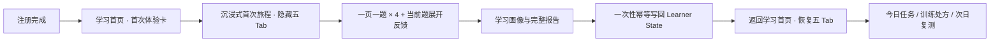

# 鲁班首次体验 × 五模块原生旅程设计

> 状态：`Approved / owner 2026-07-11 批准开始实施`
> 日期：2026-07-11
> 上游：`2026-07-10-luban-first-run-script-light-practice-plan.md`、`2026-07-02-luban-five-module-ia-frontend-brief.md`、`2026-07-04-luban-learn-tab-frontend-slice1-design.md`
> 适用面：微信小程序 `yousenwebview` 项目根中的 `packageDeeptutor` 分包
> 设计权威：五模块第 10 轮纸墨朱竹 UI；学习连续性遵守 `contracts/learner-state.md`

## 0. 决策摘要

首次体验不再是注册后的独立 onboarding，也不再以“完成后去对话/学情”为终点。它是五模块中
「学习」首页的新用户第一段原生旅程：

1. 新用户先落在学习首页，看见五模块壳和一张明确的首次体验卡。
2. 点击后进入沉浸式全屏旅程；答题期间临时隐藏五 Tab。
3. 严格一页一题；当前题反馈可以纵向展开，但绝不能滚到下一题。
4. 最大程度保留 owner 最终版的内容密度：摸底、资料揭示、四题、逐项拆解、判分点、溯源、口诀、侧写、完整报告与次日复测钩子。
5. 报告生成时，客户端只提交一次完整、版本化的答题包；服务端一次性、幂等地写回 canonical Learner State。
6. 写回成功后返回学习首页并刷新既有 `home_next_step_projection`；五 Tab 恢复，首次体验自然变成今天任务、后续处方和次日复测的起点。

本轮 owner 已拍板：

- 采用“嵌入学习首页”的入口。
- 答题时隐藏五 Tab，完成后恢复。
- 最大程度保留原版展开内容。
- 锁定“一页一题”。
- 首次体验必须融入 Learner State，形成第二天回来乃至会员转化前的连续旅程。
- 采用 A：报告完成时一次性幂等写回；中途只保留本地断点。

## 1. 调研发现与盲区

### 1.1 已确认事实

- 当前 `pages/first-run/first-run.js` 的答案、画像与报告均只存在页内内存；完成标记只写本地 `DONE_KEY`。
- 当前报告中的下一步推荐由前端按错题数静态计算，完成后默认跳学情或对话；它没有消费学习首页的 canonical 推荐投影。
- 当前第 4 题在 `script-data.js` 中已明确标注：不在首批金标候选内，仍缺白名单与双教研 verdict。
- 五模块正式学习页已经以 `home_next_step_projection`、learning report、pack lifecycle 等 read model 为消费者；它本身不应成为新的学习事实 writer。
- Learner State 已有统一事实入口、幂等键、outbox/read-your-writes、训练处方与首页下一步投影；首次体验没有必要再造独立推荐系统。

### 1.2 用户盲区

- “报告看起来很完整”不等于已进入学情。若只在前端存一份画像和建议，第二天、跨设备和后续训练都不会真正继承。
- 一次性写回减少了服务端中间态，但网络失败时仍必须明确告诉用户“报告已生成，学情同步中”，否则用户会误以为已经持久化。
- 四道题只够形成低置信度的起点信号，不能据此宣称稳定掌握度、长期人格或考试能力。

### 1.3 我方盲区

- 现有前端静态题目只有 `slug`，尚未证明四题都绑定 canonical `qid/node_code/pack_id`；没有稳定 ID 就不能安全写入学习证据。
- 第 4 题的答案和溯源尚未完成签发，不能因为 UI 已经存在就默认允许写入 Learner State。
- 当前老蓝分支没有完整五模块学习页源码；正式实施必须落在包含五模块学习页的正确 authority 分支/工作树，不能把老蓝快照当最终集成基线。
- 会员购买意愿不是可由首次体验直接写出的学习事实。Learner State 负责解释需求和下一步；权益、套餐和支付仍归 wallet/membership authority。

## 2. Karpathy Gate

### 2.1 Assumptions

- “融入 Learner State”指：完成后形成可追溯的作答证据、显式偏好和后续处方，并由现有首页投影消费；不是把整份 UI 报告 JSON 当成 learner truth。
- 首次体验只对已完成 canonical 登录/注册的用户开放，匿名访客不写 Learner State。
- 用户中途退出后可以在同一设备继续，但本阶段不承诺跨设备中途续答。
- 原版核心文案和信息结构保持不变；只做五模块原生 UI、页面节奏和数据权威适配。

### 2.2 Simplest path

最短路径是“一个既有首页入口 + 一个沉浸式旅程页 + 一个完成写回接口 + 既有 Learner State 消费链”：

- 不新建第六模块。
- 不新建 onboarding 推荐引擎。
- 不新建专用 WebSocket 或聊天入口。
- 不为每一步建立服务端 session 状态机。
- 不让前端按错题数决定正式学习路径。

### 2.3 Change boundary

允许触碰：

- 五模块学习首页的首次体验入口与完成后刷新。
- `packageDeeptutor/pages/first-run/*` 的 UI、状态机、导航、断点与完成提交。
- 复用 Learner State 的薄 API adapter、一次性写回 service、必要的 schema/event registry 与测试。
- canonical 静态题目清单及其前端生成镜像。

不在本轮顺手处理：

- 五模块其他页面重构。
- 通用 assessment 系统改版。
- 会员计费、套餐目录、支付与权益。
- 跨设备中途续答。
- 更多题目、动态 LLM 出题、认写阶梯或 CALC 题型。

### 2.4 Verification target

完成标准不是“页面能点”，而是同时证明：

- 一页一题和五 Tab 隐藏/恢复在真实微信入口成立。
- 同一个 `completion_id` 重试不会产生重复证据、重复处方或重复首页任务。
- 服务端按 canonical 内容重新判定，篡改客户端分数无效。
- 写回后返回学习首页即可读到同一 Learner State 产生的新投影。
- 第 4 题未签发时，发布门 fail closed。

## 3. 产品旅程



### 3.1 学习首页入口

- 新注册用户完成身份建立后进入 `packageDeeptutor/pages/learn/learn`，不再直接绕过五模块壳跳首跑页。
- 学习首页首屏展示纸墨朱竹风格的“首次学习旅程”主卡，解释约 3 分钟、4 道题、会得到什么报告。
- 首次旅程未完成时，主卡优先于普通下一站卡，但它只是入口投影，不承担推荐计算。
- 已完成且写回成功后主卡消失，首页回到既有 `home_next_step_projection`。
- 已生成报告但待同步时，主卡变为“报告已完成，继续同步”，不能重复开始一份新记录。

### 3.2 沉浸式旅程

- 进入后临时隐藏五 Tab，避免答题中断和层级混乱。
- 顶部位于微信安全区下方：左侧关闭/稍后继续，中间固定旅程名，右侧只显示清晰的 `1/4` 题数。
- 不再使用右上角悬浮绿点或与状态栏文字抢位的表达。
- 关闭不是“已完成”；只保存本地断点并返回学习首页。

### 3.3 一页一题

- 问题页的 viewport 只包含当前题，禁止通过下拉看到下一题。
- 选择后进入当前题反馈页；反馈页允许纵向展开，以保留原版完整解释。
- 反馈页只能包含当前题的：选择结果、正确答案、四项拆解、判分点、来源说明、术语量尺和口诀。
- 下一题只有底部明确 CTA 能触发；CTA 先经过侧写间奏，再加载下一题并回到顶部。
- 浏览器/微信返回、重复点击与页面恢复均不能跳题或重复记录。

### 3.4 报告与返回

- 报告先在本地即时生成并完整展示，不因弱网把用户卡在空白页。
- 报告进入完成态后触发一次写回；CTA 文案按状态显示“正在保存学情”“已保存，开始今天学习”或“报告已生成，稍后自动同步”。
- 写回成功后返回学习首页；`learn.onShow()` 刷新既有 read model，五 Tab 恢复。
- 订阅次日复测是报告内的可选动作，不是写回成功的前置条件；拒绝订阅不能阻塞完成。

## 4. 原版核心内容保留矩阵

| 原版内容 | 五模块适配 | 是否保留 |
|---|---|---|
| 备考阶段、答题状态、资料年份三问 | 旅程前置三屏，统一纸墨朱竹卡片 | 完整保留 |
| 资料版本揭示 | 单独一屏，不压缩成 toast | 完整保留 |
| 四道静态题 | 严格一页一题 | 完整保留 |
| 四选项逐项拆解 | 当前题反馈页展开 | 完整保留 |
| 判分卡、采分点、来源、分值量尺 | 当前题反馈页分区展示 | 完整保留 |
| 口诀 | 当前题反馈页末尾 + 报告汇总 | 完整保留 |
| 四个侧写间奏 | 每题反馈后穿插，不堆成问卷 | 完整保留 |
| 学习者画像 | 报告前独立揭示；标为“起点画像” | 保留但降级置信度 |
| 完整学习报告 | 报告页最大程度保留原版信息密度 | 完整保留 |
| “先学哪块” | 改由服务端 canonical projection 返回 | 保留表达，收回决策权 |
| 次日复测钩子 | 报告可选订阅 + 首页任务延续 | 完整保留 |
| 完成后默认去对话/学情 | 改为返回学习首页 | 删除旧路由 |

## 5. 单一权威设计

### 5.1 Thin wrapper / fat service split

- 前端页面：只采集选择、维护 UI 状态、本地断点、展示报告和提交完成包；不写正式分数、不推断 canonical 掌握度、不决定训练路径。
- `POST /api/v1/first-run/complete`：薄 adapter，只做登录身份、schema/version 校验、调用 service、稳定错误语义和观测。
- `FirstRunWritebackService`：胖能力 authority，负责 canonical 重新判定、信号分类、幂等事务、Learner State 写入、处方触发和返回公开投影。
- Learner State 既有服务：继续唯一负责事件持久化、profile promotion、training intent 与首页投影。

### 5.2 One business fact

唯一一等业务事实是：**这个 canonical learner 已完成某一版本的首次诊断，并产生一组可追溯、可复用的学习证据与明确偏好。**

### 5.3 One authority

- 唯一 writer：`FirstRunWritebackService` 经既有 Learner State service 写入。
- 唯一 storage：既有 `learner_memory_events` / profile / training-intent authority；不新建 first-run 学情表。
- 唯一 restore/read：既有 Learner State read model 与 `home_next_step_projection`。
- 前端 `DONE_KEY` 仅是 UI cache，不再是完成事实。

### 5.4 Competing authorities

当前会抢权的部分：

- 前端 `results/profile` 被当成长期学情。
- 前端按 `missN` 写死的 `rx` 推荐。
- 本地 `DONE_KEY` 被当成完成 authority。
- 完成后跳对话/学情，绕过学习首页的 next-step arbitration。
- 静态题目答案若前后端各维护一份，会形成答案 authority 漂移。

### 5.5 Canonical path

`canonical script manifest → 前端展示镜像 → 用户完成 → completion API → FirstRunWritebackService 重新判定 → learner_memory_events/profile/training_intent → home_next_step_projection → 学习首页`

### 5.6 Delete or demote

- 删除“跳过即写 DONE”。跳过只保存断点，不代表完成。
- 删除报告完成后的默认 chat/report 路由，统一回学习首页。
- 删除前端正式 `rx` 决策；前端可展示服务端返回的 public projection。
- 将 `DONE_KEY` 降级为本地显示缓存，并以服务端完成记录校准。
- 将“画面派/快枪手”等画像降级为有 provenance 的低置信起点，不允许覆盖后续真实行为证据。

### 5.7 Concept convergence

- 不新增 `onboarding_state`、`first_run_recommendation` 或 `mini_learner_profile`。
- `first_run_diagnostic` 只作为 evidence source，不是新的 learner identity 或 recommendation authority。
- 下一步仍是 `home_next_step_projection`；训练路径仍是 `training_intent`；首页仍是学习 tab。

### 5.8 新增项及理由

允许新增的最小对象：

- `first_run_script.v1` canonical manifest：解决内容 ID、答案、版本与签发状态问题。
- `first_run_diagnostic` evidence source：让 Learner State 能区分证据来源，必须 register-before-use。
- `FirstRunWritebackService`：把业务语义从前端收回唯一服务端 authority。
- 完成接口：这是稳定客户端边界，不能让小程序直接拼写 learner events。

这些新增不建立平行状态机，且每个对象都有明确唯一职责。

### 5.9 Deterministic vs LLM

- 确定性：题目版本、答案比对、分数、幂等、证据结构、显式偏好枚举、首页优先级。
- LLM：本轮运行时不参与判题、画像或处方生成；原版静态内容继续零 LLM。
- 将来若需要自然语言画像，只能消费 canonical 证据生成解释，不得反向成为判分或推荐 authority。

## 6. 内容权威与客户端镜像

推荐建立一个服务端 canonical `first_run_script.v1` manifest，至少包含：

- `script_version`
- `question_id` / 对应 canonical `qid`、`node_code`、`pack_id`
- 题干、选项与正确项的 content hash
- `authority_source`、source refs、双教研 verdict、signed status
- profile probe 枚举与公开文案版本

小程序 `script-data.js` 由 manifest 机械生成或以 hash-pinned 镜像维护；CI 必须验证镜像 hash 一致。镜像只是离线展示供给，不参与服务端判定，因此不是第二 authority。

上线硬门：四题全部必须有稳定 canonical ID 和 signed verdict。第 4 题未签发时，整套生产写回 fail closed；不得静默只写前三题却仍显示“四题完整报告”。

## 7. 完成接口与写回语义

### 7.1 请求草案

`POST /api/v1/first-run/complete`

```json
{
  "completion_id": "client-generated-stable-id",
  "script_version": "first_run_script.v1@<content_sha>",
  "completed_at": "2026-07-11T00:00:00Z",
  "answers": [
    {
      "question_id": "<canonical-id>",
      "selected_key": "A",
      "duration_ms": 12000
    }
  ],
  "declared_preferences": {
    "exam_stage": "...",
    "answer_style": "...",
    "material_version": "...",
    "memory_channel": "...",
    "study_slot": "...",
    "motivation": "..."
  }
}
```

客户端不得提交或控制：正式 `score`、`correct`、mastery、error code、training intent、home next step。

### 7.2 服务端动作

`FirstRunWritebackService` 在一个逻辑完成单元中：

1. 校验 canonical user、script version、题目集合和 signed verdict。
2. 按 canonical manifest 重新计算每题 verdict，忽略客户端自报分数。
3. 为每题追加 `memory_kind=learning_evidence`、`source_feature=first_run_diagnostic` 的证据；dedupe key 由 user、completion、script、question 构成。
4. 将用户明确选择的学习时段、记忆偏好等写入既有 profile preference authority；不得把推断画像冒充显式偏好。
5. 基于证据调用既有训练处方 authority，形成或更新 evidence-backed `training_intent`；不在 wrapper 内写 if/else 推荐规则。
6. 触发/刷新既有 home personalization 与 `home_next_step_projection`。
7. 通过既有 outbox/read-your-writes 语义返回本次完成结果和可公开的 next-step projection。

### 7.3 信号分层

| 信号 | 示例 | 写入语义 |
|---|---|---|
| 客观作答证据 | 题目、选择、正确性、耗时、内容版本 | `learning_evidence`，可追溯 |
| 显式偏好 | 学习时段、记忆方式、坚持动力 | profile preference，用户可更改 |
| 推断画像 | “画面派·稳手” | 低置信、带来源的解释性 projection |
| 稳定掌握度 | 某知识点已掌握 | 本轮禁止仅凭四题直接宣称 |
| 商业权益 | 是否会员、剩余点数 | 本轮禁止写入，归 wallet/membership |

## 8. 幂等、失败与恢复

### 8.1 幂等键

- 业务幂等键：`canonical_user_id + completion_id + script_version`。
- 同一键、同一 body 重放：返回第一次结果，不新增事件或处方。
- 同一键、不同 body：返回 `409 idempotency_conflict`，不得覆盖第一次真相。
- 每题 event 另有稳定 dedupe key，防止事务部分重试造成重复证据。

### 8.2 本地断点

- 答题中途仅保存最小本地 checkpoint：script version、当前 act/question、已选答案、显式偏好、生成时间。
- 不保存正式判分、mastery 或 canonical recommendation。
- 完成提交成功后删除 checkpoint，只保留非权威的展示 cache。
- script version 变化或内容撤签时，旧 checkpoint 明示失效并重新开始，不迁移答案。

### 8.3 网络失败

- 报告仍即时展示，但状态明确为“学情待同步”。
- 本地保存同一个 `completion_id` 和最小 pending payload；学习首页 `onShow` 或网络恢复后重试同一请求。
- 用户不得因为重试看到第二份报告、重复任务或重复证据。
- 若服务端返回内容撤签/版本冲突，不自动伪成功；保留报告只读副本并引导重新完成有效版本。

## 9. 学习首页连续性

写回成功后，首次体验不直接指定“去屋面防水”或“进细部构造”。它只产生 canonical evidence 和显式偏好，由既有 authority 决定：

- 到期复习优先于新学习。
- 已有 active training intent 优先于普通未学站。
- 没有处方时再进入既有下一绿灯站逻辑。

因此用户第二天回来时仍从学习首页继续同一条旅程；未来会员转化也可以解释“为什么此刻需要更多练习/服务”，但付费决定和权益变更不写进 Learner State。

## 10. 隐私、观测与安全

- 行为埋点继续复用 `surface-events -> product_behavior_events`，不新增 first-run 专用遥测 endpoint。
- 原始完整作答和自由文本不得塞进行为事件 metadata；学习证据只走 canonical learner-state writeback。
- 如新增 `first_run_writeback_succeeded/failed/replayed`，必须 register-before-use，并只记录 completion hash、script version、状态和延迟。
- 自动化测试账号必须是 `eval_runner`，不得进入真实会员或活跃指标。
- 服务端以 auth canonical UUID 绑定 Learner State，不能用手机号、openid 或本地设备号当 user authority。

## 11. Edge cases

- 用户从报告页杀进程：恢复报告并重试同一 `completion_id`。
- 用户重复点击完成：按钮本地去抖，服务端幂等仍是最终保障。
- 用户换账号：本地 checkpoint 必须按 canonical user 隔离，不能串答卷。
- 用户选择“说不清资料版本”：写显式 unknown，不推断成“资料过旧”。
- 用户拒绝订阅消息：完成和学情写回照常成功。
- 四题全对：仍写客观证据，但不夸大成“已掌握整个章节”。
- 四题全错：提供温和起点，不贴“基础差”标签；处方仍由既有 authority 形成。
- 首页 read model 暂时失败：显示“报告已保存，首页稍后刷新”，不能退回前端静态推荐。

## 12. 实施顺序

### P0：内容 authority 先行

- 冻结 `first_run_script.v1` manifest。
- 为四题绑定 canonical ID/source refs。
- 完成第 4 题双教研 verdict 与签发。
- 建立前端镜像 hash 一致性门。

### P1：Learner State 写回

- 注册 evidence source/schema/event。
- 实现薄 completion endpoint 与胖 `FirstRunWritebackService`。
- 接入既有 evidence、profile、training intent、home projection。
- 完成幂等、冲突、部分失败与 read-your-writes 测试。

### P2：五模块前端适配

- 学习首页首次体验卡与同步状态。
- 一页一题、当前题展开反馈、顶部安全区、五 Tab 隐藏/恢复。
- 本地 checkpoint、完成提交、报告状态和回学习首页。
- 删除旧 chat/report 默认出口与前端正式 rx。

### P3：真实入口 QA 与观测

- harness/contract/backend tests。
- 微信开发者工具打开 `yousenwebview` 项目根，进入 `packageDeeptutor` 分包目标页跑完整旅程。
- 记录 `devtools_project_root`、`target_subpackage`、`target_page`、`entry_flow`、`auth_state`、`auth_mode`。
- 灰度核对写回成功率、幂等 replay、完成到首页连续率与 D1。

## 13. 验收门

### 13.1 功能 PASS

- 新用户先看见学习首页和五模块壳，首次体验作为学习主卡进入。
- 旅程中五 Tab 隐藏；完成/退出后恢复。
- 所有题严格一页一题；页面下滑永远看不到下一题。
- 当前题完整反馈和原版报告信息均保留。
- 完成一次写回后，学习首页能消费同一 Learner State 的下一步。
- 网络重试、重复点击、杀进程恢复均不产生重复证据。

### 13.2 Authority PASS

- 客户端改分数、correct、rx 均不能改变服务端结果。
- 本地 DONE 不再决定 canonical 完成状态。
- first-run 不直接写 home next step，不建立第二推荐 authority。
- 四题全部 signed；第 4 题未签发则生产发布失败。
- 所有新增 schema/event/source 完成 register-before-use，并通过 contract guard。

### 13.3 测试 PASS

- manifest/hash/verdict 单测覆盖四题。
- service/API 测试覆盖正常、幂等 replay、冲突、未签发、部分失败、profile 信号分层和首页投影刷新。
- 前端测试覆盖一页一题、恢复、重复点击、隐藏/恢复 tab 与导航。
- `python scripts/check_contract_guard.py <changed files>` 通过。
- 真微信证据是 `real_wechat_package`，不能用 Web shadow 或仅 `open --project` 冒充。

## 14. 红线、tradeoff 与 stop conditions

### 红线

- 不签发的题不写 Learner State。
- 前端不算正式分、不写正式推荐、不把 DONE 当完成真相。
- 不新增 `/api/v1/mobile/.../ws` 或任何专用聊天入口。
- 不把四题侧写包装成稳定人格、完整掌握或购买资格。
- 不用“报告展示成功”冒充“canonical writeback 成功”。

### Tradeoff

- 选择一次性写回：服务端状态更少、authority 更清楚、幂等更容易验证；代价是中途仅同设备续答，且完成时必须处理弱网 pending sync。
- 选择完整展开内容：信任与价值感更强；代价是反馈页较长，因此用“一题内可滚动、题间不可滚动”保持节奏。
- 选择先回学习首页：旅程连续且五模块心智稳定；代价是首页 projection 必须真正可用，不能再靠前端静态推荐掩盖后端断链。

### Stop conditions

任一条件成立即停止上线，不做降级绕过：

- 第 4 题或任一题缺 canonical ID / signed verdict。
- completion 重试会重复写事件或 training intent。
- 写回后学习首页读不到同一 learner 的更新。
- 前端仍保留可影响正式下一步的 `missN -> rx` 规则。
- 真实微信入口无法完成注册后进入、答题、报告、写回、回首页的闭环。

## 15. 后续实施计划需要回答的问题

设计获批后，implementation plan 必须进一步锁定：

1. `first_run_script.v1` 落在哪个既有 registry/domain，避免新建平行内容仓。
2. `FirstRunWritebackService` 复用 assessment writeback 的哪些原语，哪些必须保持 first-run 专属。
3. profile 显式偏好如何映射到已有字段，哪些只保留为解释性 projection。
4. training intent 的创建/合并规则如何避免覆盖用户已有 active intent。
5. 正确的五模块 authority 分支/worktree 与最小改动文件清单。
