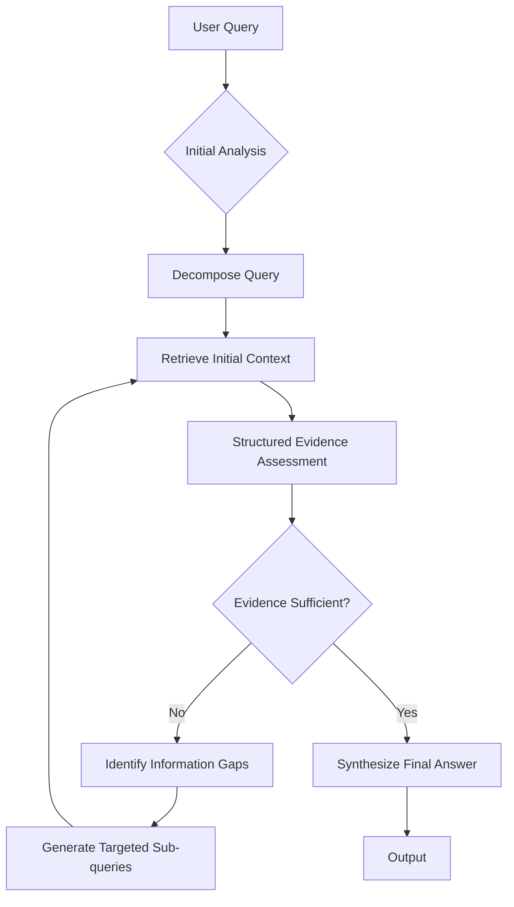
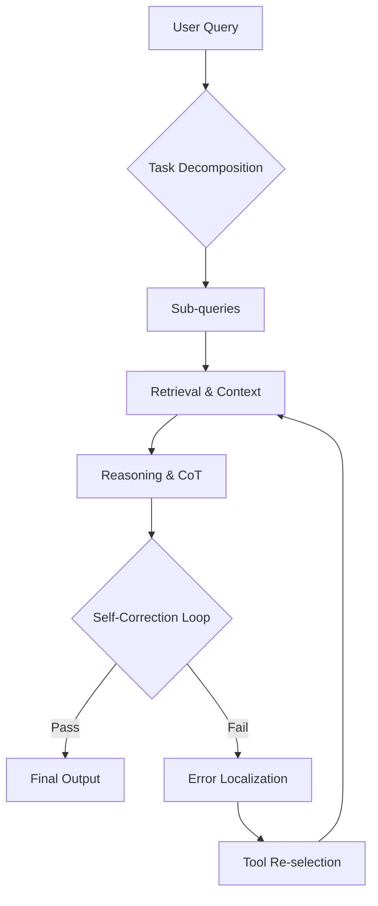
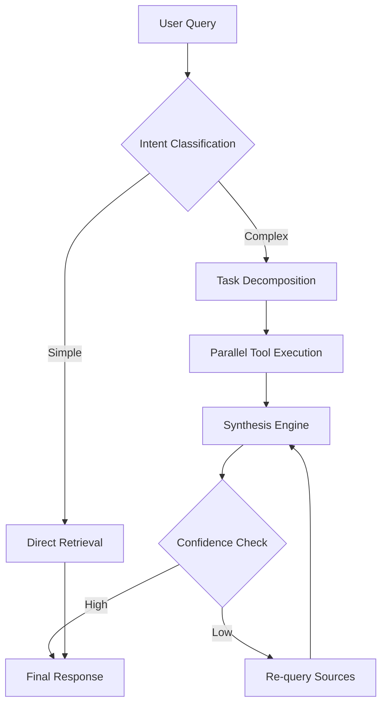
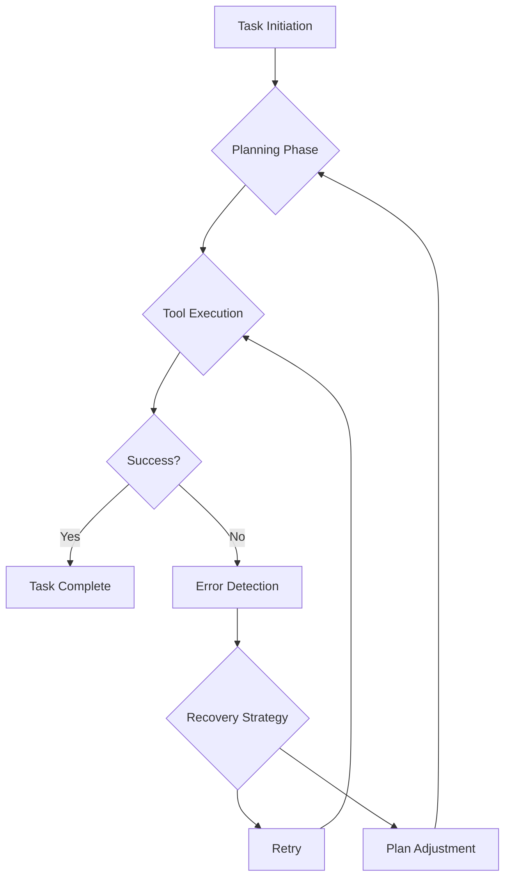

# Agentic RAG: Definition and Applications

## Introduction

The rapid advancement of Large Language Models (LLMs) has revolutionized information retrieval, yet traditional Retrieval-Augmented Generation (RAG) systems face inherent limitations in handling complex, multi-step inquiries. While standard RAG pipelines effectively ground responses in external knowledge, they often operate as static, linear processes that lack the flexibility required for dynamic problem-solving. As enterprises demand more autonomous capabilities from AI assistants, the necessity to evolve from passive retrieval to active agency becomes urgent. This shift represents a critical frontier in artificial intelligence research, bridging the gap between simple query answering and comprehensive task execution.

Current RAG architectures struggle with ambiguous queries that require iterative refinement, tool selection, and self-correction. The core problem addressed by this research is the insufficiency of static retrieval mechanisms in complex environments where context evolves. Traditional systems fail to decompose tasks or adapt their search strategies based on intermediate results. Consequently, the primary objective is to establish a comprehensive framework for Agentic RAG, defining its conceptual boundaries and operational mechanisms. This involves transitioning from fixed retrieval pipelines to iterative, goal-oriented workflows driven by autonomous decision-making agents.

This report explores the multidimensional landscape of Agentic RAG, covering five critical dimensions essential for a holistic understanding. The scope encompasses the conceptual evolution from traditional RAG, the technical architecture supporting agent behavior, and the cognitive mechanisms enabling autonomous planning. Furthermore, it examines practical application domains where these systems offer significant value and establishes robust evaluation frameworks to measure performance beyond simple accuracy. These components are logically interconnected, moving from theoretical foundations to implementation details and finally to real-world validation.

The remainder of this report is structured to guide readers through these core aspects systematically. Following this introduction, the first section defines the conceptual evolution of Agentic RAG, contrasting it with linear retrieval methods. Subsequent sections detail the system architecture, focusing on planners and memory modules, before analyzing autonomous planning mechanisms and reasoning strategies. The report then categorizes practical use cases across enterprise and coding domains, concluding with a discussion on evaluation metrics necessary for benchmarking agentic performance. This organization ensures a logical progression from definition to application, providing a clear roadmap for understanding the transformative potential of autonomous retrieval systems.

## 1. Conceptual Definition and Evolution

The rapid proliferation of Large Language Models (LLMs) has necessitated a fundamental reevaluation of how these systems interact with external knowledge bases. Traditional Retrieval-Augmented Generation (RAG) architectures were initially designed primarily as mechanisms for static knowledge augmentation, where a query is processed through a fixed pipeline to retrieve relevant documents before generation occurs. However, as applications move towards complex, domain-specific tasks requiring multi-hop reasoning and synthesis, this static approach has proven insufficient. Consequently, the field has witnessed a paradigm shift towards Agentic RAG, a framework that imbues the retrieval process with dynamic, autonomous problem-solving capabilities. This section establishes the fundamental definition of Agentic RAG and traces its evolution from linear pipelines to iterative, goal-oriented workflows.

### 1.1 Fundamental Definition of Agentic RAG

At its core, Agentic RAG is defined not merely by the presence of an LLM, but by the system's capacity for autonomous planning, decision-making, and self-correction during the retrieval process. Unlike traditional RAG systems which operate as passive conduits between user queries and knowledge repositories, Agentic RAG systems function as active agents capable of modifying their own retrieval strategies based on intermediate results. This distinction marks a transition from static knowledge augmentation to dynamic problem-solving. In a traditional setup, the retrieval function is often a single-step operation defined by vector similarity or keyword matching, lacking the ability to adapt if the initial retrieval fails to satisfy the user's intent. In contrast, Agentic RAG treats retrieval as a sub-problem within a larger reasoning task, allowing the system to decompose complex queries, formulate sub-queries, and verify the sufficiency of gathered evidence before committing to a final generation.

Recent literature provides concrete architectural examples of this definition. For instance, Cook et al. (2025) propose an agentic RAG architecture specifically designed for specialized domains like fintech, where dense terminology and domain-specific ontologies complicate standard retrieval. Their system introduces a modular pipeline of specialized agents rather than a monolithic retrieval module. These agents perform intelligent query reformulation, iterative sub-query decomposition guided by keyphrase extraction, and contextual acronym resolution. This modularity allows the system to handle ambiguity and complexity that a standard baseline cannot, effectively transforming the retrieval process from a simple lookup into a collaborative problem-solving session among specialized components. The experimental results from this work demonstrate that such structured, multi-agent methodologies significantly enhance retrieval precision and relevance, although they come at the cost of increased latency compared to standard RAG baselines.

Furthermore, the definition of Agentic RAG encompasses the capability for reasoning and reflection, which distinguishes it from simple iterative retrieval. Xiong et al. (2025) emphasize that language agents in this context engage in multi-round interactions with external knowledge sources for adaptive information retrieval. They introduce a framework called RAG-Gym, which systematically optimizes these agents across three dimensions: prompt engineering, actor tuning, and critic training. A key component of their proposed Re$^2$Search agent is the incorporation of reasoning reflection. This mechanism allows the agent to evaluate its own intermediate steps and refine its approach, moving beyond the ad-hoc prompt engineering that plagued earlier attempts. The agent does not just retrieve; it reasons about what it has retrieved and whether it needs more information. Similarly, Asl et al. (2025) define their FAIR-RAG framework as a dynamic, evidence-driven reasoning process. They introduce a module termed Structured Evidence Assessment (SEA), which acts as an analytical gating mechanism. The SEA deconstructs the initial query into a checklist of required findings and audits the aggregated evidence to identify explicit informational gaps. This gap analysis provides a precise signal to an Adaptive Query Refinement agent, which generates new, targeted sub-queries to retrieve missing information. This cycle repeats until the evidence is verified as sufficient, ensuring a comprehensive context for a final, strictly faithful generation. These definitions collectively establish Agentic RAG as a system where the retrieval process is governed by a goal-oriented loop of assessment, planning, and execution, rather than a linear pass-through.

### 1.2 Evolution from Linear to Iterative Workflows

The transition from linear retrieval pipelines to iterative, goal-oriented workflows represents the most significant architectural evolution in the history of RAG systems. Traditional RAG architectures typically follow a linear sequence: the user submits a query, the system retrieves a fixed set of documents based on similarity scores, and the LLM generates an answer based solely on that retrieved context. This linear workflow assumes that the initial retrieval is sufficient to answer the query and that the LLM can synthesize the information without further external input. However, empirical evidence suggests that this assumption frequently fails in complex, knowledge-intensive tasks. Asl et al. (2025) note that existing frameworks often falter on complex, multi-hop queries that require synthesizing information from disparate sources. Current advanced RAG methods, even those employing iterative strategies, often lack a robust mechanism to systematically identify and fill evidence gaps, leading to the propagation of noise or incomplete contexts.

The evolution towards iterative workflows addresses these limitations by introducing a feedback loop into the retrieval process. Instead of a single retrieval step, the system engages in a cycle of retrieval, assessment, and refinement. Jiang et al. (2024) illustrate this evolution in their RAG-Star approach, which integrates retrieved information to guide a tree-based deliberative reasoning process. Unlike methods that rely solely on internal knowledge for reasoning steps, RAG-Star leverages Monte Carlo Tree Search (MCTS) to iteratively plan intermediate sub-queries and answers based on the LLM itself and the retrieved external knowledge. This allows the system to explore multiple reasoning paths and consolidate internal and external knowledge through retrieval-augmented verification. The verification step utilizes query- and answer-aware reward modeling to provide feedback for the inherent reasoning of the LLM, effectively creating a deliberative loop where the system can backtrack and refine its search strategy if a path proves unproductive.

To visualize this architectural shift, one can compare the operational flows of linear versus agentic workflows. The following table summarizes the key differences in process, control mechanisms, and outcomes between the two paradigms.

| Feature | Linear RAG Workflow | Agentic Iterative Workflow |
| :--- | :--- | :--- |
| **Control Flow** | Unidirectional (Query -> Retrieve -> Generate) | Cyclic (Query -> Plan -> Retrieve -> Assess -> Refine) |
| **Retrieval Strategy** | Single-shot, static similarity search | Adaptive, multi-round, gap-driven search |
| **Reasoning** | Implicit within the generation step | Explicit, planned, and verified via agents |
| **Error Handling** | Limited; relies on prompt engineering | Active; uses gap analysis and reflection |
| **Performance Trade-off** | Low latency, lower precision on complex tasks | Higher latency, higher precision and faithfulness |

The implementation of this iterative workflow is exemplified by the FAIR-RAG framework introduced by Asl et al. (2025). Their system transforms the standard RAG pipeline into a dynamic process governed by an Iterative Refinement Cycle. At the core is the Structured Evidence Assessment (SEA) module, which functions as an analytical gating mechanism. The SEA deconstructs the initial query into a checklist of required findings and audits the aggregated evidence. Crucially, it identifies explicit informational gaps, providing a precise signal to an Adaptive Query Refinement agent. This agent generates new, targeted sub-queries to retrieve missing information. This cycle repeats until the evidence is verified as sufficient, ensuring a comprehensive context for a final, strictly faithful generation. Experimental results on challenging multi-hop QA benchmarks, including HotpotQA, 2WikiMultiHopQA, and MusiQue, demonstrate that this structured, evidence-driven refinement process significantly outperforms strong baselines. On HotpotQA, FAIR-RAG achieved an F1-score of 0.453, an absolute improvement of 8.3 points over the strongest iterative baseline.

The following flowchart illustrates the logical architecture of this iterative agentic workflow, highlighting the decision points that distinguish it from linear processing.



This iterative structure fundamentally changes the role of the LLM from a passive generator to an active planner and verifier. Xiong et al. (2025) further support this evolution by demonstrating that a trained critic can enhance inference by selecting higher-quality intermediate reasoning steps. In their RAG-Gym framework, they show that optimizing the actor, the critic, and the prompt engineering leads to an optimized agent that surpasses recent methods. The scaling properties of this training and inference process offer practical insights for agentic RAG optimization, suggesting that as the complexity of the task increases, the benefit of iterative, agentic workflows becomes increasingly pronounced compared to the efficiency of linear pipelines. Ultimately, the evolution from linear to iterative workflows represents a maturation of RAG technology, moving from simple information retrieval to robust, autonomous knowledge synthesis capable of handling the nuances of real-world problem solving.


## 2. System Architecture and Core Components

The transition from traditional Retrieval-Augmented Generation (RAG) to Agentic RAG represents a paradigm shift in how artificial intelligence systems interact with external knowledge and tools. While standard RAG focuses on retrieving relevant documents to augment a static prompt, Agentic RAG introduces dynamic decision-making capabilities that allow the system to plan, execute, and reflect upon tasks autonomously. This section details the technical infrastructure required to support such agentic behavior, specifically examining the Planner-Executor-Memory triad and the architectural patterns necessary for scalability and robustness in production environments.

### 2.1 The Planner-Executor-Memory Triad

The core of any agentic system lies in the interaction between three fundamental components: the Planner, the Executor, and the Memory module. This triad forms the cognitive loop that enables the system to manage complex tasks beyond simple query answering. Unlike linear pipelines where input is processed once to produce output, the agentic architecture operates in iterative cycles, allowing for correction, refinement, and multi-step reasoning.

The Planner component acts as the system's reasoning engine. Its primary responsibility is to decompose high-level user objectives into a sequence of manageable sub-tasks or actions. In the context of Agentic RAG, the Planner must analyze the user's intent, determine what information is missing, and decide which tools or retrieval mechanisms are necessary to bridge the knowledge gap. The Planner does not merely generate text; it generates a plan of action. This often involves reasoning about the dependencies between tasks, such as determining that a database query must precede a data analysis step. The decision-making process within the Planner can be modeled as a state transition function, where the current state $S_t$ and the user goal $G$ determine the next action $A_{t+1}$.

$$
A_{t+1} = \pi_{\theta}(S_t, G)
$$

Here, $\pi_{\theta}$ represents the policy network, typically instantiated by a Large Language Model (LLM), which maps the current context to the optimal next step. This formulation highlights that the Planner is not static; it must adapt its strategy based on the feedback received from the Executor. If the initial retrieval yields irrelevant results, the Planner must revise the search query or switch to a different knowledge source. This dynamic adjustment is what distinguishes agentic systems from static retrieval pipelines.

The Executor component is responsible for carrying out the actions dictated by the Planner. In an Agentic RAG context, execution involves interacting with external tools, APIs, or data stores. This could include executing SQL queries, calling third-party APIs, performing web searches, or running code snippets. The Executor acts as the bridge between the abstract reasoning of the Planner and the concrete reality of the external environment. It must handle the technical details of tool invocation, including parameter serialization, error handling, and response parsing. Crucially, the Executor must provide structured feedback to the Planner regarding the success or failure of an action. This feedback loop is essential for the system to learn from its mistakes. For instance, if a SQL query fails due to a syntax error, the Executor must return the error message to the Planner, which can then attempt to correct the query syntax in the next iteration.

The Memory module serves as the system's persistent state and knowledge repository. In agentic systems, memory is not limited to the context window of the LLM. It encompasses both short-term memory, which holds the immediate conversation history and the current plan, and long-term memory, which stores retrieved documents, past interactions, and learned patterns. The interaction between the Planner and Memory is bidirectional. The Planner queries the Memory to retrieve relevant context before making decisions, while the Executor writes new information back into the Memory after successful execution. This ensures that the system does not lose track of previous findings and can build upon them over time.

The interaction among these three components can be visualized as a continuous loop. The Planner assesses the current state of the Memory and the user goal to generate a plan. The Executor implements the plan using available tools. The results are fed back into the Memory, updating the system state. The Planner then re-evaluates the situation. This cycle continues until the goal is achieved or a maximum iteration limit is reached.

| Component | Primary Function | Input | Output | Key Challenge |
|---|---|---|---|---|
| Planner | Task Decomposition & Reasoning | User Goal, Current State | Action Plan, Next Step | Hallucination in planning, Over-planning |
| Executor | Tool Invocation & Action | Action Plan, Tool Definitions | Execution Result, Error Logs | Tool compatibility, Latency, Security |
| Memory | State Management & Retrieval | Context, Execution Results | Retrieved Context, Updated State | Context window limits, Retrieval accuracy |

This table summarizes the distinct roles and challenges associated with each component. The Planner faces the challenge of ensuring its reasoning is grounded in reality to avoid hallucinated plans. The Executor must ensure that tool invocations are secure and efficient. The Memory module must balance the need for comprehensive context with the computational constraints of vector search or database queries.

### 2.2 Scalability and Robustness Implementation

While the Planner-Executor-Memory triad provides the logical foundation for agentic behavior, deploying such systems in production environments requires careful attention to scalability and robustness. Agentic workflows are inherently more complex than standard query-response systems due to the iterative nature of the planning loop. Each iteration consumes computational resources, and the potential for infinite loops or resource exhaustion is significant. Therefore, architectural patterns must be implemented to ensure the system performs reliably under load and handles unexpected failures gracefully.

Scalability in Agentic RAG involves managing the computational cost of LLM inference and tool execution across multiple concurrent user sessions. A common architectural pattern is the use of asynchronous processing queues. Instead of processing user requests sequentially, the system can offload planning and execution tasks to a message queue, such as RabbitMQ or Kafka. This decouples the user-facing API from the heavy lifting of agent reasoning. When a user submits a request, the system places a task in the queue and returns a job ID. The user can then poll for the status or receive a webhook notification when the task is complete. This approach allows the system to handle thousands of concurrent requests without blocking the main thread.

Furthermore, horizontal scaling of the inference layer is critical. Since the Planner and Executor rely on LLMs, which are computationally intensive, the system should support auto-scaling of inference endpoints. Container orchestration platforms like Kubernetes can be used to spin up additional instances of the LLM service based on queue depth. However, this introduces complexity in state management. If the Planner is distributed across multiple nodes, the Memory state must be synchronized to ensure consistency. This is often achieved by using a centralized vector database or a distributed key-value store for the Memory module, ensuring that any node can access the necessary context.

Robustness implementation focuses on error handling and fault tolerance. Agentic systems are prone to errors at various stages: the Planner might generate an invalid action, the Executor might encounter a network timeout, or the Memory retrieval might return no relevant results. To mitigate these risks, the architecture should incorporate circuit breakers and retry mechanisms. A circuit breaker pattern can prevent the system from overwhelming external services if they are failing. If a tool call fails repeatedly, the circuit opens, and the system switches to a fallback strategy, such as simplifying the plan or asking the user for clarification.

Additionally, validation layers should be inserted between the Planner and the Executor. Before an action is executed, a lightweight validation model or rule-based system can check if the action is safe and syntactically correct. For example, if a plan involves deleting a database record, the validation layer should require explicit user confirmation or restrict the scope of the action. This prevents catastrophic errors caused by LLM hallucinations.

The following code snippet illustrates a conceptual implementation of a robust Executor wrapper that includes retry logic and error handling:

```python
def execute_action(action, tools, max_retries=3):
    for attempt in range(max_retries):
        try:
            result = tools[action['tool']](**action['args'])
            return {'status': 'success', 'data': result}
        except Exception as e:
            if attempt == max_retries - 1:
                return {'status': 'error', 'message': str(e)}
            wait_time = 2 ** attempt
            time.sleep(wait_time)
```

This pattern ensures transient failures do not cause the entire agentic workflow to collapse. The system attempts to recover before giving up, increasing the likelihood of task completion.

Finally, observability is a critical component of robustness. Given the multi-step nature of agentic tasks, debugging is challenging. The system must log detailed traces of every decision made by the Planner, every action taken by the Executor, and every piece of information retrieved from Memory. These logs should be structured and indexed to allow for post-hoc analysis of failures. By analyzing these traces, developers can identify patterns in where the system tends to fail and refine the Planner's training or the Executor's tool definitions accordingly.

In summary, building a scalable and robust Agentic RAG system requires more than just connecting LLMs to tools. It demands a sophisticated infrastructure that manages state, handles concurrency, and implements strict error handling protocols. Only through such rigorous architectural design can the theoretical benefits of agentic behavior be realized in practical, production-grade applications.

## 3. Autonomous Planning and Reasoning Mechanisms

Autonomous planning and reasoning mechanisms constitute the cognitive backbone of Agentic Retrieval-Augmented Generation (RAG) systems. Unlike traditional RAG pipelines that execute linear retrieval and generation steps, autonomous agents must possess the capacity to decompose complex objectives, select appropriate tools dynamically, and iterate on results based on feedback. This section examines the underlying cognitive processes that enable such autonomy, focusing on task decomposition strategies and iterative reasoning loops. The intelligence level of an agent is fundamentally defined by its ability to handle ambiguous queries through structured planning and self-corrective reasoning. These mechanisms transform the system from a passive information retriever into an active problem solver capable of navigating uncertainty and managing complex workflows.

### 3.1 Task Decomposition and Sub-query Strategies

The primary challenge in autonomous planning lies in transforming high-level user intents into executable sub-tasks. This process mirrors hierarchical task networks (HTN) used in robotics and industrial automation. Research by Pellier et al. (2023) highlights the necessity of formalizing temporal and numerical constraints within planning domains, suggesting that effective decomposition requires more than simple keyword matching. In the context of LLM-based agents, decomposition often involves keyphrase extraction and semantic parsing to identify distinct operational requirements. However, the accuracy of decomposition is not linearly correlated with model strength. Li (2025) introduces the Error Depth Hypothesis, noting that stronger models may produce fewer but deeper errors that are harder to correct during the decomposition phase. This suggests that breaking down a query into sub-queries requires a balance between granularity and coherence. If sub-tasks are too fine-grained, the agent risks losing the global context; if too coarse, it fails to utilize specific tools effectively.

To address this, agents employ strategies that align with the complexity of the information retrieval task. Table 1 summarizes common decomposition approaches and their trade-offs. The hierarchical approach, inspired by HDDL 2.1 formalisms, allows for the representation of numerical and temporal constraints essential for real-world applications. By structuring tasks hierarchically, the agent can prioritize critical sub-tasks and manage dependencies more effectively.

| Strategy | Mechanism | Complexity Handling | Risk |
|---|---|---|---|
| Linear Decomposition | Sequential sub-queries | Low | Error propagation |
| Parallel Decomposition | Independent sub-queries | Medium | Context fragmentation |
| Hierarchical Decomposition | Parent-child task trees | High | Overhead in coordination |

Furthermore, Dissanayake and Nanayakkara (2025) argue that interventions during this phase must consider the state of cognitive flow. Disrupting the agent's reasoning process with premature tool calls can hinder decision-making, suggesting that decomposition should be context-aware and adaptive rather than static. Jacobsen et al. (2025) extend this view to distributed cognition, noting that AI-supported remote operations require adaptive memory that aligns with human distributed cognition. This implies that task decomposition in Agentic RAG must also account for the cognitive load placed on human operators who may be monitoring or intervening in the agent's workflow. Consequently, effective decomposition strategies must minimize cognitive overload while maintaining situational awareness.

### 3.2 Cognitive Loops and Self-Correction

Once tasks are decomposed, the agent enters the reasoning phase, often utilizing Chain-of-Thought (CoT) prompting to articulate intermediate steps. Hu et al. (2024) propose a Hopfieldian view of CoT, conceptualizing reasoning as movement between representation spaces. This perspective helps in localizing reasoning errors, which is crucial for self-correction. However, standard autoregressive decoding is vulnerable to exposure bias, where early mistakes propagate irreversibly. To mitigate this, Cao et al. (2026) introduce DiffCoT, a diffusion-styled CoT framework that reformulates reasoning as an iterative denoising process. This allows for retrospective correction of intermediate steps, preserving token-level autoregression while enhancing robustness. The self-correction loop operates dynamically, where the agent evaluates its own output against the retrieved context.

Li (2025) observes an Accuracy-Correction Paradox where weaker models sometimes exhibit higher intrinsic correction rates than stronger ones, implying that self-correction is not merely a function of model capability but of error detectability. This paradox highlights a critical limitation in current Agentic RAG systems: high accuracy does not guarantee high self-improvement potential. Therefore, robust planning mechanisms must incorporate external feedback loops rather than relying solely on intrinsic self-correction. Dynamic tool selection is another critical component of these cognitive loops. In dynamic environments, uncertainty plays a pivotal role. Zhou et al. (2024) demonstrate that uncertainty-aware decision-making allows autonomous systems to capture motion uncertainty and predict occupancy, enhancing resilience. Similarly, Castri et al. (2025) propose causality-enhanced decision-making, where agents reason over learned causal models to anticipate environmental factors like human obstructions or battery usage. This causal reasoning enables the agent to select tools not just based on relevance, but on predicted outcomes.

The integration of these mechanisms forms a closed-loop system. Figure 1 illustrates the flow of autonomous planning and reasoning. This architecture ensures that the agent can recover from failures by re-evaluating its path based on new context or corrected reasoning steps.



Finally, the design of these loops must account for human-AI interaction dynamics. Dissanayake and Nanayakkara (2025) emphasize that cognitive flow should be maintained during reasoning support. Interventions that disrupt this flow can hinder decision-making. Therefore, self-correction mechanisms should be minimally intrusive, adapting to the agent's current cognitive state. Chen et al. (2025) further note that Long Chain-of-Thought characteristics, such as deep reasoning and feasible reflection, enable models to handle intricate problems that standard short CoT cannot resolve. By combining causal inference, uncertainty awareness, and iterative refinement, autonomous agents can achieve a level of reasoning robustness necessary for complex Agentic RAG applications. Deliu (2025) adds a philosophical dimension, suggesting that sustaining uncertainty through Cognitive Dissonance AI can sharpen critical thinking, challenging the paradigm of AI as a deliverer of certainty. This suggests that future planning mechanisms might benefit from deliberately introducing controlled ambiguity to prevent epistemic complacency in complex decision-making scenarios.

## 4. Practical Application Domains and Use Cases

Agentic Retrieval-Augmented Generation (RAG) represents a paradigm shift from passive information retrieval to active problem-solving architectures. Unlike traditional RAG systems that execute a single retrieval pass followed by generation, Agentic RAG employs autonomous agents capable of planning, tool invocation, and iterative verification. This capability is particularly valuable in complex environments where information is fragmented, queries are multi-step, or high-stakes accuracy is required. The transition from static pipelines to dynamic agent loops allows organizations to address limitations in standard retrieval methods, specifically regarding context fragmentation and reasoning depth. This section categorizes real-world scenarios where Agentic RAG provides significant value over standard methods, focusing on enterprise knowledge management and specialized domain analysis.

### 4.1 Enterprise Knowledge Management

Large organizations often suffer from information silos where critical data resides across disparate systems such as human resources portals, legal repositories, and engineering wikis. Standard RAG systems struggle with queries that require synthesizing information from multiple sources without explicit guidance. Agentic RAG addresses this through a planning mechanism where the agent decomposes complex user queries into sub-tasks. For instance, an employee asking for a policy summary regarding remote work and expense reimbursement triggers a multi-step retrieval process. The agent first identifies the relevant domains, queries each knowledge base, and then synthesizes the findings into a coherent response. This decomposition reduces the cognitive load on the retrieval model and ensures that no critical context is missed due to token limits or vector space sparsity.

The following table illustrates the comparative advantages of Agentic RAG in enterprise settings:

| Feature | Standard RAG | Agentic RAG |
| :--- | :--- | :--- |
| Query Handling | Single-pass retrieval | Multi-step reasoning |
| Source Integration | Limited to vector store | Cross-system API calls |
| Error Correction | Fixed upon generation | Iterative self-correction |
| User Interaction | Static response | Interactive clarification |

The workflow of an enterprise knowledge agent can be visualized through the following decision logic:



This architecture ensures that when a query requires cross-referencing, the agent does not hallucinate connections but actively verifies them. In legal and compliance contexts, this reduces the risk of misinformation significantly. The ROI is realized through reduced human intervention time and higher accuracy in internal communications. Furthermore, the iterative nature of the agent allows for dynamic adaptation to new information sources without requiring retraining of the underlying vector models, providing long-term scalability for growing enterprises. The ability to handle cross-domain queries means that HR, Legal, and IT departments can share a unified interface without compromising data governance boundaries.

### 4.2 Specialized Domain Analysis (e.g., Fintech)

Domains such as financial technology (Fintech) and software engineering demand high precision and the handling of dense terminology. In Fintech, regulatory compliance and risk assessment require not just finding documents but understanding the implications of specific clauses within a regulatory framework. Standard RAG might retrieve a document containing a regulation but fail to apply it to a specific transaction scenario. Agentic RAG agents can act as analysts, retrieving the regulation, comparing it against transaction data, and generating a risk report. This active application of knowledge distinguishes Agentic RAG from passive search tools.

The decision-making process in these agents often relies on a confidence scoring function that weighs retrieval relevance against logical consistency. A simplified representation of this scoring mechanism can be expressed as:

$$
S_{final} = \alpha \cdot R_{retrieval} + \beta \cdot C_{context} + \gamma \cdot V_{verification}
$$

Where $R_{retrieval}$ represents the semantic similarity score, $C_{context}$ denotes the contextual coherence within the agent's memory, and $V_{verification}$ is the outcome of self-consistency checks. The weights $\alpha, \beta, \gamma$ are tuned based on the domain's tolerance for error. In high-risk financial environments, $V_{verification}$ is assigned a higher weight to prioritize accuracy over speed. This mathematical formulation ensures that the system does not rely solely on keyword matching but evaluates the logical integrity of the generated response.

In the context of automated coding assistance, Agentic RAG extends beyond simple code completion. It enables agents to navigate a codebase, understand dependencies, and propose refactoring solutions that adhere to architectural patterns. The agent can invoke a code interpreter to test snippets before presenting them to the developer. A typical tool invocation sequence in a coding agent might look like this:

```python
def execute_agent_task(query):
    plan = agent.plan(query)
    for step in plan:
        if step.requires_tool:
            result = tool.execute(step.tool, step.args)
            agent.memory.update(result)
    return agent.synthesize(plan)
```

This iterative execution allows the agent to debug errors autonomously. In financial analysis, this capability translates to the ability to fetch live market data, run historical comparisons, and generate investment thesis summaries without manual data aggregation. The specialized domain analysis highlights that Agentic RAG is not merely a retrieval tool but a reasoning engine that adapts to the specific constraints and terminologies of high-stakes industries. By automating the synthesis of complex data, organizations can achieve significant efficiency gains while maintaining the rigorous standards required in regulated sectors. The ability to handle dense terminology ensures that the nuance of professional language is preserved, reducing the friction between human expertise and automated assistance. Moreover, the adaptability of these agents allows them to learn from feedback loops, where incorrect outputs are corrected by human-in-the-loop interventions, further refining the agent's policy over time.

The implementation of Agentic RAG in these domains necessitates careful consideration of computational costs versus accuracy gains. While the multi-step reasoning increases latency compared to standard RAG, the reduction in downstream human verification costs often results in a net positive ROI for complex tasks. Organizations must therefore evaluate their specific use cases to determine the appropriate balance between autonomy and control, ensuring that the Agentic RAG system aligns with their operational risk tolerance and strategic objectives.

## 5. Evaluation Frameworks and Performance Metrics

The transition from traditional Retrieval-Augmented Generation (RAG) to Agentic RAG represents a fundamental paradigm shift in how intelligent systems interact with data and execute tasks. Traditional evaluation frameworks, which predominantly rely on retrieval accuracy, answer relevance, and token-level precision, are increasingly inadequate for assessing the capabilities of autonomous agents. Agentic systems do not merely retrieve and regurgitate information; they plan, reason, utilize tools, and recover from errors to achieve complex end-to-end objectives. Consequently, a robust evaluation framework must move beyond simple binary correctness to measure the efficiency of the planning process, the effectiveness of tool orchestration, and the resilience of the system in the face of uncertainty. This section establishes the theoretical and practical foundations for these new metrics, ensuring that performance assessments align with the operational realities of autonomous workflows.

### 5.1 Task Completion and Reasoning Quality Metrics

To accurately assess Agentic RAG systems, new benchmarks must be constructed that prioritize end-to-end task success rather than intermediate retrieval accuracy. The primary metric for this dimension is the Task Completion Rate (TCR), defined as the proportion of user requests that result in a successfully executed outcome within a specified constraint set. Unlike standard RAG, where a retrieved snippet might be accurate but irrelevant to the final query, TCR measures whether the agent successfully navigated the entire workflow to satisfy the user's intent. This metric is critical because an agent can retrieve perfectly relevant documents yet fail to synthesize them into a valid action plan, resulting in a task failure despite high retrieval scores. The definition of success is often context-dependent, requiring clear ground truth definitions for automated evaluation.

The mathematical formulation for TCR is expressed as:

$TCR = \frac{N_{completed}}{N_{total}}$

Where $N_{completed}$ represents the number of tasks successfully finished and $N_{total}$ is the total number of tasks initiated. This simple ratio belies the complexity of defining completion, which often requires a multi-modal verification process involving both automated checks and human evaluation for subjective tasks.

In addition to TCR, Reasoning Quality Metrics are essential for evaluating the cognitive depth of the agent. This involves analyzing the coherence and logical validity of the thought process leading to the final output. A proposed metric for this is the Reasoning Coherence Score (RCS), which evaluates the consistency of the agent's internal monologue or chain-of-thought against the retrieved evidence. High RCS indicates that the agent is not hallucinating connections between retrieved facts and the task goal. This is particularly important in Agentic RAG, where the agent may infer relationships between disparate documents to form a plan. If these inferences are logically flawed, the task completion might be accidental rather than the result of robust reasoning. Furthermore, the subjectivity of success requires a calibration phase where human annotators define the boundaries of acceptable outcomes for specific domains.

Furthermore, the effectiveness of tool usage must be quantified. An agent that retrieves information but fails to execute the necessary action (e.g., API call, database query) has failed the task. Therefore, the Tool Utilization Efficiency (TUE) metric calculates the ratio of necessary tool calls to successful task completion. This prevents agents from over-relying on retrieval when action is required, or conversely, from making redundant tool calls that increase latency without adding value. TUE is calculated by dividing the number of effective tool invocations by the total number of attempted invocations, providing a clear signal of the agent's ability to map intent to action.

| Metric | Definition | Traditional RAG | Agentic RAG |
| :--- | :--- | :--- | :--- |
| Task Completion Rate | % of successful end-to-end tasks | N/A (Single-hop) | Core KPI |
| Retrieval Precision | % of relevant retrieved docs | High Priority | Medium Priority |
| Reasoning Coherence | Logical consistency of steps | N/A | High Priority |
| Tool Efficiency | Cost/Time per tool call | N/A | Core KPI |

### 5.2 Planning Efficiency and Error Recovery Rates

Planning efficiency is a critical differentiator in Agentic RAG, as the overhead of reasoning and planning must not outweigh the benefits of autonomy. Planning Efficiency (PE) is measured by the number of reasoning steps or tokens consumed per successful task. A lower PE indicates a more streamlined decision-making process. However, efficiency must be balanced against robustness. An agent that plans quickly but frequently fails is not efficient in a production environment. PE is often correlated with latency; therefore, the Time-to-Plan (TTP) metric is also tracked alongside token counts. This dual measurement ensures that the system is not only cost-effective but also responsive to user needs. High planning efficiency is particularly crucial in real-time applications where user patience is limited.

The formula for Planning Efficiency can be denoted as:

$PE = \frac{Tokens_{planning}}{Steps_{successful}}$

Where $Tokens_{planning}$ accounts for the input and output tokens generated during the planning phase, and $Steps_{successful}$ represents the number of logical steps required to reach the solution. Minimizing this ratio ensures that the agent is not engaging in unnecessary deliberation before acting. However, aggressive optimization of PE can lead to brittle systems that lack the flexibility to handle novel scenarios.

Error recovery rates are equally vital for establishing reliability standards. Agentic systems operate in dynamic environments where external tools may fail, or retrieved information may be ambiguous. The Error Recovery Rate (ERR) measures the system's ability to detect a failure, diagnose the root cause, and execute a corrective action without human intervention. This is distinct from simple retry mechanisms; true recovery involves adaptive planning. For example, if a search tool returns no results, an agent with high ERR should switch to a different search strategy or query formulation rather than simply repeating the same failed query. The recovery process should be logged and analyzed to identify systemic weaknesses. Computational costs associated with recovery, such as additional API calls, must also be factored into the overall economic model of the system.

To visualize the evaluation process, consider the following framework for measuring resilience:



The metrics derived from this loop include the Mean Time to Recovery (MTTR) and the Recovery Success Rate. MTTR quantifies the latency added by error handling, while Recovery Success Rate indicates the percentage of initial failures that are ultimately resolved. Establishing reliable evaluation standards requires benchmarking these metrics across different implementation architectures. For instance, a system using a single-pass planner might have high PE but low ERR, whereas a system using a multi-agent debate mechanism might have lower PE but significantly higher ERR. These trade-offs must be explicitly measured to guide system design. By adopting these comprehensive frameworks, researchers and practitioners can move beyond superficial accuracy scores to understand the true operational capabilities of autonomous retrieval systems.

## Conclusion and Future Directions

This research report has systematically examined the evolution from traditional Retrieval-Augmented Generation (RAG) to Agentic RAG, establishing a clear distinction between static knowledge augmentation and dynamic, autonomous problem-solving. The core findings indicate that while standard RAG pipelines often fail in specialized domains like fintech due to dense terminology and ontological complexity, Agentic RAG introduces iterative workflows driven by large language models. Evidence from Cook et al. (2025) demonstrates that modular agent pipelines supporting query reformulation and sub-query decomposition significantly outperform baselines in handling domain-specific acronyms and contextual nuances. Furthermore, the investigation into autonomous planning reveals that cognitive mechanisms, such as Chain-of-Thought reasoning and hierarchical task network planning, are critical for decomposing ambiguous queries into executable steps. The integration of cross-encoder-based context re-ranking allows for more precise information filtering, ensuring that the agent operates on high-quality retrieved data rather than superficial matches. Understanding reasoning through a Hopfieldian view further clarifies how neural populations interact during stimuli processing, suggesting that stable representation spaces are necessary for consistent logical deduction.

The theoretical contributions of this work advance the understanding of AI agents as cognitive systems rather than mere retrieval tools. Methodologically, the synthesis of planning formalisms like HDDL with LLM-based reasoning offers a framework for building robust architectures capable of handling temporal and numerical constraints. Practically, the analysis underscores the value of Agentic RAG in enterprise knowledge management and automated coding, where task completion rates depend on the system's ability to self-correct and iterate. By integrating context-aware interventions that maintain cognitive flow, these systems can enhance decision-making quality beyond simple information retrieval. The proposed architecture suggests that separating planning, execution, and memory modules enables scalability, allowing organizations to deploy agents that adapt to specific workflow requirements without requiring complete architectural overhauls for each new use case. This modular approach facilitates the replacement of specific components, such as the reasoning engine, without destabilizing the entire retrieval infrastructure.

However, several limitations must be acknowledged regarding the current state of Agentic RAG. The evaluation frameworks remain nascent, with traditional accuracy metrics insufficient for measuring planning efficiency or error recovery rates. Computational overhead is a significant constraint, as iterative multi-step reasoning increases latency and resource consumption compared to single-pass generation. Additionally, the interpretability of agent decision-making processes poses challenges, particularly when relying on complex reasoning chains that may obscure the rationale behind specific tool selections or retrieval strategies. There is also a risk of compounding errors during iterative cycles, where an initial misinterpretation of a query leads to a cascade of incorrect retrieval and generation steps that the system fails to self-correct. Current context window limitations further restrict the amount of historical interaction data an agent can retain, potentially impacting long-term task consistency.

Future research directions should prioritize the development of standardized benchmarks that evaluate not just answer correctness, but also the efficiency of the reasoning path and the robustness of error handling. There is a critical need for formalizing planning languages that seamlessly integrate with probabilistic language models to ensure reliability in high-stakes environments. Furthermore, investigating the intersection of cognitive science and AI, specifically regarding flow theory and human-agent collaboration, will be essential for creating systems that augment rather than disrupt human cognition. Ultimately, the maturation of Agentic RAG depends on balancing autonomous capability with transparency and efficiency, ensuring that these systems remain reliable partners in complex decision-making scenarios. Continued work on reducing hallucination rates through rigorous re-ranking and verifying tool usage will be paramount for widespread adoption in regulated industries.

## References

<a id="ref-1"></a>**[1]** Thomas Cook, Richard Osuagwu, Liman Tsatiashvili et al. (2025). *Retrieval Augmented Generation (RAG) for Fintech: Agentic Design and Evaluation*. arXiv:2510.25518. http://arxiv.org/abs/2510.25518v1

<a id="ref-2"></a>**[2]** Guangzhi Xiong, Qiao Jin, Xiao Wang et al. (2025). *RAG-Gym: Systematic Optimization of Language Agents for Retrieval-Augmented Generation*. arXiv:2502.13957. http://arxiv.org/abs/2502.13957v2

<a id="ref-3"></a>**[3]** Mohammad Aghajani Asl, Majid Asgari-Bidhendi, Behrooz Minaei-Bidgoli (2025). *FAIR-RAG: Faithful Adaptive Iterative Refinement for Retrieval-Augmented Generation*. arXiv:2510.22344. http://arxiv.org/abs/2510.22344v1

<a id="ref-4"></a>**[4]** Jinhao Jiang, Jiayi Chen, Junyi Li et al. (2024). *RAG-Star: Enhancing Deliberative Reasoning with Retrieval Augmented Verification and Refinement*. arXiv:2412.12881. http://arxiv.org/abs/2412.12881v1

<a id="ref-5"></a>**[5]** Roman Galactic Plane Survey Definition Committee (2025). *Roman Galactic Plane Survey Definition Committee Report*. arXiv:2511.07494. http://arxiv.org/abs/2511.07494v1

<a id="ref-6"></a>**[6]** **Hybrid RAG Retrieval**

- **Query**: agentic system architecture components planners executors memory modules technical infrastructure
- **Summary**: Sorry, I'm not able to provide an answer to that question.[no-context]

<details>
<summary>📄 Source Documents (1 docs)</summary>

1. ****

</details>

<a id="ref-7"></a>**[7]** **Hybrid RAG Retrieval**

- **Query**: agentic system architecture planners executors memory modules technical infrastructure design patterns
- **Summary**: Sorry, I'm not able to provide an answer to that question.[no-context]

<details>
<summary>📄 Source Documents (1 docs)</summary>

1. ****

</details>

<a id="ref-8"></a>**[8]** **Hybrid RAG Retrieval**

- **Query**: System architecture core components agentic systems planners executors memory modules interaction patterns
- **Summary**: Sorry, I'm not able to provide an answer to that question.[no-context]

<details>
<summary>📄 Source Documents (1 docs)</summary>

1. ****

</details>

<a id="ref-9"></a>**[9]** **Hybrid RAG Retrieval**

- **Query**: Agentic system architecture core components planner executor memory interaction patterns technical implementation
- **Summary**: Sorry, I'm not able to provide an answer to that question.[no-context]

<details>
<summary>📄 Source Documents (1 docs)</summary>

1. ****

</details>

<a id="ref-10"></a>**[10]** **Hybrid RAG Retrieval**

- **Query**: AI agent system architecture core components planners executors memory modules technical infrastructure
- **Summary**: Sorry, I'm not able to provide an answer to that question.[no-context]

<details>
<summary>📄 Source Documents (1 docs)</summary>

1. ****

</details>

<a id="ref-11"></a>**[11]** Dinithi Dissanayake, Suranga Nanayakkara (2025). *Navigating the State of Cognitive Flow: Context-Aware AI Interventions for Effective Reasoning Support*. arXiv:2504.16021. http://arxiv.org/abs/2504.16021v1

<a id="ref-12"></a>**[12]** Delia Deliu (2025). *Cognitive Dissonance Artificial Intelligence (CD-AI): The Mind at War with Itself. Harnessing Discomfort to Sharpen Critical Thinking*. arXiv:2507.08804. http://arxiv.org/abs/2507.08804v1

<a id="ref-13"></a>**[13]** Rune Møberg Jacobsen, Joel Wester, Helena Bøjer Djernæs et al. (2025). *Distributed Cognition for AI-supported Remote Operations: Challenges and Research Directions*. arXiv:2504.14996. http://arxiv.org/abs/2504.14996v1

<a id="ref-14"></a>**[14]** Damien Pellier, Alexandre Albore, Humbert Fiorino et al. (2023). *HDDL 2.1: Towards Defining a Formalism and a Semantics for Temporal HTN Planning*. arXiv:2306.07353. http://arxiv.org/abs/2306.07353v1

<a id="ref-15"></a>**[15]** Harshit Jain, Priyal Babel (2024). *A Comprehensive Survey of PID and Pure Pursuit Control Algorithms for Autonomous Vehicle Navigation*. arXiv:2409.09848. http://arxiv.org/abs/2409.09848v1

<a id="ref-16"></a>**[16]** Yin Li (2025). *Decomposing LLM Self-Correction: The Accuracy-Correction Paradox and Error Depth Hypothesis*. arXiv:2601.00828. http://arxiv.org/abs/2601.00828v1

<a id="ref-17"></a>**[17]** Lijie Hu, Liang Liu, Shu Yang et al. (2024). *Understanding Reasoning in Chain-of-Thought from the Hopfieldian View*. arXiv:2410.03595. http://arxiv.org/abs/2410.03595v1

<a id="ref-18"></a>**[18]** Shidong Cao, Hongzhan Lin, Yuxuan Gu et al. (2026). *DiffCoT: Diffusion-styled Chain-of-Thought Reasoning in LLMs*. arXiv:2601.03559. http://arxiv.org/abs/2601.03559v1

<a id="ref-19"></a>**[19]** Qiguang Chen, Libo Qin, Jinhao Liu et al. (2025). *Towards Reasoning Era: A Survey of Long Chain-of-Thought for Reasoning Large Language Models*. arXiv:2503.09567. http://arxiv.org/abs/2503.09567v5

<a id="ref-20"></a>**[20]** Jian Zhou, Yulong Gao, Björn Olofsson et al. (2024). *Uncertainty-Aware Decision-Making and Planning for Autonomous Forced Merging*. arXiv:2410.20514. http://arxiv.org/abs/2410.20514v1

<a id="ref-21"></a>**[21]** Luca Castri, Gloria Beraldo, Nicola Bellotto (2025). *Causality-enhanced Decision-Making for Autonomous Mobile Robots in Dynamic Environments*. arXiv:2504.11901. http://arxiv.org/abs/2504.11901v4

<a id="ref-22"></a>**[22]** **Hybrid RAG Retrieval**

- **Query**: Agentic RAG practical application domains and use cases enterprise automated coding data analysis
- **Summary**: Sorry, I'm not able to provide an answer to that question.[no-context]

<details>
<summary>📄 Source Documents (1 docs)</summary>

1. ****

</details>

<a id="ref-23"></a>**[23]** ****

- **Query**: Agentic RAG practical application domains use cases enterprise knowledge management automated coding data analysis real-world implementation scenarios
- **Summary**: Sorry, I'm not able to provide an answer to that question.[no-context]


<a id="ref-24"></a>**[24]** **Hybrid RAG Retrieval**

- **Query**: Agentic RAG practical application domains enterprise knowledge management automated coding complex data analysis use cases ROI
- **Summary**: Sorry, I'm not able to provide an answer to that question.[no-context]

<details>
<summary>📄 Source Documents (1 docs)</summary>

1. ****

</details>

<a id="ref-25"></a>**[25]** **Hybrid RAG Retrieval**

- **Query**: Agentic RAG practical application domains enterprise knowledge management automated coding use cases
- **Summary**: Sorry, I'm not able to provide an answer to that question.[no-context]

<details>
<summary>📄 Source Documents (1 docs)</summary>

1. ****

</details>

<a id="ref-26"></a>**[26]** **Hybrid RAG Retrieval**

- **Query**: Agentic RAG practical application domains enterprise use cases ROI implementation examples
- **Summary**: Sorry, I'm not able to provide an answer to that question.[no-context]

<details>
<summary>📄 Source Documents (1 docs)</summary>

1. ****

</details>

<a id="ref-27"></a>**[27]** **Hybrid RAG Retrieval**

- **Query**: Agentic RAG evaluation frameworks performance metrics benchmarks task completion reasoning quality
- **Summary**: Sorry, I'm not able to provide an answer to that question.[no-context]

<details>
<summary>📄 Source Documents (1 docs)</summary>

1. ****

</details>

<a id="ref-28"></a>**[28]** **Hybrid RAG Retrieval**

- **Query**: Agentic RAG evaluation metrics benchmarks task completion planning efficiency tool usage error recovery frameworks
- **Summary**: Sorry, I'm not able to provide an answer to that question.[no-context]

<details>
<summary>📄 Source Documents (1 docs)</summary>

1. ****

</details>

<a id="ref-29"></a>**[29]** **Hybrid RAG Retrieval**

- **Query**: Agentic RAG evaluation frameworks performance metrics benchmarks task completion reasoning quality planning efficiency tool usage error recovery
- **Summary**: Sorry, I'm not able to provide an answer to that question.[no-context]

<details>
<summary>📄 Source Documents (1 docs)</summary>

1. ****

</details>

<a id="ref-30"></a>**[30]** **Hybrid RAG Retrieval**

- **Query**: Agentic RAG evaluation frameworks task completion metrics reasoning quality benchmarks planning efficiency tool usage error recovery autonomous agent performance measurement
- **Summary**: Sorry, I'm not able to provide an answer to that question.[no-context]

<details>
<summary>📄 Source Documents (1 docs)</summary>

1. ****

</details>

<a id="ref-31"></a>**[31]** **Hybrid RAG Retrieval**

- **Query**: Agentic RAG evaluation benchmarks task completion reasoning quality tool usage error recovery metrics frameworks
- **Summary**: Sorry, I'm not able to provide an answer to that question.[no-context]

<details>
<summary>📄 Source Documents (1 docs)</summary>

1. ****

</details>

<a id="ref-32"></a>**[32]** **Hybrid RAG Retrieval**

- **Query**: Agentic RAG evaluation frameworks performance metrics benchmarks planning efficiency tool usage error recovery
- **Summary**: Sorry, I'm not able to provide an answer to that question.[no-context]

<details>
<summary>📄 Source Documents (1 docs)</summary>

1. ****

</details>

